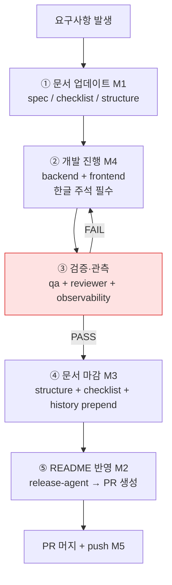
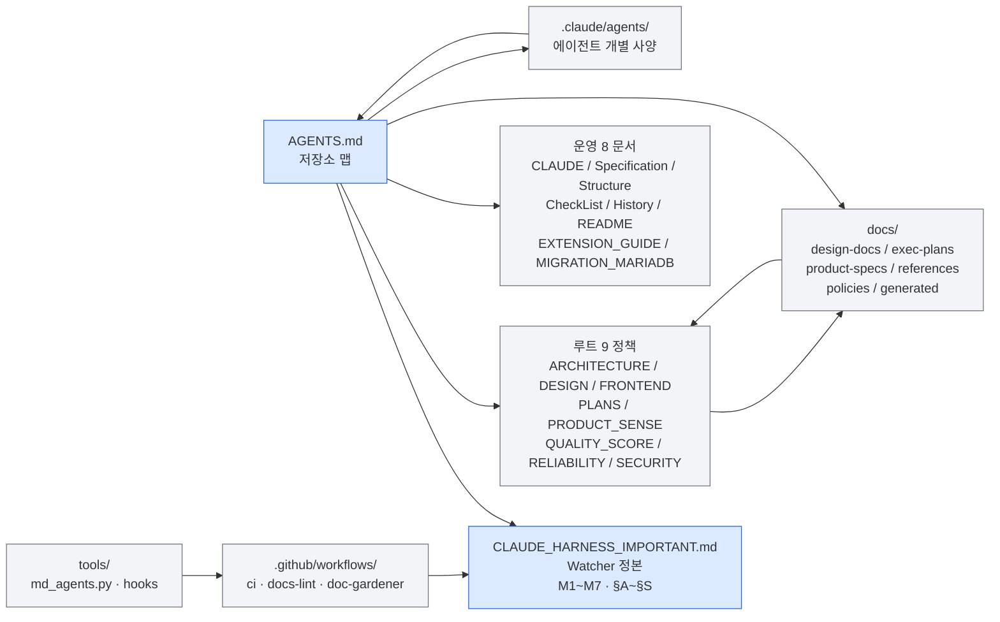

# AGENTS.md — TooTalk (p2p_msg) Repository Guide

> 본 문서는 저장소 **맵(navigation map)** 이다. 백과사전 아님.
> 세부 규칙·정책은 모두 링크로 위임한다. 본 문서의 임무는 "어디를 봐야 하는가" 안내.
> 정본 정합: [CLAUDE_HARNESS_IMPORTANT.md](CLAUDE_HARNESS_IMPORTANT.md) §B (L668~673).

---

## 1. 저장소 목적

**TooTalk** (코드명/저장소명: `p2p_msg`) 는 **PyQt6 기반 데스크탑 P2P 메신저** 다. 텔레그램 UX 를 참고하되, 시그널링 서버 하나만 거치고 실 데이터(텍스트·이미지·파일)는 **WebRTC DataChannel 직결**로 운반한다. 송수신 양방향 ProgressBar 와 **MariaDB** 로컬 저장을 기본 탑재한다.

> **명명 규약**: UI 표기·README·빌드 산출물(`TooTalk.app`, `TooTalk-{ver}-{os}.zip`)·About 다이얼로그·시그널링 User-Agent → **TooTalk**. 코드 식별자·import 경로·디렉토리명·GitHub repo 명 → **p2p_msg** 유지.

| 항목 | 값 |
|---|---|
| GUI | PyQt6 (GPL/상용 분리 유의) |
| WebRTC | aiortc |
| 이벤트 루프 통합 | qasync (Qt ↔ asyncio) |
| 시그널링 | Python `aiohttp` WebSocket |
| 시그널링 데모 호스트 | `114.207.112.73` |
| STUN | `stun.l.google.com:19302` |
| 로컬 저장 | MariaDB (`DB_HOST`/`DB_PORT`/`DB_USER`/`DB_PASS`/`DB_NAME`) |
| Python | 3.13 |
| 배포 | macOS arm64 native (self-hosted runner) + Windows x64 wine cross-compile (GitHub-hosted Ubuntu + `cdrx/pyinstaller-windows` docker) · PyInstaller + zip · 인증서 미사용 |
| Remote | https://github.com/oneticket99/p2p_msg.git (**public** — Phase 완료 시 private 전환 가능성, 사용자 directive 2026-05-17) |
| Branch 전략 | feature branch + PR · `main` 직접 push 금지 |
| 라이선스 | **GPLv3** (사용자 directive 2026-05-17 — PyQt6 GPLv3 정합 + LICENSE 저장소 루트) |

---

## 2. 최상위 원칙 (정본 §핵심 철학 인용)

- **인간 = 환경 설계자**, AI = 실행자. 사람이 직접 코드를 거의 쓰지 않아도 굴러가야 한다.
- **저장소 밖 지식은 존재하지 않는 것**으로 간주한다. 모든 컨텍스트는 git 안에 둔다.
- **AGENTS.md 는 짧고 강한 네비게이션 문서** — 본 문서는 길어지면 안 된다.
- **세부 규칙은 [docs/](docs/) 와 [.claude/agents/](.claude/agents/) 로 분산**. 본 문서는 링크만.
- **계획은 일급 아티팩트** — 큰 작업은 `docs/exec-plans/active/*.md` 로 관리.
- **문서가 코드보다 앞선다 (M1)** — 핫픽스·긴급 패치 포함 예외 없음.
- **drift 차단** — doc-gardening · lint · CI 자동 검사로 문서-코드 정합 유지.

---

## 3. 읽어야 할 문서 맵

| 역할 | 문서 | 언제 읽나 |
|---|---|---|
| 정본 (Watcher 규약 · M1~M7 · §A~§S) | [CLAUDE_HARNESS_IMPORTANT.md](CLAUDE_HARNESS_IMPORTANT.md) | **세션 시작 시 필수 정독** |
| 세션 내 서브에이전트 호출 규칙 | [CLAUDE.md](CLAUDE.md) | 에이전트 위임 직전 |
| 아키텍처 (모듈 경계·계층·의존 관계) | [ARCHITECTURE.md](ARCHITECTURE.md) | 신규 모듈 설계 전 |
| UI/UX 설계 원칙 (PyQt6 위젯·테마) | [DESIGN.md](DESIGN.md) · [FRONTEND.md](FRONTEND.md) | 화면 추가·수정 전 |
| 활성 실행 계획 (Exec Plans) | [PLANS.md](PLANS.md) → [docs/exec-plans/active/](docs/exec-plans/active/) | 큰 작업 착수 전 |
| 제품 감각 (기능 우선순위·반대 사례) | [PRODUCT_SENSE.md](PRODUCT_SENSE.md) | 기능 추가 판단 시 |
| 품질 점수 체계 | [QUALITY_SCORE.md](QUALITY_SCORE.md) | PR 머지 전 |
| 신뢰성·장애 대응 | [RELIABILITY.md](RELIABILITY.md) | 네트워크/DataChannel 오류 처리 시 |
| 보안 (시그널링·STUN·파일 검증) | [SECURITY.md](SECURITY.md) | 외부 입력 다루는 코드 작성 전 |
| 요구사항 명세 | [Specification.md](Specification.md) | M1 단계 (문서 먼저) |
| 파일 트리 · ERD | [Structure.md](Structure.md) | 신규 파일·DB 추가 시 |
| 작업 체크리스트 | [CheckList.md](CheckList.md) | directive 수령 직후 |
| 개발 히스토리 (역순 prepend) | [History.md](History.md) | 회귀·재현 추적 시 |
| 변경 이력 (M2 — 최신 30행) | [README.md](README.md) | 모든 파일 작업 완료 직후 |
| 확장 가이드 (신규 에이전트·문서·모델) | [EXTENSION_GUIDE.md](EXTENSION_GUIDE.md) | 시스템 확장 전 |
| 에이전트 개별 사양 | [.claude/agents/](.claude/agents/) `<name>.md` | 해당 에이전트 호출 직전 |
| 정책 (doc-gardening · adoption · harness) | `docs/policies/` (3 문서 active) | 운영 정책 변경 시 |
| 라이선스 본문 | [LICENSE](LICENSE) (GPLv3 GNU 표준 674 lines, 사용자 directive 2026-05-17) | 외부 distribution + SPDX header 적용 직전 |
| 인프라 절차 | [docs/references/ci-self-hosted-setup.md](docs/references/ci-self-hosted-setup.md) · [docs/references/smtp-setup.md](docs/references/smtp-setup.md) | runner 등록 + SMTP 설치 시점 |
| 평가 snapshot | [docs/assessments/productization.md](docs/assessments/productization.md) · [vibe-coding.md](docs/assessments/vibe-coding.md) | 매 task 종료 시 전체 rewrite (사이클 8) |
| enforcement layer sketch | [.claude/settings.json](.claude/settings.json) · [tools/hook_check_bpe_token_input.sh](tools/hook_check_bpe_token_input.sh) · [tools/hook_telegram_report_stop.sh](tools/hook_telegram_report_stop.sh) | 다음 BPE 위반/텔레그램 누락 발견 시 활성 |

> **루트 마크다운은 18개로 동결** ([정본 §K](CLAUDE_HARNESS_IMPORTANT.md)). 신규 문서는 반드시 `docs/` 하위에 생성.

---

## 4. 5단계 개발 워크플로우 (정본 §B 그대로)



**금지**: ② → ① 역순 진행, ③ 건너뛰기, ⑤ 생략 머지. 세부는 [정본 §B](CLAUDE_HARNESS_IMPORTANT.md).

---

## 5. 7대 필수 규칙 (M1~M7) — 어떤 작업에도 예외 없음

| 기호 | 요약 | 위반 시 조치 | 정본 |
|:---:|---|---|---|
| **M1** | 문서가 개발보다 앞선다 (Document First) | `@reviewer-agent` 차단 | [§A](CLAUDE_HARNESS_IMPORTANT.md) |
| **M2** | 파일 작업 완료 직후 `README.md` "변경 이력"에 한 줄 prepend | `@reviewer-agent` 차단 | [§H](CLAUDE_HARNESS_IMPORTANT.md) |
| **M3** | `History.md` 역순 기록 (최신 상단 prepend) | CI 실패 | [§I](CLAUDE_HARNESS_IMPORTANT.md) |
| **M4** | 작업 파일 한글 주석 필수 (`.py`·`.js`·`.html`·`.css`·`.sql`·`.sh`) | `@reviewer-agent` 차단 | [§J](CLAUDE_HARNESS_IMPORTANT.md) |
| **M5** | 작업 완료 즉시 원격 `git commit` + `push` (로컬 백로그 금지) | `@release-agent` 차단 | [§R](CLAUDE_HARNESS_IMPORTANT.md) |
| **M6** | directive 처리 직후 `data/wbs.sqlite` `wbs_tasks` 1행 등록 + status 갱신 | `harness-verify check_m6` FAIL | [§A](CLAUDE_HARNESS_IMPORTANT.md) |
| **M7** | directive 결과 보고 텔레그램 동시 송수신 (`<channel source="telegram">` 양방향) | `@reviewer-agent` 차단 | [§A](CLAUDE_HARNESS_IMPORTANT.md) |

> 신규 저장소 초기 단계에서 **M6·M7 은 인프라 준비 후 활성**. 정본 정의는 그대로 유효.

---

## 6. 에이전트 7역할 (HARNESS 프로세스 에이전트)

| 호출 | 역할 | 주요 산출물 |
|---|---|---|
| `@planning-agent` | 요구사항 분석·Exec Plan 초안 | [docs/exec-plans/active/](docs/exec-plans/active/)`*.md` |
| `@reviewer-agent` | 코드·설계 리뷰, M1~M7 위반 차단 | 리뷰 리포트 |
| `@qa-agent` | 수동 회귀 체크리스트·스모크 | QA 리포트 |
| `@observability-agent` | 로그·메트릭·성능 검증 | 관측성 리포트 |
| `@release-agent` | PR 템플릿·머지 게이트·릴리즈 노트 | PR |
| `@doc-gardener-agent` | 주간 drift 감지·자동 보정 | 보정 PR |
| `@history-agent` | History.md 역순 기록 관리 | History.md 변경 |

문서 담당 4 에이전트 (`@spec-agent` · `@structure-agent` · `@checklist-agent` · `@history-agent`) 매핑은 [정본 §D](CLAUDE_HARNESS_IMPORTANT.md). 개별 사양은 [.claude/agents/](.claude/agents/) `<name>.md` 정독.

---

## 7. 작업 절차 (directive 수령 → PR 머지)

1. **directive 수령** — 사용자 또는 텔레그램 채널 (M7) 경유
2. **[CheckList.md](CheckList.md) 갱신** — 신규 항목 추가, 매핑 테이블 갱신
3. **WBS sqlite 등록 (M6)** — `data/wbs.sqlite` `wbs_tasks` 1행 INSERT
4. **Exec Plan 작성 (큰 작업)** — `docs/exec-plans/active/YYYY-MM-DD-<slug>.md`
5. **① M1 문서 선행** — `@spec-agent` · `@checklist-agent` · `@structure-agent` 위임
6. **② 개발** — `@backend-agent` · `@frontend-agent`, **한글 주석 (M4) 필수**
7. **③ 검증** — `@qa-agent` · `@reviewer-agent` · `@observability-agent` 순차 통과
8. **④ 문서 마감 (M3)** — `History.md` 상단 prepend
9. **⑤ README 반영 (M2)** — `@release-agent` 가 변경 이력 1행 prepend
10. **즉시 commit + push (M5)** — `SKIP_PREPUSH=1 git push origin main` 표준 ([정본 §S-3](CLAUDE_HARNESS_IMPORTANT.md))
11. **PR 생성 + 머지** — feature branch 기준, main 직접 push 금지
12. **텔레그램 결과 보고 (M7)** — chat_id=allowFrom[0] reply

### 서브에이전트 호출 규약 (정본 §P)

- **Whitebox 원칙**: 모든 `Agent` 호출은 `run_in_background: true` + `Monitor` 조합 기본
- `Monitor` · `TaskOutput` · `TaskStop` 은 deferred tool — 호출 전 `ToolSearch` 로 스키마 로드 필수
- 매 stdout 라인은 감시자가 한 줄로 중계 보고 (Fine-Grained)
- 동기 foreground 호출은 "즉시 결과만 필요"가 명시된 단발 조회성 작업 한정

---

## 8. PR 전 체크리스트

PR 생성 전 다음 항목을 모두 체크한다. 미통과 항목 1개라도 있으면 `@release-agent` 차단.

- [ ] **M1** 관련 문서 선행 업데이트 완료 (`Specification.md` · `CheckList.md` · `Structure.md`)
- [ ] **M2** `README.md` "변경 이력" 섹션에 한 줄 prepend (최신 상단, 30행 상한)
- [ ] **M3** `History.md` 역순 prepend 적용 (Phase·타임스탬프 내림차순)
- [ ] **M4** 변경된 코드 파일(`.py`·`.js`·`.html`·`.css`·`.sql`·`.sh`)에 한글 주석 존재
- [ ] **M5** `git status -sb` 클린 + `origin/main` 동기 + 로컬 미반영 변경 0건
- [ ] **M6** `data/wbs.sqlite` `wbs_tasks` 신규 row 등록 + status 갱신 (인프라 준비 후)
- [ ] **M7** 텔레그램 결과 보고 송신 (인프라 준비 후)
- [ ] `@reviewer-agent` 통과 (4대 규칙 위반 검사 + 금지 패턴)
- [ ] `@qa-agent` 회귀 체크리스트 PASS
- [ ] `@observability-agent` 로그·메트릭 회귀 없음
- [ ] CI 3종 (`ci.yml` · `docs-lint.yml` · `doc-gardener.yml`) GREEN — Phase 1 active
- [ ] `build.yml` GREEN — M5 PyInstaller 매트릭스 (Phase 1 후반 신설 예정)
- [ ] PR 제목·본문이 `.github/pull_request_template.md` 양식 충족
- [ ] feature branch 기준 (main 직접 push 금지)

---

## 9. 문서 수정 의무 (M2)

**M2 — `README.md` "변경 이력" 섹션 규약** ([정본 §H](CLAUDE_HARNESS_IMPORTANT.md)):

- 위치: `README.md` 내 `## 변경 이력` 헤더 직하
- 행 수 상한: 최신 **30행** (초과 시 오래된 항목 제거, 상세는 `History.md` 위임)
- 행 형식: `- [YYYY-mm-dd H:i:s] 요약 (파일/영역)`
- **신규·수정·삭제 모든 파일 작업 단위 완료 시 한 줄 prepend** (최신이 맨 위)
- `@release-agent` 가 PR 제출 전 자동 갱신 — 누락 시 `ci.yml` "README.md 변경 이력 존재 확인" 단계에서 CI 실패
- `History.md` 와의 차이: README 는 30행 캐시·요약, History 는 전체 영구 기록

**동시 갱신 의무** ([정본 §N](CLAUDE_HARNESS_IMPORTANT.md)):

- 새 에이전트 추가 → `.claude/agents/<name>.md` + 본 AGENTS.md "에이전트" 표 + `CLAUDE.md` + `EXTENSION_GUIDE.md`
- 새 정책 문서 → **루트 생성 금지**, `docs/` 하위 + 본 AGENTS.md "문서 맵" 링크 추가
- 새 DB 모델 → `MIGRATION_MARIADB.md` tables 배열 (FK 순서) + `Structure.md` ERD
- 모든 파일 작업 종료 → `README.md` 변경 이력 prepend (예외 없음)

---

## 10. 금지사항

1. **루트 마크다운 18개 초과 금지** ([정본 §K](CLAUDE_HARNESS_IMPORTANT.md)) — 신규 문서는 `docs/` 하위에만. CI 차단.
2. **`--no-verify` · `--no-gpg-sign` 사용 금지** — pre-commit hook 우회 금지 (사용자 명시 허용 시 예외).
3. **`git push --force` · `--force-with-lease` main 대상 금지** — feature branch 외 직접 force 금지.
4. **main 직접 push 금지** — 반드시 feature branch + PR 머지 경로.
5. **② → ① 역순 진행 금지** — 코드를 먼저 고치고 문서를 나중에 작성하는 행위 (M1 위반).
6. **로컬 변경 누적 후 일괄 push 금지** ([정본 §R-4](CLAUDE_HARNESS_IMPORTANT.md)) — M5 위반.
7. **`History.md` append 금지** — prepend 전용. `tools/md_agents.py` 가 차단.
8. **변수·함수 이름 한글 금지** — 한글은 주석·문자열에만 (M4 호환성).
9. **하드코딩 설정값 금지** — `.env` 또는 DB 상수 테이블로만 관리.
10. **서브에이전트 foreground 동기 호출 금지** — Whitebox 규약 위반 ([정본 §P-7](CLAUDE_HARNESS_IMPORTANT.md)).
11. **`Monitor`·`TaskOutput`·`TaskStop` 을 `ToolSearch` 없이 직접 호출 금지** — deferred tool 스키마 미로드 에러.
12. **로그/증거 파일 삭제·수정 금지** — 감시자 역할 ([정본 §4](CLAUDE_HARNESS_IMPORTANT.md)).
13. **사용자 승인 대기 중 침묵 금지** — `/loop 2m` 폴백 즉시 기동 ([정본 §3](CLAUDE_HARNESS_IMPORTANT.md)).
14. **BPE U+CE21 단독 의존명사 사용 절대 금지** ([[feedback-no-korean-chuck-token]] 4회차 강화 영구화) — 합성어 측면/측정/관측 제외. doc-lint.sh 자동 grep + 다음 위반 발견 시 `.claude/settings.json.disabled` 의 PreToolUse hook 강제 활성 의무 ([[feedback-bpe-script-trigger-warning]]).
15. **1인칭/3인칭 대명사 사용 절대 금지** ([[feedback-no-self-other-pronoun]] 3회차 강화) — 주어 생략 + 명사 직접 + 자체/사용자/요청자 대체.
16. **텔레그램 송신 누락 금지** ([[feedback-telegram-report-mandatory-m7]] 강제 활성) — 매 응답 종료 + task 완료 시 의무. 다음 누락 발견 시 Stop hook 강제 활성 ([[feedback-telegram-report-script-trigger-warning]]).
17. **LICENSE GPLv3 의무 위반 금지** — 모든 source file 의 SPDX header (`# SPDX-License-Identifier: GPL-3.0-or-later`) 의무 (Phase 1 코드 진입 시). 외부 distribution 시 GPL 의무 발동 ([[project-license-gpl]]).
18. **`.claude/settings.json.disabled` 의 임의 활성 금지** — 사용자 directive 정합 의 의무 발동 시점 만 `mv` 의 활성 ([[feedback-bpe-script-trigger-warning]] + [[feedback-telegram-report-script-trigger-warning]]).

---

## 11. 정보 구조 인덱스 (mermaid)



- **AGENTS.md (본 문서)** = 진입점. 모든 화살표가 여기서 출발.
- **CLAUDE_HARNESS_IMPORTANT.md** = 정본. AGENTS.md 와 양방향 정합 의무.
- **9 정책 문서** = 도메인별 깊이. AGENTS.md 가 링크로만 위임.
- **docs/** = 분기 영역. 루트 18 동결 회피 통로.
- **.claude/agents/** = 에이전트 개별 사양. AGENTS.md §6 표가 인덱스.
- **tools/ · .github/** = 자동화 enforcement layer.

---

## 부록 A. 빠른 명령

```bash
# 변경 검증 (M1~M4)
python tools/md_agents.py

# M5 표준 push (SKIP_PREPUSH=1 prefix 의무)
SKIP_PREPUSH=1 git push origin main

# 신규 Exec Plan
cp docs/exec-plans/active/_template.md docs/exec-plans/active/$(date +%Y-%m-%d)-<slug>.md

# 에이전트 개별 사양 확인
ls .claude/agents/
```

## 부록 B. 환경 변수 (`.env.example` 참조)

- `SIGNALING_HOST` — 시그널링 서버 호스트 (기본 `114.207.112.73`)
- `STUN_SERVER` — `stun.l.google.com:19302`
- `DB_HOST` / `DB_PORT` / `DB_USER` / `DB_PASS` / `DB_NAME` — MariaDB 접속 (사용자 directive 2026-05-17)
- 하드코딩 금지 — 모든 값은 `.env` 또는 DB 상수 테이블 경유

---

마지막 갱신: 2026-05-17 (TooTalk 서비스명 명문화)
