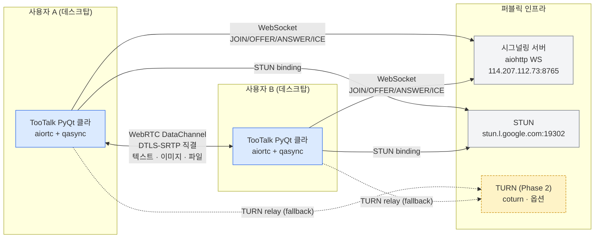
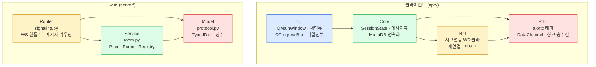
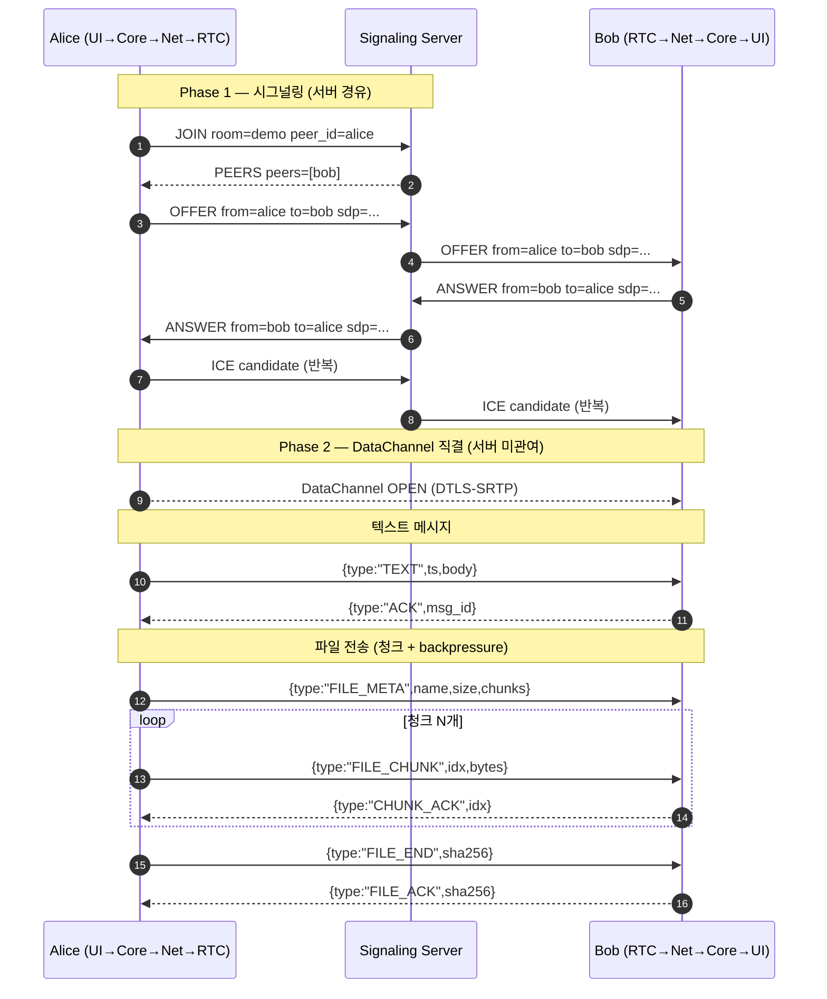

# ARCHITECTURE.md — TooTalk (p2p_msg) 시스템 아키텍처 정책

> 본 문서는 TooTalk(코드명 `p2p_msg`) 의 **시스템 아키텍처 정책 문서** 다.
> 모듈 경계·계층 분리·데이터 흐름·환경변수 외부화·Phase 진화 경로 측면 결정을 한 곳에 모은다.
> 정본 정합: [CLAUDE_HARNESS_IMPORTANT.md](CLAUDE_HARNESS_IMPORTANT.md) §E (코딩 불변 규칙) · §K (루트 18 동결).
> 저장소 맵: [AGENTS.md](AGENTS.md) · 실행계획: [docs/exec-plans/active/2026-05-17-tootalk-phase1-mvp.md](docs/exec-plans/active/2026-05-17-tootalk-phase1-mvp.md).

---

## 1. 문서 목적

본 문서는 TooTalk 의 **거시 구조 결정** 을 단일 진입점으로 고정한다. 신규 모듈을 추가하거나 의존 방향을 바꾸기 전에는 본 문서를 먼저 확인하고, 본 문서와 모순되는 변경은 PR 머지 이전에 본 문서를 갱신한 뒤 진행한다. 본 문서는 구현 코드를 포함하지 않으며, 모든 코드 예시는 정본 §E 코딩 불변 규칙을 인용하는 정도로만 등장한다. 본 문서는 루트 18 동결([정본 §K](CLAUDE_HARNESS_IMPORTANT.md)) 안에 위치하는 9개 정책 문서 중 1번 슬롯에 배정되어 있으며, 위치·파일명·확장자 모두 동결 대상이다.

---

## 2. 아키텍처 원칙 (정본 §E 코딩 불변 규칙 인용)

본 7개 원칙은 [정본 §E](CLAUDE_HARNESS_IMPORTANT.md) 의 코딩 불변 규칙 본문을 본 저장소 도메인으로 옮긴 것이다. 새 모듈은 본 원칙을 동시에 만족해야 한다.

- **상세 한글 주석 의무 (M4 정합)** — 모든 코드 파일은 docstring·주석 본문에 한국어 설명을 포함한다. 변수·함수 식별자는 영문 유지.
- **설정값 외부화** — `.env` 또는 DB 상수 테이블로만 관리. 호스트·포트·경로·임계값을 코드 리터럴로 못 박지 않는다.
- **로그 형식 통일** — `[YYYY-mm-dd H:i:s]` 접두를 갖는 단일 라인 포맷. 멀티라인 예외는 trace 영역에만 허용.
- **Backend 계층 분리** — `Router → Service → Model` 단방향 의존. **비동기 전용** (`async def` 기본, 동기 라이브러리는 `asyncio.to_thread` 경유).
- **Frontend 계층 분리** — PyQt6 위젯은 UI → Core → Net → RTC 단방향 의존. UI 레이어가 직접 소켓·DB 핸들을 잡지 않는다.
- **외부 입력 신뢰 금지** — 시그널링 envelope `from` 필드처럼 클라이언트가 보낸 식별자는 서버 영역에서 항상 재확정. `server/protocol.py::wire_to_internal` 참조.
- **단일 책임 모듈** — `signaling.py` 는 라우팅만, `room.py` 는 상태 관리만, `protocol.py` 는 스키마만. 모듈 안에 두 책임이 섞이는 순간 분리 대상이 된다.

---

## 3. 시스템 컨텍스트 다이어그램

사용자 영역의 PyQt 데스크탑 클라이언트가 시그널링 서버 하나만 거치고, 실 데이터는 STUN 으로 NAT traversal 을 끝낸 뒤 DataChannel 직결로 운반된다. TURN 은 Phase 2 진입 시점에 옵션으로 추가될 예정이다.

**핵심 불변식**: 시그널링 서버는 SDP·ICE 만 통과시키고 실 데이터 페이로드는 일절 들고 있지 않는다 ([server/README.md](server/README.md) §3). 즉 클라이언트 영역의 DataChannel 이 OPEN 되는 순간부터 서버 부하는 0 이 된다.

---

## 4. 계층 분리

클라이언트는 4계층, 서버는 3계층으로 분리한다. 단방향 의존만 허용하며 역방향 import 는 PR 단계에서 `@reviewer-agent` 가 차단한다.

**금지 의존**:

- UI → Net · UI → RTC 직접 호출 금지. 반드시 Core 를 거친다.
- Service → Router · Model → Service 역방향 import 금지.
- Net 과 RTC 가 서로 직접 결합하지 않도록 Core 가 시그널링 결과(원격 SDP/ICE)를 RTC 에 전달하는 역할만 수행한다.

---

## 5. 데이터 흐름 (텍스트 + 파일 전송)

시그널링은 SDP/ICE 교환만 담당하고, 실 메시지·파일은 DataChannel 직결 청크 + ACK 흐름으로 운반된다. 아래 sequenceDiagram 은 Alice → Bob 방향 1:1 케이스를 보인다.

**핵심 보장**:

- 시그널링 단계는 9개 envelope 안에서만 진행 ([server/protocol.py](server/protocol.py) 5종 클라→서버, 4종 서버→클라).
- DataChannel envelope 은 별도 스키마이며 시그널링 envelope 와 절대 섞이지 않는다.
- 파일 송수신은 `CHUNK_ACK` 기반 backpressure 로 흐름 제어. 청크 크기 + buffer 상/하한 + ACK 간격 = `.env` `FILE_CHUNK_SIZE` / `FILE_BUFFER_HIGH` / `FILE_BUFFER_LOW` / `FILE_ACK_INTERVAL_BYTES` 외부화 (Agent #16 정합, §7 표).

---

## 6. 모듈 책임 표

| 모듈 | 책임 | 의존성 | 위치 |
|---|---|---|---|
| `app/ui/` | PyQt6 위젯·QSS·signup/login/reset dialog (사이클 23) + main_window 계정 메뉴 | `app/core/` · `app/net/auth_client.py` | 클라이언트 UI 계층 |
| `app/core/` | `AppState` 세션 상태 + `Config` .env 로딩 + `security.py` (PBKDF2-SHA256 600K iter + OTP + session token, 사이클 18) | `python-dotenv` + `hashlib` + `secrets` + `hmac` | 클라이언트 Core |
| `app/net/` | 시그널링 WS client + `auth_client.py` REST client (사이클 21) + `messages_client.py` (사이클 62 — ChatView lazy load 의 client-side wrapper + MessagePayload + MessageFetchResult + Bearer 인증 + 401/400/5xx/network 4 종 exception 매핑) | `aiohttp` · `app/core/` 콜백 | 클라이언트 Net |
| `app/rtc/` | aiortc 래퍼·DataChannel + protocol/peer/file_sender/file_receiver/image_processor (Agent #16) | `aiortc` · `Pillow` · `aiofiles` | 클라이언트 RTC |
| `app/crypto/` | Phase 2 E2EE Signal Protocol — `e2ee.py` (AES-GCM+X25519+HKDF) + `double_ratchet.py` (KDF chain) + `session.py` (SessionState + DH ratchet) + `skipped_keys.py` (LRU+TTL) + `x3dh.py` (사이클 37 initial key agreement) + `device_registry.py` (사이클 42 multi-device 식별) + `fan_out.py` (사이클 44 N device fan-out 격리) + `sender_keys.py` (사이클 46 그룹 N×M → N+M reduction) (사이클 27~46) | `cryptography>=42.0` | 클라이언트 E2EE |
| `app/notifications/` | Phase 2 push 알림 skeleton (사이클 47) — `push.py` 의 4 platform (APNS/FCM/SILENT/PULL) + PushTarget + PushPayload + silent/visible format + offline filter + PushBatch | (transport-agnostic, gateway 호출 = 별개 cycle) | 클라이언트 Notification |
| `app/backup/` | Phase 2 encrypted backup / restore (사이클 48 + 50 + 52) — `encrypted_backup.py` 의 BackupEntry + BackupBundle + PBKDF2-HMAC-SHA256 600K iter derive_backup_key (v2) + AES-256-GCM encrypt_backup / decrypt_backup (version enforcement) + wire format bytes serialize / deserialize | `cryptography>=42.0` (e2ee 재사용) | 클라이언트 Backup |
| `app/remote/` | Phase 3 entry 원격 데스크탑 차별화 skeleton (사이클 55~58) — `permission.py` Pattern A/B + `protocol.py` RemoteFrame + RemoteInput + RemoteSession + `capture.py` (사이클 57) CaptureBackend + Mock + Quartz placeholder + BGRA→RGB + `input_forward.py` (사이클 58) InputForwardBackend + Mock + CGEvent placeholder + apply_events batch + filter_events_by_type | stdlib + (Phase 3 mid 의 PyObjC CFRelease 의무 + ctypes / Xlib 별개 cycle) | 클라이언트 Remote Desktop |
| `app/bot/` | Phase 3 bot framework (사이클 65~70) — `llm_proxy.py` (사이클 65) + `customer_service_bot.py` (사이클 66 + 69 — RAGStore 통합 의 answer pipeline 의 system prompt augmentation) + `streaming_helper.py` (사이클 67) + `rag_context.py` (사이클 68 — FAQEntry + RAGStore Protocol + KeywordRAGStore substring + token overlap ranking + EmbeddingRAGStore placeholder + build_default_toonation_faq 5 영역 10 entry + compose_rag_context markdown) + `anthropic_client.py` (사이클 70 — Messages API serialize_messages system 분리 + parse_response text block 합본 + AnthropicClient + HttpTransport Protocol + 4 종 예외 auth/rate/server/malformed + from_env factory) | stdlib + (sentence-transformers + httpx + obs-websocket-py + platform API 별개 cycle) | 클라이언트 Bot Framework (default 투네이션 고객센터 봇 + 방송 도우미 봇 + RAG context + bot ↔ RAG 통합 + Anthropic Messages API client) |
| `app/main.py` | qasync entry + AuthClient 초기화 + MainWindow 진입 (사이클 22) | `qasync` + 위 5개 | 클라이언트 부트스트랩 |
| `server/signaling.py` | WebSocket 핸들러 + DB 영속화 통합 (signaling_persistence dependency injection, 사이클 26) | `server/room.py` · `server/signaling_persistence.py` | 서버 Router |
| `server/signaling_persistence.py` | DB 영속화 helper (rooms/peers/messages persist + pool=None silent skip, 사이클 24) | `server/db/repositories/` | 서버 Service Bridge |
| `server/api/auth_handlers.py` | REST 5 endpoint — /api/auth/{register,verify,login,reset/request,reset/consume} (사이클 21) | `aiohttp` + `server/auth/` | 서버 Router REST |
| `server/api/devices_handlers.py` | REST 3 endpoint — POST /api/devices + GET /api/devices + DELETE /api/devices/{device_id} (Phase 2 사이클 43 multi-device sync) | `aiohttp` + `server/db/repositories/devices.py` | 서버 Router REST |
| `server/api/messages_handlers.py` | REST 1 endpoint — GET /api/messages?room_id&start_ts_ms&end_ts_ms&limit (Phase 3 사이클 60 ChatView lazy load server counterpart, `_DEFAULT_LIMIT` 1000 + `_MAX_LIMIT` 5000 의 unbounded SELECT 차단) | `aiohttp` + `server/db/repositories/messages.py` 의 `list_messages_in_range` | 서버 Router REST |
| `server/auth/` | 5 use case (register/verify/login/reset_password) + middleware (Bearer + public path skip) + 7 exception (사이클 20) | `app.core.security` (PBKDF2) + `server/db/repositories/` + `aiosmtplib` | 서버 Auth Service |
| `server/db/` | `connection.py` (asyncmy pool + 환경변수 8) + 8 repository (users/email_verification/password_reset/rooms/peers/file_meta/messages/devices) + `migrations/0001_init.sql` + `0002_devices.sql` (60+ 필드 COMMENT 5요소 의무, 사이클 18~19 + 43) | `asyncmy>=0.2.10` | 서버 영속화 |
| `server/mail/smtp_client.py` | aiosmtplib STARTTLS + SASL + UTF-8 한글 본문 (signup/password_reset 분기, 사이클 19) | `aiosmtplib>=3.0` | 서버 Mail |
| `server/room.py` | `Peer` (user_id + db_room_id field 추가, 사이클 25) + `Room`·`RoomRegistry` | `server/protocol.py` | 서버 Room State |
| `server/protocol.py` | TypedDict envelope + 오류 코드 (사이클 1) | — | 서버 Model |
| `server/main.py` | entry + DB pool + auth middleware + session_store + on_cleanup (사이클 22) | 위 + `dotenv` + `signaling_persistence` | 서버 부트스트랩 |
| `tools/` | `md_agents.py` · `doc-lint.sh` · `claude-telegram.sh` · `hook_check_bpe_token_input.sh` (PreToolUse sketch) · `hook_telegram_report_stop.sh` (Stop sketch) · `db_init.py` (예정) · `build.py` (예정) | 표준 라이브러리 + bash | 운영 자동화 + enforcement layer sketch |
| `.github/workflows/` | `ci.yml` 8 job · `docs-lint.yml` · `doc-gardener.yml` · `build.yml` (Phase 1 후반 — macOS native + Ubuntu wine cross-compile 듀얼) | self-hosted macOS arm64 + GitHub-hosted Ubuntu | CI 게이트 |
| `LICENSE` (저장소 루트) | GPLv3 표준 본문 (GNU 674 lines, 사용자 directive 2026-05-17) | — | 라이선스 |
| `.claude/settings.json.disabled` | PreToolUse Edit/Write BPE 차단 + Stop 텔레그램 자동 송신 sketch (미활성). 다음 위반/누락 발견 시 `mv` 의 즉시 활성 | `tools/hook_*.sh` | enforcement layer sketch |

---

## 7. 환경변수 영역 설정 외부화 정책

정본 §E 의 "설정값은 `.env` 또는 DB 상수 테이블로만 관리" 규칙을 본 저장소 도메인에 적용한다. 다음 표는 본 시점에 합의된 환경변수 키이며, 추가·변경 시 본 표를 먼저 갱신한다.

| 키 | 영역 | 기본값 | 출처 |
|---|---|---|---|
| `SIGNAL_SERVER_HOST` | 서버 | `0.0.0.0` | [server/README.md](server/README.md) §2 |
| `SIGNAL_SERVER_WS_PORT` | 서버 | `8765` | [server/README.md](server/README.md) §2 |
| `SIGNAL_SERVER_WS_SCHEME` | 서버 | `ws` (Phase 1) | [server/README.md](server/README.md) §2 |
| `LOG_LEVEL` | 공통 | `INFO` | [server/README.md](server/README.md) §2 |
| `SIGNALING_HOST` | 클라 | `114.207.112.73` | [AGENTS.md](AGENTS.md) 부록 B |
| `STUN_SERVER` | 클라 | `stun.l.google.com:19302` | [AGENTS.md](AGENTS.md) 부록 B |
| `DB_HOST` | 클라 | `127.0.0.1` | [AGENTS.md](AGENTS.md) 부록 B (MariaDB 회수 2026-05-17) |
| `DB_PORT` | 클라 | `3306` | [AGENTS.md](AGENTS.md) 부록 B |
| `DB_USER` | 클라 | `tootalk` | [AGENTS.md](AGENTS.md) 부록 B |
| `DB_PASS` | 클라 | (비움) | `.env.local` 주입 |
| `DB_NAME` | 클라 | `tootalk` | [AGENTS.md](AGENTS.md) 부록 B |
| `FILE_CHUNK_SIZE` | 클라 | `16384` | 본 문서 §5 (파일 전송 청크 크기 — Agent #16 정합) |
| `FILE_BUFFER_HIGH` | 클라 | `16777216` (16 MiB) | `app/rtc/file_sender.py` (backpressure 상한 — 16 MiB 이상 시 송신 대기) |
| `FILE_BUFFER_LOW` | 클라 | `4194304` (4 MiB) | `app/rtc/file_sender.py` (backpressure 하한 — 4 MiB 이하 시 송신 재개) |
| `FILE_BACKPRESSURE_POLL_MS` | 클라 | `50` | `app/rtc/file_sender.py` (`bufferedAmount` 폴링 간격) |
| `FILE_ACK_INTERVAL_BYTES` | 클라 | `262144` (256 KiB) | `app/rtc/file_receiver.py` (수신 ACK 발송 간격, qa-agent 사이클 13 코드 정합 회수) |
| `FILE_RECEIVE_DIR` | 클라 | `~/Downloads/TooTalk` | `app/rtc/file_receiver.py` (수신 파일 저장 디렉토리) |
| `THUMB_MAX_PX` | 클라 | `200` | `app/rtc/image_processor.py` (Pillow 썸네일 최대 픽셀) |
| `THUMB_QUALITY` | 클라 | `80` | `app/rtc/image_processor.py` (JPEG 품질) |

**금지**:

- 호스트·포트·임계값을 코드 리터럴로 박는 행위 (정본 §E).
- `.env` 를 git 에 commit 하는 행위 (`.gitignore` 에 `.env.local` · `.env.telegram` 명시 — [AGENTS.md](AGENTS.md) 7번 결정).
- 운영 환경에서 `os.environ.get` 없이 하드코딩 default 로 대체하는 행위.

---

## 8. Phase 영역 진화 경로

본 아키텍처는 3단계 Phase 로 진화한다. Phase 경계는 사용자 directive 로만 전이하며, 직전 Phase 의 Definition of Done ([실행계획 §6](docs/exec-plans/active/2026-05-17-tootalk-phase1-mvp.md)) 이 충족되지 않은 채 진입 금지.

| Phase | 범위 | 주요 추가 모듈 | 신규 외부 의존 |
|---|---|---|---|
| **Phase 1** | P2P 1:1 텍스트·이미지·파일 | `app/ui/` · `app/core/` · `app/net/` · `app/rtc/` · `server/*` | aiortc · qasync · aiohttp · PyQt6 |
| **Phase 2** | 그룹 채팅 + E2EE Signal Protocol + TURN | `app/group/` · `app/crypto/` · coturn 인프라 | mediasoup or LiveKit · Double Ratchet + X3DH |
| **Phase 3** | 음성/영상 통화 + 자동 업데이트 | `app/media/` · Sparkle/Squirrel 통합 | Opus · H.264 negotiation · 코드 서명 인프라 |

**Phase 경계 불변 보장**:

- Phase 1 에서 합의된 5+4 envelope 스키마는 Phase 2 에서 **확장만 허용**, breaking change 금지.
- Phase 2 의 E2EE 도입은 DataChannel envelope 안에 암호화 레이어를 추가하는 방식 — 시그널링 envelope 는 그대로 유지.
- Phase 3 의 미디어 통화는 별도 RTCPeerConnection track 으로 추가 — DataChannel 메시지 흐름과 분리.

---

## 9. Architectural Decision Records (ADR)

본 시점(2026-05-17 부트스트랩) 기준 [실행계획 §7](docs/exec-plans/active/2026-05-17-tootalk-phase1-mvp.md) 에 누적된 8개 결정을 본 저장소의 ADR 인덱스로 고정한다. 신규 결정은 실행계획 §7 에 행을 추가한 뒤 본 §9 에도 동시 반영한다.

| ADR | 결정 | 1~2행 요약 |
|---|---|---|
| ADR-1 | GUI = PyQt6 | Tk·wxPython 대비 위젯 완성도와 signal/slot 모델 우위. GPL/상용 분리 영향은 PySide6 전환 옵션으로 흡수. |
| ADR-2 | Python 3.13 | PyInstaller 6.x · aiortc 1.10+ · qasync 0.27+ 모두 호환. CI 매트릭스 단일 버전 강제. |
| ADR-3 | 시그널링 = `aiohttp` WebSocket | FastAPI WS 대비 의존 가벼움, asyncio 네이티브. `server/signaling.py` 약 200~300 LOC 예상. |
| ADR-4 | 그룹 채팅 Phase 2 이후 보류 | 1:1 안정성 확보 선행. Phase 2 진입 시 mediasoup 도입 검토. |
| ADR-5 | E2EE Signal Protocol Phase 2 보류 | DataChannel DTLS 가 transport 암호 제공. Phase 1 위협 모델에는 충분. |
| ADR-6 | 빌드 = PyInstaller + zip · 인증서 미사용 | Phase 1 데모. Gatekeeper/SmartScreen 우회 README 안내로 대체. TD-2/TD-3 보류. |
| ADR-7 | GitHub repo 공개 | OSS 데모 + 포트폴리오 겸용. 시크릿은 `.env` + Actions Secrets 분리. |
| ADR-8 | 서비스명 TooTalk · 코드명 p2p_msg | UI/빌드 산출물은 브랜드, import 경로·repo 명은 코드 식별자 유지. |
| ADR-9 | CI runner = self-hosted | macOS arm64 + Windows x64 self-hosted 매트릭스. GitHub-hosted runner 미사용. 비용 0. |

---

## 10. 비기능 요구사항 매핑

비기능 요구사항을 측정 가능한 지표로 고정한다. PR 머지 게이트 ([AGENTS.md §8](AGENTS.md)) 에서 본 표가 회귀 기준으로 사용된다.

| 영역 | 요구사항 | 측정 지표 | 검증 시점 |
|---|---|---|---|
| **성능** | 텍스트 메시지 왕복 RTT | 평균 < 500 ms (데모 시그널링 서버 경유) | M3 종료 ([실행계획 §6](docs/exec-plans/active/2026-05-17-tootalk-phase1-mvp.md)) |
| **성능** | 파일 송수신 throughput | 100MB 파일 < 5분 (aiortc 약 5Mbps 한계 — TD-4) | M4 종료 |
| **성능** | ProgressBar 갱신 빈도 | 1% 단위 이상 (정지·역행 없음) | M4 종료 |
| **가용성** | 시그널링 서버 health-check | `/health` 200 OK · uptime ≥ 99% (Phase 1 데모) | M5 종료 |
| **가용성** | 클라이언트 재연결 | WS 단절 후 백오프 재연결 자동 (최대 30초 내 복구) | M2 종료 |
| **보안** | 시그널링 envelope `from` 위변조 방어 | JOIN 시점 peer_id 로 강제 덮어쓰기 | M2 종료 ([server/README.md](server/README.md) §3.1) |
| **보안** | 외부 입력 검증 | `is_valid_client_type` 화이트리스트 + 필수 필드 검증 | M2 종료 ([server/protocol.py](server/protocol.py)) |
| **보안** | DataChannel 암호 | DTLS-SRTP 자동 적용 (aiortc 기본) | M3 종료 |
| **유지보수성** | Router → Service → Model 의존 위배 | 역방향 import 0 건 | 매 PR (`@reviewer-agent`) |
| **유지보수성** | 한글 주석 (M4) | 변경 코드 파일 100% | 매 PR (`ci.yml`) |
| **관측성** | 로그 포맷 일관성 | `[YYYY-mm-dd H:i:s]` 접두 100% | 매 PR (`@observability-agent`) |

---

## 11. 참조 링크

### 11.1 정본·맵

- [CLAUDE_HARNESS_IMPORTANT.md](CLAUDE_HARNESS_IMPORTANT.md) — Watcher 정본 · M1~M7 · §E 코딩 불변 규칙 · §K 루트 동결
- [AGENTS.md](AGENTS.md) — 저장소 맵 · 명명 규약 · 7대 규칙 요약 · 문서 인덱스

### 11.2 실행계획

- [docs/exec-plans/active/2026-05-17-tootalk-phase1-mvp.md](docs/exec-plans/active/2026-05-17-tootalk-phase1-mvp.md) — Phase 1 MVP 실행계획 (§7 결정 로그 · §8 기술 부채 · §11 의존성 그래프)

### 11.3 코드 영역

- [server/README.md](server/README.md) — 시그널링 서버 빠른시작·환경변수·프로토콜·모듈 구조
- [server/protocol.py](server/protocol.py) — TypedDict envelope 9종·오류 코드 상수·직렬화 헬퍼

### 11.4 자매 정책 문서 (루트 9 정책 동결 슬롯)

- `DESIGN.md` · `FRONTEND.md` · `PLANS.md` · `PRODUCT_SENSE.md` · `QUALITY_SCORE.md` · `RELIABILITY.md` · `SECURITY.md` — 본 ARCHITECTURE.md 와 함께 9 정책 슬롯 (1/9 본 문서)

---

마지막 갱신: 2026-05-17 (TooTalk Phase 1 부트스트랩 시점 ADR 9건 등재)
