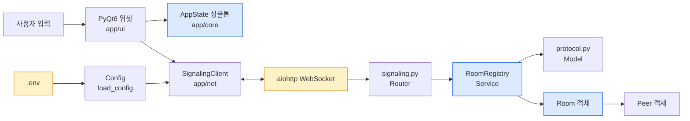
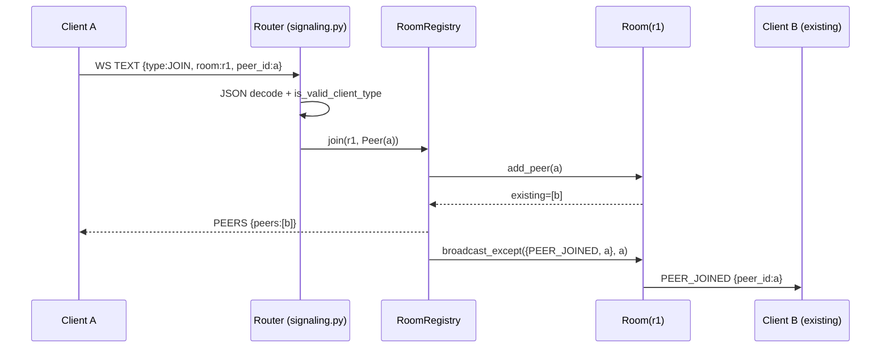

# DESIGN.md — TooTalk (p2p_msg) 설계 정책

> 본 문서는 **TooTalk** (저장소명 `p2p_msg`) 의 코드·인터페이스·데이터 흐름 설계 원칙을 정의한다.
> 정본 [CLAUDE_HARNESS_IMPORTANT.md](CLAUDE_HARNESS_IMPORTANT.md) §E 코딩 불변 규칙을 본 문서 전반에 반영한다.
> 본 문서는 "어떻게 만드는가"의 정책이며, "무엇을 만드는가"는 [Specification.md](Specification.md), 모듈 경계는 [ARCHITECTURE.md](ARCHITECTURE.md), UI 표현은 [FRONTEND.md](FRONTEND.md) 가 담당한다.

---

## 1. 문서 목적

본 문서는 다음 질문에 대해 단일 정답을 제공한다.

- 모듈을 신규로 추가할 때 어떤 계층에 두는가
- 비동기/동기 코드를 어디서 섞을 수 있는가 (정답: 섞지 않는다)
- 환경 설정은 어떻게 외부화되는가
- 데이터 객체의 소유자(owner) 는 누구인가, 해제 책임은 어디에 있는가
- 어떤 패턴을 안티패턴으로 명시 금지하는가
- 테스트를 어떻게 단위/통합으로 분리하는가

본 정책은 **AI 에이전트가 코드를 읽고 패턴을 재현할 수 있는 수준**으로 구체적이어야 한다. 추상적 가이드라인은 금지한다.

---

## 2. 설계 원칙 (10대)

1. **단일 책임 (SRP)** — 한 모듈/클래스는 한 가지 변화 축에 응답한다. `server/protocol.py` 는 메시지 구조만, `server/room.py` 는 라우팅 상태만, `server/signaling.py` 는 WebSocket 프레임 디스패치만 책임진다.
2. **명시적 의존성 (Explicit DI)** — 전역 변수·모듈 레벨 mutable 금지. 의존성은 생성자/함수 인자로 주입한다. `RoomRegistry` 가 `aiohttp.Application` 에 `APP_KEY_REGISTRY` 키로 바인딩되는 방식이 정답 예시.
3. **비동기 전용 (Async-First)** — 모든 IO 는 `async def`. 동기 IO 는 `app.core` (Qt 비의존 단위 테스트 계층) 와 순수 데이터 변환 함수에만 허용된다.
4. **환경변수 외부화** — 설정값은 `.env` 또는 DB 상수 테이블로만 관리한다. 코드 안 하드코딩은 정본 §E 위반. `app/core/config.py` 의 `_DEFAULT_*` 상수는 폴백 전용이며 운영 값은 `.env` 가 단일 진실.
5. **계층 분리 (Router → Service → Model)** — 외부 입력 검증은 Router 계층이, 비즈니스 규칙은 Service 가, 데이터 정의는 Model 이 책임진다. 역방향 의존(Model 이 Router 를 import 하는 행위) 금지.
6. **불변 데이터 우선** — 설정/메시지/스냅샷은 `frozen=True` dataclass · `TypedDict` · `frozenset` 으로 표현. 가변 컨테이너는 lock 으로 보호하는 컴포넌트(`Room._peers`, `RoomRegistry._rooms`) 내부에 한정.
7. **한글 주석 의무 (M4)** — 모든 코드 파일의 모듈/클래스/메서드 docstring 과 주요 분기 주석은 한국어. 변수·함수·클래스 이름은 영어 (도구 호환성).
8. **외부 입력 격리** — 외부에서 들어온 dict/JSON 은 화이트리스트로만 통과시킨다. `protocol.is_valid_client_type` · `Config._normalize_scheme` 패턴 참조.
9. **이벤트 루프 통합 정책** — Qt UI 와 asyncio 는 `qasync` 단일 이벤트 루프로 통합한다. 별도 스레드에서 Qt 위젯을 건드리는 행위 금지.
10. **싱글톤 최소화** — 싱글톤은 `AppState` 한 개로 한정한다. 모든 신규 컴포넌트는 인스턴스 주입 우선, 전역 접근 최후.

---

## 3. 명명 규약

| 대상 | 규칙 | 예시 |
|---|---|---|
| 서비스명 | **TooTalk** (PascalCase) | About 다이얼로그, `TooTalk.app`, `TooTalk-{ver}-{os}.zip` |
| 코드/저장소명 | **p2p_msg** (snake_case) | import 경로, 디렉토리, GitHub repo |
| 모듈 파일 | snake_case `.py` | `app_state.py`, `signaling.py` |
| 클래스 | PascalCase | `RoomRegistry`, `AppState`, `Config` |
| 함수/메서드 | snake_case | `load_config`, `cleanup_peer` |
| 비공개 멤버 | `_` prefix | `_rooms`, `_DEFAULT_SIGNAL_HOST` |
| 상수 | UPPER_SNAKE + `Final` | `MSG_JOIN`, `APP_KEY_REGISTRY` |
| 환경변수 | `UPPER_SNAKE` | `SIGNAL_SERVER_HOST`, `STUN_URL` |
| 와이어 키 vs 내부 키 | 와이어 `from` ↔ 내부 `from_` | `wire_to_internal`/`internal_to_wire` 가 변환 흡수 |

- **이름은 영어, 주석·문자열은 한국어** — 이중 언어 정책 (M4 §J).
- 변수명에 한글 사용 금지 (툴체인 호환).
- 메시지 타입 식별자는 `MSG_*` prefix, 오류 코드는 `ERR_*` prefix.

---

## 4. 인터페이스 설계 패턴

### 4.1 PyQt6 — Signal/Slot

- 위젯 간 통신은 Qt **Signal/Slot** 으로만 한다. 부모 위젯이 자식 위젯의 메서드를 직접 호출하는 양방향 의존 금지.
- Signal 은 명사 과거형, Slot 은 동사 현재형으로 명명한다 (`peer_joined` Signal → `on_peer_joined` Slot).

### 4.2 asyncio — async generator + coroutine

- 메시지 루프는 `async for msg in ws:` 패턴 (`signaling.py:handle_ws` 참조).
- 외부 IO 는 항상 `await`. 콜백 지옥 회피.
- 동시 송신이 발생할 수 있는 자원은 `asyncio.Lock` 으로 보호 (`Peer.send_lock`, `Room._mutex`).

### 4.3 TypedDict 기반 메시지 모델

- 와이어 envelope 는 `TypedDict` 로 선언 (`server/protocol.py` 참조). 런타임 검증은 `is_valid_client_type` + 필드별 isinstance 가드.
- 외부 IO 도구(JSON serializer) 에 넘기기 직전에만 `internal_to_wire` 로 변환.
- 새 메시지 타입 추가 시: ① `protocol.py` 에 TypedDict + `MSG_*` 상수 추가 → ② `CLIENT_MSG_TYPES` frozenset 갱신 → ③ Router 라우팅 분기 추가 → ④ Service 메서드 추가.

### 4.4 dataclass — 설정·런타임 객체

- 설정은 `frozen=True, slots=True` dataclass (`Config`).
- 런타임 mutable 상태는 일반 dataclass 또는 일반 클래스 (`Peer`, `Room`).
- `field(default_factory=...)` 사용 — mutable 기본값 직접 선언 금지.

---

## 5. 데이터 흐름과 소유권 (Ownership)



### 소유권 표

| 객체 | 생성자 | 소유자 | 해제 시점 |
|---|---|---|---|
| `Config` | `load_config()` | 모듈 main | 프로세스 종료 |
| `AppState` | 싱글톤 진입점 `instance()` | 프로세스 전역 | 프로세스 종료 (테스트는 `_reset_for_tests`) |
| `RoomRegistry` | `main.py` 부트스트랩 | `aiohttp.Application[APP_KEY_REGISTRY]` | `shutdown()` 단일 진입점 |
| `Room` | `RoomRegistry.join` 안 lazy 생성 | `RoomRegistry._rooms` | `is_empty()` 시 자동 GC |
| `Peer` | `signaling._handle_join` | 동일 WebSocket 핸들러 코루틴 로컬 | 핸들러 `finally` 안 `cleanup_peer` |
| WebSocket | aiohttp 프레임워크 | 코루틴 로컬 | `finally` 안 `ws.close()` |

**핵심 규칙**: 생성한 코루틴이 해제도 담당한다. `try/finally` 로 자원 해제를 보장하고, 다른 코루틴에 자원을 넘길 때는 소유권 이전을 명시적으로 한다.

---

## 6. 오류 처리 방침

### 6.1 try/except 사용 범위

- **외부 입력 (네트워크·파일·사용자) 만 try/except** 로 감싼다.
- **내부 invariant 는 `assert`** 또는 명시적 raise. 정상 흐름에서 발생할 수 없는 상태는 빠르게 실패시킨다.
- **try/pass 금지** — 모든 예외는 로그·복구·재던지기 중 하나로 처리한다.

### 6.2 예외 분류

| 구분 | 예시 | 처리 |
|---|---|---|
| 외부 형식 오류 | `json.JSONDecodeError`, `ValueError` (정수 변환 실패) | 로그 + 안전 기본값 폴백 또는 ERROR 응답 |
| 외부 연결 단절 | `ConnectionResetError`, `RuntimeError` (`ws.send_str` 실패) | 로그 + cleanup 진입점 호출 |
| 내부 invariant | 빈 `room_id`, 허용 외 `connection_state` | `ValueError` raise — 호출자 책임으로 위임 |
| 프로그래밍 오류 | 싱글톤 직접 생성 | `RuntimeError` raise |

### 6.3 로그 형식

- 정본 §E 규약: `[YYYY-mm-dd H:i:s]`.
- 모듈 단위 `logger = logging.getLogger(__name__)`.
- 외부 IO 결과는 항상 로그 1행. 보안 민감 필드(SDP 본문, 자격증명) 는 로그 금지.
- 로그 메시지는 한국어 + 영어 식별자 혼합 허용 (`"peer 송신 실패 peer_id=%s err=%s"`).
- `print()` 디버깅 금지 — 모든 진단 출력은 `logger` 경유.

---

## 7. 환경변수 명세

본 시점 누계 (`.env.example` 정합). 신규 환경변수 추가 시 본 표와 `app/core/config.py` `_DEFAULT_*` 상수, `Config` dataclass 필드를 **동시** 갱신해야 한다.

| 키 | 기본값 | 용도 | 정규화 |
|---|---|---|---|
| `SIGNAL_SERVER_HOST` | `114.207.112.73` | 시그널링 서버 호스트 | 빈 문자열 → 기본값 |
| `SIGNAL_SERVER_WS_PORT` | `8765` | 시그널링 서버 WebSocket 포트 | 정수 변환 실패 → 기본값 |
| `SIGNAL_SERVER_WS_SCHEME` | `ws` | `ws` 또는 `wss` | 그 외 → `ws` 폴백 |
| `STUN_URL` | `stun:stun.l.google.com:19302` | WebRTC ICE 수집용 STUN | 빈 문자열 → 기본값 |
| `TURN_URL` | `""` | 선택. 비면 TURN 미사용 | — |
| `TURN_USERNAME` | `""` | TURN 자격증명 | — |
| `TURN_CREDENTIAL` | `""` | TURN 비밀값 | — |
| `USER_NICKNAME` | `guest` | 클라이언트 표시명 | — |
| `LOG_LEVEL` | `INFO` | 로깅 레벨 | 허용 외 → `INFO` |
| `DB_HOST` | `127.0.0.1` | MariaDB 호스트 (사용자 directive 2026-05-17) | — |
| `DB_PORT` | `3306` | MariaDB 포트 | 정수 변환 실패 → 기본값 |
| `DB_USER` | `tootalk` | MariaDB 사용자 | — |
| `DB_PASS` | `""` | MariaDB 비밀번호 (`.env.local` 격리) | — |
| `DB_NAME` | `tootalk` | MariaDB 스키마 | — |
| `MEDIA_CACHE_DIR` | `./media_cache` | 이미지·파일 캐시 디렉토리 | — |
| `SIGNAL_SERVER_BIND` | `0.0.0.0` | 시그널링 서버 바인드 주소 (서버 전용) | — |
| `SIGNAL_SERVER_LOG_FILE` | `./logs/signaling.log` | 서버 로그 출력 경로 | — |
| `SIGNAL_HEARTBEAT_SEC` | `30` | WebSocket heartbeat 주기(초) | 정수 변환 실패 → 기본값 |
| `MAX_PEERS_PER_ROOM` | `2` | 방당 peer 상한 (Phase 1 = 2) | 정수 변환 실패 → 기본값 |

---

## 8. 코드 스타일

### 8.1 타입 힌트

- **타입 힌트 100% 강제** — 모든 public 함수/메서드 매개변수와 반환값에 타입 어노테이션 필수.
- `from __future__ import annotations` 모듈 상단 의무 (Python 3.13 호환성·forward reference).
- `Any` 사용은 외부 dict (`payload: dict[str, Any]`) 와 호환성 헬퍼 한정.

### 8.2 async 강제

- IO 를 수행하는 함수는 예외 없이 `async def`.
- 동기 헬퍼는 순수 변환(`wire_to_internal`, `_normalize_scheme`) 또는 dataclass property 에 한정.

### 8.3 docstring 한국어

- 모듈/클래스/함수 docstring 은 한국어 (M4 §J).
- 첫 줄은 한 문장 요약, 두 번째 줄 공백, 본문 상세.
- Sphinx/numpy 스타일 둘 다 허용 (정합만 유지).

### 8.4 Import 순서

1. `from __future__ import ...`
2. 표준 라이브러리
3. 서드파티
4. 내부 패키지 (상대 import 우선)

각 그룹 사이 빈 줄 1개.

### 8.5 짧은 예시 (5줄 이하)

```python
# 외부 입력 화이트리스트 — 정본 §E 정합 패턴
if not is_valid_client_type(msg_type):
    await _send_error(ws, ERR_UNKNOWN_TYPE, f"허용되지 않은 타입: {msg_type!r}")
    return peer
```

---

## 9. 안티패턴 (명시 금지)

1. **동기 IO 호출** — `requests.get`, `time.sleep`, blocking 파일 IO. 비동기 등가물 사용.
2. **하드코딩 설정값** — host/port/path 를 코드 상수로 박는 행위. `.env` + `Config` 경유.
3. **`try: ... except: pass`** — 모든 예외는 로그 + 처리. 의도적 무시는 주석으로 명시 + 좁은 예외 타입 한정.
4. **`print()` 디버깅** — `logger` 경유. 임시 디버깅도 commit 금지.
5. **전역 mutable** — 모듈 레벨 dict/list 의 mutation 금지. lock 보호된 컴포넌트 안에 캡슐화.
6. **순환 import** — Router → Service → Model 일방향. 역방향 import 발생 시 인터페이스 분리.
7. **Qt 위젯 백그라운드 스레드 접근** — qasync 단일 루프 경유. 별도 스레드 접근 금지.
8. **싱글톤 남발** — `AppState` 외 신규 싱글톤 금지. 인스턴스 주입 우선.
9. **`Any` 남용** — 외부 dict 경계 외에는 정확한 타입 명시.
10. **한국어 의존명사 단독 사용 금지** — 합성어(관측·측면·추측·좌측·우측) 만 허용한다. 영어 직역체("server-side", "client-side") 를 한글 의존명사 단독으로 옮기는 표현 금지. "서버에서·클라이언트에서·서버 계층·클라이언트 계층" 같은 명확한 대체어를 사용한다.

---

## 10. 테스트 설계

### 10.1 단위 테스트 (pytest 기본)

- 위치: `tests/unit/test_<module>.py`
- 대상: 순수 함수, Service 계층 단일 클래스, dataclass 변환.
- 외부 IO 금지 — 네트워크·파일·DB 모두 fake/stub.
- `app/core` 는 Qt 의존성 없이 전부 단위 테스트 가능해야 한다 (정본 §E 정합).

### 10.2 통합 테스트 (`@pytest.mark.integration`)

- 위치: `tests/integration/test_<scenario>.py`
- 대상: aiohttp WebSocket 라운드트립, qasync 이벤트 루프 통합, 시그널링 ↔ DataChannel 연결.
- 마커: `@pytest.mark.integration` 필수 — 기본 실행에서 제외, CI 별도 job 으로 실행.

### 10.3 시퀀스 — JOIN 시나리오



### 10.4 테스트 데이터 명명

- 픽스처: `conftest.py` 안 `@pytest.fixture` 로 정의.
- room_id/peer_id 는 `r1`, `peer-a`, `peer-b` 같은 짧은 명시적 식별자.
- 무작위 ID 가 필요한 경우 `uuid.uuid4()` 직접 호출, `random.seed` 고정 금지.

### 10.5 커버리지 목표

- 단위: 라인 커버리지 80% 이상 (`app/core`, `server/protocol.py` 는 95% 이상).
- 통합: 시나리오 커버리지 — JOIN/LEAVE/OFFER/ANSWER/ICE 5종 + 오류 6종 (`ERR_*`) 전부.

### 10.6 E2E 테스트 (Playwright — 사용자 directive 2026-05-17)

**사용자 directive**: "qa 단계에 반드시 playwright 를 이용한 테스트도 명시해"

PyQt6 데스크탑 위젯 직접 자동화는 Playwright 영역 외 (`pytest-qt` `QTest` 사용). Playwright 의 다음 3 영역 적용:

| 영역 | 도구 | 검증 대상 |
|---|---|---|
| 시그널링 서버 WebSocket E2E | `playwright.async_api` + 브라우저 WebSocket client | JOIN/OFFER/ANSWER/ICE 흐름 + 오류 6종 응답 |
| HTML 등가 시각 회귀 | `page.screenshot()` + `page.locator()` | `docs/html/` 6 HTML 의 swatch + mermaid SVG 렌더 + console error 0 |
| GitHub Release zip 첫 실행 capture | Phase 2+ deferred | PyInstaller zip 다운 + 첫 화면 screenshot + 파일 송수신 회귀 |

**구성**:

- 마커: `@pytest.mark.e2e` 필수 — 기본 실행 의 제외 (수동 또는 CI nightly 전용)
- 위치: `tests/e2e/` — 단위 `tests/app/` · `tests/server/` 와 분리
- 의존성: `pytest-playwright>=0.5` + `playwright>=1.42` (`app/requirements-dev.txt` + `server/requirements-dev.txt`)
- 픽스처: `tests/e2e/conftest.py` 의 `signaling_server_url` + `live_signaling_server_url` + `html_docs_base` (file:// base)
- 원격 기본값: `signaling_server_url` = `ws://114.207.112.73:8765/ws` (원격 테스트 서버). `E2E_SIGNALING_URL` 로 staging / local URL override 가능.
- 브라우저 WebSocket E2E 는 기본적으로 원격 테스트 서버를 대상으로 Playwright page 안의 native `WebSocket` 으로 검증한다. 로컬 격리 검증이 필요할 때만 `live_signaling_server_url` 로 실제 `aiohttp` `TCPSite` 를 loop thread 에 띄운다.
- 최소 happy path = Alice/Bob 2 socket JOIN → PEERS / PEER_JOINED → OFFER → ANSWER → ICE → LEAVE / PEER_LEFT.
- 최소 error path = unknown type → `ERROR UNKNOWN_TYPE`, JOIN 전 OFFER → `ERROR NOT_JOINED`.

**실행**:

```bash
# 사전 설치 (1회)
pip install -r app/requirements-dev.txt
playwright install --with-deps chromium

# E2E 단독 실행
pytest -m e2e

# unit + integration + e2e 전체
pytest -m "integration or e2e or not (integration or e2e)"
```

**한계 영역 (Playwright 부적합)**:

- PyQt6 메인 윈도우 의 위젯 클릭 = `pytest-qt` `QTest.mouseClick` 사용
- aiortc DataChannel 의 binary 전송 검증 = `pytest-asyncio` + 직접 client 호출
- 시스템 트레이 / OS 알림 = `pyautogui` 또는 OS 별 자동화 (Phase 4+ 모바일 의 별도)

---

## 11. UI 디자인 시스템 (사용자 directive 2026-05-17)

본 섹션은 UI 컴포넌트 카드 + 상태 + 변이체 + 레이아웃 그리드 정의. [FRONTEND.md](FRONTEND.md) §3 위젯 계층 트리 + §4 색상 변수 + §14 wireframe 의 동기. `app/ui/theme.qss` (Phase 1 후반 신설) 의 정식 변수로 이관 예정.

### 11.1 컴포넌트 인벤토리

| 컴포넌트 | 위치 | 핵심 책임 |
|---|---|---|
| `MainWindow` | `app/ui/main_window.py` | `QMainWindow` 컨테이너. 메뉴바 + ChatView + 입력바 + StatusBar 결합 |
| `ChatView` | `app/ui/chat_view.py` | `QScrollArea` + `QVBoxLayout`. MessageBubble 누적 + 자동 스크롤 |
| `MessageBubble` | `app/ui/message_bubble.py` | 단일 메시지 표시. 내/상대 좌우 정렬 + 배경색 분기 + 타임스탬프 |
| `InputBar` | `app/ui/input_bar.py` (예정) | 텍스트 입력 + 파일 첨부 버튼 + Enter 송신 + Shift+Enter 줄바꿈 |
| `FileProgressWidget` | `app/ui/file_progress_widget.py` | 송수신 양방향 ProgressBar (회색 sent + 파란 acked) |
| `StatusBar` | `app/ui/status_bar.py` | 시그널링 연결 상태 + peer 수 + 현재 방 |
| `OnboardingDialog` | `app/ui/onboarding_dialog.py` (예정) | 첫 실행 nickname 입력 + STUN/시그널링 안내 |
| `RoomJoinDialog` | `app/ui/room_join_dialog.py` (예정) | room id + peer_id 입력 모달 |

### 11.2 컴포넌트 상태 (interaction state)

모든 interactive 컴포넌트 (Button, Input, MessageBubble) 의 적용:

| 상태 | 시각 효과 | 트리거 |
|---|---|---|
| `default` | 기본 색상 + 1px border | 마우스/포커스 없음 |
| `hover` | 배경 +5% 명도 + 커서 pointer | mouseover |
| `active` | 배경 −5% 명도 (눌림 효과) | mousedown |
| `focused` | 2px outline `--status-connected` | Tab 키 or click |
| `disabled` | opacity 0.4 + 커서 not-allowed | `setEnabled(False)` |
| `error` | border 색상 `--status-error` + 흔들림 30ms | invalid 입력 |

### 11.3 컴포넌트 변이체 (variant)

| 변이체 | 용도 | 예시 컴포넌트 |
|---|---|---|
| `primary` | 핵심 액션 (보내기 / JOIN / 확인) | Button.primary |
| `secondary` | 보조 액션 (취소 / 뒤로) | Button.secondary |
| `ghost` | 텍스트만 (메뉴 항목 / 링크) | Button.ghost |
| `danger` | 파괴적 액션 (LEAVE / 삭제) | Button.danger |

### 11.4 레이아웃 그리드 (spacing scale)

4px base unit. 모든 padding / margin / gap 의 본 스케일 사용:

| 토큰 | 값 (px) | 용도 |
|---|---|---|
| `--space-xs` | 4 | 컴포넌트 내부 micro (icon ↔ text) |
| `--space-sm` | 8 | 컴포넌트 내부 base (input padding) |
| `--space-md` | 12 | 컴포넌트 간 base (bubble ↔ bubble) |
| `--space-lg` | 16 | 섹션 간 base (ChatView padding) |
| `--space-xl` | 24 | 큰 섹션 분리 (MainWindow padding) |
| `--space-2xl` | 32 | 모달 padding |
| `--space-3xl` | 48 | dialog inner section 분리 |

### 11.5 elevation / shadow (Phase 1 후반 정의)

| 토큰 | 그림자 값 | 용도 |
|---|---|---|
| `--elev-0` | `none` | 평면 (default 배경) |
| `--elev-1` | `0 1px 2px rgba(0,0,0,0.08)` | MessageBubble + Button |
| `--elev-2` | `0 2px 4px rgba(0,0,0,0.12)` | Dialog + Dropdown |
| `--elev-3` | `0 8px 16px rgba(0,0,0,0.16)` | Modal overlay |

### 11.6 motion (transition curve + duration)

- `--motion-fast` = `120ms cubic-bezier(0.4, 0, 0.2, 1)` (hover / focus 전환)
- `--motion-base` = `200ms cubic-bezier(0.4, 0, 0.2, 1)` (drawer / dialog open)
- `--motion-slow` = `400ms cubic-bezier(0.4, 0, 0.2, 1)` (페이지 전환 — Phase 2+)
- 사용자 OS "Reduce Motion" 설정 의 모두 0ms 적용 (접근성 — [FRONTEND.md §11](FRONTEND.md) 정합)

### 11.7 dark mode 동기 정합

- 라이트 ↔ 다크 = `--bg` · `--fg` · `--bubble-self` · `--bubble-other` · `--bubble-border` · `--text-timestamp` · `--text-sender` 7 변수 토글
- `--status-connected` / `--status-error` = 라이트/다크 동일 (의미 색상 안정성)
- `--primary` / `--progress-acked` / `--progress-inflight` = Phase 1 후반 후크 확정
- 자동 감지 = `palette().windowText().lightness() < 128` 의 dark 판정 (`app/ui/theme.py` 예정)

### 11.8 다국어 + 타이포 (FRONTEND.md §5 + §10 정합)

- system font stack 우선 (한글 가독성 확보)
- 폰트 크기 토큰 = `--text-xs` 11 / `--text-sm` 13 / `--text-base` 15 / `--text-lg` 18 / `--text-xl` 22
- line-height = 1.5 base + 1.3 (heading)
- 한국어 line-break = `word-break: keep-all` (어절 단위 break 유지)

### 11.9 Toonation BI 색상 통합 (cycle 153~169.x 본격 entry, FRONTEND.md §15 ground truth)

본 §11.9 = `app/assets/themes/base-dark.qss` + `app/ui/theme.py` actual binding 정합 본문. FRONTEND.md §15 BI 가이드 의 변수 mapping + DESIGN.md §11 컴포넌트 시스템 의 연결 layer.

#### 11.9.1 brand color scale 6 변수 (ground truth)

| 변수 | hex | 역할 |
|---|---|---|
| `--toon-primary` | `#0066FF` | 핵심 액션 (보내기 / CTA / nav active / self bubble) |
| `--toon-primary-deep` | `#0052FF` | hover / active 변이 |
| `--toon-navy` | `#0F172A` | dark bg + footer + welcome banner gradient end |
| `--toon-slate` | `#1F2937` | dark elevated (card bg / peer bubble) |
| `--toon-cyan` | `#22D3EE` | accent / heading / ACK progress |
| `--toon-cyan-light` | `#67E8F9` | sub accent / badge / sender label |

#### 11.9.2 widget ↔ brand color mapping

| widget | bg | text | border |
|---|---|---|---|
| QPushButton[primary] | `#0066FF` → hover `#0052FF` | `#ffffff` | none |
| QPushButton[secondary] | transparent | `#0066FF` | `#0066FF` 1px |
| QFrame#messageBubbleSelf | `#0066FF` | `#ffffff` | none |
| QFrame#messageBubblePeer | `#1F2937` | `#e5e7eb` | `#374151` |
| QFrame#sidebarRail | `#0a0f1c` | `#9ca3af` (active `#0066FF`) | right 1px `#1f2937` |
| QListWidget#chatList | `#0F172A` | `#e5e7eb` | none |
| QListWidget#chatList::item:selected | `#1F2937` | `#67E8F9` | none |
| QFrame#chatHeader | `#0F172A` | `#e5e7eb` + status `#67E8F9` | bottom 1px `#1f2937` |
| QLineEdit / QTextEdit | `#1F2937` | `#e5e7eb` | `#374151` (focus `#0066FF`) |
| QFrame#welcomeBanner | gradient `#0F172A` → `#0066FF` | `#ffffff` | none |
| Reply preview (ChatView) | rgba(34,211,238,0.08) | `#9ca3af` | left 3px `#22D3EE` |
| Reaction pill | rgba(34,211,238,0.15) | `#67E8F9` | 1px rgba(34,211,238,0.3) |

#### 11.9.3 로고 자산 4 변형 (cycle 153.1)

| 변형 | path | size | 용도 |
|---|---|---|---|
| Full | `app/assets/branding/tootalk_logo.svg` | 380×100 | WelcomeDialog banner + 정보 dialog |
| Icon-only | `app/assets/branding/tootalk_icon.svg` | 64×64 | LoginDialog top + SignupDialog top + tray icon |
| Wordmark-only | `app/assets/branding/tootalk_wordmark.svg` | 200×48 | header bar + footer + about |
| Favicon | (cycle 161+ 신설 의무) | 16×16 + 32×32 | 브라우저 tab + Linux window icon |

#### 11.9.4 theme 로딩 chain (cycle 155+ actual)

```
app/main.py qt_app 초기화
  → load_user_theme_preference() 읽기 (~/.tootalk/theme_preferences.json)
  → load_theme(qt_app, theme=chosen) — base-{dark|light|auto}.qss 적용

사용자 SettingsDialog → 테마 tab → ThemePicker click
  → ThemePicker._on_clicked(mode)
  → load_theme(qt_app, mode) 즉시 reload
  → save_user_theme_preference(mode) persist
```

#### 11.9.5 dark / light 변수 토글 (cycle 161+ light theme 의무)

cycle 160 = dark mode 우선 actual + light mode skeleton 만. cycle 161+ light theme `base-light.qss` 신설 + 자동 감지 (`palette().windowText().lightness() < 128`) actual binding.

### 11.10 cycle 169.x UI Toonation BI 통합 redesign (cycle 169.117~206 90+ sub-cycle)

telegram desktop Win11 align + Toonation BI 통합 chain reflect.

- **sidebar 2 entry** — 모든 대화방 (chat_bubble.svg) + 편집 (edit.svg sliders) — width 72 + icon 24
- **top bar 3 영역 통합** — sidebar hamburger / chat_list search pill / chat_header — height 60 + bg `#0A1019` + vertical center align
- **chat_header simple** — avatar 폐기 + nickname only + status 한국어 (`최근에 접속함` / `온라인`) + transparent bg
- **chat_list "채팅" tab 통합** — friend + room + bot kind 전수 visible + 단색 avatar `#0066FF` (gradient 폐기)
- **chat_view 회수 chain** — clear_messages + DM history client cache replay + scroll offset per-chat retain + day separator 라벨 (오늘 / 어제 / YYYY년 M월 D일)
- **message_bubble grouping** — 동일 sender 연속 시 sender label + tail corner 부재 + ts inline overlay (negative margin + color 분기: self `#A9D4FF` / peer `#A1AAB3`)
- **input_bar composite pill** — emoji left + text + attach right (single QFrame `#1a2335` radius 22) + voice/send mutual toggle (text 빈 = mic / text 있음 = send circle `#0066FF`)
- **hamburger drawer** — Toonation BI vertical gradient header (`#0066FF` → `#001A4D`) + 9 menu entry + slide-in 220ms
- **dialog modal pattern** — MyProfileDialog + FolderManageDialog + FolderEditDialog 의 `Qt.WindowType.Dialog | FramelessWindowHint` + `setModal(True)` 일괄
- **편집 tab** — `_on_sidebar_tab_clicked("settings")` branch → `FolderManageDialog` redirect (telegram folder edit align)
- **default chat 진입** — startup `_post_login_refresh` 후 active chat retain + 부재 시 투네이션 고객센터 bot kind 진입 (chat_header 즉시 출력)
- **bot LLM 응답 chain** — `_send_bot_message` async helper (POST `/api/bot/chat`) + reply → `_append_dm_message` chain + system prompt knowledge source (`help.toon.at/hc/ko` + `namu.wiki/w/Toonation`)

### 11.11 dialog modal 통합 패턴 (cycle 169.121 + 169.201)

- `setWindowFlags(Qt.WindowType.Dialog | Qt.WindowType.FramelessWindowHint)` + `setModal(True)` + `setFixedSize(W, H)`
- `WA_TranslucentBackground=False` retain (배경 retain)
- frame chrome 폐기 = OS title bar 없음 + outside click close (drawer eventFilter pattern)
- 적용 대상 = `MyProfileDialog` (380×480) + `FolderManageDialog` (520×720) + `FolderEditDialog` (480×720) + 4 dialog batch (Welcome / Login / Signup / OTP — cycle 169.92~93 retain)

---

## 12. 참조

- 정본 — [CLAUDE_HARNESS_IMPORTANT.md §E](CLAUDE_HARNESS_IMPORTANT.md) (코딩 불변 규칙)
- 정본 — [CLAUDE_HARNESS_IMPORTANT.md §J](CLAUDE_HARNESS_IMPORTANT.md) (M4 한글 주석 규약)
- 정본 — [CLAUDE_HARNESS_IMPORTANT.md §R](CLAUDE_HARNESS_IMPORTANT.md) (M5 즉시 commit/push)
- 저장소 맵 — [AGENTS.md](AGENTS.md)
- 모듈 경계 — [ARCHITECTURE.md](ARCHITECTURE.md)
- UI 표현 정책 — [FRONTEND.md](FRONTEND.md)
- 신뢰성 (장애·재연결) — [RELIABILITY.md](RELIABILITY.md)
- 보안 (외부 입력 hardening) — [SECURITY.md](SECURITY.md)
- 실행 계획 — [PLANS.md](PLANS.md) → [docs/exec-plans/active/](docs/exec-plans/active/)
- 코드 참조 — [server/protocol.py](server/protocol.py), [server/room.py](server/room.py), [server/signaling.py](server/signaling.py), [app/core/app_state.py](app/core/app_state.py), [app/core/config.py](app/core/config.py)

---

마지막 갱신: 2026-05-17 (DESIGN.md 신설)
