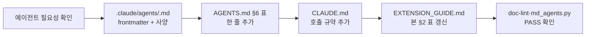
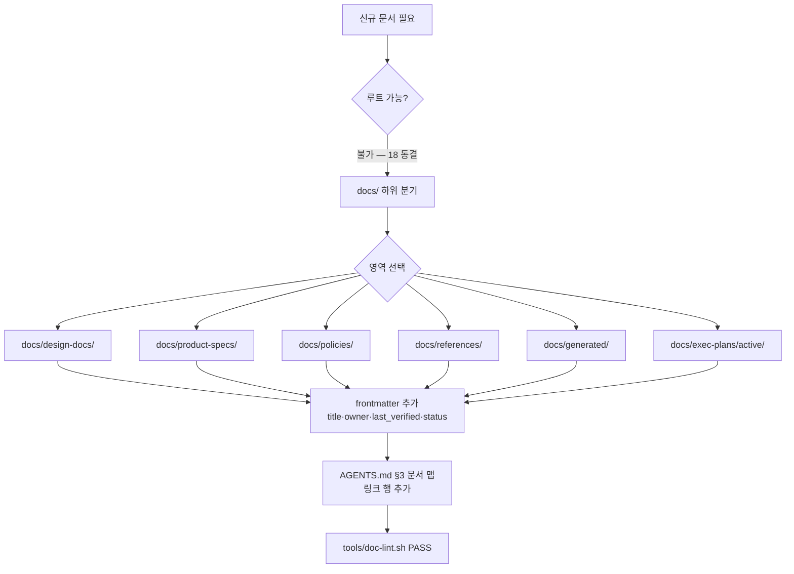
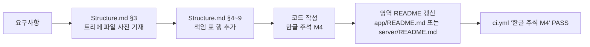
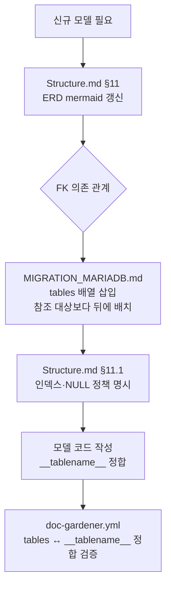
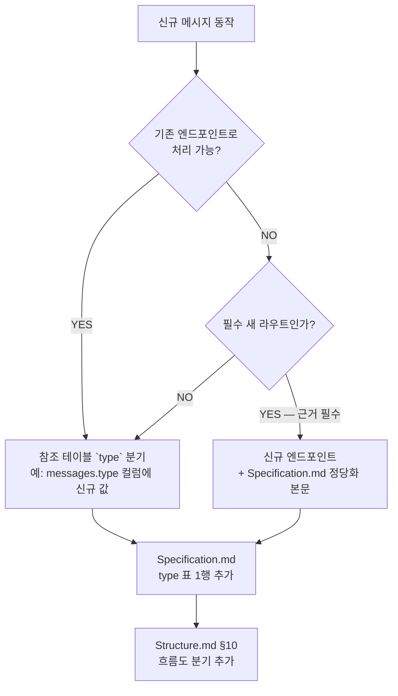
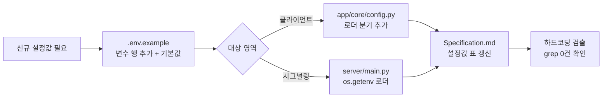
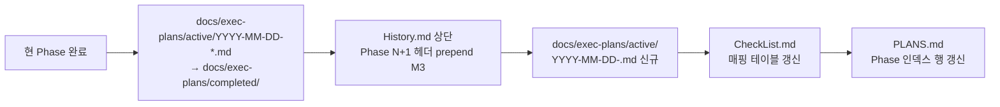

# EXTENSION_GUIDE.md — TooTalk (p2p_msg) 확장 운영 가이드

> 본 문서는 **시스템 확장 시 동기화 의무**를 단일 진입점으로 모은 운영 매뉴얼이다.
> 정본은 [CLAUDE_HARNESS_IMPORTANT.md](CLAUDE_HARNESS_IMPORTANT.md) §N, 저장소 지도는 [AGENTS.md](AGENTS.md) §9.
> 본 문서가 시키는 절차를 건너뛰면 `@reviewer-agent` 차단 또는 CI 실패가 발생한다.

---

## 1. 문서 목적

신규 산출물(에이전트·문서·코드 파일·DB 모델·위젯·정책·CI 워크플로우·환경변수·Phase 전환)을 추가할 때 발생하는 **다중 파일 동기화 의무**를 누락 없이 수행하도록, 절차·체크리스트·검증 기준을 한곳에 모은다. 정본([§N](CLAUDE_HARNESS_IMPORTANT.md))이 선언한 의무를 본 문서가 **실행 절차**로 구체화한다.

본 문서가 다루지 않는 영역:

- 정본 자체의 규칙 변경 (정본 직접 편집 — 본 문서 §7 절차 참조)
- 일회성 핫픽스 (M1 의무는 동일하나 절차는 [PLANS.md](PLANS.md) 참조)
- 외부 의존성 업그레이드 (`app/requirements.txt` · `server/requirements.txt` 변경 — [Structure.md](Structure.md) §13)

---

## 2. 신규 서브에이전트 추가 절차

새로운 `@<name>-agent` 를 도입할 때의 4중 동기화. 정본 [§N-1](CLAUDE_HARNESS_IMPORTANT.md) 명문 의무.



**파일별 추가 내용**:

| 대상 | 추가 내용 |
|---|---|
| `.claude/agents/<name>.md` | frontmatter (`name` / `description` / `tools` / `model`) + 목적·입력·출력·금지·성공 기준·handoff |
| `AGENTS.md` §6 표 | `\| @<name>-agent \| 역할 요약 \| 주요 산출물 \|` 1행 |
| `CLAUDE.md` | 호출 규약 본문에 한 줄 (개발/문서/프로세스 구역 중 해당 위치) |
| `EXTENSION_GUIDE.md` (본 문서) | §2 표 끝에 `@<name>-agent` 행 추가 |

**현재 등록된 7 에이전트** (alphabetical):

| 에이전트 | 사양 파일 |
|---|---|
| `@doc-gardener-agent` | [.claude/agents/doc-gardener-agent.md](.claude/agents/doc-gardener-agent.md) |
| `@history-agent` | [.claude/agents/history-agent.md](.claude/agents/history-agent.md) |
| `@observability-agent` | [.claude/agents/observability-agent.md](.claude/agents/observability-agent.md) |
| `@planning-agent` | [.claude/agents/planning-agent.md](.claude/agents/planning-agent.md) |
| `@qa-agent` | [.claude/agents/qa-agent.md](.claude/agents/qa-agent.md) |
| `@release-agent` | [.claude/agents/release-agent.md](.claude/agents/release-agent.md) |
| `@reviewer-agent` | [.claude/agents/reviewer-agent.md](.claude/agents/reviewer-agent.md) |

---

## 3. 신규 문서 추가 절차

루트 마크다운은 **18개로 동결**([정본 §K](CLAUDE_HARNESS_IMPORTANT.md)). 신규 문서는 무조건 `docs/` 하위에 생성한다.

**금지**: 루트에 새 `.md` 파일 생성 (CI `ci.yml` 차단).



**frontmatter 필수 항목** (`docs/**` 강제, [정본 §L](CLAUDE_HARNESS_IMPORTANT.md) `docs-lint.yml` 검증):

```yaml
---
title: 문서 제목
owner: '@담당-에이전트 또는 사용자명'
last_verified: 2026-05-17
status: draft | active | review | completed | deprecated
---
```

**영역별 용도**:

| 디렉토리 | 용도 |
|---|---|
| `docs/design-docs/` | 아키텍처·설계 결정 기록 |
| `docs/product-specs/` | 제품 요구사항·UX 시나리오 |
| `docs/policies/` | 운영 정책 (doc-gardening · adoption-roadmap · execution-harness) |
| `docs/references/` | 외부 API·프로토콜 등 참조 자료 |
| `docs/generated/` | 자동 생성 산출물 (수동 편집 금지) |
| `docs/exec-plans/active/` | 진행 중 실행계획 |
| `docs/exec-plans/completed/` | 완료된 실행계획 (Phase 종료 시 이동) |

---

## 4. 신규 코드 파일 추가 절차

문서 선행(M1) 의무 + 한글 주석(M4) 의무가 동시 적용된다.



**구체 절차**:

1. **사전 등록 (M1)**: [Structure.md](Structure.md) §3 트리에 신규 파일 경로 추가 (실제 생성 직전)
2. **책임 명시**: 해당 영역 표에 행 추가
   - `server/` 영역의 라우터/서비스/모델 → [Structure.md](Structure.md) §6
   - `app/` 영역의 UI/Core/Net/RTC → [Structure.md](Structure.md) §7
   - `.claude/agents/` → [Structure.md](Structure.md) §8 (본 가이드 §2 와 이중 갱신)
   - `docs/` · `tools/` → [Structure.md](Structure.md) §9
3. **한글 주석 (M4)**: `.py` · `.js` · `.html` · `.css` · `.sql` · `.sh` 파일은 주석 영역에 완성형 한글(`AC00–D7A3`) 1자 이상 필수
4. **영역 README 변경 이력 prepend**: [app/README.md](app/README.md) 또는 [server/README.md](server/README.md) 의 "변경 이력" 섹션 (M2 의 영역판)
5. **루트 README.md 변경 이력 prepend**: 30행 상한, 최신 상단 (M2)

**금지**: Structure.md 갱신 없이 신규 파일 생성 (`@reviewer-agent` 차단).

---

## 5. 신규 DB 모델 추가 절차

[정본 §N-3](CLAUDE_HARNESS_IMPORTANT.md) 명문: ERD + MIGRATION_MARIADB tables 배열 FK 순서 동시 갱신.



**FK 순서 규칙**: 참조 대상 테이블이 `tables` 배열에서 **선행**해야 한다. 예) `messages` 가 `users(id)` FK 를 가지면 `users` 가 배열 상 앞.

**필수 갱신 파일**:

| 파일 | 내용 |
|---|---|
| [Structure.md](Structure.md) §11 | ERD mermaid 노드·간선 추가 |
| [Structure.md](Structure.md) §11.1 | 인덱스·UNIQUE·NULL 정책 |
| `MIGRATION_MARIADB.md` (생성 시) | `tables` 배열 FK 순서 삽입 |
| 모델 코드 | `__tablename__` 가 MIGRATION 항목과 정확 일치 |

**검증**: `.github/workflows/doc-gardener.yml` 주간 cron 이 `MIGRATION_MARIADB.md` `tables` ↔ 코드 `__tablename__` 정합을 차단.

---

## 6. 신규 위젯·메시지 타입 추가 절차

[정본 §N-4](CLAUDE_HARNESS_IMPORTANT.md) 명문: **참조 테이블 / `type` 분기 확장으로만**. 신규 엔드포인트 신설 지양.

**판단 기준**:



**예시**:

- 텍스트 메시지에 이모지 리액션 → `messages.type='reaction'` 신규 값으로 확장 (엔드포인트 신설 X)
- 파일 송수신 재시도 → `signaling` 의 기존 `FILE_META` payload 에 `retry` 필드 추가 (엔드포인트 신설 X)
- 영상 통화 → 데이터 경로 자체가 다르므로 신규 엔드포인트 정당 (Specification.md 에 근거 본문 필수)

---

## 7. 정책 변경 절차

루트 9 정책 (`AGENTS` · `ARCHITECTURE` · `DESIGN` · `FRONTEND` · `PLANS` · `PRODUCT_SENSE` · `QUALITY_SCORE` · `RELIABILITY` · `SECURITY`) 본문 + 정본 본문 **동시 갱신**.


**필수 정합 점검**:

- 정책 본문 변경 → 정본 §N/§K/§Q 의 해당 절 동시 수정
- [AGENTS.md](AGENTS.md) §3 (문서 맵) · §10 (금지사항) 정합
- 한쪽만 갱신된 모순 상태 금지 ([정본 §Q-7](CLAUDE_HARNESS_IMPORTANT.md))

---

## 8. CI 워크플로우 추가 절차

`.github/workflows/` 디렉토리에 신규 YAML 파일을 추가하는 절차.

| 단계 | 파일/위치 | 내용 |
|---|---|---|
| ① | `.github/workflows/<name>.yml` | 트리거(`on:`) · 작업(`jobs:`) 정의 |
| ② | [AGENTS.md](AGENTS.md) PR 체크리스트 | CI 체크 항목 행 추가 |
| ③ | [CLAUDE_HARNESS_IMPORTANT.md](CLAUDE_HARNESS_IMPORTANT.md) §L | 워크플로우 표에 1행 추가 |
| ④ | [Structure.md](Structure.md) §9 | `tools/` 디렉토리 의존 스크립트 명시 |

**필수 트리거 패턴** (기존 3종 참조):

- `ci.yml` — `on: [push, pull_request]` (전역 게이트)
- `docs-lint.yml` — `on: { push: { paths: ['**.md'] } }` (문서 전용)
- `doc-gardener.yml` — `on: { schedule: [{ cron: ... }], workflow_dispatch: {} }` (주간 drift)

신규 워크플로우는 위 3종 중 어디에 흡수 가능한지 먼저 검토 — 무분별한 신설 금지.

---

## 9. 신규 환경변수 추가 절차

[정본 E (코딩 불변 규칙)](CLAUDE_HARNESS_IMPORTANT.md) 명문: **하드코딩 금지**. 모든 설정값은 `.env` 또는 DB 상수 테이블 경유.



**필수 갱신**:

| 파일 | 추가 |
|---|---|
| [.env.example](.env.example) | `KEY=기본값` 행 + 주석 한 줄 (M4) |
| `app/core/config.py` (클라이언트 영역) | `os.getenv("KEY", "기본값")` 로더 |
| `server/main.py` (시그널링) | 동일 패턴 |
| [Specification.md](Specification.md) | 환경변수 표 행 추가 |
| [AGENTS.md](AGENTS.md) 부록 B | 핵심 변수만 노출 (전체는 `.env.example` 정본) |

**금지**: 코드 내 리터럴 값 (`SIGNAL_SERVER_HOST = "114.207.112.73"` 와 같은 직접 대입) — `@reviewer-agent` 차단.

---

## 10. Phase 진입 절차

큰 작업 단위 Phase 전환 절차. 활성 실행계획을 완료로 이동하고 신규를 생성한다.



**필수 절차**:

1. 현 Phase 의 모든 active 실행계획 status 가 `completed`
2. `git mv docs/exec-plans/active/<file>.md docs/exec-plans/completed/<file>.md`
3. [History.md](History.md) 최상단에 `## Phase N+1` 헤더 prepend (역순 — M3)
4. `docs/exec-plans/active/$(date +%Y-%m-%d)-<slug>.md` 신규 생성 (frontmatter status=`active`)
5. [PLANS.md](PLANS.md) Phase 인덱스 갱신
6. [CheckList.md](CheckList.md) 매핑 테이블 갱신

**금지**: active 디렉토리에 완료된 계획 잔존 — `doc-gardener.yml` 주간 drift 감지가 Issue 자동 생성.

---

## 11. 검증 체크리스트

본 가이드의 어느 절차든 종료 시 아래 4 검증을 **모두 통과**해야 한다. 1개라도 실패하면 `@reviewer-agent` 차단.

- [ ] **doc-lint** — `tools/doc-lint.sh` (혹은 `.github/workflows/docs-lint.yml` 로컬 시뮬레이션) PASS
- [ ] **md_agents** — `python tools/md_agents.py` PASS (M1·M3·spec 오름차순·금지 패턴)
- [ ] **테스트** — 코드 변경 동반 시 `pytest` PASS (`tests/` 디렉토리, 신설 예정)
- [ ] **루트 18 동결** — `find . -maxdepth 1 -name '*.md' | wc -l` 결과 ≤ 18 (`ci.yml` 강제)

추가 산출물별 점검:

| 산출물 | 추가 검증 |
|---|---|
| 신규 에이전트 | `AGENTS.md` §6 · `CLAUDE.md` · 본 가이드 §2 표 4중 정합 grep |
| 신규 문서 | frontmatter 4 필드 (title·owner·last_verified·status) 존재 |
| 신규 코드 | `.py/.js/.html/.css/.sql/.sh` 한글 주석 1자 이상 (M4) |
| 신규 DB 모델 | `MIGRATION_MARIADB.md` `tables` 배열 ↔ 코드 `__tablename__` 일치 |
| 정책 변경 | 정본 + 루트 정책 + AGENTS.md 3중 정합 |
| CI 워크플로우 | [정본 §L](CLAUDE_HARNESS_IMPORTANT.md) 표 갱신 + AGENTS.md PR 체크리스트 행 |
| 환경변수 | 코드 내 리터럴 하드코딩 grep 0건 |
| Phase 진입 | active 디렉토리에 잔존 completed 파일 0건 |

**누계 표** (본 가이드가 강제하는 동기화 절차):

| § | 절차 | 갱신 파일 수 |
|---|---|---|
| 2 | 신규 서브에이전트 | 4 |
| 3 | 신규 문서 | 2 (생성 + AGENTS.md §3) |
| 4 | 신규 코드 파일 | 3 (Structure.md §3·§4~9 + 영역 README + 루트 README) |
| 5 | 신규 DB 모델 | 3 (Structure.md §11·§11.1 + MIGRATION_MARIADB) |
| 6 | 신규 위젯·메시지 타입 | 2 (Specification + Structure.md §10) |
| 7 | 정책 변경 | 3 (루트 정책 + 정본 + AGENTS.md) |
| 8 | CI 워크플로우 | 4 (워크플로우 YAML + AGENTS.md + 정본 §L + Structure.md §9) |
| 9 | 환경변수 | 4 (.env.example + 로더 + Specification + AGENTS.md 부록 B) |
| 10 | Phase 진입 | 4 (mv + History + 신규 plan + PLANS + CheckList) |

총 **9 절차**. 본 가이드가 동기화 의무를 일괄 위임받는다.

---

## 12. 참조

### 12.1 정본·맵

- [CLAUDE_HARNESS_IMPORTANT.md](CLAUDE_HARNESS_IMPORTANT.md) §N (동기화 의무 정본) · §K (루트 18 동결) · §L (CI 3종) · §A (M1~M7)
- [AGENTS.md](AGENTS.md) §3 (문서 맵) · §6 (에이전트 7역할) · §8 (PR 체크리스트) · §10 (금지사항)
- `CLAUDE.md` — 세션 내 서브에이전트 호출 규칙 (저장소 루트, 18 동결 인덱스에 포함된 운영 문서)

### 12.2 직접 갱신 대상 문서

- [Structure.md](Structure.md) §3 (트리) · §4~9 (영역 표) · §10 (흐름도) · §11 (ERD)
- [Specification.md](Specification.md) — 요구사항·환경변수·메시지 타입
- [CheckList.md](CheckList.md) — directive 매핑
- [History.md](History.md) — 역순 prepend (M3)
- [README.md](README.md) — 변경 이력 prepend (M2)
- [PLANS.md](PLANS.md) — Phase 인덱스

### 12.3 디렉토리

- [.claude/agents/](.claude/agents/) — 에이전트 7 사양
- [docs/exec-plans/active/](docs/exec-plans/active/) · `docs/exec-plans/completed/` (Phase 종료 시 생성)
- `docs/policies/` · `docs/design-docs/` · `docs/product-specs/` · `docs/references/` · `docs/generated/` (필요 시점 생성, 정본 §K 분기 영역)
- `.github/workflows/` — `ci.yml` · `docs-lint.yml` · `doc-gardener.yml`
- [tools/](tools/) — `doc-lint.sh` · `claude-telegram.sh`

### 12.4 코드 영역

- [app/](app/) — PyQt6 클라이언트 ([app/README.md](app/README.md))
- [server/](server/) — aiohttp 시그널링 ([server/README.md](server/README.md))
- [.env.example](.env.example) — 환경변수 정본

---

마지막 갱신: 2026-05-17 (EXTENSION_GUIDE.md 신설 — 정본 §N 실행 절차화)
