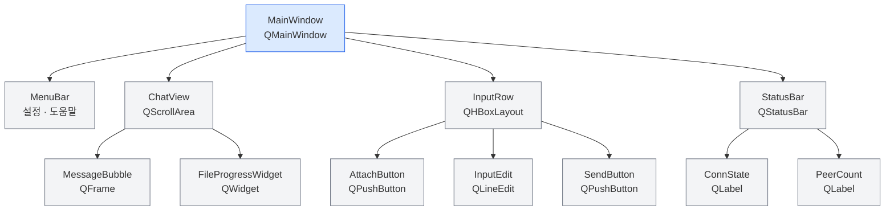
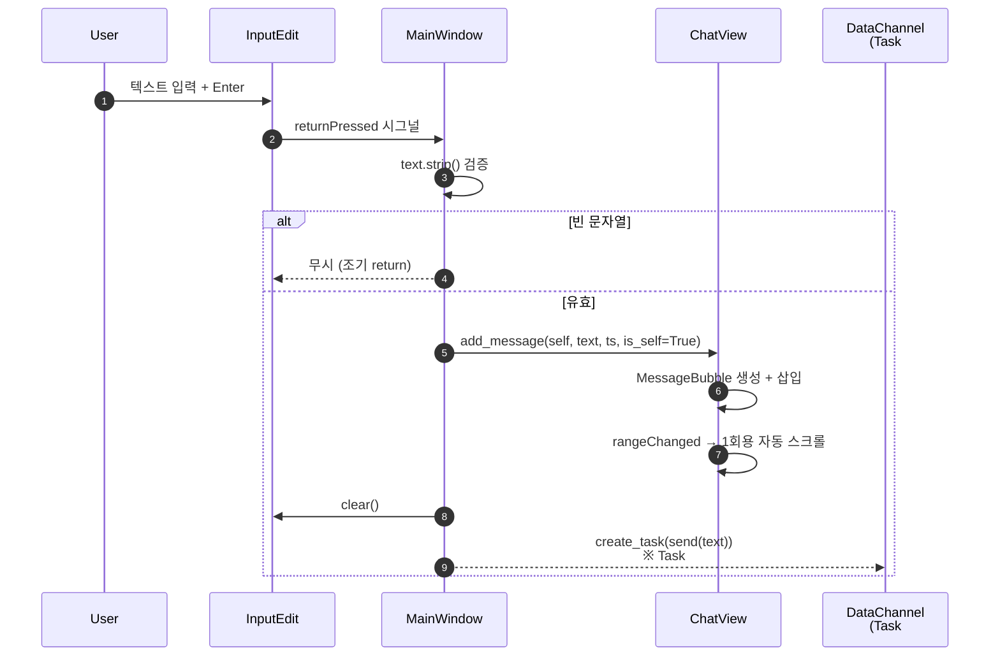
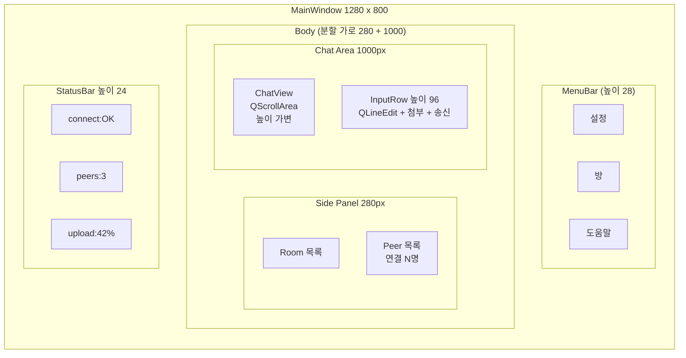
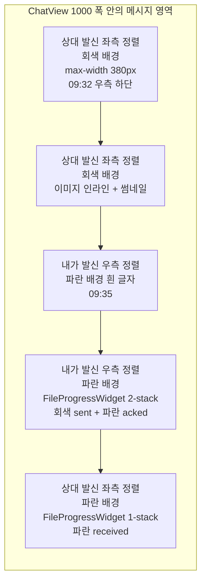
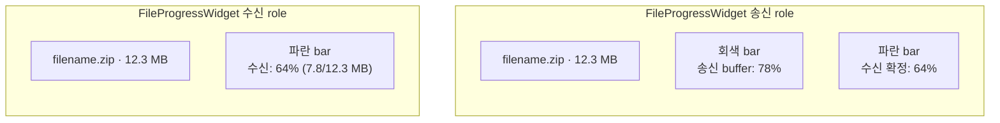
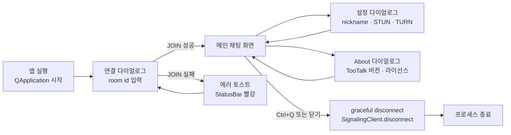
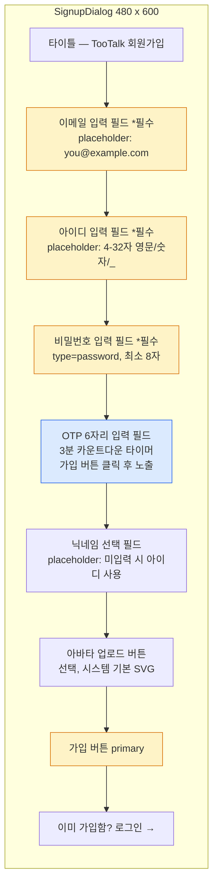
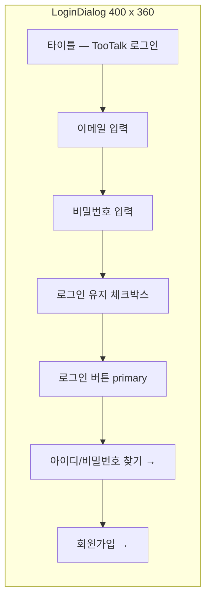
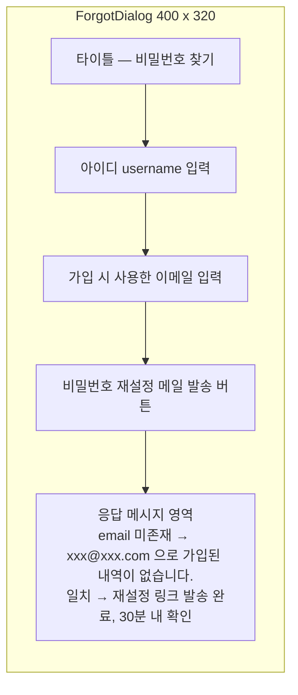

# FRONTEND.md — TooTalk PyQt6 UI 표준

> 본 문서는 TooTalk(코드명 `p2p_msg`) 데스크탑 클라이언트의 **프런트엔드 정책** 정의서다.
> 정본 정합: [CLAUDE_HARNESS_IMPORTANT.md](CLAUDE_HARNESS_IMPORTANT.md) §E (L144~150).
> 상위 네비게이션: [AGENTS.md](AGENTS.md) §3 "문서 맵" — UI/UX 설계 항목.
> 자매 문서: [DESIGN.md](DESIGN.md) (UX 컨셉·정보 구조), [ARCHITECTURE.md](ARCHITECTURE.md) (계층 경계).

---

## 1. 문서 목적

본 문서는 **PyQt6 기반 데스크탑 UI 표준**을 정의한다. 구체적으로:

- 위젯 계층(MainWindow → ChatView → MessageBubble + StatusBar) 의 책임 분할
- 색상 변수 / 타이포그래피 / 입력창 UX 의 통일 규칙
- 메시지 버블 정렬·타임스탬프 노출 정책
- 윈도우 사이즈 / 반응형 그리드 / 다국어·접근성 후크
- XSS 차단을 위한 메시지 escape 규약 (정본 §E 인용)

본 문서는 **정책**이고 **실제 코드 큰 블록은 포함하지 않는다**. 구현은 [app/ui/](app/ui/) 하위 모듈 본문이 담당하며, 본 문서는 그 본문이 따라야 하는 계약(contract) 만 명문화한다. 정본 §E 와 본 문서가 충돌하면 정본 우선.

---

## 2. UI 원칙 (7~10 bullet)

1. **단순 우선** — 1차 시야(viewport) 안에 채팅 리스트·입력창·상태표시 3 영역만 노출. 부가 패널은 토글로만 진입.
2. **접근성 기본** — 모든 인터랙티브 위젯에 `setAccessibleName` / `setToolTip` 부여 의무. 스크린리더 호환 라벨 필수.
3. **키보드 단축키** — Ctrl+R(방 입장), Ctrl+Q(종료), Enter(송신), Shift+Enter(개행), Esc(입력창 비우기). 마우스 없이도 핵심 흐름 완주 가능.
4. **메시지 가독성** — 본문 폰트 14px 이상, 줄간격 1.4, 한 버블 최대 가로 380px. 한 호흡에 읽히는 가로 폭 유지.
5. **다크모드 후크** — `app/ui/theme.qss` 단일 파일에서 `--bg` / `--fg` / `--bubble-*` 변수를 토글하면 전 위젯이 일괄 전환되도록 `objectName` 기반 셀렉터로 위임.
6. **하드코딩 금지** — 색상·간격·폰트 패밀리 직접 문자열 금지 ([정본 §E](CLAUDE_HARNESS_IMPORTANT.md)). 본 문서 §4 변수 표 경유.
7. **내/상대 시각 분기** — 좌(상대) / 우(나) 정렬 + 배경색 분기로 시선 흐름을 좌→우 일방향으로 고정.
8. **상태 즉시 가시화** — 시그널링 연결 상태·peer 수·파일 진행률은 항상 화면 1 영역(StatusBar 또는 인라인 위젯)에 노출. 모달로 숨기지 않는다.
9. **비동기 IO 비차단** — 시그널링·DataChannel·디스크 IO 는 모두 `asyncio.create_task` 로 예약하고, Qt slot 본문은 UI 업데이트만 수행 ([정본 §E](CLAUDE_HARNESS_IMPORTANT.md) 비동기 전용).
10. **점진적 강조** — 신규 메시지 도착 시 자동 스크롤은 1회용 시그널로 처리해 사용자가 위로 스크롤 중일 때 강제 점프를 피한다.

---

## 3. 위젯 계층 트리

- **MainWindow** = [app/ui/main_window.py](app/ui/main_window.py) — 모든 자식 위젯의 부모, `AppState` 보유.
- **ChatView** = [app/ui/chat_view.py](app/ui/chat_view.py) — `QScrollArea` + `QVBoxLayout`, stretch 슬롯 직전 삽입.
- **MessageBubble** = [app/ui/message_bubble.py](app/ui/message_bubble.py) — 단일 메시지(텍스트 + 타임스탬프) 표시.
- **FileProgressWidget** = [app/ui/file_progress_widget.py (예정)](app/ui/file_progress_widget.py) — 송신/수신 양방향 ProgressBar.
- **StatusBar** = [app/ui/status_bar.py](app/ui/status_bar.py) — 연결 상태 + peer 수.

---

## 4. 색상 변수 표

본 표의 값은 Phase 1 후반 `app/ui/theme.qss` 도입 시점에 정본 §E "CSS 변수 사용" 규약에 따라 정식 변수로 이관한다. `MessageBubble._COLOR_*` 클래스 상수는 본 변수의 임시 보관소이며, 테마 시스템 도입 후 제거 대상이다.

**Toonation 브랜드 컬러 통합** (사용자 directive 2026-05-17). Toonation 공식 BI 가이드 — 2023-04 브랜드 리뉴얼 정합 — 비비드 블루 + 딥 네이비 + 네온 민트/스카이 포인트. 본 §15 자세한 본문.

| 변수명 | 라이트 | 다크 | 용도 |
|---|---|---|---|
| `--primary` | `#0066FF` (Toonation Blue) | `#0052FF` (Toonation Blue Deep) | 보내기 버튼 · 강조 액션 · Toonation 브랜드 정합 |
| `--bg` | `#ffffff` | `#1e1e1e` | 윈도우 배경 |
| `--fg` | `#1a1a1a` | `#e5e5e5` | 본문 텍스트 |
| `--bubble-self` | `#dcf8c6` | `#2d5a3f` | 내가 발신한 버블 배경 (self) |
| `--bubble-other` | `#ffffff` | `#2a2a2a` | 상대가 발신한 버블 배경 (peer) |
| `--bubble-border` | `#dddddd` | `#3a3a3a` | 버블 경계선 |
| `--text-timestamp` | `#888888` | `#9a9a9a` | 타임스탬프 회색 |
| `--text-sender` | `#555555` | `#b5b5b5` | 발신자 라벨 |
| `--status-connected` | `#22c55e` | `#22c55e` | 연결 정상 |
| `--status-error` | `#dc2626` | `#ef4444` | 연결 오류 |
| `--progress-acked` | `#22D3EE` (네온 시안) | `#67E8F9` (라이트 시안) | ACK 누적 진행 막대 — Toonation 포인트 컬러 (민트/스카이 블루) 정합 |
| `--progress-inflight` | `#0F172A` (Deep Navy) | `#1E293B` (Navy 변형) | 송신 큐 대기 막대 — Toonation 서브 컬러 (딥 네이비) 정합 |

> **Toonation 브랜드 컬러** = 2023-04 BI 리뉴얼 정합 (사용자 directive 2026-05-17). 자세한 본문 = §15.

---

## 5. 폰트 + 타이포그래피

- **기본 폰트 패밀리**: 시스템 폰트 fallback 체인
  - macOS: `-apple-system`, `"SF Pro Text"`, `"Apple SD Gothic Neo"`
  - Windows: `"Segoe UI"`, `"Malgun Gothic"`
  - 공통 fallback: `sans-serif`
- **한국어 fallback 의무** — 한국어 글리프가 없는 영문 전용 폰트가 1순위에 오는 경우 한글이 깨질 수 있으므로 한국어 폰트를 반드시 fallback 체인에 포함.
- **크기 등급** (px 기준):
  - 본문(메시지 텍스트): 14px
  - 발신자 라벨: 11px / 굵기 600
  - 타임스탬프: 10px
  - 메뉴·버튼: 13px
  - About 다이얼로그 제목: 16px
- **줄간격**: 본문 1.4, 라벨 1.2
- **이모지 지원** — 시스템 컬러 이모지 폰트는 자동 fallback. 별도 패치 불필요하지만 일부 Linux 환경에서는 Noto Color Emoji 권장(본 단계는 macOS + Windows 만 지원).

---

## 6. 메시지 버블 가이드

### 6.1 정렬·색상 분기

| 발신자 | 정렬 | 배경 변수 | 발신자 라벨 |
|---|---|---|---|
| 내 메시지 (`is_self=True`) | 우측 | `--bubble-self` | 미노출 |
| 상대 메시지 (`is_self=False`) | 좌측 | `--bubble-other` | 상단 노출 |
| 시스템 안내 | 좌측 | `--bubble-other` | `sender="system"` |

### 6.2 타임스탬프 위치

- 위치: 버블 **내부 우측 하단**
- 표시 형식: `HH:MM` (예: `14:23`)
- 전체 시각(`YYYY-mm-dd HH:MM:SS`) 은 툴팁으로 분리(향후 작업).
- 정본 §E 로그 형식(`[YYYY-mm-dd H:i:s]`) 은 로그 전용이며 UI 표시는 짧은 변형을 사용.

### 6.3 이미지 인라인

- 이미지 메시지는 버블 내부에 썸네일 노출, 클릭 시 별도 다이얼로그로 원본 표시.
- 최대 썸네일 가로 320px, 비율 유지.
- 다운로드 진행 중인 이미지는 `FileProgressWidget` 와 동일한 막대로 임시 표시 후 완료 시점에 썸네일로 교체.

### 6.4 파일 ProgressBar 배치

- 파일 송수신 위젯(`FileProgressWidget`) 은 `MessageBubble` 자리에 끼워 넣어 동일한 시간순 흐름 안에 배치.
- 송신자 시점: 회색(in-flight) + 파랑(acked) 2-stack 표현.
- 수신자 시점: 단일 파랑 막대.
- 완료 시점에는 파일 아이콘 + 파일명 + 크기만 남기고 막대는 100% 채워진 상태로 유지(취소·재시도 버튼은 Phase 2).

---

## 7. 입력창 UX

- **Placeholder**: `"메시지를 입력하세요…"` (한국어 단일 — Phase 1).
- **단일 라인 + 다중 라인 토글**:
  - 현재 Phase 1 스켈레톤은 `QLineEdit` 단일 라인.
  - Phase 1 후반에 `QTextEdit` 로 전환하여 **Shift+Enter = 개행 / Enter = 송신** 분기 적용.
- **첨부 버튼 단축키** — `Ctrl+O` (Open file). 본 단계는 비활성(Task #16 에서 활성).
- **전송 단축키** — `Enter` (단일 라인 모드에서는 `returnPressed`, 다중 라인 모드에서는 `keyPressEvent` 분기).
- **포커스 정책**: 윈도우 활성화 시 입력창 자동 포커스. 메시지 송신 후 입력창 자동 클리어 + 포커스 유지.
- **빈 문자열 송신 차단** — `text.strip() == ""` 일 때 송신 무시.
- **IME(한글 입력) 보호** — 조합 중인 음절(`InputMethodEvent`) 은 송신 트리거 차단(엔터 키 분기 시 `isAutoRepeat` 와 IME 상태 함께 검사).

---

## 8. 윈도우 사이즈 + 반응형

- **최소 사이즈**: 480 × 640 (현재 [main_window.py](app/ui/main_window.py) `setMinimumSize(480, 640)`).
- **기본 사이즈**: 720 × 880 (Phase 1 후반 도입).
- **그리드 분할 (Phase 2 예정)**:
  - 좌측 사이드바(방 목록·peer 목록): 가변 220~280px
  - 본문(채팅 + 입력): 가변 stretch
  - 우측 패널(파일 목록·설정): 토글, 기본 숨김
- **반응형 분기**:
  - 가로 < 600px → 사이드바 자동 접힘, 햄버거 메뉴로 전환
  - 가로 ≥ 1000px → 우측 패널 동시 표시 허용
- **DPI 스케일** — Qt 자체 `Qt.HighDpiScaleFactorRoundingPolicy.PassThrough` 를 명시 설정해 Retina/4K 환경에서 흐릿함 방지.

---

## 9. 빈도 높은 상태 표시

| 상태 | 위치 | 표시 형식 |
|---|---|---|
| 시그널링 연결 | StatusBar 좌측 | `DISCONNECTED` / `CONNECTING` / `CONNECTED` / `ERROR` |
| Peer 수 | StatusBar 우측 | `peers: N` (나 제외) |
| 현재 방 | 메뉴바 또는 윈도우 제목 | `TooTalk — room: <id>` (Phase 1 후반) |
| 파일 진행률 | 인라인 위젯 | `1.2/3.4 MB · 35%` |
| 시스템 안내 | ChatView 시스템 버블 | `sender="system"` |

연결 상태 화이트리스트는 [status_bar.py](app/ui/status_bar.py) `_VALID_STATES` 에서 강제하며, 화이트리스트 밖 값은 `ERROR` 로 강제 정규화한다.

---

## 10. 다국어 후크

- **Phase 1**: 한국어 단일 (모든 UI 문자열을 코드 안에 직접 한국어로 기록). M4 규약에 따라 한국어 주석과 일관성 유지.
- **Phase 2** (i18n 도입):
  - 외부화 대상 문자열은 `app/ui/i18n/ko.json` / `en.json` 으로 분리
  - 함수 `tr(key: str) -> str` 도입, 미존재 키는 키 자체 반환 + 경고 로그
  - 닉네임 등 사용자 입력 문자열은 번역 대상 외(원문 보존)
- **로케일 감지** — `QLocale.system().name()` 기반. `.env` 의 `UI_LOCALE` 환경 변수가 있으면 우선.
- **본 단계 합의** — Phase 1 동안 i18n 인프라 미도입. 단, 새 문자열을 코드에 추가할 때는 추후 외부화가 쉽도록 **상수 변수**로 분리 권장.

---

## 11. 접근성

- **탭 순서** — 입력창 → 보내기 버튼 → 첨부 버튼 → 메뉴바 → ChatView 의 순으로 `setTabOrder` 명시.
- **스크린리더 라벨** — 모든 버튼/입력 위젯에 `setAccessibleName` 부여. 예: 보내기 버튼 = `"메시지 보내기"`.
- **ARIA 등가 속성** — PyQt6 는 ARIA 자체를 지원하지 않으나 `QAccessible` 인터페이스로 등가 효과를 제공한다. 역할(role) 은 Qt 기본을 사용하되, 커스텀 위젯(`MessageBubble`)은 `QAccessible.Role.StaticText` 로 설정.
- **포커스 시각화** — 키보드 포커스 위젯은 `:focus` 스타일 셀렉터로 2px 윤곽선 노출(다크모드 대비 명도 비율 4.5:1 이상).
- **명도 대비** — 본문 텍스트 vs 배경 색상은 WCAG AA 기준(4.5:1) 이상 유지. 다크/라이트 양 모드 모두 검증.
- **확대 지원** — Qt `QApplication.setHighDpiScaleFactorRoundingPolicy` 외에 사용자 폰트 크기 환경 변수 `UI_FONT_SCALE` (0.8~1.5) 후크 제공(Phase 2).

---

## 12. XSS / 메시지 escape 정책

정본 §E 인용: **"Frontend: `base.html` 상속, CSS 변수 사용, XSS `escapeHtml()` 필수"** ([CLAUDE_HARNESS_IMPORTANT.md L150](CLAUDE_HARNESS_IMPORTANT.md)).

본 정책의 데스크탑 PyQt6 환경 적용:

- **현 단계 메시지 본문은 plain text only** — `MessageBubble` 의 본문 `QLabel` 은 `setTextFormat(Qt.TextFormat.PlainText)` 명시 의무. 본 단계 코드에서 명시 호출이 누락된 경우 보강 대상.
- **HTML/리치 텍스트 금지** — `QLabel.setText` 에 사용자 메시지를 그대로 전달하면 Qt 가 휴리스틱으로 HTML 해석을 시도할 위험이 있으므로 `PlainText` 강제는 필수.
- **About 다이얼로그 예외** — 정적 HTML 만 허용 (사용자 입력 미포함). 동적 문자열을 HTML 로 합치는 행위 금지.
- **URL 자동 링크화 (Phase 2)** — 도입 시 별도 함수(`linkify(text) -> str`) 가 escape 후 `<a>` 만 합성하도록 분리. 일반 메시지 경로(`add_message`)와 절대 혼합 금지.
- **파일명·발신자명** — 외부에서 들어온 모든 문자열은 표시 직전 `QLabel.setText` 가 아닌 `QLabel(text)` 생성자 + `PlainText` 형식으로만 통과.
- **시스템 안내** (`sender="system"`) — 내부 생성 문자열이라도 사용자 입력(예: room_id, peer_id) 을 합성하는 경우 동일 규칙 적용.

---

## 13. 메시지 전송 시퀀스

본 시퀀스는 입력창에서 ChatView 까지의 송신 흐름을 보여준다. Phase 1 스켈레톤 단계는 echo 까지만 동작하고, DataChannel send 는 Task #16 에서 활성화한다.

---

## 14. Wireframe / Mockup (mermaid block diagram)

### 14.1 메인 채팅 화면 (1280x800 기본)

### 14.2 메시지 버블 배치 (ChatView 안)

### 14.3 파일 진행 위젯 상세

### 14.4 화면 전환 다이어그램

### 14.5 설계 제약

| 항목 | 기준값 | 비고 |
|---|---|---|
| 메인 윈도우 최소 사이즈 | 800 x 600 | 사이드 패널 자동 접힘 < 1024 |
| 메인 윈도우 기본 사이즈 | 1280 x 800 | 첫 실행 시 |
| 사이드 패널 폭 | 280 ~ 360 | 드래그 조절 |
| 채팅 입력창 높이 | 96 | 다중 라인 시 192 까지 자동 확장 |
| StatusBar 높이 | 24 | 변동 없음 |
| 메시지 버블 최대 가로 | 380 | §2.4 메시지 가독성 정합 |
| 파일 진행 위젯 높이 | 송신 72 · 수신 56 | 2-stack vs 1-stack |
| 첨부 버튼 한 변 | 36 | 클릭 영역 확보 |

본 wireframe 은 **레이아웃 의도**만 정의한다. 실제 픽셀·색상값은 `app/ui/theme.qss` (Phase 1 후반 신설 예정) 와 `app/ui/*.py` 구현 본문이 따른다.

### 14.6 회원가입 화면 (사용자 directive 2026-05-17, FR-11)

### 14.7 로그인 화면 (FR-12)

### 14.8 아이디·비밀번호 찾기 화면 (FR-13)

---

## 15. Toonation 브랜드 컬러 가이드 (사용자 directive 2026-05-17)

본 §15 = Toonation 공식 BI 가이드 정합 본문. TooTalk UI 의 `--primary` + `--progress-*` 변수 + 회원가입 / 로그인 / 비번찾기 wireframe (§14.6~§14.8) 의 브랜드 컬러 적용 정본.

### 15.1 브랜드 정합 사유

Toonation 공식 브랜드 컬러 = **블루 계열 메인**. 2023-04 브랜드 리뉴얼 — 로고 + 공식 웹사이트 + 후원 페이지 + 가이드 시스템 전반 의 비비드 블루 + 딥 네이비 + 네온 민트/스카이 포인트 조합 의 핵심 아이덴티티 적용. TooTalk = Toonation 통합 옵션 B (★★★★★ 권장도 1순위 — adoption-roadmap §4.2) 정합 본 브랜드 컬러 직접 채택.

### 15.2 핵심 브랜드 컬러 표

| 분류 | hex | swatch | 용도 |
|---|---|---|---|
| **메인 컬러 (Toonation Blue)** | `#0066FF` |  | 선명 + 신뢰감 비비드 블루. 보내기 버튼 · 강조 액션 · 후원 CTA |
| **메인 컬러 변형 (Toonation Blue Deep)** | `#0052FF` |  | 다크 모드 + hover/active 상태 |
| **서브 컬러 (Deep Navy)** | `#0F172A` |  | 다크 모드 배경 + 코인/텍스트 배경 |
| **베이스 (White)** | `#FFFFFF` |  | 라이트 모드 기본 배경 |
| **포인트 (네온 시안)** | `#22D3EE` |  | 후원 금액 + 배너 + 시선 끌기 (민트 블루) |
| **포인트 (라이트 시안)** | `#67E8F9` |  | 다크 모드 의 포인트 + ACK 누적 진행 |

### 15.3 §4 색상 변수 매핑

| §4 변수 | Toonation 매핑 |
|---|---|
| `--primary` 라이트 | 메인 컬러 `#0066FF` |
| `--primary` 다크 | 메인 컬러 변형 `#0052FF` |
| `--progress-acked` 라이트 | 포인트 네온 시안 `#22D3EE` |
| `--progress-acked` 다크 | 포인트 라이트 시안 `#67E8F9` |
| `--progress-inflight` 라이트 | 서브 딥 네이비 `#0F172A` |
| `--progress-inflight` 다크 | Navy 변형 `#1E293B` |

### 15.4 BI 가이드 참조 + 활용 영역

- 공식 BI 가이드라인 + 로고 원본 (PC/모바일 사이즈) = Toonation 공식 홈페이지 하단 또는 Toonation 고객센터 의 로고 변경 안내 페이지
- 활용 = 방송용 오버레이 + 후원 배너 + 회원가입/로그인 wireframe (§14.6~§14.8) 의 `--primary` 적용 + 메인 채팅 의 보내기 버튼 + 양방향 ProgressBar 의 ACK 색상

### 15.5 제약 + 의무

- 브랜드 외부 표기 시 = Toonation 공식 가이드 직접 인용 의무 (본 §15 = TooTalk 내부 정합 본문)
- 라이선스 GPLv3 + 브랜드 정합 — 외부 fork distribution 시 Toonation 브랜드 사용 권한 별도 확인 의무 (TooTalk source code 라이선스 ≠ Toonation 브랜드 사용권)
- 정식 Toonation 통합 옵션 B 진입 시 = 본 §15 의 공식 BI 가이드 의 자세한 인용 + 사용자 검토 의무 (Phase 2 이후)

### 15.6 로고 구성 비율 박제 (사용자 directive 2026-05-20 cycle 169.13~169.24 영구화)

> ⚠️ **확정 비율 — 변경 절대 금지** (사용자 directive cycle 169.24 — "지금이 딱 맞는 비율이야 잘 저장해놔")
>
> symbol PNG height 50 + Talk font 55 = symbol:Talk ratio **50 : 55 ≈ 0.91** 확정.
> cycle 169.17~169.23 동안 6회 reflow 끝 사용자 확정 ack. 향후 cycle 안 임의 변경 시 가드레일 위반 + 사용자 비판 회수 chain 강제.

본 §15.6 = TooTalk dialog 안 logo composition 의 의무 비율 박제. WelcomeDialog 기준 + LoginDialog/SignupDialog 의 동일 비율 의무.

#### 15.6.1 logo composition 의무 (symbol PNG + Talk 흰색)

| 영역 | 값 | 비고 |
|---|---|---|
| symbol PNG height | **50 px** | `app/assets/branding/tootalk_symbol.png` (Toonation 공식 brand resource) + `scaledToHeight(50, SmoothTransformation)` |
| Talk QLabel font-size | **55 px** | font-weight 700 + letter-spacing -1px + family `-apple-system, 'SF Pro Display', 'Inter', sans-serif` (cycle 169.23 — 59 → 55 추가 7% 축소) |
| symbol:Talk ratio | **50 : 55 ≈ 0.91** | 모든 dialog (Welcome + Login + Signup) 동일 의무 |
| logo_row spacing | **0** | `setSpacing(0)` + `setContentsMargins(0, 0, 0, 0)` (symbol + Talk 딱붙임) |
| symbol_label bg | **transparent** | `setStyleSheet("background: transparent;")` + `WA_TranslucentBackground` |
| talk_label color | **#ffffff** | 흰색 (banner gradient 또는 dark dialog 위 노출) |

#### 15.6.2 mascot 이미지 + "투턱" 텍스트 (WelcomeDialog 전용)

| 영역 | 값 |
|---|---|
| mascot path | `app/assets/branding/toona_sakamoto.png` |
| mascot height | **160 px** + transparent bg + center align |
| "투턱" 텍스트 font-size | **24 px** font-weight 700 + letter-spacing -1px + 흰색 |

#### 15.6.3 dialog 안 title 표기 의무

| dialog | title 텍스트 |
|---|---|
| WelcomeDialog | (title 부재 — mascot + "투턱" 만) |
| LoginDialog | "투턱 로그인" (22px bold, color `#e5e7eb`) |
| SignupDialog | "투턱 회원가입" (22px bold, color `#e5e7eb`) |

#### 15.6.4 비율 위반 차단

- 사용자 비판 cycle 169.12 — "로고가 첫화면에서 수정한 형태와 달라"
- 회수 cycle 169.13 — symbol 40→50 + Talk 22/28→28 통일
- 본 §15.6 = WelcomeDialog 기준 비율 박제 — 다른 dialog 의 logo composition 의무 정합 + 비율 임의 변경 차단

---

## 16. 다이얼로그 모달 정책 (cycle 169.838)

사용자 directive: **앱의 모든 다이얼로그는 메인 레이아웃 안 in-app overlay 모달**이다.
별도 OS 윈도우로 띄우는 것은 **원격 데스크탑 제어 상대화면 창 1개뿐**이다.

### 16.1 적용 규약

| 호출 위치 | 진입 방식 |
|---|---|
| MainWindow mixin 직접 dialog | `self._exec_dialog_centered(dialog)` (backdrop dim + 중앙 child overlay + manual modal loop) |
| 비차단 dialog (async 후속 작업) | `self._embed_dialog_centered(dialog)` (loop 생략, 예: GroupCallDialog SFU publish) |
| dialog 내부 nested sub-dialog (self ≠ MainWindow) | `app.ui._modal_helper.exec_modal(dialog, self)` (parent 체인 walk → MainWindow `_exec_dialog_centered` 위임, 미발견 시 `.exec()` 폴백) |
| 알림/확인 popup (`ConfirmDialog.show_info`/`show_warning`/`show_critical`/`ask`) | 정적 헬퍼 내부서 `exec_modal(dlg, parent)` 호출 — 호출 사이트 변경 없이 in-app overlay 모달. startup/부모 부재 시 `.exec()` 폴백 |

- 적용 대상 예: 멤버 보기·받은 친구 요청·연락처·설정·프로필·그룹/채널 만들기·통화·OTP(회원가입 nested)·관리자 emoji moderation·업데이트 안내·알림/확인 popup(ConfirmDialog).
- 테스트(offscreen/pytest) 환경에서는 `_exec_dialog_centered` 가 `loop.exec()` 무한 블록을 피하려고 non-blocking `show` 만 하고 `0` 을 반환한다.

### 16.2 별도 OS 윈도우 예외 (in-app 모달 아님)

| 예외 | 사유 |
|---|---|
| 원격 데스크탑 제어 상대화면 창 (`RemoteRequestDialog`/`RemoteConnectDialog` 후속 제어 창) | directive 가 명시한 유일 새창 — 상대 화면은 메인 레이아웃 밖 독립 창이어야 한다. |
| startup auth bootstrap (`app/main.py` 의 welcome/login/signup/find/reset `.exec()`) | MainWindow 생성 **전** 단계라 overlay 대상이 없다. |
| 로그아웃 후 tray 재인증 chain (`_tray_mixin.py` login/signup `.exec()`) | startup 과 동일한 재인증 단계 + login↔signup 전환에 custom done() code(`res==2/3`)를 쓰는데 `_exec_dialog_centered` 는 `accept=1`/`reject=0` 만 반환해 전환 code 가 손실된다. |
| `HamburgerDrawer` | QFrame child overlay(좌측 slide-in)로 이미 메인 레이아웃 안. `.exec()` 는 `show+raise` 호환 shim 일 뿐 별도 윈도우/모달 loop 가 아니다. |

### 16.3 "방 입장" 제거 (cycle 169.838)

- room_id/peer_id 직접 입력 다이얼로그(`_on_open_room_dialog` + 메뉴 항목)를 전수 제거했다.
- 그룹방은 채팅창의 **"그룹 만들기" + 멤버 초대** 로만 생성한다(텔레그램 플로우 정합).

### 16.4 아바타 이미지 picker + 표시 전파 (cycle 169.852)

텔레그램 정합 — 그룹 만들기 / 채널 만들기 / 개인 프로필 3 dialog 의 원형 아바타를 클릭하면
드롭다운(**파일에서 / 카메라에서 / 클립보드에서**, "이모지 사용"은 directive 명시 **제외**)이 열린다.

| 컴포넌트 | 역할 |
|---|---|
| `_avatar_picker_button.AvatarPickerButton` | 원형 picker(드롭다운 3항목 + center 정사각 crop 원형 preview). 미선택 시 이름 2글자 이니셜, 이름도 없으면 camera 아이콘 blue circle. `avatar_selected(QImage)` signal |
| `_camera_capture_dialog.CameraCaptureDialog` | "카메라에서" 진입점 — QtMultimedia(`QCamera`/`QImageCapture`/`QVideoWidget`) live preview + 촬영 → QImage. §16.1 in-app 모달(`exec_modal`). 권한 거부/카메라 부재 graceful + 종료 3경로(accept/reject/closeEvent) 자원 해제(stop+setActive(False)+deleteLater) |
| `_avatar_cache.AvatarCache` | 표시 전파 source — avatar_ref(서버 content-addressed) memory+disk 캐시 + `AvatarFetchWorker` async fetch(dedup) + `avatar_ready(str)` signal. 동기 `make_avatar_pixmap` + 백그라운드 fetch → signal 재렌더(progressive enhancement, UI 블로킹 0) |
| `_avatar_helper.make_avatar_pixmap(name, avatar_ref, size)` | 표시 전파 6 site 단일 진입점 — avatar_ref hit 시 원형 이미지, 부재/miss 시 이니셜 fallback(무손상) |

- **표시 전파 6 site**: group/channel(chat-list delegate) · member_list · drawer header · profile(MyAccountDialog) · my_profile picker. chat sender 는 telegram grouped 정합상 이름 label(색 텍스트)만이라 avatar pixmap 대상 아님(N/A).
- **이니셜 fallback 무손상**: 빈 avatar_ref → 기존 palette circle + 2글자 이니셜 동작 동일(회귀 0).
- **즉시 표시**: 프로필 avatar 변경(업로드 PASS) 시 `_drawer_mixin` 이 cache `seed_image` → drawer header 라이브 갱신(round-trip 없이).

---

## 17. 참조

| 주제 | 문서 |
|---|---|
| 정본 §E (코딩 불변 규칙) | [CLAUDE_HARNESS_IMPORTANT.md](CLAUDE_HARNESS_IMPORTANT.md) |
| 상위 네비게이션 | [AGENTS.md](AGENTS.md) |
| UX 컨셉·정보 구조 | [DESIGN.md](DESIGN.md) |
| 계층 경계·모듈 의존 | [ARCHITECTURE.md](ARCHITECTURE.md) |
| 메인 윈도우 구현 | [app/ui/main_window.py](app/ui/main_window.py) |
| 채팅 리스트 구현 | [app/ui/chat_view.py](app/ui/chat_view.py) |
| 메시지 버블 구현 | [app/ui/message_bubble.py](app/ui/message_bubble.py) |
| 상태바 구현 | [app/ui/status_bar.py](app/ui/status_bar.py) |
| 파일 진행 위젯 구현 | [app/ui/file_progress_widget.py (예정)](app/ui/file_progress_widget.py) |
| 요구사항 명세 | [Specification.md](Specification.md) |
| 신뢰성 정책 | [RELIABILITY.md](RELIABILITY.md) |
| 보안 정책 | [SECURITY.md](SECURITY.md) |

---

마지막 갱신: 2026-05-26 (cycle 169.852 — §16.4 아바타 이미지 picker + 표시 전파 신설: AvatarPickerButton(드롭다운 파일/카메라/클립보드, 이모지 제외) + CameraCaptureDialog(QtMultimedia in-app 모달) + AvatarCache(async fetch + avatar_ready) + make_avatar_pixmap 표시 전파 6 site + 이니셜 fallback 무손상. 직전 cycle 169.838 §16 모달 정책)
