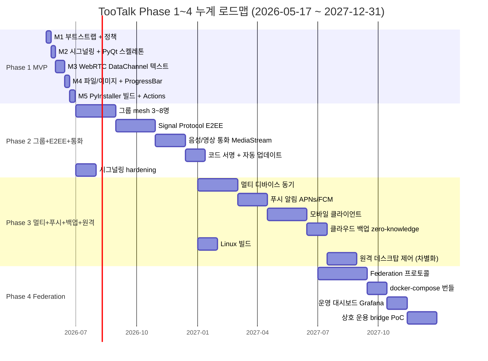
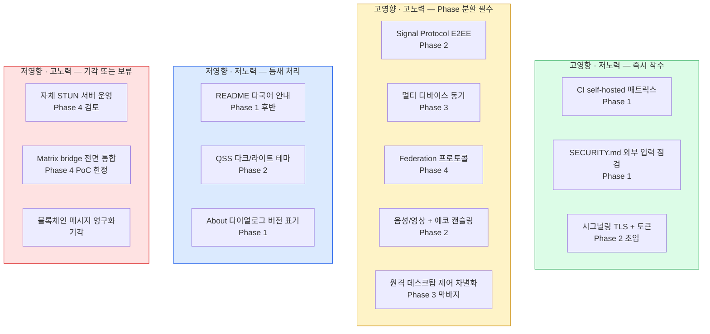

# PLANS.md — TooTalk(p2p_msg) 로드맵 정본

> 본 문서는 **단·중·장기 로드맵의 정본**이다. Phase 1~4 누계 일정·산출물·의존성·우선순위·기각 항목·도입 단계를 한 곳에 모은다.
> 정본 정합: [CLAUDE_HARNESS_IMPORTANT.md §J](CLAUDE_HARNESS_IMPORTANT.md) 도입 로드맵 · [AGENTS.md §3](AGENTS.md) 문서 맵
> 활성 실행계획 본체는 [docs/exec-plans/active/](docs/exec-plans/active/) 하위 개별 문서로 위임한다.

---

## 1. 문서 목적

본 PLANS.md 는 TooTalk(저장소명 `p2p_msg`) 의 **로드맵 정본 (Single Source of Truth)** 으로 다음을 책임진다.

- Phase 1 MVP 부터 Phase 4 Federation 까지의 **단·중·장기 일정 누계 정합 보증**.
- 각 Phase 의 **목표·핵심 산출물·의존성** 한 줄 요약 — 상세는 `docs/exec-plans/active/` 개별 실행계획 문서로 위임.
- **우선순위 매트릭스** 와 **기각 항목 목록** 으로 신규 directive 진입 시 판단 근거 제공.
- 정본 [§J](CLAUDE_HARNESS_IMPORTANT.md) 의 **MVP / Standard / Scaled** 3단계 도입 로드맵을 본 저장소 컨텍스트로 인용하여 Phase 진행과 함께 변동 추적.

**금지**: 본 문서에 신규 Phase(예: Phase 5 등) 발명 금지. Phase 4 까지가 정본이며, 확장 필요 시 별도 directive + 본 문서 갱신 절차를 거친다. TODO 목록 작성 금지 — TODO 는 `CheckList.md` + Exec Plan 의 영역.

---

## 2. Phase 1 MVP 요약 (2026-05-17 ~ 2026-06-30)

**목표**: 1:1 P2P 채팅이 macOS + Windows 양쪽에서 안정 동작하는 zip 배포 가능 상태.

**범위**:

- PyQt6 메인 윈도우 + 채팅 뷰 (qasync 통합)
- WebRTC DataChannel 1:1 (aiortc · STUN `stun.l.google.com:19302`)
- 시그널링 서버 (aiohttp WebSocket · 데모 호스트 `114.207.112.73`)
- 텍스트·이미지·파일 송수신 + 양방향 ProgressBar
- **회원가입 + 이메일 OTP 인증** (FR-11/12/13, 사용자 directive 2026-05-17 — bcrypt 12 + OTP 3분 + 아이디/비번 찾기)
- **MariaDB 7 테이블** (users + email_verification + password_reset + rooms + peers + file_meta + messages) — SQLite 회수 (사용자 directive 2026-05-17)
- **SMTP 데모 서버 자체 설치** — 114.207.112.73 postfix + Let's Encrypt + SPF/DKIM/DMARC ([docs/references/smtp-setup.md](docs/references/smtp-setup.md))
- **PyInstaller macOS arm64 native** (self-hosted runner) + **Windows x64 wine cross-compile** (GitHub-hosted Ubuntu + `cdrx/pyinstaller-windows` docker) zip 빌드
- GitHub Actions self-hosted macOS arm64 + GitHub-hosted Ubuntu 듀얼 CI (ci.yml 8 job GREEN + docs-lint + doc-gardener)
- **GPLv3 라이선스** ([LICENSE](LICENSE) 저장소 루트) + GitHub visibility public (Phase 완료 시 private 전환 가능성)
- **fork PR 승인 정책 strict** (`all_external_contributors` — gh API 자동)
- AGENTS.md + 루트 9 정책 + `.claude/agents/` 7 프로세스 에이전트 + CI 8 job 게이트

**상세 실행계획**: [docs/exec-plans/active/2026-05-17-tootalk-phase1-mvp.md](docs/exec-plans/active/2026-05-17-tootalk-phase1-mvp.md)

본 Phase 의 마일스톤 M1~M5, 결정 로그 9건, 기술 부채 TD-1~TD-6, 차단점 추적은 위 Exec Plan 단독 책임. 본 PLANS.md 는 일정만 누계.

---

## 3. Phase 2 그룹 채팅 + E2EE + 음성/영상 통화 (조기 진입 2026-05-18 ~ 2026-12-31)

**목표**: 1:1 한계를 넘어 **3명 이상 다자 통신 + 종단간 암호 + 음성/영상 통화** 도입.

**진입 시점 drift 회수** (사이클 36): 원안 = 2026-07-01 진입. 실 = **2026-05-18 조기 진입** (사이클 27 commit `c3eeaf4`). Phase 1 자율 chain 완성 + signaling DB 통합 직후 즉시 진입 패턴 = scope creep 회피 정합 — 단 일정 1.5개월 단축.

**범위**:

- **E2EE Signal Protocol** ✅ **사이클 27~35 핵심 완성** (Phase 2 누계 84 케이스):
  - AES-256-GCM + X25519 ECDH + HKDF-SHA256 (`app/crypto/e2ee.py`, 24 PASS)
  - Double Ratchet KDF chain (Signal Protocol 0x01/0x02 separator, `double_ratchet.py`, 16 PASS)
  - SessionState + DH ratchet 3 step + skip helper (`session.py`, 20 PASS)
  - skipped_keys LRU+TTL (`skipped_keys.py`, 14 PASS)
  - decrypt_with_session_ooo out-of-order delivery (replay 차단, 6 PASS)
  - Alice/Bob integration test (4 PASS)
  - **잔존**: X3DH initial key exchange + multi-device sync + sender keys (그룹 chat)
- **그룹 채팅 (3~8명 mesh)** — n^2 PeerConnection 토폴로지 우선. 8명 초과 시 SFU 도입 검토 (Phase 3 이연 가능). **사이클 36 시점 미시작**
- **WebRTC MediaStream** — Opus 음성 + H.264/VP8 영상. 에코 캔슬링 (WebRTC AEC3) + 자동 이득 조절. **미시작**
- **signature sound** ([[project-signature-sound]]) — PyQt6 QSoundEffect + 자체 "뿅" WAV (200~400ms chiptune, 사용자 directive 2026-05-18). UX brand recognition 차별화. **사이클 38~39 완성** — 사이클 38 `app/ui/sound_player.py` SoundPlayer wrapper + Config 3 필드 + WAV placeholder + 19 PASS. 사이클 39 ChatView 의 `should_play_on_message` helper + `add_message` peer 수신 trigger + 9 PASS. **잔존**: 설정 UI dialog (음소거 toggle + 볼륨 slider) + designer 최종 chiptune asset 교체.
- **코드 서명** — Apple Developer ID notarization + Windows Authenticode. TD-2 · TD-3 해소. **미시작**
- **시그널링 hardening** — TLS + 인증 토큰 + rate limit. TD-1 해소. **부분 완성** (auth Bearer middleware = 사이클 20 완료, TLS = 미실시)
- **자동 업데이트** — Sparkle (macOS) + WinSparkle (Windows) 통합. **미시작**

**완료 정의**: 3명 그룹 채팅 + 1:1 영상통화 30분 안정 동작 + 정식 서명 zip 배포 + signature sound + E2EE 끝점 검증.

---

## 4. Phase 3 멀티 디바이스 + 푸시 알림 + 클라우드 백업 (2027-01-01 ~ 2027-06-30)

**목표**: 단일 머신 종속 해소. **여러 디바이스 동기 + 백그라운드 푸시 + 안전한 클라우드 백업** 도입.

**범위**:

- **멀티 디바이스 동기** — Signal Protocol Sesame 또는 자체 device-list 프로토콜. 메시지·연락처·세션 키 N 디바이스 일관성.
- **푸시 알림** — APNs (iOS/macOS) + FCM (Android/Windows native push). 백그라운드 데몬 분리, 메시지 본문은 단말 복호화.
- **모바일 클라이언트 (iOS · Android)** — Phase 3 후반 도입 검토. Phase 1·2 데스크탑 코어와 envelope 호환 의무.
- **클라우드 백업** — 사용자 패스프레이즈 파생 키 기반 zero-knowledge 백업. 백엔드는 암호문만 저장.
- **그룹 SFU 도입** — 8명 초과 그룹 통화/회의 필요 시 mediasoup 또는 LiveKit 통합.
- **Linux 빌드** — AppImage · Flatpak · `.deb` 배포 추가.
- **친구간 원격 데스크탑 제어 (Phase 3 막바지 — 핵심 차별화)** — 패턴 A 원격 도움 요청 (P5 라이브 크리에이터 OBS 도움 시나리오) + 패턴 B 원격 제어 요청 (P6 기술 도움 제공자 가 P5 컴퓨터 제어). 권한 모델 = 친구 추가 사전 + 명시 수락 모달 + 긴급 ESC + 감사 로그. 기술 = WebRTC video track + 화면 캡처 (mss / Qt QScreen) + 입력 주입 (pynput / pywinauto / pyobjc) + x264/VP9/AV1 인코딩. 정합 = [[project-phase2-remote-control-differentiator]].

**완료 정의**: 데스크탑 + 모바일 양 디바이스 동시 로그인 + 푸시 수신 + 패스프레이즈 복구 시나리오 통과 + 친구간 원격 제어 패턴 A+B 동작 + 권한 모델 PASS.

---

## 5. Phase 4 Federation / 자체 호스팅 가이드 (2027-07-01 ~ 2027-12-31)

**목표**: 시그널링 서버 단일 의존 탈피. **연합(federation) 프로토콜 + 사용자 자체 호스팅 가이드** 제공.

**범위**:

- **Federation 프로토콜** — Matrix-style room federation 또는 자체 정의 서버 간 메시지 라우팅. 서버 신뢰 경계 분리.
- **자체 호스팅 docker-compose 번들** — 시그널링 + TURN + 백업 + 푸시 게이트웨이 단일 명령 부팅.
- **TURN/STUN 자체 운영 가이드** — coturn 운영, 대역폭 측정, 비용 추정.
- **운영 대시보드** — 서버 측면(side) 메트릭 (peer 수·연결 성공률·중계 트래픽) Grafana 대시보드 템플릿.
- **상호 운용 (interoperability)** — Matrix bridge 또는 XMPP bridge 1종 이상 PoC.
- **거버넌스 문서** — 자체 호스팅 운영자를 위한 보안 책임·로그 보존·법적 의무 가이드.

**완료 정의**: 외부 운영자 1명이 docker-compose 단독으로 자체 노드 부팅 + 본가 노드와 연합 통신 + 운영 가이드 검증.

---

## 6. mermaid Gantt — Phase 1~4 누계 일정

---

## 7. 마일스톤 표 (Phase / 목표일 / 핵심 산출물 / 의존성)

| Phase | 목표일       | 핵심 산출물                                                                     | 의존성                                |
|-------|--------------|---------------------------------------------------------------------------------|---------------------------------------|
| 1     | 2026-06-30   | PyQt6 1:1 채팅 + zip 빌드 + self-hosted Actions + 정책 18 문서                  | (없음 — 부트스트랩)                  |
| 2     | 2026-12-31   | 그룹 mesh 3~8명 + Signal Protocol E2EE + 음성/영상 통화 + 코드 서명             | Phase 1 envelope · 시그널링 서버 안정 |
| 3     | 2027-06-30   | 멀티 디바이스 동기 + APNs/FCM 푸시 + 모바일 클라이언트 + zero-knowledge 백업 + **친구간 원격 데스크탑 제어 (막바지 차별화)** | Phase 2 E2EE 키 교환 + 그룹 토폴로지   |
| 4     | 2027-12-31   | Federation 프로토콜 + docker-compose 번들 + 자체 호스팅 가이드 + bridge PoC     | Phase 3 멀티 디바이스 ID 체계         |

Phase 별 세부 마일스톤(M1~Mn) 은 해당 Phase 의 Exec Plan 문서에서 단독 관리. 본 표는 Phase 헤더만 누계.

---

## 8. 우선순위 매트릭스 (영향 vs 노력 2x2)

신규 directive 진입 시 본 매트릭스에 1차 분류 후 Exec Plan 으로 이관한다.

**해석 규칙**:

- **Q1 (고영향 · 저노력)** — 진행 중 Phase 의 현재 마일스톤에 즉시 합류시킨다.
- **Q2 (고영향 · 고노력)** — Phase 단위로 분할하고 반드시 `docs/exec-plans/active/` 에 별도 문서 신설.
- **Q3 (저영향 · 저노력)** — 현재 Phase 의 후반부 또는 다음 Phase 초입에서 일괄 처리.
- **Q4 (저영향 · 고노력)** — §9 기각 항목으로 이관하거나 PoC 범위로 축소.

---

## 9. 기각 항목 목록 (검토 후 제외)

검토 단계에서 제외 결정된 항목. 재진입 시 본 표에 행을 보존하고 "재검토 일자" 만 갱신한다. 절대 삭제 금지.

| ID    | 항목                                              | 기각 사유                                                                          | 재검토 일자       |
|-------|---------------------------------------------------|------------------------------------------------------------------------------------|-------------------|
| DR-1  | 블록체인 기반 메시지 영구화 (IPFS · 자체 체인)     | P2P 직결 철학과 무관. 메시지 영속성은 SQLite + 선택적 클라우드 백업으로 충분.       | 재검토 불필요     |
| DR-2  | 자체 암호 프로토콜 신설 (Signal 미사용)            | 검증된 Signal Protocol 우위 명확. 자체 설계는 보안 감사 비용 폭증.                  | Phase 4 재검토   |
| DR-3  | WebRTC 미사용 자체 NAT traversal 스택              | aiortc + libnice 가 산업 표준. 자체 구현은 ROI 음수.                                | 재검토 불필요     |
| DR-4  | Phase 1 단계 음성 통화 포함                        | MVP 범위 폭주 위험. Phase 2 로 명시 이연.                                          | Phase 2 진입 시  |
| DR-5  | Electron 또는 Tauri 로 GUI 재구현                  | PyQt6 의 위젯 완성도·signal/slot 모델 + qasync 통합 검증됨. 재구현 비용 정당화 불가.| Phase 4 재검토   |
| DR-6  | 광고 기반 무료 모델                                | UX 마찰 + 사용자 신뢰 손실. OSS 데모 + 기부 모델 우선.                              | 재검토 불필요     |
| DR-7  | GitHub-hosted runner 사용                          | 사용자 directive 2026-05-17 — self-hosted 단독. 비용 0 · 보안 통제 우위.            | 재검토 불필요     |
| DR-8  | 코드 서명 인증서 Phase 1 도입                      | 발급 심사 시간 · 비용 부담. Phase 1 데모 단계는 사용자 우회 안내로 대체.            | Phase 2 진입 시  |
| DR-9  | Phase 5 이상 추가 발명                             | 본 PLANS 의 Phase 정본은 1~4. 신규 Phase 는 사용자 directive + 본 문서 갱신 필수.   | 재검토 불필요     |

---

## 10. 정책 누계 도입 — MVP / Standard / Scaled (정본 §J)

정본 [CLAUDE_HARNESS_IMPORTANT.md §J](CLAUDE_HARNESS_IMPORTANT.md) 의 3단계 도입 로드맵을 본 저장소 컨텍스트로 인용한다. 각 단계는 본 PLANS 의 Phase 진행과 **느슨하게 매핑** (단계 = Phase 1:1 매핑 강제 아님).

### 10.1 MVP (소규모 프로젝트 · 1~3인)

> **본 저장소 현재 위치 = MVP 단계 후반.** Phase 1 종료 시점에 Standard 진입 검토.

- **문서**: AGENTS.md + 루트 9 정책 문서 + `Specification.md` · `Structure.md` · `CheckList.md` · `History.md` · `README.md` · `EXTENSION_GUIDE.md`.
- **자동화 수준**: CI 3 워크플로우 (`ci.yml` · `docs-lint.yml` · `doc-gardener.yml`) + L0~L4 hook layer (정본 §S-1).
- **에이전트 역할 분리**: 7 프로세스 에이전트 (planning · reviewer · qa · observability · release · doc-gardener · history). 본 저장소 `.claude/agents/` 7 에이전트 활성.
- **필요 도구**: `tools/md_agents.py` · `tools/db_init.py` · self-hosted Actions runner 2종 (macOS · Windows).
- **운영 방식**: feature branch + PR · main 직접 push 금지 · `SKIP_PREPUSH=1 git push origin main` 표준 (정본 §S-3).

### 10.2 Standard (중규모 팀 · 4~15인)

> **Phase 2 초입 진입 예정**. 그룹 채팅 + E2EE 구현이 코드 베이스 복잡도를 일정 임계점 이상으로 끌어올린 시점.

- **문서**: MVP 문서 전부 + `docs/design-docs/` 깊이 보강 (모듈별 설계 문서) + `docs/product-specs/` 사용자 시나리오 문서 + `docs/references/` 외부 라이브러리 인덱스.
- **자동화 수준**: MVP + 보안 lint (bandit · safety) + 정적 분석 (mypy strict · ruff) + 의존성 SBOM 생성 + secret scanning.
- **에이전트 역할 분리**: MVP 7 에이전트 + `@security-agent` · `@perf-agent` 신설 검토.
- **필요 도구**: pre-commit 프레임워크 · renovate bot · CodeQL · Grafana 운영 대시보드 초기 골격.
- **운영 방식**: 주간 doc-gardener 자동 PR · 월간 retrospective · `tech-debt-tracker.md` 검토 격주.

### 10.3 Scaled (대규모 프로젝트 · 멀티팀 · 16인 이상)

> **Phase 3 후반 또는 Phase 4 진입 시점**. Federation + 모바일 클라이언트 + 자체 호스팅 가이드까지 진행되어 외부 운영자가 참여하기 시작한 단계.

- **문서**: Standard 문서 전부 + `docs/policies/` 거버넌스 문서 (보안 책임 · 로그 보존 · 법적 의무) + `docs/playbooks/` 장애 대응 시나리오 + 외부 운영자용 `OPERATOR_GUIDE.md`.
- **자동화 수준**: Standard + chaos engineering 정기 실행 + canary 배포 + 자동 롤백 + on-call 알림 통합.
- **에이전트 역할 분리**: 도메인별 sub-team (signaling · client · ops) 각각 자체 reviewer/qa 에이전트 운영. 본가 정책 에이전트와 위임 관계 명시.
- **필요 도구**: 멀티 환경 (`dev` · `staging` · `prod`) · feature flag 시스템 · 분산 트레이싱 (OpenTelemetry) · 멀티 리전 TURN.
- **운영 방식**: 24/7 on-call · SLO 모니터링 · 분기 SRE retrospective · 외부 운영자 대상 patch coordination 채널.

### 10.4 단계 간 전환 트리거

| 전환                  | 트리거 조건                                                                                |
|-----------------------|--------------------------------------------------------------------------------------------|
| MVP → Standard        | Phase 2 진입 + 일일 활성 사용자 100명 초과 또는 contributor 4명 이상 합류                   |
| Standard → Scaled     | Phase 3 후반 + 외부 자체 호스팅 운영자 1명 이상 존재 또는 모바일 클라이언트 GA              |

---

## 11. 참조

### 11.1 정본·맵

- [CLAUDE_HARNESS_IMPORTANT.md](CLAUDE_HARNESS_IMPORTANT.md) — Watcher 정본 · M1~M7 · §A~§S · §J 도입 로드맵
- [AGENTS.md](AGENTS.md) — 저장소 맵 · 문서 인덱스 · 7대 규칙 요약

### 11.2 활성 실행계획

- [docs/exec-plans/active/2026-05-17-tootalk-phase1-mvp.md](docs/exec-plans/active/2026-05-17-tootalk-phase1-mvp.md) — Phase 1 MVP 실행/검증/결정 기록

### 11.3 루트 정책 문서 (예정)

- `ARCHITECTURE.md` — 모듈 경계·계층·의존 관계
- `DESIGN.md` · `FRONTEND.md` — UI/UX 설계 원칙
- `PRODUCT_SENSE.md` — 기능 우선순위·반대 사례
- `QUALITY_SCORE.md` — 품질 점수 체계
- `RELIABILITY.md` — 신뢰성·장애 대응
- `SECURITY.md` — 시그널링·STUN·파일 검증

### 11.4 docs/ 하위 (예정)

- `docs/design-docs/` — 모듈별 설계 문서 (Phase 2 진입 시 보강)
- `docs/exec-plans/completed/` — 완료된 Phase 별 실행계획 보존
- `docs/policies/` — `doc-gardening.md` · `adoption-roadmap.md` · `execution-harness.md`
- `docs/product-specs/` — 사용자 시나리오 (Standard 단계)
- `docs/references/` — 외부 라이브러리 인덱스
- `docs/generated/` — 자동 생성 문서 (Doc Gardener 산출물)

---

마지막 갱신: 2026-05-17 (TooTalk Phase 1~4 로드맵 정본 신설)
