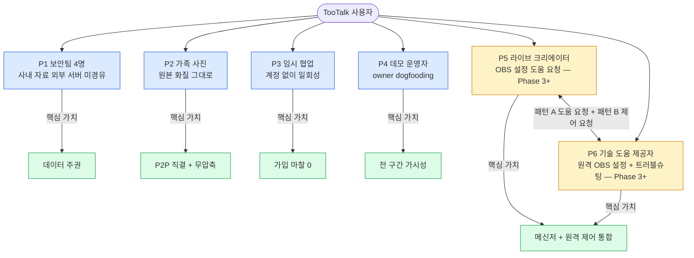

# PRODUCT_SENSE.md — TooTalk 제품 감각·비전·시나리오

> 본 문서는 TooTalk(코드명 `p2p_msg`)의 **제품 감각 정본**이다.
> "왜 만드는가 / 누구를 위한 것인가 / 어떤 장면에서 쓰는가" 를 한 장으로 모은다.
> 상위 정본: [CLAUDE_HARNESS_IMPORTANT.md](CLAUDE_HARNESS_IMPORTANT.md) · 저장소 맵: [AGENTS.md](AGENTS.md) · 실행 계획: [docs/exec-plans/active/2026-05-17-tootalk-phase1-mvp.md](docs/exec-plans/active/2026-05-17-tootalk-phase1-mvp.md)

---

## 1. 문서 목적

본 문서는 두 가지 질문에 답한다.

1. **제품 비전** — TooTalk 가 무엇을 지향하며, 무엇을 지향하지 않는가.
2. **사용자 시나리오** — 어떤 사람이 어떤 순간에 TooTalk 를 켜고, 무엇을 얻고 닫는가.

기능 우선순위 판단·반대 사례 결정·기능 추가/제거 의사결정의 1차 참조 문서다. 본 문서가 코드보다 앞선다 ([AGENTS.md §2 M1](AGENTS.md)). 신규 기능 directive 가 들어왔을 때 §4 페르소나·§5 시나리오 중 하나라도 강하게 맞물리지 않으면 우선순위 후순위로 미룬다.

---

## 2. 비전

**한 줄**: TooTalk 는 *데이터가 내 PC 와 상대 PC 사이로만 흐르는 데스크탑 메신저* 다.

**한 문단**: 현대 메신저 대부분은 사용자 데이터를 회사 서버로 끌어올린 뒤 다시 상대에게 내려보낸다. 편의성·검색·다중 디바이스 동기화를 얻는 대신 발신자가 송신한 모든 텍스트·이미지·파일이 제3자의 디스크에 남는다. TooTalk 는 그 거래 조건이 어색한 사용자를 위한 도구다. 시그널링 서버는 두 peer 가 서로의 네트워크 좌표를 알아내는 첫 악수 한 번에만 개입하고, 실 데이터는 WebRTC DataChannel 의 DTLS 암호 위로 P2P 직결된다. 송수신 양쪽에 동시에 표시되는 ProgressBar 는 "내 파일이 지금 어디까지 어느 속도로 흘러가고 있는가" 를 한 화면에서 시각화한다. 사용자는 자기 데이터의 행방을 눈으로 확인할 수 있다.

---

## 3. 핵심 가치 제안

세 축으로 요약한다.

### 3.1 P2P 직결 (Path Sovereignty)

- 텍스트 1바이트, 이미지 1픽셀, 파일 1청크 — 모두 시그널링 서버를 통과하지 않는다.
- 서버는 Offer/Answer/ICE 후보 교환의 첫 악수에만 관여한 뒤 침묵한다.
- DTLS 자체 암호가 transport 구간을 보호한다 (Phase 1 위협 모델 기준).

### 3.2 데이터 주권 (Data Sovereignty)

- 모든 대화 히스토리·메타데이터는 사용자 PC 의 SQLite 파일에 영구 저장된다.
- 클라우드 동기화 없음. 백업 정책은 사용자가 직접 결정한다.
- 회사 서버에 사용자 메시지가 누적되지 않으므로 데이터 유출 사고의 폭발 반경이 0 에 가깝다.

### 3.3 양방향 ProgressBar UX

- 송신자와 수신자 화면에 **동일한 진행률**이 동시에 표시된다.
- 청크 단위 ack 가 양쪽 `QProgressBar` 를 동기 갱신한다.
- 대용량 파일(>100MB) 전송 시 "지금 멈춘 건가 / 끊긴 건가 / 흐르는 건가" 의 모호함을 제거한다.
- 텔레그램·디스코드·슬랙 모두 송신자 화면 단방향 표시 위주로 동작한다. TooTalk 는 양방향 가시성을 1순위 차별점으로 둔다.

---

## 4. 타겟 사용자 페르소나

본 Phase 1 MVP 기준 4 인 + Phase 2+ 차별화 의 2 인 (신규). 가공 인물 발명 금지 — 모두 directive 와 데모 시그널링 서버 운용 맥락에서 도출된 실재 유형이다.

| 코드 | 이름      | 직군                  | 핵심 요구                                                       | Phase |
|------|-----------|-----------------------|-----------------------------------------------------------------|-------|
| P1   | 보안팀 4명 | 소규모 보안 민감 팀    | 회사 외부 서버에 사내 자료 흐름이 남지 않을 것                  | 1+    |
| P2   | 가족 사진  | 비기술 가족 사용자     | 카톡 화질 압축·용량 제한 없이 원본 사진/영상을 가족끼리 직송    | 1+    |
| P3   | 임시 협업  | 단기 외부 협력자       | 회사 계정 발급 없이, 일회성으로 자료 1~2건 빠르게 주고받기      | 1+    |
| P4   | 데모 운영자| 저장소 owner (oneticket99) | 데모 서버 운용 + 자기 데이터 흐름 통제 + 개발 dogfooding         | 1+    |
| P5   | 라이브 크리에이터 | Toonation 후원 받는 BJ/스트리머 | OBS 설정 어려움 — 친구 (P6) 의 원격 도움 요청 + 수락 → 원격 OBS 설정 받기 (사용자 directive 2026-05-17) | 3+    |
| P6   | 기술 도움 제공자 | OBS / 방송 셋업 숙련 친구 | 라이브 크리에이터 친구 (P5) 의 원격 제어 → 직접 OBS 설정 + 트러블슈팅 | 3+    |

### 4.1 페르소나 흐름 도식

### 4.2 페르소나 상세

- **P1 보안 민감 소규모 팀** — 4~10명 규모 보안·법무·M&A 실무 팀. 사내 자료가 SaaS 메신저 서버에 영구 저장되는 것을 직장 정책 또는 개인 신념으로 거부한다. 사외 비밀 정보 메일링은 부담스럽고, 자체 호스팅 메신저(Mattermost·Rocket.Chat)는 운영 부담이 크다. TooTalk 는 시그널링 서버 1대만 띄우면 끝나고, 그 서버조차 메시지를 보지 못한다는 점이 핵심 매력이다.
- **P2 가족 사진 전송 사용자** — 비기술 가족 구성원(부모·자녀). 카카오톡으로 사진을 보내면 화질이 압축되고, 1GB 영상 파일은 거절당한다. 클라우드 링크 공유는 가족에게 너무 추상적이다. "그냥 원본을 보내고 싶다" 는 욕구가 1순위. UI 마찰을 극단적으로 낮춰야 한다.
- **P3 임시 협업 사용자** — 외부 디자이너·번역가·1회성 컨설턴트. 회사 메신저 계정 발급은 과하고, 이메일 첨부는 용량 제약이 있다. TooTalk 의 가입 불필요·1:1 직결·세션 종료 시 흔적 최소화 특성이 핵심.
- **P4 데모/개발 담당 운영자** — 저장소 owner (`oneticket99`). 데모 시그널링 서버 `114.207.112.73` 운용 + 매 directive 마다 dogfooding. 자기 데이터 흐름의 전 구간을 눈으로 확인하려는 욕구가 다른 페르소나의 가치 제안을 뛰어넘는다. 양방향 ProgressBar 가 owner 시연 무기.
- **P5 라이브 크리에이터 (Phase 3+ 차별화)** — Toonation 의 후원 받는 BJ/스트리머. OBS 설정 의 화면 캡처 / 마이크 / 라우팅 / 알림 위젯 설정 어려움. 비기술 사용자가 다수. 친구 (P6) 의 원격 도움 요청 → 수락 → P6 의 P5 컴퓨터 원격 OBS 설정. 사용자 directive 2026-05-17 — "투네이션은 라이브 크리에이터 서드파티 방송 플랫폼이고, 상대방의 OBS 설정 능력이 미흡한경우 친구 추가를 해서 원격 작업으로 도움을 주거나 할 필요가 있어".
- **P6 기술 도움 제공자 (Phase 3+ 차별화)** — OBS / 방송 셋업 숙련 친구 (BJ 동료 또는 매니저 또는 PD). P5 의 원격 OBS 설정 + 트러블슈팅 직접 수행. 패턴 A (P5 의 도움 요청 → P6 수락) 또는 패턴 B (P6 의 제어 요청 → P5 수락) 양방향. 친구 추가 사전 의무 + 명시 수락 모달 + 긴급 ESC 권한 모델 — [[project-phase2-remote-control-differentiator]] 정합.

---

## 5. 핵심 사용자 시나리오

5개 시나리오. 모두 Phase 1 MVP 범위 안에서 동작해야 한다 ([실행계획 §6 Definition of Done](docs/exec-plans/active/2026-05-17-tootalk-phase1-mvp.md)).

### 5.1 시나리오 A — 첫 실행 (P3 임시 협업)

외부 디자이너가 zip 빌드를 받아 압축 해제 → `TooTalk.app` 더블클릭 → macOS Gatekeeper 우회 안내(README 1페이지) 1회 수행 → 메인 윈도우 표시 → 상대방의 peer ID 를 입력 → 시그널링 서버 경유 1회 악수 → 채팅 시작. **첫 사용자 1회 사용 도달 시간 목표 5분 이내** (§10 측정 지표 KPI-T).

### 5.2 시나리오 B — 대용량 파일 전송 (P2 가족 사진 · P1 보안팀)

100MB~500MB 파일을 드래그앤드롭 → 청크 스트림 시작 → 송신자·수신자 양쪽 `QProgressBar` 가 1% 단위로 동시 갱신 → 완료 시 양쪽에 "전송 완료" 토스트. 중간에 네트워크 단절 발생 시 ProgressBar 가 정지하고 명시적 오류 표시(역행 또는 무한 회전 금지). aiortc 약 5Mbps 처리 한계는 기술 부채 TD-4 로 추적 중.

### 5.3 시나리오 C — 그룹 사진 공유 (P2 가족)

Phase 1 MVP 는 1:1 만 지원한다. 가족 4인 그룹 사진 공유 use case 는 1:1 채팅 4개를 각각 동시에 열어 같은 파일을 4회 전송하는 *임시 우회*로 대응한다. 그룹 채팅 토폴로지(mesh·SFU)는 Phase 2 이후 ([실행계획 §3 Out of Scope](docs/exec-plans/active/2026-05-17-tootalk-phase1-mvp.md)). 본 시나리오는 "MVP 에서 어떻게든 동작은 한다"의 하한선 검증용이다.

### 5.4 시나리오 D — 오프라인 복귀 (P1 보안팀)

상대 peer 가 오프라인 상태에서 시그널링 서버 접속 시도 → 시그널링 응답이 "peer not online" → UI 가 명시적 안내 + 재시도 버튼 노출. 상대 peer 복귀 후 사용자가 재시도 → 정상 연결. 메시지 큐 영구화·푸시 알림은 Phase 1 범위 외 (Out of Scope). 본 시나리오는 "끊김의 가시성"이 P2P 도구의 신뢰성 핵심임을 인정하는 시나리오다.

### 5.5 시나리오 E — 데모 시연 (P4 데모 운영자)

운영자가 macOS 노트북과 Windows 노트북을 나란히 놓고 시연. macOS 에서 200MB 파일을 송신 → Windows ProgressBar 가 동시에 증가 → 운영자가 화면을 가리키며 "send/receive 양쪽이 동기로 흐른다" 를 설명. 본 시나리오가 양방향 ProgressBar 차별점(§3.3)의 dogfooding 검증이며 Phase 1 MVP 종료의 시그니처 데모다.

---

## 6. 텔레그램 비교

가장 가까운 reference 제품이 텔레그램이다. 강점·약점을 솔직히 명시한다 (마케팅 과장 금지).

| 항목                        | TooTalk                                  | Telegram                                  | 격차                                                |
|-----------------------------|------------------------------------------|-------------------------------------------|-----------------------------------------------------|
| 데이터 경로                  | P2P 직결 (DataChannel)                   | Telegram 서버 경유 (클라우드 저장)          | TooTalk 우세 — 서버에 데이터 미저장                  |
| E2EE 기본                   | DTLS (transport 암호)                    | 1:1 Secret Chat 만 E2EE, 기본은 server-side| Phase 2 Signal Protocol 도입 시 동등 이상            |
| 그룹 채팅                   | Phase 1 미지원                            | 최대 20만명 슈퍼그룹                       | TooTalk 약세 — Phase 1 범위 외                       |
| 멀티 디바이스 동기           | 단일 PC                                   | 전 디바이스 실시간 동기                     | TooTalk 약세 (의도) — 서버 미경유의 trade-off        |
| 파일 용량 제한               | 사실상 무제한 (네트워크·디스크 의존)       | 2GB (Premium 4GB)                          | TooTalk 우세 — P2P 직결로 서버 한도 부재              |
| 양방향 ProgressBar          | 1순위 차별점, 송수신 동시 표시             | 송신 화면 단방향 표시 위주                  | TooTalk 우세 — 핵심 UX 차별                          |
| 메시지 검색                 | 로컬 SQLite full-text 검토 (Phase 2)      | 서버사이드 검색, 강력                       | TooTalk 약세 — 데이터 주권 trade-off                 |
| 봇·미니앱 생태계             | 없음                                      | Bot API·Mini Apps 풍부                     | TooTalk 비대상 — 다른 제품군                         |
| 가입 마찰                   | 계정 발급 불필요, peer ID 만               | 전화번호 필수                              | TooTalk 우세 — 익명성·임시성 우위                    |
| 모바일 지원                 | 없음 (PyQt 데스크탑 전용)                  | iOS·Android·Web·Desktop 전부                | TooTalk 약세 (의도) — Phase 1 범위 외                |
| 자동 업데이트               | 없음 (수동 zip 갱신)                       | 자동 업데이트                              | TooTalk 약세 — Phase 1 인증서 미사용 trade-off       |
| 코드 서명                   | 없음 (Gatekeeper/SmartScreen 우회 안내)   | Apple 공인·Microsoft 인증                  | TooTalk 약세 — TD-2·TD-3 으로 Phase 2 추적            |
| 데스크탑 네이티브 UI         | PyQt6 (Qt 위젯·QSS)                       | Telegram Desktop (TDLib + Qt)              | 동급 — 둘 다 Qt 기반                                 |
| 한글 입력기 정합            | 한글 한자 BPE 비의존, Qt IME 네이티브       | 자체 입력 처리                              | TooTalk 미세 우세 — IME 마찰 회피                    |

---

## 7. 차별화 핵심

위 비교표에서 TooTalk 가 텔레그램을 *덮을 수 없는* 영역은 분명하다(그룹·모바일·자동 업데이트·생태계). 대신 **다음 4가지는 텔레그램으로 대체 불가**:

1. **양방향 ProgressBar** — "내 파일이 지금 상대에게 어디까지 갔는지" 를 한 화면에 본다. 대용량·저속 회선 환경에서 결정적 가치.
2. **시그널링만 거치는 데이터** — 메시지 본문이 회사 서버 디스크에 닿지 않는다. 보안 민감 사용자의 1순위 요구.
3. **Qt 네이티브 데스크탑** — Electron 기반 메신저 대비 메모리·시작 시간 우위. PyQt6 의 QSS 테마로 운영체제 룩앤필 정합.
4. **한글 한자 BPE 무관** — 토크나이저 종속이 없는 일반 텍스트 채팅. 한국어 IME(macOS 입력기·Windows IME) 와 Qt 입력 시그널 직결로 조합 문자 깨짐 회피.

---

## 8. 비즈니스 모델

**현재 (Phase 1)** — 없음. 데모/OSS/포트폴리오 단계. 사용자 비용 0, 운영자 비용은 데모 시그널링 서버 1대 운용비만.

**미래 후보** (Phase 3 이후 검토 — 결정 사항 아님):

- **자체 호스팅 라이선스 판매** — 기업이 자기 사내 시그널링 서버를 띄우는 onprem 패키지 라이선스.
- **TURN 릴레이 유료화** — 양 peer 가 모두 대칭 NAT 일 때 폴백 TURN 서버 (사용량 기반).
- **Pro 기능** — 고급 검색 인덱싱·다중 디바이스 동기(opt-in 클라우드)·자동 백업.
- **컨설팅·SI** — 보안 민감 조직 대상 도입 컨설팅.

본 단계에서는 모든 후보가 "보류 + 가능성만 기록" 상태이며, 현재 의사결정에 영향을 주지 않는다.

---

## 9. UX 원칙

[FRONTEND.md](FRONTEND.md) · [DESIGN.md](DESIGN.md) 와 정합. 본 문서는 제품 감각 측면 5 원칙으로 요약한다.

1. **마찰 최소화** — 가입 0회·계정 0개·설정 0회로 첫 메시지까지 도달. P3 페르소나 핵심.
2. **가시성 우선** — 송수신 진행 상태·연결 상태·오프라인 여부 모두 명시 상태 표시. 침묵 금지.
3. **모호한 회전 금지** — `QProgressBar` 가 무한 회전(indeterminate)으로 빠지는 경우는 명시적 진행 정보 없는 짧은 순간 한정. "도는 게 멈춘 건지 흐르는 건지 모르겠다" 가 가장 큰 사용자 불신 유발 신호.
4. **데이터 흐름 시각화** — peer ID, 연결 종류(P2P 직결 / TURN 폴백 — Phase 2), 평균 throughput 을 사용자가 한 화면에서 확인 가능.
5. **한국어 1순위** — UI·README·오류 메시지·로그까지 한국어 단일 (Phase 1). 다국어는 Phase 2 ([Out of Scope](docs/exec-plans/active/2026-05-17-tootalk-phase1-mvp.md)).

---

## 10. 측정 지표

Phase 1 MVP 의 제품 감각 지표 4개. CI·관측성에서 자동 수집 가능한 항목만 정의한다 (수동 설문·NPS 미포함).

| 코드   | 지표명                          | 정의                                                                | Phase 1 목표              |
|--------|---------------------------------|---------------------------------------------------------------------|---------------------------|
| KPI-D  | DAU (Daily Active Users)        | 24시간 내 1회 이상 시그널링 서버 핸드셰이크 성공한 peer 수           | 측정 인프라 마련 (값 목표 없음) |
| KPI-S  | 메시지 송신 성공률              | 텍스트 메시지 envelope 송신 시 수신자 ack 도달 비율                   | 99% 이상 (양호 회선 기준) |
| KPI-T  | 파일 전송 평균 throughput       | 100MB 파일 전송 1회 평균 Mbps (LAN 또는 동일 ISP 환경)                | 3Mbps 이상 (TD-4 추적)    |
| KPI-O  | 첫 사용자 1회 사용 도달 시간    | 빌드 zip 다운로드 → 첫 메시지 송신 성공까지의 경과 시간               | 5분 이내 (시나리오 A 정합)|

지표 수집 시 사용자 식별 정보·메시지 본문은 전송하지 않는다. peer ID 해시·이벤트 타임스탬프·throughput 값만 익명 집계 (Phase 2 인프라 후 본격 가동, Phase 1 은 로컬 로그 회수).

---

## 11. 위험 / 제약

본 Phase 의 알려진 제약. 의도적으로 받아들인 trade-off 는 신중히 명시한다.

1. **분산 신뢰 모델 부재** — peer ID 위·변조·중간자 위험 존재. Phase 2 에서 Signal Protocol + 키 검증 도입 전까지 "서로 아는 사람끼리만 쓰는 도구"로 한정.
2. **NAT 순회 실패** — 양 peer 가 모두 대칭 NAT(symmetric NAT) 인 경우 STUN 단독으로 연결 불가. TURN 릴레이 미배포 — Phase 1 데모는 "최소 한 peer 는 cone NAT" 환경으로 한정 시연.
3. **인증서 미사용 (데모 단계 한정)** — macOS Gatekeeper · Windows SmartScreen 첫 실행 우회 수동 안내. TD-2·TD-3 으로 Phase 2 추적 ([실행계획 §8](docs/exec-plans/active/2026-05-17-tootalk-phase1-mvp.md)).
4. **단일 디바이스 제약** — 같은 사용자가 데스크탑·노트북에서 같은 대화를 보지 못한다. 데이터 주권 trade-off (의도).
5. **메시지 큐 영구화 없음** — 상대 오프라인 시 메시지가 큐잉되지 않는다. Phase 1 의 P2P 순수성 유지를 위한 의도된 제약.
6. **자동 업데이트 없음** — 사용자가 수동으로 zip 을 재다운로드. Phase 1 인증서 미사용 trade-off 와 연동.
7. **모바일 미지원** — PyQt6 데스크탑 전용. 모바일은 다른 제품군 (Phase 3 이후 별도 검토).

---

## 12. 참조

### 12.1 정본·맵·실행 계획

- [CLAUDE_HARNESS_IMPORTANT.md](CLAUDE_HARNESS_IMPORTANT.md) — Watcher 정본 · M1~M7 · §A~§S
- [AGENTS.md](AGENTS.md) — 저장소 맵 + 명명 규약 (TooTalk / p2p_msg)
- [docs/exec-plans/active/2026-05-17-tootalk-phase1-mvp.md](docs/exec-plans/active/2026-05-17-tootalk-phase1-mvp.md) — Phase 1 MVP 실행 계획

### 12.2 정책 동행 문서 (루트 9)

- [ARCHITECTURE.md](ARCHITECTURE.md) — 모듈 경계·계층·의존 관계
- [DESIGN.md](DESIGN.md) · [FRONTEND.md](FRONTEND.md) — UI/UX 설계 원칙
- [QUALITY_SCORE.md](QUALITY_SCORE.md) — 품질 점수 체계
- [RELIABILITY.md](RELIABILITY.md) — 신뢰성·장애 대응
- [SECURITY.md](SECURITY.md) — 보안 위협 모델 · 외부 입력 검증
- [PLANS.md](PLANS.md) — 활성 실행 계획 인덱스

### 12.3 비교 reference

- Telegram Desktop (TDLib + Qt) — UX 참고 reference, 데이터 모델 반대 사례
- Signal — E2EE Signal Protocol reference, Phase 2 도입 후보
- WebRTC samples (DataChannel) — aiortc 구현 reference

---

**문서 상태**: `active` · 최초 작성 2026-05-17 · 다음 검증 예정 Phase 1 M3 종료일 (2026-06-14)
