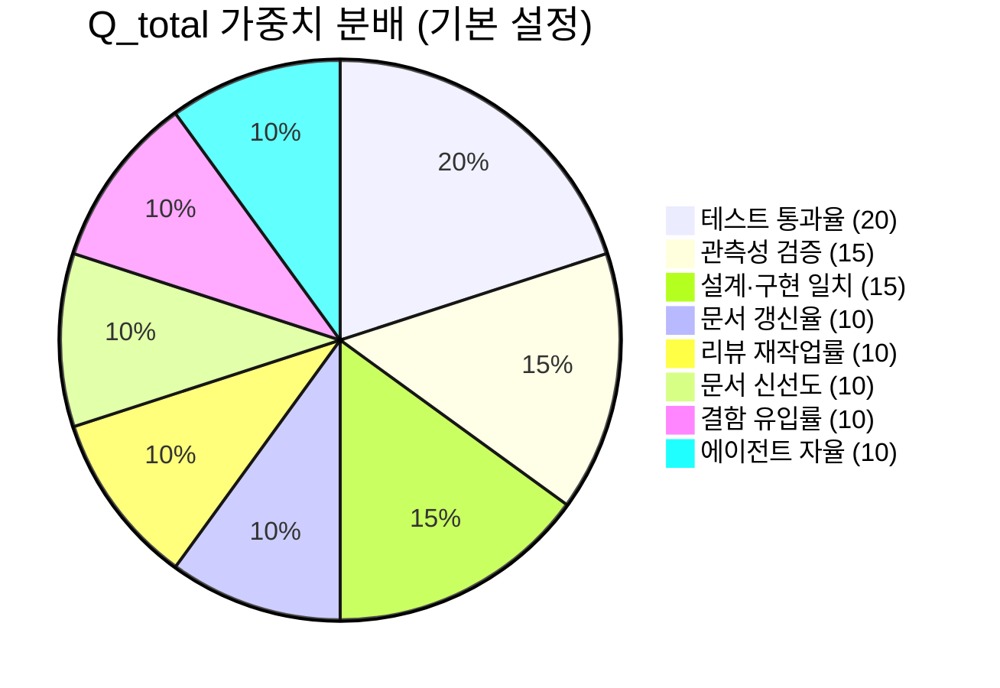

# QUALITY_SCORE.md — TooTalk (p2p_msg) 품질 점수 체계

> 본 문서는 TooTalk 저장소의 **정량/반정량 품질 추적 표준**이다.
> 정본 정합: [CLAUDE_HARNESS_IMPORTANT.md](CLAUDE_HARNESS_IMPORTANT.md) §I (시스템 빌더 메타프롬프트 L762~L772) — 8 핵심 메트릭의 단독 정본 소스.
> 본 문서 우회 경로 없음. 모든 PR 머지·릴리즈는 본 문서가 정의하는 게이트를 통과해야 한다.

---

## 1. 문서 목적

본 문서는 다음 3 의무를 충족한다.

1. **정량 표준 제공** — 8 메트릭의 산식·단위·임계값·갱신 주기를 단일 정본으로 고정. 정본 §I 본문이 정의를 가지고 본 문서가 운영 규약을 가진다.
2. **자동화 enforcement 매핑** — 각 메트릭이 CI 자동 측정인지 수동 평가인지, 어떤 실재 도구로 측정되는지 명시. 가짜 측정 도구 발명 금지 ([금지사항](#10-금지사항-quality_score-한정)).
3. **드리프트 차단** — red/yellow/green 임계값 + 분기별 회고 절차로 점수 하락을 조기 탐지.

본 문서가 적용되는 범위:

- 모든 `main` 브랜치 머지 PR
- 모든 릴리즈 (PyInstaller zip 배포 직전)
- 분기별 회고 (3개월 주기)

본 문서가 적용되지 **않는** 범위:

- `wip/` · `draft/` 접두어 브랜치 ([정본 §R-3](CLAUDE_HARNESS_IMPORTANT.md))
- 순수 docs-only PR (`docs/**` · 루트 `*.md` 단독 변경) — 단, 문서 신선도 점수는 항상 적용

---

## 2. 점수 체계 개요

정본 §I 본문 인용 (L762~L772):

> 시스템 품질을 정량/반정량적으로 추적할 수 있게 하라.
> 예:
> - 테스트 통과율
> - 변경당 문서 갱신율
> - 리뷰 재작업률
> - 관측성 검증 통과율
> - 문서 신선도 점수
> - 설계 문서와 실제 구현 일치도
> - PR당 결함 유입률
> - 에이전트 자율 완수율

본 문서는 위 8 메트릭을 **그대로 채택**하며 가감 없음. 새 메트릭 추가는 본 문서 갱신 + 정본 §I 동시 갱신 의무 ([정본 §Q-7](CLAUDE_HARNESS_IMPORTANT.md) "정책 변경 시 동시 갱신").

### 점수 합산 공식

```text
Q_total = Σ(weight_i × normalize(metric_i))   for i ∈ {1..8}
```

- 각 메트릭은 0.0 ~ 1.0 사이로 정규화
- 기본 가중치는 [§4 점수 산출 방법](#4-점수-산출-방법) 표 참조
- 합산 결과 `Q_total ≥ 0.85` = green, `0.70 ≤ Q_total < 0.85` = yellow, `Q_total < 0.70` = red

---

## 3. 8 핵심 메트릭 표

| # | 메트릭 | 산식 | 단위 | 임계값 (R/Y/G) | 측정 도구 (실재) | 갱신 주기 |
|---|---|---|---|---|---|---|
| 1 | 테스트 통과율 | `passed / total` | % | <80 / 80~94 / ≥95 | `pytest` + `coverage` | PR마다 (CI) |
| 2 | 변경당 문서 갱신율 | `docs_touched_PR / code_touched_PR` | 비율 | <0.4 / 0.4~0.7 / ≥0.7 | `git diff --name-only` + custom shell script | PR마다 (CI) |
| 3 | 리뷰 재작업률 | `revision_commits / total_commits_in_PR` | 비율 | >0.5 / 0.2~0.5 / <0.2 | GitHub API (`gh pr view --json commits`) | PR 머지 직후 |
| 4 | 관측성 검증 통과율 | `obs_checks_passed / obs_checks_total` | % | <80 / 80~94 / ≥95 | `@observability-agent` 리포트 + custom shell script | PR마다 (수동 트리거) |
| 5 | 문서 신선도 점수 | `1 - (avg_stale_days / 90)` clamp(0,1) | 0.0~1.0 | <0.5 / 0.5~0.79 / ≥0.8 | `doc-gardener.yml` workflow + `find -mtime` | 주 1회 (cron) |
| 6 | 설계 문서·구현 일치도 | `spec_items_matched / spec_items_total` | % | <70 / 70~89 / ≥90 | `tools/md_agents.py` + 수동 spot-check | 격주 (수동) |
| 7 | PR당 결함 유입률 | `bugs_filed_within_7d / merged_PRs` | 건/PR | >0.3 / 0.1~0.3 / <0.1 | GitHub Issues (`gh issue list --label bug`) | 주 1회 |
| 8 | 에이전트 자율 완수율 | `agent_directives_no_user_intervention / agent_directives_total` | % | <60 / 60~84 / ≥85 | `data/wbs.sqlite` `wbs_tasks` 쿼리 (M6) | 분기 1회 |

### 산식 상세 (메트릭별 핵심 노트)

- **1. 테스트 통과율** — `pytest --tb=short --strict-markers` 표준. skip/xfail 제외, error 는 fail 처리. `coverage` 는 보조 지표 (산식 미반영).
- **2. 변경당 문서 갱신율** — 코드 파일 = `.py`·`.js`·`.html`·`.css`·`.sql`·`.sh` ([정본 §J](CLAUDE_HARNESS_IMPORTANT.md)). 코드 변경 0건이면 산식 미적용. M1 본질 지표 — 0.4 미만은 M1 위반 의심.
- **3. 리뷰 재작업률** — `(force-push 또는 fixup 커밋 수) / (PR 총 커밋)`. `@reviewer-agent` 피드백 후 수정 커밋 = 재작업. 0.5 초과는 사전 검토 부족 — `@planning-agent` 보강 필요.
- **4. 관측성 검증 통과율** — `@observability-agent` 가 발행하는 리포트 산출 ([.claude/agents/observability-agent.md](.claude/agents/observability-agent.md)). 체크 항목 예시: WebRTC DataChannel 연결 로그, SQLite write latency, 시그널링 WebSocket reconnect 횟수.
- **5. 문서 신선도 점수** — `freshness = clamp(1 - (Σ stale_days / N) / 90, 0, 1)`. `stale_days` = `last_verified` ~ 오늘 일수. 90일을 0점 기준선 ([정본 §L](CLAUDE_HARNESS_IMPORTANT.md) 정책 정합). `last_verified` 누락은 `stale_days = 90` penalty.
- **6. 설계 문서·구현 일치도** — `Specification.md` 요구사항 ID 가 `Structure.md` 파일 트리에 매핑되는지 검사. `tools/md_agents.py` 자동 매핑 후 수동 spot-check (분기 1회). 90% 미만은 spec·코드 drift.
- **7. PR당 결함 유입률** — `(머지 후 7일 이내 bug 라벨 신규 이슈) / (해당 기간 머지 PR)`. `gh issue list --label bug --search "created:>=YYYY-MM-DD"`. 라벨 표준 `bug` 1종 (분산 금지). 0.3 초과는 `@qa-agent` 회귀 시나리오 확장.
- **8. 에이전트 자율 완수율** — `wbs_tasks.user_intervention_count = 0` 행 / 전체 행. `/loop` 트리거 발생도 개입으로 계산. M6 활성 후 측정 시작. 인프라 미준비 시 N/A + 가중치 재정규화.

---

## 4. 점수 산출 방법

### CI 자동 vs 수동 평가 분류

| 메트릭 | 분류 | 측정 책임 | 가중치 (기본) |
|---|---|---|---|
| 1. 테스트 통과율 | CI 자동 | `ci.yml` pytest 단계 | 0.20 |
| 2. 변경당 문서 갱신율 | CI 자동 | `ci.yml` doc-touch 스크립트 | 0.10 |
| 3. 리뷰 재작업률 | 반자동 | `@release-agent` PR 머지 직후 측정 | 0.10 |
| 4. 관측성 검증 통과율 | 수동 트리거 | `@observability-agent` (PR 라벨 `needs-obs`) | 0.15 |
| 5. 문서 신선도 점수 | CI 자동 (cron) | `doc-gardener.yml` 주 1회 | 0.10 |
| 6. 설계 문서·구현 일치도 | 수동 | `@spec-agent` + `@structure-agent` 격주 검토 | 0.15 |
| 7. PR당 결함 유입률 | 반자동 | `@release-agent` 주간 집계 | 0.10 |
| 8. 에이전트 자율 완수율 | 자동 (M6 활성 후) | `data/wbs.sqlite` 쿼리 | 0.10 |
| **합계** | | | **1.00** |

> 가중치는 합리적 추정값. 실 데이터 누적 후 분기별 회고에서 재조정 — 사용자 confirmation 필요.

### 측정 실행 절차

```bash
# CI 자동 메트릭 (1, 2, 5)
python tools/md_agents.py             # 정합 검사 + 문서 신선도 산출
pytest --tb=short --strict-markers    # 테스트 통과율
coverage run -m pytest && coverage report --fail-under=80  # 보조 커버리지

# 반자동/수동 메트릭 (3, 4, 6, 7)
gh pr view <PR#> --json commits       # 재작업률
@observability-agent                  # 관측성 검증 트리거 (CLAUDE.md 위임 규약)
gh issue list --label bug --search "created:>=$(date -v-7d +%Y-%m-%d)"  # 결함 유입

# WBS 메트릭 (8) — M6 활성 후
sqlite3 data/wbs.sqlite "SELECT COUNT(*) FROM wbs_tasks WHERE user_intervention_count = 0;"
sqlite3 data/wbs.sqlite "SELECT COUNT(*) FROM wbs_tasks;"
```

### 점수 보드 갱신

- CI 자동 메트릭: 매 PR 머지 직후 `docs/generated/quality-score.json` 에 append (자동)
- 수동 메트릭: `@release-agent` 가 PR 본문 `## Quality Score` 섹션에 기록
- 분기별 회고: 본 문서 [§8](#8-분기별-회고-절차) 절차 따라 `docs/exec-plans/completed/YYYY-QN-quality-retro.md` 생성

---

## 5. 임계값 — red / yellow / green

### 게이트 합격선

| 게이트 | 조건 | 동작 |
|---|---|---|
| **GREEN** | `Q_total ≥ 0.85` **AND** 모든 메트릭이 yellow 이상 | 자동 머지 허용 |
| **YELLOW** | `0.70 ≤ Q_total < 0.85` **OR** 1개 메트릭이 red | `@reviewer-agent` 명시 승인 필요 |
| **RED** | `Q_total < 0.70` **OR** 2개 이상 메트릭이 red | 머지 차단 + 재작업 강제 |

### 차단선 (단일 red 메트릭이 절대 차단되는 경우)

다음 4 메트릭이 red 면 다른 메트릭과 무관하게 **머지 차단**:

1. **테스트 통과율 < 80%** — 회귀 위험 (`ci.yml` 에서 hard fail)
2. **관측성 검증 통과율 < 80%** — 운영 가시성 손실
3. **변경당 문서 갱신율 < 0.4** — M1 (Document First) 본질 위반
4. **PR당 결함 유입률 > 0.3** — QA 게이트 무력화

나머지 메트릭(2개 추가)은 yellow 게이트에서 `@reviewer-agent` 가 허용 가능.

### 신규 저장소 grace period

- M6 (WBS sqlite) · M7 (텔레그램) 미활성 단계에서는 **메트릭 8 N/A** + 가중치 재정규화 (1.00 → 0.90, 다른 메트릭에 비례 분배)
- Grace period 종료 조건: M6/M7 인프라 PR 머지 직후
- Grace period 동안에도 메트릭 1~7 임계값은 그대로 적용

---

## 6. 점수 보드 mock-up

### 현재 분기 종합 점수 (예시 데이터, 실 측정값 미적용)



### 분기별 추이 표 (`docs/generated/quality-score.json` 에서 자동 생성)

| 분기 | 테스트 | 문서 갱신 | 재작업 | 관측성 | 신선도 | 일치도 | 결함 | 자율 | Q_total | 등급 |
|---|---|---|---|---|---|---|---|---|---|---|
| 2026 Q1 | — | — | — | — | — | — | — | — | — | — |
| 2026 Q2 | — | — | — | — | — | — | — | — | — | — |

> 실 측정 데이터 누적 전이므로 모든 값 미정. 첫 측정 회 (M6/M7 활성 후 첫 분기) 부터 기록 시작.

### PR 보드 표시 형식 (`.github/pull_request_template.md` 와 정합)

```text
## Quality Score (자동 생성)
- 테스트 통과율 : 96.2% [GREEN]
- 문서 갱신율   : 0.58  [YELLOW]
- 리뷰 재작업   : 0.18  [GREEN]
- 관측성 검증   : 91%   [YELLOW]
- Q_total       : 0.83  [YELLOW]
- 게이트        : @reviewer-agent 명시 승인 필요
```

---

## 7. 드리프트 알람 (Phase 2 슬랙·텔레그램 알림 후크)

### 알람 트리거 조건

| 조건 | 알람 채널 | 우선순위 |
|---|---|---|
| `Q_total` 직전 분기 대비 ≥ 0.10 하락 | 텔레그램 (M7) + 슬랙 | P0 |
| 단일 메트릭이 2주 연속 red | 텔레그램 (M7) | P1 |
| 문서 신선도 < 0.5 (90일 스테일 누적) | 슬랙 + `doc-gardener.yml` Issue 자동 생성 | P1 |
| 테스트 통과율 < 80% (CI hard fail) | 텔레그램 + 슬랙 즉시 | P0 |

### 후크 구현 (Phase 2 — 인프라 준비 후 활성)

```bash
# tools/quality_score_alarm.sh (Phase 2 신설 예정)
# - docs/generated/quality-score.json 직전·현재 diff 계산
# - 임계값 초과 시 텔레그램 reply + Slack webhook POST
```

- 현재 단계 (Phase 1) 에서는 **CI 로그 기반 수동 알람** — `@release-agent` 가 임계값 위반 감지 후 텔레그램 보고
- Phase 2 활성 트리거: `data/wbs.sqlite` 측정 인프라 + `docs/generated/quality-score.json` 누적 데이터 3 분기 이상 확보

### 슬랙 webhook 설정 (Phase 2)

- webhook URL 은 `.env` 의 `SLACK_QUALITY_WEBHOOK` 환경 변수 (하드코딩 금지, [정본 §E](CLAUDE_HARNESS_IMPORTANT.md))
- 채널: `#tootalk-quality` (가칭, 사용자 confirmation 필요)
- 메시지 형식: `[Q_DROP] Q_total {prev} → {curr} (Δ={delta})` + 영향 메트릭 목록

---

## 8. 분기별 회고 절차

### Quarterly review template

분기 종료일 기준 5 영업일 이내에 다음 절차 수행:

```text
[1] 데이터 수집
    - docs/generated/quality-score.json 분기 전체 export
    - GitHub API: 분기 내 머지 PR 목록 + bug 라벨 이슈 목록
    - data/wbs.sqlite: 분기 wbs_tasks 행 집계

[2] 메트릭별 분석
    - 각 메트릭의 분기 평균·중앙값·최저값
    - 직전 분기 대비 변화량
    - red 진입 메트릭이 있다면 근본 원인 추적

[3] 가중치 재조정 검토
    - 가중치 변경 시 사용자 confirmation 필수
    - 변경안은 docs/exec-plans/active/YYYY-QN-quality-retro.md draft 로 제출

[4] 회고 문서 작성
    - 경로: docs/exec-plans/completed/YYYY-QN-quality-retro.md
    - 필수 섹션: 데이터 / 분석 / 의사결정 / 액션 아이템 / 다음 분기 목표

[5] 액션 아이템 등록
    - 각 액션 아이템은 wbs_tasks 1행 INSERT (M6)
    - 차기 분기 시작일 이전에 모두 status 갱신
```

### 회고 문서 템플릿 (요약)

```markdown
# YYYY-QN Quality Retrospective

## 1. 측정 데이터
- Q_total 평균: ___
- 메트릭별 분기 평균 (표)

## 2. 분석
- 상승 메트릭 / 하락 메트릭
- red 진입 사례 + 근본 원인

## 3. 의사결정
- 가중치 변경 여부 (사용자 confirmation 결과)
- 임계값 조정 여부

## 4. 액션 아이템
- [ ] 액션 1 (담당: @___-agent, 마감: ___)
- [ ] 액션 2 ...

## 5. 다음 분기 목표
- Q_total 목표: ≥ ___
- 우선 개선 메트릭: ___
```

---

## 9. 참조

### 정본 정합

- [CLAUDE_HARNESS_IMPORTANT.md](CLAUDE_HARNESS_IMPORTANT.md) §I — 8 메트릭 정본 정의 (L762~L772)
- [CLAUDE_HARNESS_IMPORTANT.md](CLAUDE_HARNESS_IMPORTANT.md) §A — M1~M7 규칙
- [CLAUDE_HARNESS_IMPORTANT.md](CLAUDE_HARNESS_IMPORTANT.md) §L — CI 강제 게이트 3종
- [CLAUDE_HARNESS_IMPORTANT.md](CLAUDE_HARNESS_IMPORTANT.md) §R — M5 commit + push 절차
- [CLAUDE_HARNESS_IMPORTANT.md](CLAUDE_HARNESS_IMPORTANT.md) §S — Tier 1 자동화 layer 5단

### 운영 문서

- [AGENTS.md](AGENTS.md) §8 — PR 전 체크리스트 (본 문서 게이트와 정합 의무)
- [README.md](README.md) — 변경 이력 (M2, 30행 상한)
- [History.md](History.md) — 역순 prepend 영구 기록 (M3)
- [Specification.md](Specification.md) — 메트릭 6 (설계·구현 일치도) 의 spec 측정 대상
- [Structure.md](Structure.md) — 메트릭 6 의 구현 측정 대상

### 정책 문서

- [docs/policies/doc-gardening.md](docs/policies/doc-gardening.md) — 문서 신선도 점수 (메트릭 5) 의 운영 정책
- [docs/policies/adoption-roadmap.md](docs/policies/adoption-roadmap.md) — MVP / Standard / Scaled 단계별 본 문서 적용 범위
- [docs/policies/execution-harness.md](docs/policies/execution-harness.md) — 관측성 검증 (메트릭 4) 하네스 사양

### 에이전트 사양

- [.claude/agents/reviewer-agent.md](.claude/agents/reviewer-agent.md) — 게이트 판정 책임 에이전트
- [.claude/agents/qa-agent.md](.claude/agents/qa-agent.md) — 메트릭 7 (결함 유입률) 1차 방어선
- [.claude/agents/observability-agent.md](.claude/agents/observability-agent.md) — 메트릭 4 (관측성 검증) 측정 책임
- [.claude/agents/release-agent.md](.claude/agents/release-agent.md) — 본 문서 게이트 enforcement

### CI 워크플로우

- [.github/workflows/ci.yml](.github/workflows/ci.yml) — 메트릭 1, 2 자동 측정
- [.github/workflows/doc-gardener.yml](.github/workflows/doc-gardener.yml) — 메트릭 5 (주 1회 cron)
- [.github/workflows/docs-lint.yml](.github/workflows/docs-lint.yml) — 메트릭 5 보조 (메타데이터 검증)

---

## 10. 금지사항 (QUALITY_SCORE 한정)

본 문서 운영 시 다음 행위를 금지한다.

1. **가짜 측정 도구 발명 금지** — 본 문서에 명시된 도구 외에 새 도구를 임의로 도입하지 않는다. 실재하는 도구만 사용: `pytest`, `coverage`, GitHub API (`gh`), `sqlite3`, `find`, custom shell script (`tools/*.sh`). 새 도구 도입은 `docs/exec-plans/active/` 에 별도 plan 제출 후 사용자 confirmation 경유.
2. **임계값 임의 변경 금지** — red/yellow/green 임계값은 본 문서가 단일 정본. 변경은 분기별 회고 + 사용자 confirmation 경유. PR 본문에서 임시 완화 금지.
3. **메트릭 누락 금지** — 8 메트릭 모두 측정 (M6/M7 미활성 시 메트릭 8 만 N/A 허용). 메트릭 누락 PR 은 `@reviewer-agent` 차단.
4. **점수 위조 금지** — 측정 데이터 수동 편집 금지. `docs/generated/quality-score.json` 은 자동 생성만 허용.
5. **가중치 변경 단독 결정 금지** — 가중치 합 = 1.00 유지 + 사용자 confirmation 필요.

---

마지막 갱신: 2026-05-17 (TooTalk QUALITY_SCORE 초안 작성)
정본 §I 정합 검토일: 2026-05-17
