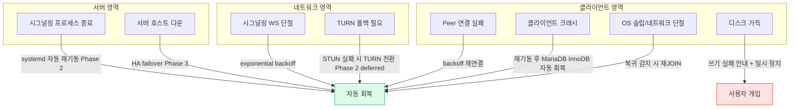
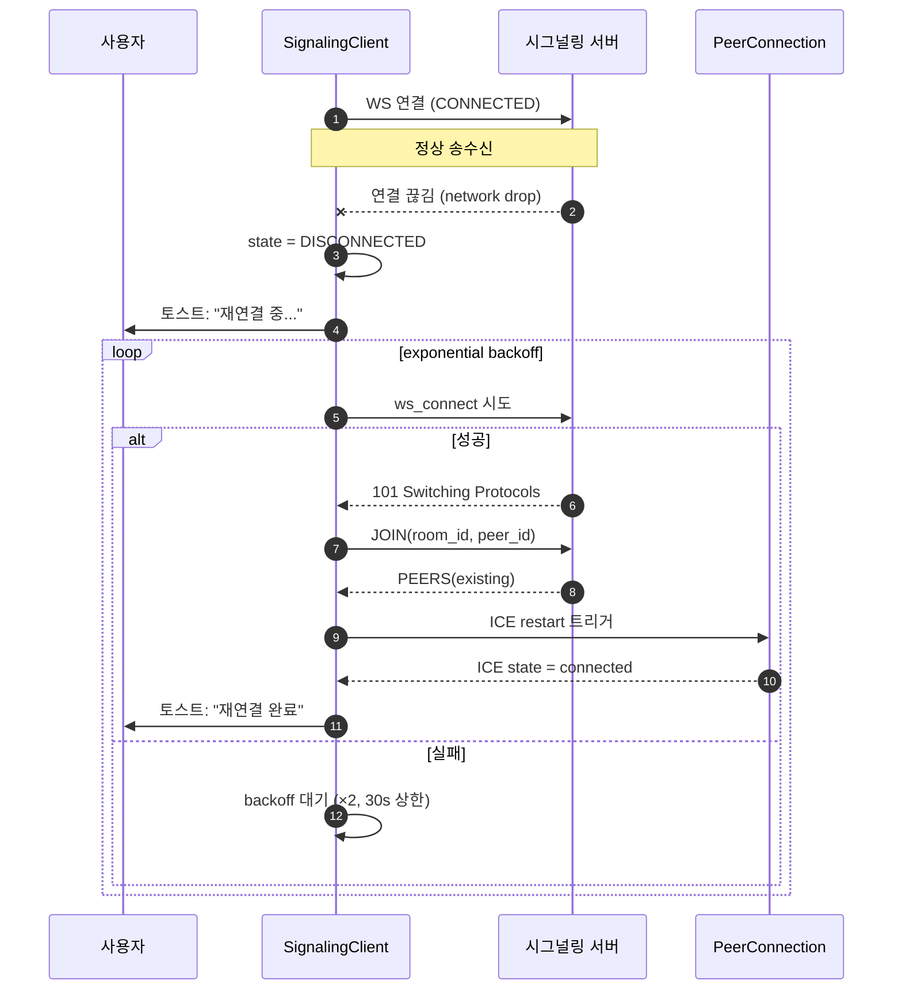

# RELIABILITY.md — TooTalk (p2p_msg) 신뢰성·내결함성·회복 정책

> 본 문서는 TooTalk 서비스의 **가용성·내결함성·회복 기준**을 정의한다.
> 운영 정책의 진입점은 [AGENTS.md](AGENTS.md) §3 문서 맵 — 본 문서는 "장애 발생 시 무엇을 보장하고, 어떻게 회복하는가" 한 가지에만 집중한다.
> 정본 정합: [CLAUDE_HARNESS_IMPORTANT.md](CLAUDE_HARNESS_IMPORTANT.md) §A·§E.

---

## 1. 문서 목적

TooTalk 는 시그널링 서버 1대 + WebRTC DataChannel 직결의 P2P 메신저다. 본 문서는 다음 3가지 신뢰성 축을 명문화한다.

| 축 | 정의 | 측정 지표 |
|---|---|---|
| **가용성 (Availability)** | 사용자가 메시지를 보내려 할 때 시스템이 응답하는 비율 | 시그널링 endpoint `/health` 200 OK 비율 |
| **내결함성 (Fault Tolerance)** | 단일 구성요소 장애 (peer 단절·디스크 가득·OS 슬립) 가 다른 사용자나 전체 서비스로 전파되지 않는 능력 | 장애 격리 범위 |
| **회복성 (Recoverability)** | 장애 종료 후 자동/수동으로 정상 동작으로 복귀하는 시간 (MTTR) | 재연결 성공까지 elapsed |

본 문서는 **현 구현 (Phase 1 MVP)** 의 실제 동작과 **Phase 2/3 의 목표** 를 분리해서 기술한다. 미구현 정책은 명시적으로 `Phase 2 deferred` 또는 `Phase 3 deferred` 마킹된다.

---

## 2. 가용성 목표 (SLO)

| Phase | 목표 가용성 | 정의 | 운영 자세 |
|---|---|---|---|
| **Phase 1 (MVP/데모)** | **best effort** | SLA·SLO 미보장. 데모 호스트 `114.207.112.73` 단일 노드. | 장애 발생 시 즉시 수동 재기동. 무중단 보장 없음. |
| **Phase 2 (베타)** | **99.5%** | 월 단위 누적 다운타임 ≤ 3시간 36분 | 자동 재기동 (systemd), 야간 백업, 단순 모니터링 |
| **Phase 3 (정식)** | **99.9%** | 월 단위 누적 다운타임 ≤ 43분 | HA 시그널링 (2노드 active-passive), Prometheus 알람 |

> **중요**: Phase 1 의 `best effort` 는 SLA 가 아니다. 본 문서 어디에도 Phase 1 에 대한 정량 가용성 약속이 존재하지 않음을 명시한다. 데모 시연·내부 테스트 한정.

### 2.1 가용성 산정 범위

가용성은 **시그널링 서버 가용성** 만을 의미한다. WebRTC DataChannel 자체는 P2P 직결이므로 양 peer 의 NAT·네트워크 품질에 종속되며 본 SLO 산정에서 제외된다 (단, TURN 폴백 동작 자체는 Phase 3 에서 가용성 산정 대상).

---

## 3. 장애 시나리오 매트릭스



### 3.1 시나리오별 상세

| 시나리오 | 감지 방법 | 1차 대응 | 2차 대응 | Phase |
|---|---|---|---|---|
| Peer 연결 실패 (ICE failed) | aiortc `iceConnectionState` 이벤트 | 동일 peer 재시도 (backoff) | TURN 폴백 (P2 deferred) | 1 / 2 |
| 시그널링 WS 단절 | `aiohttp.WSMsgType.CLOSED` 또는 `ERROR` | exponential backoff 재연결 | 사용자 알림 + 수동 재연결 버튼 | 1 |
| TURN 폴백 | STUN candidate 0건 또는 ICE timeout | TURN 자격 발급 후 재협상 | TURN 서버 미가용 시 실패 안내 | 2 deferred |
| Disk full | MariaDB `ER_RECORD_FILE_FULL` 또는 `OSError: ENOSPC` | 신규 메시지 큐잉 정지 + 토스트 | 사용자가 정리 후 재시도 | 1 |
| 클라이언트 크래시 | 다음 기동 시 비정상 종료 감지 (lock 파일) | MariaDB InnoDB redo log 자동 회복 | 마지막 송신 메시지 ack 재확인 | 1 |
| OS 슬립 | qasync 이벤트 루프 stall + wakeup gap | wake 직후 시그널링 재연결 | 미완 청크 재전송 | 1 |

### 3.2 격리 원칙

- **한 peer 의 장애가 다른 peer 에 전파되지 않는다.** [server/room.py](server/room.py) `Room.broadcast_except` 는 `asyncio.gather(return_exceptions=False)` 호출 시 한 peer 송신 실패가 다른 송신을 막지 않도록 `Peer.send_json` 안에서 예외를 흡수하고 `False` 만 반환한다.
- **서버 종료는 모든 peer 에 `ERROR(SERVER_SHUTDOWN)` 으로 통지**된다. 클라이언트는 이 코드를 받으면 자동 재연결 루프에 진입한다 ([server/room.py](server/room.py) `RoomRegistry.shutdown`).

---

## 4. 회복 전략

### 4.1 자동 재연결 (Exponential Backoff)

시그널링 WebSocket 단절 시 클라이언트는 지수 backoff 로 재연결한다.

| 시도 회차 | 대기 시간 | 비고 |
|---|---|---|
| 1 | 1s | 즉시 재시도 |
| 2 | 2s | |
| 3 | 4s | |
| 4 | 8s | |
| 5 | 16s | |
| 6+ | 30s 상한 | 무한 재시도하되 30s 간격 고정 |

- 재연결 시 클라이언트는 **마지막 `room_id` + `peer_id` 로 자동 재JOIN** 한다.
- 사용자가 명시적으로 disconnect 호출 시 backoff 중단 ([app/net/signaling_client.py](app/net/signaling_client.py) `disconnect`).
- 본 backoff 로직은 Phase 1 스켈레톤에서 골격만 존재하며, 본격 구현은 Task #16 (PeerConnection 통합) 와 함께 마무리된다.

### 4.2 청크 재전송

WebRTC DataChannel 위의 파일 전송은 청크 단위 (64KB 기본) 로 분할되고 각 청크에 시퀀스 번호가 부여된다.

- 수신측은 누적 수신 바이트수를 `ack` 로 돌려준다.
- 송신측은 일정 시간 ack 없으면 마지막 ack 이후 청크부터 재전송한다.
- 재연결 후에는 송신측이 `received_bytes` 를 먼저 조회하여 그 지점부터 이어 보낸다 (resume).

> Phase 1 의 청크 프로토콜 상세는 [docs/exec-plans/active/](docs/exec-plans/active/) 의 파일 전송 plan 에서 확정된다.

### 4.3 sha256 무결성

- 송신자는 파일 전체 sha256 을 메타데이터에 동봉한다.
- 수신자는 모든 청크 수신 완료 후 sha256 을 재계산하여 일치 여부를 확인한다.
- **불일치 시 전체 재전송** — 부분 재전송은 안전성을 위해 사용하지 않는다.

### 4.4 MariaDB 트랜잭션 (사용자 directive 2026-05-17)

- 모든 메시지·파일 메타 쓰기는 **단일 InnoDB 트랜잭션** 안에서 수행된다 (`START TRANSACTION` ... `COMMIT`).
- InnoDB redo log + doublewrite buffer — 크래시 시 자동 회복 보장 (별도 설정 불필요).
- binlog (`log_bin=ON`) 활성화 권장 — PITR (Point-In-Time Recovery) 및 replication 지원.
- DB 접속 정보는 `.env` 의 `DB_HOST`/`DB_PORT`/`DB_USER`/`DB_PASS`/`DB_NAME` 5종으로만 지정 (하드코딩 금지, [AGENTS.md](AGENTS.md) 부록 B).

### 4.5 회복 시퀀스 (시그널링 단절 → 재연결 → 재JOIN)



---

## 5. Graceful Shutdown

서버는 SIGINT/SIGTERM 수신 시 모든 방에 `ERROR(SERVER_SHUTDOWN)` 을 송신한 뒤 종료한다. 본 정책의 정본은 [server/main.py](server/main.py) 의 다음 구간이다.

```python
# server/main.py — _serve()
stop_event = asyncio.Event()
loop = asyncio.get_running_loop()

def _request_stop() -> None:
    logger.info("종료 시그널 수신 — graceful shutdown 시작")
    stop_event.set()

for sig in (signal.SIGINT, signal.SIGTERM):
    try:
        loop.add_signal_handler(sig, _request_stop)
    except NotImplementedError:
        # Windows 등 일부 플랫폼은 add_signal_handler 미지원
        pass

try:
    await stop_event.wait()
finally:
    logger.info("AppRunner cleanup 진행")
    await runner.cleanup()
    logger.info("시그널링 서버 종료 완료")
```

cleanup hook 은 `RoomRegistry.shutdown` 을 호출하여 모든 peer 에 종료 통지를 보낸다 ([server/room.py](server/room.py)).

- Windows 환경에서는 `add_signal_handler` 미지원으로 `KeyboardInterrupt` 폴백 경로를 사용한다.
- cleanup 도중 발생하는 송신 실패는 흡수된다 — 이미 끊긴 소켓에 대한 재시도는 의미가 없기 때문.

---

## 6. 데이터 무결성

| 단위 | 검증 방법 | 실패 시 |
|---|---|---|
| 메시지 envelope | JSON 디코드 + 타입 화이트리스트 | `ERROR(BAD_JSON)` 또는 `ERROR(UNKNOWN_TYPE)` 응답 |
| 파일 전체 | sha256 일치 검증 | 전체 재전송 |
| 청크 누적 | `received_bytes` ack | 누락 청크부터 재전송 |
| 로컬 DB | MariaDB InnoDB + 단일 트랜잭션 | 자동 복구 (redo log replay) |

### 6.1 ack 누적 received_bytes

- 수신자는 모든 청크 수신 시점에 `{"type": "ACK", "received_bytes": <int>}` 를 송신한다.
- 송신자는 `received_bytes` 가 전체 크기와 일치할 때만 sha256 검증 단계로 진입한다.
- ack 손실에 대비해 송신자는 일정 주기로 `received_bytes` 를 조회한다.

### 6.2 Envelope 검증

서버는 envelope `type` 화이트리스트만 검사하며 `sdp` · `candidate` 본문은 **파싱하지 않는다** ([server/signaling.py](server/signaling.py) `_handle_relay`). 이는 시그널링을 dumb relay 로 유지하여 공격 표면을 최소화하는 결정이다. 본문 검증 책임은 클라이언트의 aiortc 라이브러리에 위임된다.

---

## 7. 백업·복구 (Phase 2)

> Phase 1 은 로컬 MariaDB 만 사용하며 별도 백업 정책이 없다. 사용자가 직접 `mysqldump` 으로 DB 를 백업해야 한다.

### 7.1 mysqldump 자동화 (Phase 2)

- 클라이언트가 일일 1회 (애플리케이션 종료 시) `mysqldump --single-transaction --routines --triggers <DB_NAME>` 실행 → `tootalk-YYYYMMDD.sql.gz` 압축 백업.
- 백업 위치: OS 별 표준 데이터 디렉토리 (`~/Library/Application Support/TooTalk/backups/` 또는 `%APPDATA%/TooTalk/backups/`).
- 보관 정책: 최근 7일분 rotate.
- binlog 활성화 시 PITR (Point-In-Time Recovery) 가능 — `mysqlbinlog` + dump 조합으로 임의 시점 복원.

### 7.2 복구 시나리오

| 손상 유형 | 복구 절차 |
|---|---|
| InnoDB redo log 만 손상 | 앱 재기동 시 MariaDB 가 자동 회복 — 사용자 개입 불필요 |
| 메인 DB 손상 (테이블 corrupted) | 백업 디렉토리에서 가장 최근 `tootalk-YYYYMMDD.sql.gz` → `mysql < dump.sql` 복원 + 사용자 안내 |
| 백업조차 없음 | 빈 DB 로 재시작 + 상대 peer 와 메시지 재요청 (Phase 3 의 "메시지 동기화 프로토콜" 도입 시 자동화) |

> 시그널링 서버 백업은 Phase 2 범위에서 **로그 디렉토리 한정**이다. 시그널링 서버는 stateful 데이터를 보유하지 않으므로 (방·peer 상태는 메모리만 존재) DB 백업 대상이 아니다.

---

## 8. 카오스 시나리오 (Phase 2 deferred)

> 본 절은 **Phase 2 에서 도입 예정** 이다. Phase 1 에서는 카오스 도구를 도입하지 않으며, 본 절의 모든 항목은 계획 수준이다. 미구현 도구를 가정해 테스트를 작성하지 않는다.

| 시나리오 | 주입 방법 | 기대 동작 | Phase |
|---|---|---|---|
| 정전 (kill -9) | `kill -9` 클라이언트 PID | 재기동 후 MariaDB InnoDB 자동 회복 + 마지막 송신 메시지 ack 재확인 | 2 deferred |
| NAT 재할당 | 라우터 재시작 / VPN on/off | ICE restart 트리거 후 5초 이내 연결 복원 | 2 deferred |
| 디스크 가득 | tmpfs `fallocate -l` | 메시지 큐잉 정지 + 사용자 토스트 + 회복 후 자동 재개 | 2 deferred |
| 시그널링 서버 재기동 | `systemctl restart tootalk-signaling` | 클라이언트 backoff 1회 안에 재JOIN 완료 | 2 deferred |
| 대량 동시 합류 | 100 peer 동시 JOIN | 서버 메모리 < 200MB · 응답 지연 p99 < 500ms | 3 deferred |

### 8.1 카오스 도구 후보 (Phase 2 도입 시점 결정)

- `pumba` (컨테이너 네트워크 카오스) — 시그널링 서버 단위
- `tc netem` (지연·패킷 손실 주입) — 클라이언트 네트워크
- 자체 PyTest 픽스처 (`monkeypatch` + `aiohttp.test_utils`) — 단위 회귀

---

## 9. 관측성 (SLO/SLI 후크)

### 9.1 Phase 1 (현재)

- 정본 §E 형식의 텍스트 로그만 활성 — `[YYYY-mm-dd H:i:s] LEVEL logger: message` ([server/main.py](server/main.py) `configure_logging`).
- 시그널링 서버 `/health` 엔드포인트 — `{"status": "ok", "rooms": <int>}` ([server/signaling.py](server/signaling.py) `_handle_health`).
- 메트릭 수집 없음. 사람이 직접 로그 grep.

### 9.2 Phase 2 (Prometheus exporter 도입)

| SLI | 측정 메트릭 | SLO 임계 |
|---|---|---|
| 시그널링 가용성 | `tootalk_signaling_up` (1=up, 0=down) | 99.5% 월간 |
| 평균 JOIN 지연 | `tootalk_join_duration_seconds` histogram | p95 < 200ms |
| 활성 방 수 | `tootalk_rooms_active` gauge | 알람 임계 없음 (관측만) |
| 활성 peer 수 | `tootalk_peers_active` gauge | 알람 임계 없음 |
| WS 오류율 | `tootalk_ws_errors_total` counter | 5xx 등가 < 0.5%/min |

- exporter 는 aiohttp app 에 `/metrics` 엔드포인트로 추가 — Phase 2 진입 시 [server/main.py](server/main.py) 라우트 등록 한 줄로 활성화 가능한 위치를 미리 마련해 둔다.
- 알람 채널: 텔레그램 봇 (M7 와 동일 인프라 재사용).

### 9.3 Phase 3 (Distributed tracing)

- OpenTelemetry 도입 후보. 시그널링 hop ↔ DataChannel hop trace 결합. **정식 도입 결정은 Phase 3 진입 시 재검토.**

---

## 10. 사용자 회복 가이드

장애 상황별 사용자 자가 진단·복구 절차. 본 가이드는 [README.md](README.md) 의 트러블슈팅 섹션에서 링크된다.

### 10.1 "연결되지 않습니다" 토스트

1. 메뉴 → 도움말 → 로그 폴더 열기
2. 가장 최근 `tootalk-*.log` 의 마지막 50줄 확인 — `signaling` 키워드 grep
3. `ERR_CONN_REFUSED` → 시그널링 서버 점검 중 (Phase 1) · 잠시 후 재시도
4. `ICE failed` → 상대 peer 와 네트워크 불일치 — 양쪽 모두 같은 NAT/VPN 환경인지 확인

### 10.2 메시지가 보이지 않거나 중복으로 보임

1. 앱 완전 종료 (Cmd+Q / Alt+F4)
2. 캐시 디렉토리 정리 (DB 파일은 보존)
   - macOS: `~/Library/Caches/TooTalk/`
   - Windows: `%LOCALAPPDATA%/TooTalk/Cache/`
3. 앱 재기동 → MariaDB InnoDB redo log replay 자동 수행

### 10.3 파일 전송이 중간에 멈춤

1. 양 peer 의 디스크 여유 확인 (sender 5MB 이상, receiver 파일 크기 × 1.2 이상)
2. 전송 취소 후 재시도 — 청크 재전송이 자동 트리거됨
3. 동일 파일이 반복 실패하면 sha256 불일치 가능성 — 송신자가 파일을 다시 선택

### 10.4 로그 위치

| OS | 로그 디렉토리 |
|---|---|
| macOS | `~/Library/Logs/TooTalk/` |
| Windows | `%LOCALAPPDATA%/TooTalk/Logs/` |
| Linux (개발) | `./logs/` (저장소 루트 상대) |

문의 시 마지막 3일분 로그를 첨부한다. 로그에는 메시지 본문이 포함되지 않으며 메타데이터 (peer_id, 타임스탬프, 오류 코드) 만 기록된다 — [SECURITY.md](SECURITY.md) §로깅 정책 참조.

---

## 11. 참조

- [AGENTS.md](AGENTS.md) — 저장소 맵·문서 인덱스
- [CLAUDE_HARNESS_IMPORTANT.md](CLAUDE_HARNESS_IMPORTANT.md) §A·§E — 정본 (M1~M7·로그 포맷)
- [ARCHITECTURE.md](ARCHITECTURE.md) — 모듈 경계·계층
- [SECURITY.md](SECURITY.md) — 외부 입력·인증·로깅 정책
- [QUALITY_SCORE.md](QUALITY_SCORE.md) — PR 머지 게이트 점수 체계
- [server/main.py](server/main.py) — 시그널링 entry point, SIGINT/SIGTERM 처리
- [server/signaling.py](server/signaling.py) — WebSocket Router, envelope 검증
- [server/room.py](server/room.py) — Room/Peer registry, `shutdown` · `cleanup_peer`
- [app/net/signaling_client.py](app/net/signaling_client.py) — 클라이언트 WebSocket, 재연결 골격

---

마지막 갱신: 2026-05-17 (Phase 1 MVP 신뢰성 정책 초안)
