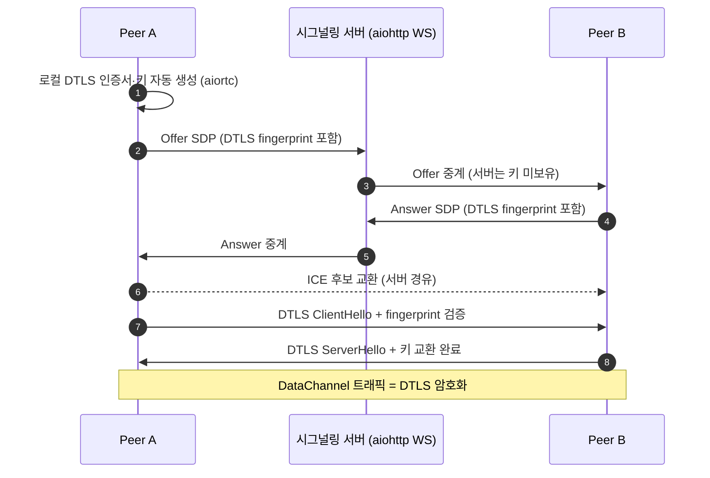
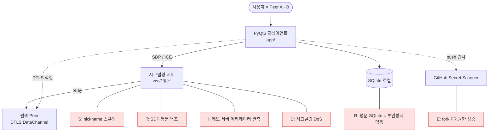

# SECURITY.md — TooTalk 보안 정책 정본

> 본 문서는 **TooTalk (코드명 `p2p_msg`) 의 보안 정책 정본**이다.
> 시그널링 서버 보안, WebRTC 자체 암호화, 자격증명 격리, GitHub secret scanner 정합, self-hosted runner 위험, 향후 E2EE 진입 요건, STRIDE 위협 모델, 보안 이슈 보고 절차, 라이선스·서드파티 의무를 한 문서에서 다룬다.
> 정본 정합: [CLAUDE_HARNESS_IMPORTANT.md](CLAUDE_HARNESS_IMPORTANT.md) · 저장소 맵: [AGENTS.md](AGENTS.md) · Phase 1 실행계획: [docs/exec-plans/active/2026-05-17-tootalk-phase1-mvp.md](docs/exec-plans/active/2026-05-17-tootalk-phase1-mvp.md)

---

## 1. 문서 목적

본 문서가 다루는 범위:

- TooTalk 가 시그널링 서버·STUN·DataChannel·로컬 SQLite·빌드 산출물·CI 러너에 걸쳐 가지는 **보안 표면(attack surface)** 식별.
- 사용자 directive (2026-05-17, §3 인용) 에 따른 **Phase 별 보안 우선순위** 명문화.
- 자격증명·token·데모 서버 비밀번호 같은 비밀정보의 **저장·격리·노출 방지 규약**.
- 보안 이슈 발견 시 **보고 채널·절차**.

다루지 않는 영역: 일반 코드 품질 ([QUALITY_SCORE.md](QUALITY_SCORE.md)), 장애·재시작 ([RELIABILITY.md](RELIABILITY.md)), 제품 우선순위 ([PRODUCT_SENSE.md](PRODUCT_SENSE.md)). 본 문서 변경 시 [AGENTS.md](AGENTS.md) §3 "문서 맵" SECURITY 행과 본 문서 `last_verified` 를 동시 갱신.

---

## 2. Phase 별 보안 모델

TooTalk 의 보안 강도는 Phase 진행과 함께 증가한다. 본 문서는 Phase 1 의 **데모 단계 deprioritized 정책** 을 명시적으로 인정한다.

| Phase | 명칭 | 보안 우선순위 | 시그널링 | 자격증명 | E2EE | 코드 서명 |
|---|---|---|---|---|---|---|
| 1 | 데모 (현재) | **최저** (directive) | `ws://` 평문 | `.env.local` 격리 | DTLS-SRTP 의존 | 미사용 |
| 2 | Hardening | 표준 | `wss://` + token | OS keychain 옵션 | Signal Protocol 검토 | Apple Dev ID / Authenticode |
| 3 | Enterprise | 강화 | mTLS + 인증서 회전 | HSM / KMS 위임 | Signal Protocol 정식 | EV + Notarization |

Phase 1 → Phase 2 진입은 §9 의 6 항목 체크리스트 전원 PASS 시에만 허용. 데모 서버(`114.207.112.73`) 는 Phase 2 진입 직후 폐기 또는 재배포 (자격증명 회전 의무).

---

## 3. 사용자 directive 명문화 (Phase 1 보안 우선순위)

본 절은 사용자가 2026-05-17 에 명시한 directive 를 보안 정책 정본 안에 인용 보존하는 부분이다. 본 directive 가 적용되는 범위는 **데모 서버 한정**이며, 클라이언트 자격증명 격리·E2EE 진입 요건·자격증명 commit 금지 같은 의무는 본 directive 와 별개로 항상 유지된다.

### 3.1 directive 원문 인용

> "데몬스트레이션용 서버 보안 우선순위 가장 낮음."
>
> — 사용자, 2026-05-17

### 3.2 directive 적용 범위

| 항목 | 적용 | 비고 |
|---|---|---|
| 데모 시그널링 서버 TLS / 인증 토큰 / rate-limit / OS hardening | 면제 | Phase 1 한정. Phase 2 진입 시 즉시 회수. |
| 클라이언트 `.env.local` 비밀 격리 | **유지** | directive 무관. |
| 데모 서버 비밀번호 / GitHub Secrets·token 의 commit 금지 | **유지** | directive 무관. |
| WebRTC DTLS-SRTP 자체 암호화 | **유지** | aiortc 기본 동작 보존. |

### 3.3 directive 가 면제하지 **않는** 항목 (재확인)

- 클라이언트가 데모 서버에 보내는 자격증명·token 의 본문 commit 노출.
- `.env.local` · `.env.telegram` 의 `.gitignore` 격리.
- GitHub Actions Secrets 의 워크플로우 출력 노출.
- self-hosted runner 의 fork PR 실행 정책 (§8).
- 데모 서버 IP 외 비밀번호·token 의 본문 노출 금지.

데모 서버 IP `114.207.112.73` 자체는 [.env.example](.env.example) `SIGNAL_SERVER_HOST` 라인을 통해 이미 공개된 값이다. 해당 서버의 **로그인 비밀번호·SSH 키·관리자 token** 은 절대 본문에 적지 않으며 `.env.local` 안에서만 보유한다.

---

## 4. WebRTC 자체 암호화 (DTLS-SRTP)

TooTalk 는 시그널링 서버를 거치지 않는 실 데이터(텍스트·이미지·파일)를 WebRTC DataChannel 직결로 운반한다. DataChannel 은 SCTP-over-DTLS 위에서 동작하며, DTLS 핸드셰이크가 transport 암호를 자동 제공한다 (aiortc DTLS 1.2 기본).

### 4.1 DTLS 키 교환 흐름

### 4.2 보안 속성 요약

| 속성 | 보장 | 근거 |
|---|---|---|
| Transport 기밀성 (서버 도청 차단) | 보장 | DTLS 종단간, 서버는 SDP·ICE 만 중계. |
| Transport 무결성 | 보장 | DTLS AEAD (AES-GCM / ChaCha20-Poly1305). |
| Peer 인증 (long-term) | 미보장 | DTLS fingerprint 는 세션 단위. long-term key 부재 → Phase 2 Signal Protocol 필요. |
| Forward Secrecy | 부분 | DTLS ECDHE 한정. Application-layer ratchet 없음. |
| 악성 시그널링 서버 MitM | **미보장** | 서버가 fingerprint 조작 시 양쪽 peer 가 다른 키로 핸드셰이크 가능. Phase 2 진입 시 SAS / fingerprint 비교 도입. |

### 4.3 Phase 1 위협 모델 가정

Phase 1 에서는 **데모 서버 운영자가 신뢰 가능**하다고 가정한다. SDP 조작 MitM 은 위협 모델에서 제외되며, 본 가정이 무너지는 시점이 Phase 2 진입 요건이다 (§9).

---

## 5. 시그널링 서버 보안

`server/signaling.py` (aiohttp WebSocket) 의 보안 정책은 Phase 에 따라 다음과 같이 분리된다.

### 5.1 Phase 1 — `ws://` 평문 (현재)

- 스킴: `ws://` (directive §3 면제). 인증: 없음 — 익명 peer 가 nickname 으로 접속.
- 라우팅: nickname 기반 broadcast / target relay. rate-limit: 없음 (TD-1 추적, [Phase 1 §8](docs/exec-plans/active/2026-05-17-tootalk-phase1-mvp.md)).
- 적합: 데모·LAN 시연·사내 발표. **부적합**: 인터넷 공개 배포, 임의 다수 접속, 비밀 채팅.

### 5.2 Phase 2 — `wss://` + 인증 토큰

- 스킴: `wss://` (Let's Encrypt 또는 사내 PKI). 인증: 첫 페어링 시 발급 **단기 token (JWT 24h)** 또는 long-term keypair 챌린지-응답.
- 라우팅: token 기반 peer ID 검증, nickname 변경은 허용하되 ID 고정. rate-limit: peer 당 분당 60, 채널 당 분당 600.
- 감사 로그: 접속/해제·핸드셰이크 실패 횟수만 보존 (메시지 내용 미보존).

### 5.3 Phase 1 → Phase 2 전환

§9 체크리스트와 동일 시점에 `ws://` → `wss://` 마이그레이션 수행. 이중 listen (`8765/ws`, `8766/wss`) 는 최대 30 일 허용.

---

## 6. 자격증명 격리 — `.env*` 와 `.gitignore`

비밀정보는 모두 `.env` 계열 파일 안에 격리하고 `.gitignore` 가 차단한다.

### 6.1 파일 분리 패턴

| 파일 | 용도 | commit |
|---|---|---|
| `.env.example` | 키 이름 + 빈 값 + 주석. 신규 개발자 참조용. | **허용** |
| `.env.local` | 실 서버 IP·로컬 DB 경로·nickname 등 머신-로컬 값. | **금지** |
| `.env.telegram` | M7 텔레그램 bot token / chat_id allowlist. | **금지** |
| `.env.signaling` (Phase 2) | 시그널링 인증 token / TLS 키 경로. | **금지** |

### 6.2 `.gitignore` 정합 (현재)

[.gitignore](.gitignore) 1~4 행이 `.env` / `.env.*` 차단 + `!.env.example` 예외. 와일드카드가 `.env.local` · `.env.telegram` · `.env.signaling` 등 모든 변형을 차단하며 예시 파일만 commit 허용.

### 6.3 로드 순서

PyQt6 클라이언트 시작 시 환경변수 병합 순서 (`app/config.py` 예정): (1) OS 환경변수 → (2) `.env.local` (개발 환경, OS 보다 우선) → (3) `.env.example` (fallback 기본값, 비밀 미포함). `.env.telegram` 은 별도 로더에서 텔레그램 hook 만 사용.

### 6.4 token 전용 파일 분리 원칙

- 한 파일 안에 **여러 서비스의 token 을 섞지 않는다**. 텔레그램 / 시그널링 / TURN credential 은 각각 별도 `.env.*` 파일. 이유: 한 파일 유출 시 피해 범위를 한 서비스로 제한.
- 신규 외부 서비스 통합 시 `.env.<service>` 파일 1 개 신설 + `.env.example` 에 키 이름만 추가.

---

## 7. GitHub Secret Scanner 정합 — 절대 commit 금지 파일 표

GitHub 는 push 시점에 secret scanner 를 자동 실행한다. 다음 표의 파일은 **단 한 번이라도 commit 에 진입하면 영구히 git history 에 노출**되므로 commit 을 어떤 상황에서도 금지한다.

| 파일 / 패턴 | 차단 방식 | 노출 시 영향 |
|---|---|---|
| `.env` / `.env.local` / `.env.telegram` / `.env.signaling`(P2) | `.gitignore` 와일드카드 | 비밀 일괄·데모 서버 비밀번호·봇 token·인증 token 노출 |
| `*.pem` / `*.key` / `*.p12` | `.gitignore` 추가 의무 | TLS / 코드 서명 키 노출 → 신원 위조 |
| `id_rsa` / `id_ed25519` | 글로벌 `.gitignore` 권장 | SSH 키 노출 → 데모 서버 접속 탈취 |
| `*.sqlite` 류 | `.gitignore` | 로컬 대화 영구 저장 노출 |
| 데모 서버 비밀번호 평문 | **본 문서 본문 절대 노출 금지** | git history 영구 박제 |
| Apple Developer ID 비밀번호 (Phase 2) | GitHub Actions Secrets 만 사용 | 코드 서명 위조 |

### 7.1 사고 대응 (실수로 commit 된 경우)

1. **즉시 회전** — token / 비밀번호 무효화 + 새 값 발급. git history 정리보다 회전이 우선.
2. **GitHub 알림 확인** — secret scanner 자동 알림 (`Security` 탭 → `Secret scanning alerts`).
3. **history rewrite** — `git filter-repo` 또는 BFG. **public repo 는 이미 fork·clone 되었을 가능성 가정**.
4. **재발 방지** — `pre-commit` hook 또는 `gitleaks` 도입 검토 (Phase 2 표준).

### 7.2 본 문서가 노출하지 않는 비밀 (재확인)

본 문서는 데모 서버 IP `114.207.112.73` 외 비밀을 본문에 적지 않는다. 데모 서버 root 비밀번호·SSH 키·관리자 token 같은 운영 비밀은 사용자 로컬 `.env.local` 안에만 존재하며 본 저장소에는 부재.

---

## 8. self-hosted Runner 보안

[AGENTS.md](AGENTS.md) §1 표 + [Phase 1 실행계획 §7 결정 로그](docs/exec-plans/active/2026-05-17-tootalk-phase1-mvp.md) 의 사용자 directive (2026-05-17) 에 따라 CI 러너는 GitHub-hosted 가 아닌 **self-hosted (macOS arm64 + Windows x64)** 만 사용한다. 이 결정은 비용·환경 통제 면의 이득이 있으나 **공개 저장소(public repo) 의 fork PR 이 실행될 위험** 을 동반한다.

### 8.1 위험 요약

- 공격 시나리오: 외부 contributor 가 악성 워크플로우 변경을 포함한 fork PR 을 열어 self-hosted 러너에서 임의 명령 실행.
- 피해 범위: 러너 머신의 파일시스템 (`.env.local` · `.ssh/` · 캐시), GitHub Actions Secrets, 호스트 네트워크 접근.

### 8.2 정책 (정본 정합)

| 규칙 | 강제 방법 |
|---|---|
| **첫 contributor PR 은 maintainer `Approve and run` 클릭** | repo → `Actions` → `Require approval for first-time contributors` |
| 워크플로우는 **fork PR 에서 secrets 미주입** | `pull_request` 이벤트에서 `secrets` 미참조. `pull_request_target` 분리 시 코드 체크아웃 차단. |
| 러너 머신 = **빌드 전용 사용자 계정** | 개인 계정·키체인 분리. keychain 에 민감 데이터 부재. |
| 작업 완료 후 **workspace 강제 정리** | workflow 마지막 step `cleanup` · self-hosted 라벨 격리. |
| 러너 등록 token 회전 | 분기당 1회 또는 사고 발생 시 즉시. |
| public repo fork PR 의 매트릭스 실행 차단 | Phase 1 동안 **모든 fork PR 이 maintainer 승인 후에만** 매트릭스 진입. |

### 8.3 Phase 2 진입 시 검토 항목

- ephemeral runner (각 job 마다 VM 폐기) 전환 · Docker/Lima/UTM 격리 · 러너 disk-level 암호화.

---

## 9. 향후 E2EE (Signal Protocol) Phase 2 진입 요건

Phase 1 의 DTLS-SRTP 는 transport 암호화만 제공하며, **application-layer end-to-end 암호화** 는 Phase 2 에서 Signal Protocol (X3DH + Double Ratchet, 통칭 Triple Ratchet 운용) 으로 추가한다. 정확한 알고리즘 명세는 [Signal Specifications](https://signal.org/docs/) 를 따른다.

### 9.1 Phase 2 진입 요건 (체크리스트 6 항목)

다음 6 항목 모두 PASS 시 Phase 2 진입 허용.

- [ ] Phase 1 MVP DoD 10 항목 ([Phase 1 §6](docs/exec-plans/active/2026-05-17-tootalk-phase1-mvp.md)) 전원 PASS.
- [ ] 데모 서버 (`114.207.112.73`) 운영 비밀번호 회전 완료 + `.env.local` 신규 값 격리 확인.
- [ ] `wss://` 전환 + Let's Encrypt 인증서 자동 갱신 워크플로우 가동.
- [ ] 사용자 long-term keypair 생성·저장 정책 결정 (OS keychain vs 파일 + 패스프레이즈).
- [ ] X3DH 키 번들 (identity / signed prekey / one-time prekey) 서버 보관 형식 결정.
- [ ] envelope schema 가 Phase 1 평문 JSON 과 호환되는 마이그레이션 경로 확보.

### 9.2 envelope 구조 변경 영향

- Phase 1: `{ "type": "text", "ts": ..., "from": ..., "body": "..." }`
- Phase 2: `{ "type": "ciphertext", "ts": ..., "from": ..., "session_id": ..., "header": {ratchet_pub, prev_chain_len, msg_num}, "body": "<base64 ciphertext>" }`
- SQLite 영구 저장은 ciphertext / plaintext 분리. 복호화 후 plaintext 는 메모리 캐시만 유지하는 선택지 존재.

### 9.3 §4 갱신 의무

Phase 2 진입과 동시에 §4 의 "악성 시그널링 서버 MitM = 미보장" 행이 "보장 (SAS 또는 long-term key fingerprint 비교)" 로 갱신되어야 한다.

---

## 9-2. 회원가입 + 이메일 OTP 인증 보안 (Phase 1 의무 — 사용자 directive 2026-05-17)

본 절은 회원가입 + 이메일 OTP 인증 관련 보안 정책. 정합 = [[project-auth-email-otp-required]] 메모리 본문.

### 9-2.1 비밀번호 저장

| 항목 | 정책 |
|---|---|
| 해시 알고리즘 | bcrypt 12 rounds 최소 (passlib) 또는 argon2id (argon2-cffi) |
| 평문 저장 | **절대 금지** — DB / 로그 / 디버그 출력 모두 |
| 송수신 | HTTPS / TLS 강제 (Phase 2 시그널링 서버 TLS 진입 후) — Phase 1 데모 단계 의 자체 책임 |
| 비밀번호 정책 | 최소 8자 + 알파벳 + 숫자 권장 (강제 X — UX 마찰) |

### 9-2.2 OTP 보안

| 항목 | 정책 |
|---|---|
| 생성 | `secrets.choice` (CSPRNG) — 6자리 숫자 |
| 만료 | **3분** (180초 — 사용자 directive 명시) |
| 저장 | 평문 OK (짧은 윈도우 + DB 격리) — 만료 후 삭제 (consumed_at + cron) |
| 입력 시도 제한 | 5회 후 30분 차단 (brute force 방어) |
| 재발송 rate-limit | 60초 1회 (DoS 방어) |
| 이메일 본문 | 코드 + 만료 시간 + 사용자 IP 마지막 octet (피싱 회피) |

### 9-2.3 SMTP 보안

| 항목 | 정책 |
|---|---|
| 서버 | 데모 서버 (`114.207.112.73`) 안 **자체 postfix** 설치 (사용자 directive 2026-05-17 "smtp 서버는 사전에 명시했던 테스트서버에 설치해") |
| TLS | 강제 (port 587 STARTTLS) + Let's Encrypt 인증서 — 평문 25 절대 금지 |
| 자격증명 | `.env.local` 격리 (`SMTP_USER=tootalk-otp@<domain>` / `SMTP_PASS=<saslpasswd2>`) — commit 절대 금지 |
| 발신 도메인 인증 | SPF TXT (ip4 + `-all`) + DKIM (opendkim RSA 2048) + DMARC TXT (`p=quarantine` → `p=reject` 점진) — 의무 |
| rDNS PTR | 114.207.112.73 → `mail.<domain>` (ISP UI 의무 — residential IP 의 PTR 설정 불가능 시 SendGrid fallback) |
| client | `aiosmtplib` async (TooTalk Python + qasync 정합) |
| fallback | SendGrid relay (free 100/day) — 자체 spam reputation 부족 시 즉시 전환 |
| Reply-To | `noreply@<tootalk-domain>` (운영 도메인 결정 후) |
| 절차 본문 | [docs/references/smtp-setup.md](docs/references/smtp-setup.md) — postfix + DKIM + DMARC 설치 13 섹션 |

### 9-2.4 아이디·비밀번호 찾기 보안

| 항목 | 정책 |
|---|---|
| email enumeration | 회피 권장 — 가입 여부 정보 누출 차단 (단 사용자 directive 의 "가입된 내역이 없습니다" 메시지 명시 = trade-off 인지) |
| reset_token | UUID4 (`secrets.token_urlsafe(32)`) — 30분 유효 + 1회 사용 (consumed_at) |
| 링크 형식 | `https://tootalk.example/reset?token=<UUID>` — query string token (URL 의 노출 위험 인지) |
| 토큰 송신 | SMTP TLS 강제 |

### 9-2.5 회원가입 의 STRIDE 위협 모델 추가

| 위협 | 영역 | 대응 |
|---|---|---|
| Spoofing | OTP 도청 → 가입 도용 | SMTP TLS + 3분 만료 |
| Tampering | OTP 변조 | DB 의 직접 비교 (단방향 검증) |
| Repudiation | 가입 부인 | created_at + verified flag + IP 로그 |
| Information disclosure | email 가입 여부 누출 | enumeration 회피 메시지 |
| DoS | OTP brute force / 재발송 폭주 | 5회 차단 + 60초 rate-limit |
| Elevation of Privilege | 미인증 사용자 권한 획득 | verified=false 의 모든 기능 차단 |

---

## 10. 위협 모델 — STRIDE

본 절은 Phase 1 데모 단계에 한정된 STRIDE 위협 모델이다. Phase 2 hardening 후에는 본 표가 통째로 재작성된다.

### 10.1 STRIDE 매핑 (Phase 1)

| ID | 카테고리 | 위협 | 자산 | 완화 (Phase 1) | 잔존 위험 |
|----|----------|------|------|-----------------|-----------|
| T1 | **S**poofing | 시그널링 nickname 자유 변경으로 다른 peer 사칭 | 채팅 신뢰성 | 없음 (directive 면제) | 데모 한정, Phase 2 token 인증으로 해소 |
| T2 | **T**ampering | 평문 `ws://` 위에서 SDP / DTLS fingerprint 변조 | DataChannel 키 합의 | 없음 (directive 면제) | Phase 2 `wss://` + SAS 검증으로 해소 |
| T3 | **R**epudiation | 로컬 SQLite 가 평문 저장 → 사용자가 자신이 보냈는지 부인 가능 | 대화 감사성 | 없음 (Phase 1 가정상 위협 외) | 단일 사용자 클라이언트 가정 |
| T4 | **I**nformation Disclosure | 데모 서버 운영자가 누가 누구와 통신하는지 메타데이터 관측 | 사용자 프라이버시 | DataChannel 본문은 DTLS 로 보호 | 메타데이터 (peer 쌍, 시각) 노출 잔존 |
| T5 | **D**enial of Service | 시그널링 서버에 대량 핸드셰이크 요청 → 정상 사용자 접속 차단 | 가용성 | OS 레벨 fail2ban 정도 | rate-limit 미적용 (Phase 2 의 TD-1) |
| T6 | **E**levation of Privilege | self-hosted runner 에서 fork PR 워크플로우가 비밀 추출 | CI Secrets · 러너 머신 | maintainer 승인 게이트 (§8) | 첫 contributor 승인 절차 누락 시 위험 |

### 10.2 위협 우선순위 (Phase 1 한정)

대응 순서: T6 > T2 > T5 > T1 > T4 > T3. T6 는 directive 면제 항목이 아니라 별도 자산(러너 머신·GitHub Secrets) 을 가지므로 최우선 처리.

---

## 11. 보안 이슈 보고 절차

본 저장소는 OSS 데모 단계 (public repo) 이지만, 보안 이슈에 대해서는 **공개 이슈 트래커가 아닌 비공개 채널** 을 우선 사용한다.

### 11.1 보고 채널 (우선순위)

1. **GitHub Security Advisory (Private)** — `Security` 탭 → `Report a vulnerability`. 본 채널 권장.
2. **저장소 owner 이메일** — `oneticket99` GitHub 프로필 또는 로컬 git config 의 사용자 이메일.
3. **공개 이슈 = 최후 수단** — 위 1·2 가 7 일 이내 무응답일 때만. **재현 절차·자격증명·내부 IP 미포함** 의무.

### 11.2 신고자 의무

- **PoC 미공개** — 패치 배포 전까지 외부 공개 금지.
- **데모 서버 라이브 공격 금지** — 시연·테스트는 `localhost:8765` 시그널링 서버에서만.
- **데이터 채집 금지** — 다른 peer 의 메시지·파일을 의도적으로 수집·보존하지 않음.

### 11.3 응답 SLA (best-effort, Phase 1 한정)

최초 응답 영업일 3 일 · 영향 평가 + 패치 일정 공유 영업일 14 일 · 패치 배포 + credit 90 일 이내.

---

## 12. 라이선스·서드파티

본 절은 라이선스 의무가 보안 정책과 교차하는 지점만 다룬다 (전체 매핑은 향후 `docs/references/` 로 분리).

### 12.1 핵심 의존성 라이선스 표

| 라이브러리 | 라이선스 | 보안 정책 관점 의무 |
|---|---|---|
| [PyQt6](https://www.riverbankcomputing.com/static/Docs/PyQt6/) | **GPL v3 / 상용 듀얼** | GPL 적용 시 zip 배포 산출물도 GPL 호환 필요. 상용 변경 시 PySide6 (LGPL) 전환 가능. |
| [aiortc](https://aiortc.readthedocs.io/) | BSD-3-Clause | CVE 모니터링 의무. |
| [PyInstaller](https://pyinstaller.org/) | GPL 예외 조항 | 부트로더가 본 저장소 코드 라이선스를 강제하지 않는 예외 보유. |
| [aiohttp](https://docs.aiohttp.org/) · [qasync](https://github.com/CabbageDevelopment/qasync) · [Pillow](https://pillow.readthedocs.io/) | Apache-2.0 · BSD-2 · HPND | minimal. Pillow 는 이미지 디코더 CVE 모니터링 의무. |

### 12.2 보안 패치 모니터링

- **aiortc / aiohttp / Pillow** 는 CVE 발생 빈도가 상대적으로 높음. Dependabot 또는 `pip-audit` 을 [.github/workflows/ci.yml](.github/workflows/ci.yml) 에 통합 (Phase 1 후반).
- **PyQt6** 는 Qt upstream CVE 추적 필요. Phase 2 진입 시 Qt LTS 채택 검토.

### 12.3 GPL 의무 ↔ 보안 정책 교차

PyQt6 GPL 의무로 인해 데모 zip 배포물도 GPL 적용 가능성. 사용자 directive (§3) 는 **데모 서버 hardening 만 면제**하며 GPL 의무 자체는 면제하지 않는다.

---

## 13. 참조

### 13.1 정본 · 맵

- [CLAUDE_HARNESS_IMPORTANT.md](CLAUDE_HARNESS_IMPORTANT.md) — Watcher 정본, M1~M7, §K 루트 동결. [AGENTS.md](AGENTS.md) — 저장소 맵, 명명 규약, 환경 변수 부록.

### 13.2 Phase 1 실행계획 · 정책

- [docs/exec-plans/active/2026-05-17-tootalk-phase1-mvp.md](docs/exec-plans/active/2026-05-17-tootalk-phase1-mvp.md) — §8 TD-1·TD-6 이 본 문서와 직결.
- [RELIABILITY.md](RELIABILITY.md) — DataChannel 오류·재연결. [QUALITY_SCORE.md](QUALITY_SCORE.md) — 보안 통과율 정량 지표.

### 13.3 외부 스펙

- [RFC 8261 — DTLS over SCTP](https://www.rfc-editor.org/rfc/rfc8261) · [RFC 8446 — TLS 1.3](https://www.rfc-editor.org/rfc/rfc8446)
- [Signal Specifications](https://signal.org/docs/) — Phase 2 X3DH + Double Ratchet.
- [STRIDE Threat Modeling](https://learn.microsoft.com/en-us/azure/security/develop/threat-modeling-tool-threats) — §10 출처.
- [GitHub Actions self-hosted runner security](https://docs.github.com/en/actions/hosting-your-own-runners/managing-self-hosted-runners/about-self-hosted-runners#self-hosted-runner-security) — §8 근거.

---

**문서 상태**: `active` · 최초 작성 2026-05-17 · 다음 검증 예정 Phase 1 M1 종료일 (2026-05-24) 또는 사용자 directive 갱신 시.
