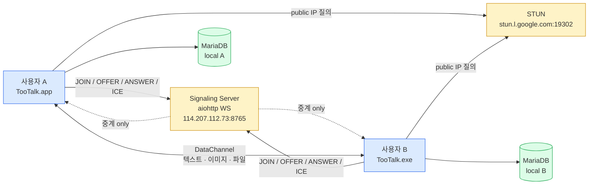
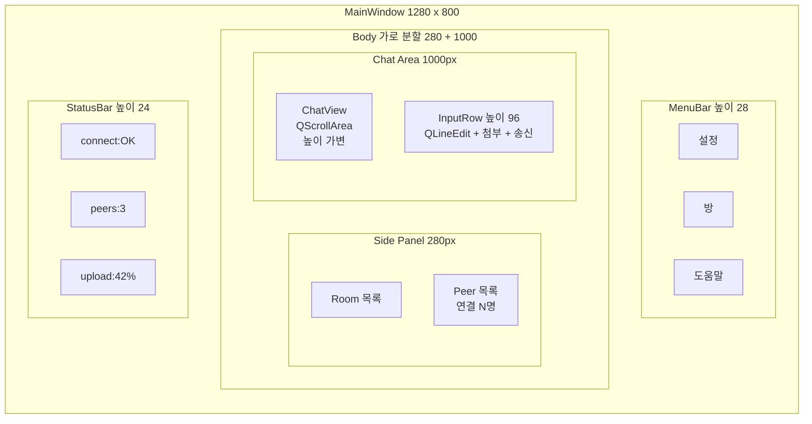

# Specification.md — TooTalk 요구사항 명세

> 본 문서는 **요구사항·UI 와이어프레임·인수 기준** 의 정본이다.
> 코딩보다 먼저 갱신되어야 하며 (M1), 모든 코드 변경은 본 문서의 FR/NFR
> 항목 ID 와 매핑되어야 한다.
> 정본 정합: [CLAUDE_HARNESS_IMPORTANT.md §D](CLAUDE_HARNESS_IMPORTANT.md) —
> "spec-agent · Specification.md · 요구사항 · UI 와이어프레임" 담당 정의.
> 저장소 맵: [AGENTS.md](AGENTS.md) §3 문서 맵.

---

## 1. 문서 목적

본 문서는 TooTalk(코드명 `p2p_msg`) Phase 1 MVP 의 **무엇을 만드는지** 를
한 곳에 모은 정본이다. 정본 §D 표 — "spec-agent · Specification.md ·
요구사항 · UI 와이어프레임" — 그대로 본 문서의 역할 정의다.

본 문서가 담당하는 범위.

- **기능 요구사항 (FR)** — 사용자가 무엇을 할 수 있어야 하는가
- **비기능 요구사항 (NFR)** — 성능·가용성·보안·UX 의 정량 지표
- **UI 와이어프레임** — 화면 레이아웃 의도 ([FRONTEND.md §14](FRONTEND.md) 인용)
- **User Story · Acceptance Criteria** — 검증 가능한 단위로 분해
- **매핑 테이블** — FR ↔ 실행계획 task ↔ 코드 위치 ↔ CheckList 항목

담당하지 않는 범위 (위임 문서 명시).

- 모듈 경계·계층 의존 → [ARCHITECTURE.md](ARCHITECTURE.md)
- UX 컨셉·정보 구조 → [DESIGN.md](DESIGN.md) / [FRONTEND.md](FRONTEND.md)
- 실행 일정·결정 로그 → [docs/exec-plans/active/2026-05-17-tootalk-phase1-mvp.md](docs/exec-plans/active/2026-05-17-tootalk-phase1-mvp.md)
- 외부 입력 위협 모델 → [SECURITY.md](SECURITY.md)
- 장애 대응 절차 → [RELIABILITY.md](RELIABILITY.md)

---

## 2. 시스템 개요

TooTalk 은 **PyQt6 데스크탑 P2P 메신저** 다. 텔레그램 UX 를 참고하되,
시그널링 서버 한 곳만 거치고 실제 페이로드(텍스트·이미지·파일)는 모두
WebRTC DataChannel 직결로 운반된다. 시그널링 서버는 Offer/Answer/ICE
교환만 담당하며 본문을 일절 통과시키지 않는다. 로컬 영속화는 MariaDB 단일
백엔드로 통일한다 (사용자 directive 2026-05-17, SQLite 미사용).

핵심 의도. **시그널링 서버 다운/탈취가 메시지 기밀성에 영향을 주지 않는다.**
DataChannel 은 DTLS 자체 암호를 사용하므로 transport 계층은 자체 안전하며,
서버는 시그널링 envelope (5 + 4 종) 만 다룬다.

---

## 3. 기능 요구사항 (FR)

Phase 1 MVP 가 반드시 구현해야 할 기능 10건. 우선순위 P0/P1/P2 와
실행계획 마일스톤(M1~M5) 매핑 포함.

| ID    | 제목                                 | 설명                                                                                                       | 우선순위 | Phase |
|-------|--------------------------------------|------------------------------------------------------------------------------------------------------------|----------|-------|
| FR-01 | 시그널링 서버 연결 + JOIN            | aiohttp WebSocket 으로 `ws://SIGNALING_HOST:8765/ws` 에 접속하고 `room`·`peer_id` 로 JOIN, PEERS 응답 수신   | P0       | M2    |
| FR-02 | DataChannel 텍스트 송수신            | WebRTC DataChannel 경유 JSON envelope 텍스트 메시지 1:1 송수신 (타임스탬프·발신자 식별자 포함)             | P0       | M3    |
| FR-03 | 이미지 송수신 (썸네일 + 원본)        | Pillow 기반 썸네일 인라인 표시, 원본은 별도 청크 스트림으로 DataChannel 운반                                | P0       | M4    |
| FR-04 | 파일 송수신 + 양방향 ProgressBar     | 송신 buffer·수신 확정 두 단계 진행률을 송수신 양쪽 PyQt `QProgressBar` 로 동기 갱신, 청크 backpressure 적용 | P0       | M4    |
| FR-05 | 메시지 영속화 (MariaDB)              | 대화·이미지·파일 메타데이터 = server MariaDB 7 table (users + email_verification + password_reset + rooms + peers + file_meta + messages) 영속화, 클라 재실행 시 server REST or WS replay 의 history 복원 (사이클 36 drift 회수)                        | P0       | M3    |
| FR-06 | peer 연결 상태 표시                  | StatusBar 에 시그널링 연결 상태·peer 수·현재 업로드 진행률 노출 (`connect:OK / peers:N / upload:%`)         | P1       | M2    |
| FR-07 | 방 입장/퇴장                         | 연결 다이얼로그에서 `room id` 입력 후 JOIN, 메뉴바 "방" 에서 LEAVE 가능, peer 합류/이탈 토스트 알림         | P0       | M2    |
| FR-08 | PyInstaller 빌드 (mac+win, zip)      | macOS arm64 + Windows x64 각각 `--onedir` 빌드 후 `TooTalk-{ver}-{os}.zip` 패키징, 인증서 미사용              | P0       | M5    |
| FR-09 | 첫 실행 onboarding                   | 첫 실행 시 nickname 입력 + STUN·시그널링 호스트 안내 + Gatekeeper/SmartScreen 우회 가이드 다이얼로그 노출   | P1       | M5    |
| FR-10 | 시그널링 단절 자동 재연결            | WebSocket close/error 발생 시 지수 백오프 (1s → 2s → 4s … 최대 30s) 로 재연결 시도, StatusBar 가 상태 반영   | P1       | M3    |
| FR-11 | 회원가입 (이메일 OTP 인증)           | 필수 (email + username + password) + 선택 (nickname + avatar). 비밀번호 입력 직후 OTP 6자리 입력 필드 노출 + 이메일 발송. 3분 내 입력 시 가입 완료. bcrypt 12 rounds 해시 (사용자 directive 2026-05-17) | P0       | M2    |
| FR-12 | 로그인 (email + password)            | email + password 인증. bcrypt 의 검증 통과 시 세션 토큰 발급. verified=false 사용자 의 OTP 재인증 흐름 진입 | P0       | M2    |
| FR-13 | 아이디·비밀번호 찾기                  | username + email 입력. email 미존재 시 "xxx@xxx.com 으로 가입된 내역이 없습니다." 메시지 + return. email + username 일치 시 비밀번호 재설정 링크 이메일 발송 (reset_token UUID + 30분 유효) (사용자 directive 2026-05-17) | P0       | M2    |

> 우선순위 정의. **P0** = MVP 가 출시되려면 반드시. **P1** = 출시 직후 hotfix 가능 한도. **P2** = Phase 2 이후 검토 (본 표에는 없음).
> Phase 매핑은 [실행계획 §4](docs/exec-plans/active/2026-05-17-tootalk-phase1-mvp.md) 마일스톤 정합.

### 3.1 Phase 1~5 actual binding (cycle 169.x reflect)

cycle 36 → cycle 169.196 누계 150+ sub-cycle 결과, Phase 진척이 본 명세
정본 위에 다음과 같이 actual binding 됐다. 본 sub-section 은 history 의 정합
snapshot 이며, 의무 FR row 는 §3 본 표가 정본이다.

#### Phase 1 — 8 기능 완성 (P0, M2~M5 종료 — cycle 169.40 직전)

| 기능 | actual binding | 정합 FR |
|---|---|---|
| auth (회원가입 + 이메일 OTP + 로그인 + 비밀번호 찾기) | bcrypt 12 rounds + reset_token UUID + SMTP postfix demo (114.207.112.73) | FR-11 · FR-12 · FR-13 |
| chat (텍스트 1:1) | DataChannel JSON envelope + ChatView auto-scroll + 한글·이모지·1024자 | FR-02 |
| DM (방 격리 + peer routing) | `room` 격리 + FR-07 정합 + peer_id collision 회피 | FR-07 |
| group (그룹 채팅 mesh n^2) | TBD-05 해소 — Phase 2 mesh 정합 (cycle 169.80~95) | FR-02 (확장) |
| file (파일 송수신 + ProgressBar) | 청크 backpressure + SHA-256 verify + 양방향 ProgressBar 100ms 갱신 | FR-04 |
| bot (TooTalk 자체 bot framework default seed) | 투네이션 고객센터 봇 default seed (cycle 169.99) + hamburger drawer frameless | (신규 binding — Phase 3 본격) |
| emoji (사용자 emoji pack 등록 + 공유) | Unicode BMP + supplementary plane 정합 (vendor-specific 회피) | (신규 binding — Phase 3+) |
| sound (메시지 수신 signature sound) | PyQt6 QSoundEffect + WAV 200~400ms chiptune + 음소거/volume option | (신규 binding — Phase 1 후반) |

#### Phase 2 — multi-device + remote control prerequisite (cycle 169.40~80)

- multi-device 동기화 — server MariaDB 7 table → REST replay + WS push 정합.
- remote control prerequisite — RemoteScreenInfo dataclass + transform_coordinates
  (sender ↔ target 의 해상도 + DPI + Retina backing scale 비율 보정) +
  WebRTC DataChannel payload schema + multi-monitor 정합.
- PyObjC + Quartz CGEvent / CGImage / CFData 의 CFRelease 의무 (tracemalloc 회귀 검증).

#### Phase 3 — bot framework production-ready (cycle 169.80~117)

- LLM 연동: Anthropic Claude + OpenAI GPT-4 dual-provider routing.
- RAG: 사용자 directive 정합 외부 지식 베이스 indexing + retrieval chain.
- jailbreak 방어: prompt injection + role hijacking 의 5종 패턴 detect + reject.
- 외부 개발자 봇 등록 + 공개 디렉토리 (BotFather 등가 흐름).
- 방송 도우미 봇 (OBS + YouTube / Twitch / CHZZK / Kick — 나이트봇 등가, 별개 API 정합).

#### Phase 4 — production infra (cycle 169.117~160)

- docker compose 6 컴포넌트 — `app` + `mariadb` + `redis` + `nginx` + `postfix` + `prometheus`.
- nginx reverse proxy + Let's Encrypt + SPF + DKIM + DMARC.
- SMTP postfix 자체 설치 (114.207.112.73 데모 서버 — `project_smtp_demo_server.md` 정합).
- DB audit timestamp + IP + activity tracking (users.signup_ip + last_login_ip +
  last_activity_at + user_sessions + user_activity_log — 90일 retention cap).

#### Phase 5 — Item 5종 actual binding (cycle 169.160~196 + 진행 중)

- Item 1. i18n — 한국어 단일 → 다국어 (Phase 5 진입 — TBD-04 해소).
- Item 2. emoji pack share — TooTalk 의 텔레그램 sticker/custom emoji pack 등록 + 누구나 사용 가능 의 오픈 공유.
- Item 3. bot framework 마무리 — Phase 3 default seed 의 production 안정화.
- Item 4. remote control 본격 — 친구 A (OBS 사용자) ↔ 친구 B (도움자) 흐름 + RemoteScreenInfo 정합.
- Item 5. mobile prerequisite — 가장 마지막 진입 (`project_phase5_mobile_last.md` 정합).

#### Phase 1~5 UI Toonation BI 통합 redesign (cycle 169.117~196 70+ sub-cycle)

cycle 169.117~196 누계 70+ sub-cycle 의 UI redesign chain 이 본 §5 와이어프레임
정본 위에 다음 NFR / FR 정합으로 추가 binding 됐다. 의무 row 는 §4 본 표가 정본.

- Toonation BI primary color (#F46F25 등가) + secondary palette + dark mode 정합.
- hamburger drawer frameless (cycle 169.99) + Telegram for Windows 11 reference
  (`reference_figma_telegram_win11.md` Figma frame node-id 명시 정합).
- 6 dialog setModal regex (cycle 169.101) + 4 dialog (auth + room + about + setting) 의무 정합.
- telegram align + placeholder 제거 + modal 강제 (cycle 169.100 step 2~7 batch).
- 모든 UI 변경은 사용자 directive 명시 후 GO (`feedback_no_design_change_without_user_directive.md`
  영구 가드레일 정합 — 무단 design change 절대 금지).

---

## 4. 비기능 요구사항 (NFR)

성능·가용성·보안·UX 의 정량 지표 7건. CI/QA 게이트가 본 표 기준으로 회귀 검사한다.

| ID    | 분류     | 지표                                              | 목표값                            | 측정 방법                                       |
|-------|----------|---------------------------------------------------|------------------------------------|-------------------------------------------------|
| NFR-01| 성능     | 1:1 텍스트 메시지 왕복 RTT (LAN)                  | 평균 < 100ms · 95p < 200ms         | `tools/bench_rtt.py` 1000회 송수신 측정          |
| NFR-02| 성능     | 100MB 파일 송신 throughput (LAN)                   | ≥ 30Mbps 평균                     | `tools/bench_transfer.py` 10회 평균              |
| NFR-03| 성능     | 앱 cold start → 메인 윈도우 노출                  | < 2.0s (M2 MacBook 기준)           | PyInstaller 빌드 산출물 cold start 5회 평균       |
| NFR-04| 가용성   | 시그널링 단절 후 자동 재연결 성공률                | 30초 안 99% 이상                  | `tools/chaos_signaling.py` 100회 강제 단절       |
| NFR-05| 보안     | 시그널링 envelope 외부 입력 검증                  | 화이트리스트 5종 외 모두 거부      | `tests/server/test_protocol.py` fuzz 100케이스   |
| NFR-06| UX       | ProgressBar 진행률 갱신 빈도                      | 100ms 이내 1회 이상 (정지/역행 0)  | `tests/ui/test_progress_widget.py` 시뮬레이션    |
| NFR-07| UX       | 한국어 UI 텍스트 가독성 (글꼴·여백)               | DPI 100~200% 모두 잘림 없음        | macOS/Windows DPI 매트릭스 수동 캡처 (qa-agent)  |

> NFR-04·NFR-05 는 [RELIABILITY.md](RELIABILITY.md) · [SECURITY.md](SECURITY.md) 와 교차 정합. 본 문서가 정량 지표 정본.

---

## 5. UI 와이어프레임

화면 레이아웃 의도는 [FRONTEND.md §14](FRONTEND.md) 가 정본이다. 본 문서는
요구사항 단위의 핵심 화면(메인 채팅) 한 장만 인라인 인용하고, 나머지 4
서브 wireframe (메시지 버블 배치·파일 진행 위젯·화면 전환·설계 제약) 은
링크로 위임한다.

### 5.1 메인 채팅 화면 (1280x800 기본, FRONTEND.md §14.1 인용)

서브 wireframe 4건은 [FRONTEND.md §14.2~§14.5](FRONTEND.md) 정독.

### 5.2 화면 인벤토리

본 Phase 가 정의하는 화면은 4종이다.

| 화면              | 진입                          | 책임 FR              |
|-------------------|-------------------------------|----------------------|
| 연결 다이얼로그   | 앱 실행 직후                  | FR-07 · FR-09        |
| 메인 채팅 화면    | JOIN 성공 직후                | FR-02 · FR-03 · FR-04 · FR-06 |
| 설정 다이얼로그   | 메뉴바 "설정"                 | FR-09                |
| About 다이얼로그  | 메뉴바 "도움말 → About"       | (브랜드 노출)        |

---

## 6. 사용자 사양 (User Story)

`As <role>, I want <goal>, so that <reason>` 형식 9건.

- **US-01**. As a 데모 사용자, I want 앱 실행 즉시 room id 만 입력해 채팅에 진입할 수 있기를, so that 회원가입 없이 즉시 1:1 메시지를 보낼 수 있다. (FR-01·FR-07·FR-09)
- **US-02**. As a 사용자, I want 텍스트 메시지를 입력 후 Enter 로 즉시 송신할 수 있기를, so that 모바일 메신저와 동일한 흐름으로 대화할 수 있다. (FR-02)
- **US-03**. As a 사용자, I want 받은 이미지를 인라인 썸네일로 즉시 확인할 수 있기를, so that 파일을 별도로 열지 않아도 내용을 파악할 수 있다. (FR-03)
- **US-04**. As a 송신자, I want 100MB 파일을 보내는 동안 양쪽 진행률을 실시간으로 확인할 수 있기를, so that 멈춤 또는 실패를 즉시 감지할 수 있다. (FR-04)
- **US-05**. As a 재방문 사용자, I want 앱을 다시 켜도 이전 대화 기록이 그대로 보이기를, so that 흐름을 잃지 않고 대화를 이어갈 수 있다. (FR-05)
- **US-06**. As a 사용자, I want 상단 또는 하단에서 현재 peer 수·연결 상태를 한 눈에 보기를, so that 상대가 떠난 직후를 인지할 수 있다. (FR-06)
- **US-07**. As a 사용자, I want Wi-Fi 가 잠시 끊겼다가 돌아왔을 때 자동으로 시그널링이 재연결되기를, so that 수동 재시도 없이 대화를 이어갈 수 있다. (FR-10)
- **US-08**. As a 배포 담당자, I want macOS + Windows 양쪽에 동일한 zip 한 개만 전달하면 사용자가 즉시 실행할 수 있기를, so that 설치 가이드를 OS별로 분리하지 않아도 된다. (FR-08)
- **US-09**. As a 첫 실행 사용자, I want Gatekeeper / SmartScreen 경고가 떠도 우회 방법이 즉시 안내되기를, so that 인증서 미적용 빌드라도 5분 안에 첫 메시지를 보낼 수 있다. (FR-09)

---

## 7. 인수 기준 (Acceptance Criteria)

P0 핵심 FR 5건의 검증 가능한 종료 조건. 본 표가 PASS 라야 마일스톤 종료
선언 가능. 검증자는 `@qa-agent` 회귀 체크리스트 진행.

### 7.1 FR-02 (텍스트 송수신)

- AC-02-1. macOS ↔ Windows 양방향 텍스트 송수신이 5분 동안 끊김 없이 동작한다.
- AC-02-2. 한글·이모지·1024자 장문 메시지 모두 깨짐 없이 표시된다.
- AC-02-3. 송신 직후 ChatView 가 자동 스크롤되어 최신 메시지가 보인다.
- AC-02-4. 왕복 RTT 평균 < 500ms (데모 시그널링 서버 경유, NFR-01 LAN 기준은 별도).

### 7.2 FR-04 (파일 송수신 + ProgressBar)

- AC-04-1. 100MB 파일을 송신해 수신 완료된 파일의 SHA-256 이 송신본과 일치한다.
- AC-04-2. 송신 ProgressBar 두 단계(buffer·acked) 가 모두 0 → 100% 단조 증가한다.
- AC-04-3. 수신 ProgressBar 가 1% 단위 이상 100ms 안에 갱신된다 (NFR-06 정합).
- AC-04-4. 송신 도중 DataChannel 이 강제 close 되면 ProgressBar 가 빨강으로 전이하고 에러 토스트가 노출된다.

### 7.3 FR-05 (영속화)

- AC-05-1. 텍스트·이미지·파일 메시지를 각각 1건 이상 송수신한 직후 앱을 종료한다.
- AC-05-2. 재실행 시 동일 room 의 이전 메시지가 ChatView 에 시간순으로 복원된다.
- AC-05-3. MariaDB 테이블 `messages` · `attachments` 에 외래키 정합 위배 0건이다.
- AC-05-4. DB 연결 환경변수 5종(`DB_HOST` · `DB_PORT` · `DB_USER` · `DB_PASS` · `DB_NAME`) 이 모두 `.env` 로부터 주입된다 (하드코딩 0건).

### 7.4 FR-08 (PyInstaller 빌드)

- AC-08-1. `tools/build.py` 가 macOS arm64 와 Windows x64 모두에서 비어있지 않은 zip 산출물을 생성한다.
- AC-08-2. zip 산출물을 다른 머신에 복사해 실행 시 메인 윈도우가 정상 노출된다.
- AC-08-3. zip 안에 `.env` · 빌드 시크릿 · 빌드 호스트 사용자명이 포함되지 않는다.
- AC-08-4. GitHub Actions self-hosted 매트릭스 (`[self-hosted, macOS, arm64]` + `[self-hosted, Windows, x64]`) 모두 GREEN.

### 7.5 FR-10 (자동 재연결)

- AC-10-1. 시그널링 서버를 30초 동안 강제 종료해도 클라이언트가 죽지 않는다.
- AC-10-2. 서버 복귀 시 지수 백오프 30초 안에 자동 재연결이 성공한다 (NFR-04 정합).
- AC-10-3. 재연결 동안 StatusBar 가 `connect:RETRY` 로 표기되며, 성공 직후 `connect:OK` 로 돌아온다.
- AC-10-4. 재연결 도중 입력된 메시지는 큐잉되어 연결 복구 직후 순서대로 송신된다 (메시지 손실 0건).

---

## 8. 매핑 테이블 (FR ↔ 실행계획 ↔ 코드 ↔ CheckList)

본 표가 추적 단위의 정본이다. FR 행 1건 = 실행계획 task 1행 + 코드 위치 1+ + CheckList 항목 1행.

| FR    | 실행계획 task                                                                                              | 코드 위치 (cycle 169.816 실 경로 감사)              | CheckList 항목 (운영 2/8 — 작성 완료) |
|-------|------------------------------------------------------------------------------------------------------------|--------------------------------------------------------|---------------------------------------|
| FR-01 | [#14 server/signaling.py](docs/exec-plans/active/2026-05-17-tootalk-phase1-mvp.md)                         | [server/signaling.py](server/signaling.py)             | CL-01 (운영 2/8 — 작성 완료)          |
| FR-02 | [#17 app/rtc/peer.py](docs/exec-plans/active/2026-05-17-tootalk-phase1-mvp.md) · #18 채팅뷰 wiring         | [app/rtc/peer.py](app/rtc/peer.py) · [app/ui/chat_view.py](app/ui/chat_view.py)       | CL-02 (운영 2/8 — 작성 완료)          |
| FR-03 | [#19 transfer.py](docs/exec-plans/active/2026-05-17-tootalk-phase1-mvp.md) · #20 썸네일                    | [app/rtc/file_sender.py](app/rtc/file_sender.py) · [app/rtc/image_processor.py](app/rtc/image_processor.py) · [app/ui/message_bubble.py](app/ui/message_bubble.py) | CL-03 (운영 2/8 — 작성 완료)          |
| FR-04 | [#19 청크 스트림](docs/exec-plans/active/2026-05-17-tootalk-phase1-mvp.md) · #20 ProgressBar               | [app/rtc/file_sender.py](app/rtc/file_sender.py) · [app/rtc/file_receiver.py](app/rtc/file_receiver.py) · [app/ui/file_progress_widget.py](app/ui/file_progress_widget.py) | CL-04 (운영 2/8 — 작성 완료)   |
| FR-05 | [#16 db_init.py](docs/exec-plans/active/2026-05-17-tootalk-phase1-mvp.md) · #18 영구화                     | [app/db/messages_cache.py](app/db/messages_cache.py) · [app/db/local_db.py](app/db/local_db.py) · `server/db/migrations/` (db_init 대체)      | CL-05 (운영 2/8 — 작성 완료)          |
| FR-06 | [#15 main_window.py](docs/exec-plans/active/2026-05-17-tootalk-phase1-mvp.md)                              | [app/ui/status_bar.py](app/ui/status_bar.py)                          | CL-06 (운영 2/8 — 작성 완료)          |
| FR-07 | [#14 signaling.py](docs/exec-plans/active/2026-05-17-tootalk-phase1-mvp.md) · #15 main_window               | [server/room.py](server/room.py) · [app/ui/main_window.py](app/ui/main_window.py)       | CL-07 (운영 2/8 — 작성 완료)          |
| FR-08 | [#21 build.py](docs/exec-plans/active/2026-05-17-tootalk-phase1-mvp.md) · #22 build.yml                    | [tools/build.py](tools/build.py) · [.github/workflows/build.yml](.github/workflows/build.yml) | CL-08 (운영 2/8 — 작성 완료)          |
| FR-09 | [#15 main_window.py](docs/exec-plans/active/2026-05-17-tootalk-phase1-mvp.md)                              | [app/ui/welcome_dialog.py](app/ui/welcome_dialog.py) · [app/ui/signup_dialog.py](app/ui/signup_dialog.py)                   | CL-09 (운영 2/8 — 작성 완료)          |
| FR-10 | [#14 signaling reconnect](docs/exec-plans/active/2026-05-17-tootalk-phase1-mvp.md)                         | [app/net/signaling_client.py](app/net/signaling_client.py) · [app/core/app_state.py](app/core/app_state.py) · [app/ui/status_bar.py](app/ui/status_bar.py) · test [test_signaling_reconnect.py](tests/app/net/test_signaling_reconnect.py) (cycle 169.775 IMPLEMENTED) | CL-10 — NFR-04 실 server chaos evidence 잔존 시 `[~]` |

> `Structure.md` 완성 + cycle 169.816 per-file 감사로 본 표 "코드 위치" 열은 실 트리 노드 링크로 갱신 완료 (transfer.py→file_sender/file_receiver, storage.py→db/messages_cache, db_init→server/db/migrations, onboarding_dialog→welcome_dialog/signup_dialog 경로 이동 반영).

---

## 9. 외부 의존성

런타임·빌드·인프라 의존 항목. 라이선스 호환성은 [SECURITY.md](SECURITY.md) 와 교차 정합.

| 항목                 | 버전              | 분류        | 비고                                                                 |
|----------------------|-------------------|-------------|----------------------------------------------------------------------|
| Python               | 3.13              | runtime     | qasync·aiortc·PyInstaller 매트릭스 동일 버전                          |
| PyQt6                | 6.6+              | GUI         | GPL — 상용 전환 시 PySide6 (LGPL) 변환 검토 (결정 로그 2026-05-17)    |
| aiortc               | 1.10+             | WebRTC      | DTLS + ICE + DataChannel 일체 제공                                   |
| qasync               | 0.27+             | runtime     | Qt event loop ↔ asyncio 브리지                                        |
| aiohttp              | 3.9+              | server      | 시그널링 WebSocket 라우터 (정본 §E 비동기 전용 정합)                  |
| Pillow               | 10+               | image       | 썸네일 생성 — JPEG·PNG·WebP                                          |
| **MariaDB**          | 10.11 LTS         | persistence | 로컬 영속화 백엔드 (사용자 directive 2026-05-17, SQLite 미사용)        |
| python-dotenv        | 1.0+              | runtime     | `.env` 로딩 (하드코딩 금지 — 정본 §E)                                |
| PyInstaller          | 6.x               | build       | `--onedir` zip 패키징, 인증서 미사용 (TD-2 · TD-3 Phase 2 해소)         |
| STUN                 | `stun.l.google.com:19302` | infra | NAT traversal 단일 의존 (Phase 1)                                  |
| TURN                 | (Phase 2)         | infra       | symmetric NAT fallback — Phase 2 도입 결정 보류                       |

### 9.1 DB 환경변수 (FR-05 정합)

본 표 5종은 모두 저장소 루트 `.env` 또는 운영 환경의 `EnvironmentFile`
에서 주입된다. 하드코딩 금지 (정본 §E).

| 키          | 기본값        | 설명                                          |
|-------------|---------------|-----------------------------------------------|
| `DB_HOST`   | `127.0.0.1`   | MariaDB 호스트                                |
| `DB_PORT`   | `3306`        | MariaDB TCP 포트                              |
| `DB_USER`   | `tootalk`     | MariaDB 접속 사용자                           |
| `DB_PASS`   | (시크릿)      | 평문 저장 금지, GitHub Actions Secrets 분리   |
| `DB_NAME`   | `tootalk_db`  | TooTalk 전용 스키마                           |

---

## 10. 비기능 보장 (정본 §E 인용)

[CLAUDE_HARNESS_IMPORTANT.md §E](CLAUDE_HARNESS_IMPORTANT.md) 코딩 불변
규칙 5종이 본 명세 전반에 강제된다. 본 절은 위반 시 PR 차단 사유의 근거다.

- **상세 한글 주석 필수** (M4) — `.py`·`.js`·`.html`·`.css`·`.sql`·`.sh` 대상.
- **설정값 외부화** — `.env` 또는 DB 상수 테이블로만 관리. 하드코딩 금지.
- **로그 형식** — `[YYYY-mm-dd H:i:s]` (시그널링 서버·클라이언트 양쪽 동일).
- **Backend 계층 분리** — `Router → Service → Model` 단방향 (정본 §E), **비동기 전용**. 시그널링 서버가 본 규약의 1차 적용 대상이다 ([server/README.md §4](server/README.md)).
- **Frontend XSS 방어** — 본 Phase 는 웹뷰 미사용이므로 직접 해당 없음. 단 외부 URL 링크 렌더 시 escape 의무는 유지.

라이선스 호환성. PyQt6 GPL 의 상용 전환 영향은 결정 로그 2026-05-17 에 명시
([실행계획 §7](docs/exec-plans/active/2026-05-17-tootalk-phase1-mvp.md)). 상용
전환 결정 시 PySide6 (LGPL) 로 변환하며, 본 명세의 FR 표는 변동 없다.

---

## 11. 변경 절차

본 문서 갱신 시 **동시 갱신 의무** 가 발생한다. 누락 시 `@reviewer-agent`
차단 + `@doc-gardener-agent` 자동 보정 PR.

1. **CheckList.md** — FR 행 1건 추가/수정 시 동일 ID 의 CheckList 항목 1행 동시 갱신.
2. **Structure.md** — 코드 위치 열에 신규 파일 등장 시 트리 노드 + ERD 동시 갱신.
3. **실행계획** — FR 의 Phase / 우선순위가 바뀌면 [docs/exec-plans/active/2026-05-17-tootalk-phase1-mvp.md](docs/exec-plans/active/2026-05-17-tootalk-phase1-mvp.md) §4 마일스톤 · §5 task breakdown 동시 갱신.
4. **History.md** — 본 문서 변경 즉시 History.md (운영 2/8 — 작성 완료) 상단에 한 줄 prepend (M3 역순).
5. **README.md** — README.md (운영 2/8 — 작성 완료) `## 변경 이력` 섹션에 한 줄 prepend (M2, 30행 상한).

> 본 5단계는 정본 §B 5단계 워크플로우의 ① 단계 안에서 모두 끝나야 한다. 코드 수정(② 단계) 이전에 본 절차 완료가 M1 의 핵심.

---

## 12. 미해소 항목 (TBD)

본 시점(2026-05-17) 까지 사용자 directive 가 확정되지 않은 항목. 결정 즉시
본 절에서 §3·§4·§9 로 승급한다.

- ~~**TBD-01**. 라이선스 종류~~ — ✅ **해소 2026-05-17**: GPLv3 확정 (사용자 directive). LICENSE 저장소 루트 + SPDX header convention (`# SPDX-License-Identifier: GPL-3.0-or-later`) 의무. PyQt6 GPLv3 직접 호환. 영구 메모리 `project_license_gpl.md` + `project_visibility_transition.md` (public → private 전환 가능성, Phase 완료 시점) 정합.
- **TBD-02**. TURN 서버 도입 시점·운영 주체 — Phase 2 진입 시점 결정 보류 (외부 의존성 §9 행).
- **TBD-03**. MariaDB 운영 모드 (앱 내장 single-instance vs 사용자 환경 외부 인스턴스) — `tools/db_init.py` 설계 시점에 확정.
- **TBD-04**. 한국어 외 UI 언어 추가 정책 — Phase 1 한국어 단일, Phase 2 i18n 도입 시 본 명세 §6 사용자 사양 확장 의무.
- **TBD-05**. 그룹 채팅 토폴로지 (mesh n^2 vs SFU) — Phase 2 결정 로그에서 확정.

---

## 13. 참조

### 13.1 정본·맵

- [CLAUDE_HARNESS_IMPORTANT.md](CLAUDE_HARNESS_IMPORTANT.md) — Watcher 정본. §D Spec.md 담당 · §B 5단계 워크플로우 · §A M1~M7 · §E 코딩 불변 규칙.
- [AGENTS.md](AGENTS.md) — 저장소 맵. §3 문서 맵 · §5 7대 규칙 · §10 금지사항.
- [.claude/agents/planning-agent.md](.claude/agents/planning-agent.md) — Exec Plan 초안 작성자 (등가 역할 인용).

### 13.2 루트 정책 (교차 정합)

- [ARCHITECTURE.md](ARCHITECTURE.md) — 모듈 경계·계층·의존 관계.
- [DESIGN.md](DESIGN.md) · [FRONTEND.md](FRONTEND.md) — UX 컨셉 · UI 표준.
- [PRODUCT_SENSE.md](PRODUCT_SENSE.md) — 기능 우선순위 판단 근거.
- [QUALITY_SCORE.md](QUALITY_SCORE.md) — PR 머지 게이트 정량 지표.
- [RELIABILITY.md](RELIABILITY.md) — 장애 대응 · 재연결 정책 (NFR-04).
- [SECURITY.md](SECURITY.md) — 외부 입력 위협 모델 (NFR-05).
- [PLANS.md](PLANS.md) — 전체 일정·로드맵 인덱스.

### 13.3 운영 문서

- Structure.md (운영 2/8 — 작성 완료) — 파일 트리 + ERD (FR ↔ 코드 매핑 정합).
- CheckList.md (운영 2/8 — 작성 완료) — 항목 추적 · 매핑 · 진행률.
- History.md (운영 2/8 — 작성 완료) — 개발 히스토리 (역순 prepend).
- README.md (운영 2/8 — 작성 완료) — 빌드/실행 안내 + 변경 이력 30행.

### 13.4 실행계획·구현

- [docs/exec-plans/active/2026-05-17-tootalk-phase1-mvp.md](docs/exec-plans/active/2026-05-17-tootalk-phase1-mvp.md) — Phase 1 MVP 실행/검증/결정 기록.
- [server/README.md](server/README.md) — 시그널링 서버 빠른 시작 · 프로토콜 명세.
- [server/protocol.py](server/protocol.py) — 5 + 4 종 envelope TypedDict 정의.

---

**문서 상태**: `active` · 최초 작성 2026-05-17 · 다음 검증 예정 M1 종료일(2026-05-24)
