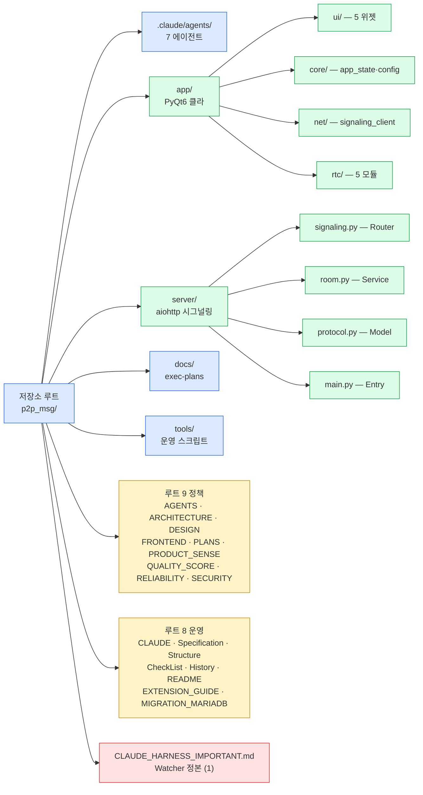
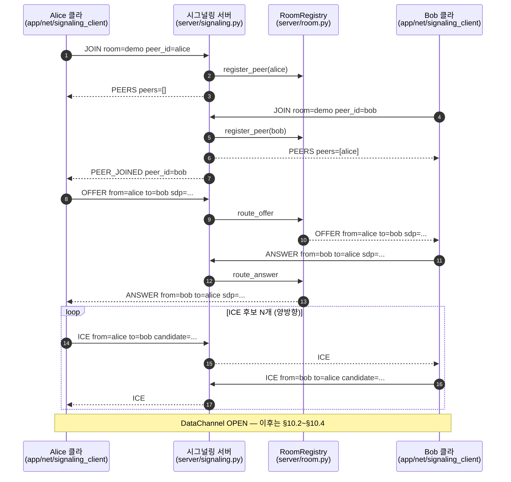
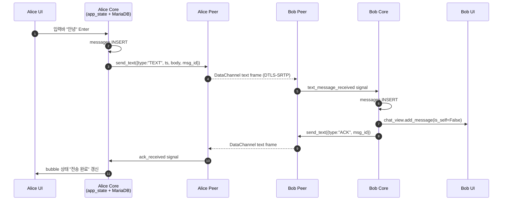
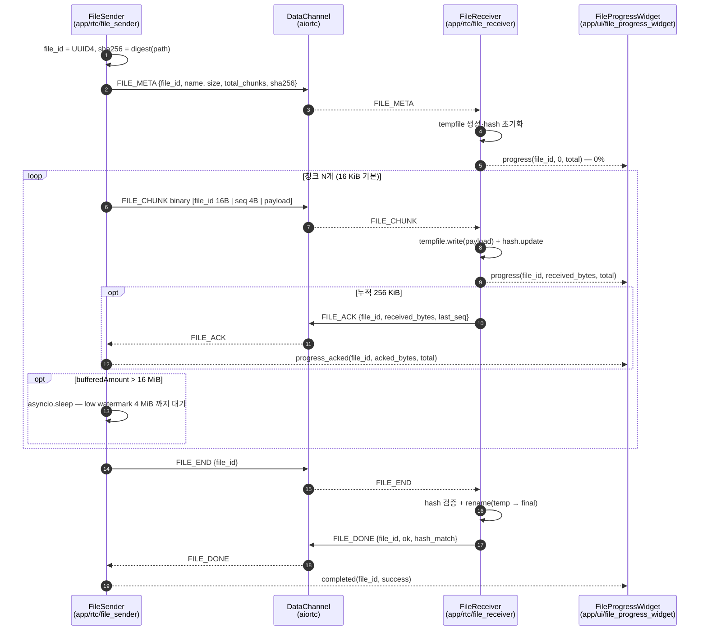
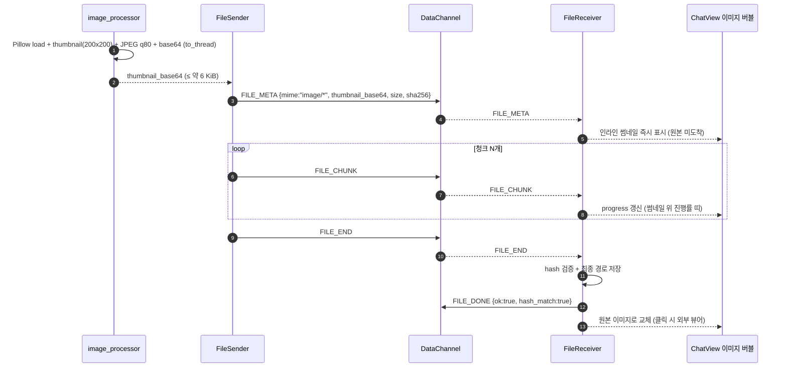
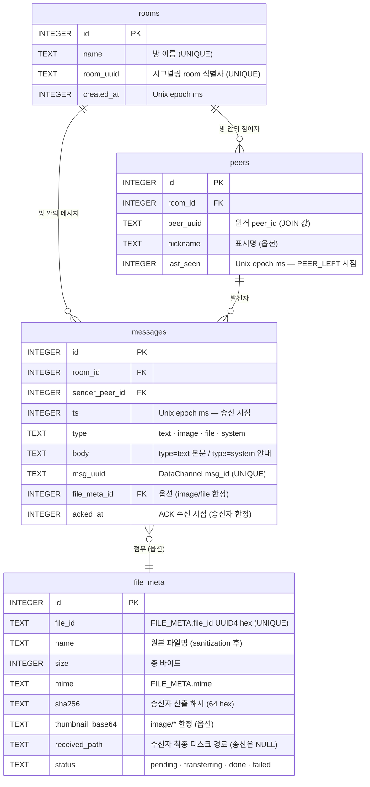

# Structure.md — TooTalk(p2p_msg) 저장소 구조

> 본 문서는 TooTalk(코드명 `p2p_msg`) 저장소의 **파일 트리 · 모듈 책임 · 데이터 흐름 · ERD** 를 한 곳에 모은 운영 문서다.
> 신규 파일·DB 테이블·메시지 흐름이 추가되거나 변경되면 본 문서를 먼저 갱신한 뒤 코드 작업을 진행한다 (M1 — Document First).
> 정본 정합: [CLAUDE_HARNESS_IMPORTANT.md](CLAUDE_HARNESS_IMPORTANT.md) §D (Doc Gardener 담당 매핑 · `@structure-agent`) · §E (Router → Service → Model 계층) · §K (루트 18 동결).
> 저장소 맵: [AGENTS.md](AGENTS.md) · 아키텍처: [ARCHITECTURE.md](ARCHITECTURE.md).

---

## 1. 문서 목적

본 문서는 (1) **어디에 무엇이 있는가** (파일 트리), (2) **각 파일이 무엇을 하는가** (1~3행 책임 표), (3) **어떻게 데이터가 흐르는가** (mermaid 순서도 4종), (4) **로컬 DB 가 어떻게 생겼는가** (mermaid ERD) 4가지에 한 번에 답한다.

본 문서는 저장소 단일 진실 공급원이며 `@structure-agent` 가 매 PR 단계에서 실제 트리와의 정합성을 검증한다 ([정본 §D](CLAUDE_HARNESS_IMPORTANT.md)). 코드 영역 새 파일 추가 시 §3 트리·§4~§9 표·필요 시 §10 흐름도·§11 ERD 가 동시에 갱신되어야 한다. 본 문서가 다루지 않는 것: 정책 결정 (→ 9 정책 문서), 작업 계획 (→ [PLANS.md](PLANS.md)), 변경 이력 (→ `README.md` · `History.md` — 작성 예정).

---

## 2. 트리 시각 인덱스 (mermaid)

저장소 1-depth 디렉토리·루트 문서 그룹의 관계를 한 장으로. 실제 파일 트리는 §3 에서 나열.



---

## 3. 저장소 파일 트리 (실제 ls 기반, 2026-05-17 시점)

본 트리는 `__pycache__` · `.git` · `.venv` 를 제외한 모든 추적 대상 파일을 포함한다. 깊이 4 이상까지 전개. 본 트리에 등재되지 않은 파일이 생기는 즉시 본 문서를 갱신한다.

```text
p2p_msg/
├── .claude/
│   └── agents/
│       ├── doc-gardener-agent.md
│       ├── history-agent.md
│       ├── observability-agent.md
│       ├── planning-agent.md
│       ├── qa-agent.md
│       ├── release-agent.md
│       └── reviewer-agent.md
├── .env.example
├── .env.local
├── .env.telegram
├── .gitignore
├── .markdownlint.json
├── AGENTS.md
├── ARCHITECTURE.md
├── CLAUDE_HARNESS_IMPORTANT.md
├── DESIGN.md
├── FRONTEND.md
├── PLANS.md
├── PRODUCT_SENSE.md
├── QUALITY_SCORE.md
├── RELIABILITY.md
├── SECURITY.md
├── Structure.md                       (본 문서 — 신설)
├── app/
│   ├── __init__.py
│   ├── README.md
│   ├── main.py
│   ├── requirements.txt
│   ├── core/
│   │   ├── __init__.py
│   │   ├── app_state.py
│   │   ├── config.py
│   │   └── security.py            # 사이클 18 — PBKDF2-SHA256 + OTP + session token
│   ├── crypto/                    # 사이클 27~46 — Phase 2 E2EE Signal Protocol
│   │   ├── __init__.py
│   │   ├── device_registry.py     # 사이클 42 — multi-device 식별 (X25519 32B)
│   │   ├── double_ratchet.py      # KDF chain (0x01 message + 0x02 chain)
│   │   ├── e2ee.py                # AES-256-GCM + X25519 + HKDF
│   │   ├── fan_out.py             # 사이클 44 — N device fan-out + 격리
│   │   ├── sender_keys.py         # 사이클 46 — 그룹 N×M → N+M reduction
│   │   ├── session.py             # SessionState + DH ratchet + skip helper
│   │   ├── skipped_keys.py        # LRU+TTL out-of-order delivery
│   │   └── x3dh.py                # 사이클 37 — X3DH initial key agreement
│   ├── notifications/             # 사이클 47 — Phase 2 push 알림 skeleton
│   │   ├── __init__.py
│   │   └── push.py                # 4 platform (APNS/FCM/SILENT/PULL) + silent/visible
│   ├── backup/                    # 사이클 48 — Phase 2 encrypted backup/restore
│   │   ├── __init__.py
│   │   └── encrypted_backup.py    # PBKDF2 600K + AES-GCM + wire format bytes
│   ├── remote/                    # 사이클 55~58 — Phase 3 entry 원격 데스크탑 skeleton
│   │   ├── __init__.py
│   │   ├── permission.py          # Pattern A (도움-mode) + Pattern B (제어-mode)
│   │   ├── protocol.py            # RemoteFrame + RemoteInput + RemoteSession
│   │   ├── capture.py             # 사이클 57 — Capture Backend + Mock + Quartz placeholder
│   │   └── input_forward.py       # 사이클 58 — Input Forward Backend + Mock + CGEvent placeholder
│   ├── bot/                       # 사이클 65~67 — Phase 3 bot framework
│   │   ├── __init__.py
│   │   ├── llm_proxy.py           # 사이클 65 — BotMessage + LLMProvider + Mock + Anthropic placeholder + RateLimitGate
│   │   ├── customer_service_bot.py  # 사이클 66 — default 투네이션 고객센터 봇 + system prompt + history cap
│   │   └── streaming_helper.py    # 사이클 67 — 방송 도우미 봇 별개 API (YT/Twitch/CHZZK/Kick/OBS)
│   ├── net/
│   │   ├── __init__.py
│   │   ├── auth_client.py         # 사이클 21 — REST AuthClient
│   │   ├── messages_client.py     # 사이클 62 — REST MessagesClient (lazy load)
│   │   └── signaling_client.py
│   ├── rtc/
│   │   ├── __init__.py
│   │   ├── README.md
│   │   ├── file_receiver.py
│   │   ├── file_sender.py
│   │   ├── image_processor.py
│   │   ├── peer.py
│   │   └── protocol.py
│   └── ui/
│       ├── __init__.py
│       ├── chat_view.py
│       ├── file_progress_widget.py
│       ├── main_window.py
│       ├── message_bubble.py
│       └── status_bar.py
├── docs/
│   └── exec-plans/
│       └── active/
│           └── 2026-05-17-tootalk-phase1-mvp.md
├── server/
│   ├── __init__.py
│   ├── README.md
│   ├── main.py                    # 사이클 22 — DB pool + auth middleware + session_store
│   ├── protocol.py
│   ├── requirements.txt
│   ├── room.py                    # 사이클 25 — Peer.user_id + db_room_id field 추가
│   ├── signaling.py               # 사이클 26 — DB 영속화 dependency injection
│   ├── signaling_persistence.py   # 사이클 24 — DB 영속화 helper (rooms/peers/messages)
│   ├── api/                       # 사이클 21 + 43 — REST endpoint
│   │   ├── __init__.py
│   │   ├── auth_handlers.py       # /api/auth/{register,verify,login,reset/*}
│   │   └── devices_handlers.py    # 사이클 43 — POST/GET/DELETE /api/devices (multi-device)
│   ├── auth/                      # 사이클 20 — 5 use case + middleware
│   │   ├── __init__.py
│   │   ├── exceptions.py          # 7 도메인 예외 + HTTP status 매핑
│   │   ├── login.py               # 비번 검증 + 세션 토큰
│   │   ├── middleware.py          # aiohttp Bearer + public path skip
│   │   ├── register.py            # email/username/password 검증 + OTP 발급
│   │   ├── reset_password.py      # 비번 재설정 silent success
│   │   └── verify.py              # signup OTP 검증
│   ├── db/                        # 사이클 18~19 + 43 — MariaDB asyncmy pool + 8 repository
│   │   ├── __init__.py
│   │   ├── connection.py          # asyncmy create_pool + 환경변수 8
│   │   ├── migrations/
│   │   │   ├── 0001_init.sql      # 7 table 52 필드 COMMENT 5요소 의무
│   │   │   └── 0002_devices.sql   # 사이클 43 — devices 10 필드 COMMENT (multi-device)
│   │   └── repositories/
│   │       ├── __init__.py
│   │       ├── devices.py         # 사이클 43 — DeviceRow + 5 async (insert/get/revoke)
│   │       ├── email_verification.py
│   │       ├── file_meta.py
│   │       ├── messages.py
│   │       ├── password_reset.py
│   │       ├── peers.py
│   │       ├── rooms.py
│   │       └── users.py
│   └── mail/                      # 사이클 19 — aiosmtplib client
│       ├── __init__.py
│       └── smtp_client.py
└── tools/
    ├── claude-telegram.sh
    └── doc-lint.sh
```

> 본 트리에 없으나 정본·AGENTS.md 가 예고한 파일 (예: `Specification.md`·`CheckList.md`·`History.md`·`README.md`·`CLAUDE.md`·`EXTENSION_GUIDE.md`·`MIGRATION_MARIADB.md`·`docs/policies/`·`tests/`·`.github/workflows/`·`data/wbs.sqlite`) 은 §13 에 별도 추적한다.

---

## 4. 디렉토리 책임 표

| 디렉토리 | 책임 + 의존 방향 |
|---|---|
| `.claude/agents/` | 7 프로세스 에이전트 개별 사양 (한 파일 1 에이전트) · 정본 §C ↔ AGENTS.md §6 |
| `app/` | PyQt6 데스크탑 클라 패키지 · UI → Core → {Net, RTC} 단방향 · qasync 단일 이벤트 루프 |
| `app/ui/` | QWidget 계층 (메인 윈도우·채팅뷰·버블·상태바·진행률 위젯) · `app/core/` 만 import |
| `app/core/` | 상태 머신 + 환경변수 로딩 (Qt 의존성 없음) · 외부 의존 없음 · 단위 테스트 가능 |
| `app/net/` | aiohttp WS 시그널링 클라 · `app/core/` 콜백 · 9종 envelope 송수신 |
| `app/rtc/` | aiortc WebRTC PeerConnection + DataChannel 송수신 · `app/core/` 콜백 · 5종 파일 메시지 |
| `app/auth/` | 회원가입/로그인/OTP/비번찾기 클라이언트 (사용자 directive 2026-05-17) · server/auth API 호출 |
| `app/db/` | MariaDB 스키마·마이그레이션 (asyncmy 드라이버) · `app/core/` 영속화 |
| `server/` | aiohttp 시그널링 서버 · Router → Service → Model 단방향 · SDP/ICE 만 통과 |
| `server/auth/` | 회원가입/로그인/OTP 발송/비번 재설정 (bcrypt 12 rounds + aiosmtplib + secrets.choice) |
| `docs/exec-plans/active/` | 활성 실행 계획 (`YYYY-MM-DD-<slug>.md`) · PLANS.md 인덱스 · 완료 시 `completed/` 이동 |
| `tools/` | 운영 스크립트 (텔레그램 브리지 · 문서 린트) · `data/wbs.sqlite` 등 추후 추가 |

**금지 의존**: `app/ui/` → `app/net/` · `app/rtc/` 직접 호출, `server/room.py` → `signaling.py` 역방향, `server/protocol.py` → `room.py` 역방향. PR 단계에서 `@reviewer-agent` 가 차단 ([ARCHITECTURE.md §4](ARCHITECTURE.md)).

---

## 5. 루트 파일 표 (정본 §K 루트 18 동결)

루트 18 슬롯의 점유 현황 — **점유** `예` 는 디스크 존재·`예정` 은 정본·AGENTS.md 예고분 (§13 별도 추적).

| 그룹 | 슬롯 | 파일 (점유) | 역할 요약 |
|---|---|---|---|
| 정본 | 1/1 | `CLAUDE_HARNESS_IMPORTANT.md` (예) | Watcher 정본 · M1~M7 · §A~§S |
| 정책 | 1/9 | `AGENTS.md` (예) | 저장소 맵·명명·7대 규칙·문서 인덱스 |
| 정책 | 2/9 | `ARCHITECTURE.md` (예) | 모듈 경계·계층 분리·Phase 진화·ADR |
| 정책 | 3-4/9 | `DESIGN.md` · `FRONTEND.md` (예·예) | UI/UX 설계 원칙·PyQt6 위젯 가이드 |
| 정책 | 5-6/9 | `PLANS.md` · `PRODUCT_SENSE.md` (예·예) | 활성 Exec Plan 인덱스·제품 감각 기준 |
| 정책 | 7/9 | `QUALITY_SCORE.md` (예) | 품질 점수 체계·머지 기준 |
| 정책 | 8-9/9 | `RELIABILITY.md` · `SECURITY.md` (예·예) | 신뢰성·장애 대응 · 보안·외부 입력 정책 |
| 운영 | 1/8 | `CLAUDE.md` (예정) | 세션 내 서브에이전트 호출 규칙 |
| 운영 | 2/8 | `Specification.md` (예정) | 요구사항 명세·UI 와이어프레임 |
| 운영 | 3/8 | `Structure.md` (**예 — 본 문서**) | 파일 트리·ERD·순서도 단일 진입점 |
| 운영 | 4/8 | `CheckList.md` (예정) | 작업 체크리스트·매핑 테이블 |
| 운영 | 5/8 | `History.md` (예정) | 개발 히스토리 (역순 prepend) |
| 운영 | 6/8 | `README.md` (예정) | 변경 이력 최신 30행 캐시 (M2) |
| 운영 | 7/8 | `EXTENSION_GUIDE.md` (예정) | 신규 에이전트·문서·모델 확장 가이드 |
| 운영 | 8/8 | `MIGRATION_MARIADB.md` (예정) | DB 모델·테이블 마이그레이션 정본 |

> **§K 동결 규칙**: 루트 18 슬롯 외 신규 마크다운은 반드시 `docs/` 하위. CI `ci.yml` "Root markdown 개수 동결 확인" 단계에서 차단.

---

## 6. `server/` 모듈 표 (Router → Service → Model)

`server/` 는 [정본 §E](CLAUDE_HARNESS_IMPORTANT.md) "Backend: `Router → Service → Model` 계층 분리, 비동기 전용" 규약을 직접 구현한다. 실 데이터 페이로드는 본 서버를 통과하지 않으며, SDP/ICE 만 9종 envelope 안에서 중계된다.

> `server/__init__.py` (docstring + `__version__`) · `server/requirements.txt` (aiohttp · python-dotenv) · `server/README.md` (영역 README) 는 보일러플레이트로 본 표 생략.

| 파일 | 계층 | 책임 1행 |
|---|---|---|
| `server/main.py` | Entry | `.env` 로딩·로깅 통일·`AppRunner` 기동·SIGINT/SIGTERM graceful shutdown · 환경변수 4종 (`SIGNAL_SERVER_HOST` · `_WS_PORT` · `_WS_SCHEME` · `LOG_LEVEL`) |
| `server/signaling.py` | Router | WS upgrade·JSON 디코드·5종 클라 메시지 화이트리스트·`RoomRegistry` 위임·ERROR 응답 · `from` 위변조 방어 (정본 §E) |
| `server/room.py` | Service | `Peer` · `Room` · `RoomRegistry` 상태 머신·OFFER/ANSWER/ICE 1:1 전달·`PEER_JOINED`/`PEER_LEFT` 브로드캐스트·연결 종료 cleanup·`send_lock` 직렬화 |
| `server/protocol.py` | Model | TypedDict envelope 9종 (5+4) · 6종 오류 코드 상수 · `wire_to_internal`/`internal_to_wire`/`is_valid_client_type` 헬퍼 · 외부 IO 없음 |

**의존 단방향**: `signaling.py` → `room.py` → `protocol.py` · 역방향 import 는 PR 단계에서 차단.

---

## 7. `app/` 모듈 표 (UI ← Core ← {Net, RTC})

`app/` 은 PyQt6 + qasync 단일 스레드 이벤트 루프 안에서 동작한다. `ui/` 는 위젯 전용·`core/` 는 Qt 의존성 없는 상태 머신·`net/` 은 시그널링 WS·`rtc/` 는 aiortc 래퍼 + 파일 송수신이다.

> `__init__.py` 4종 (`app/` · `ui/` · `core/` · `net/` · `rtc/`) 은 패키지 docstring + 재내보내기만 담당하며 본 표에서 생략.

| 파일 | 영역 | 책임 1행 |
|---|---|---|
| `app/main.py` | 공통 | `QApplication` + `qasync.QEventLoop` 부트스트랩·`MainWindow` 표시·`loop.run_forever()` |
| `app/requirements.txt` | 공통 | PyQt6 · qasync · aiohttp · aiortc · Pillow · python-dotenv 고정 |
| `app/README.md` | 공통 | 클라 빠른 시작·환경변수·계층 의존도·플랫폼별 주의사항 |
| `app/ui/main_window.py` | ui | `QMainWindow` — 메뉴바·ChatView·입력바·StatusBar 결합 |
| `app/ui/chat_view.py` | ui | `QScrollArea` + `QVBoxLayout` — `MessageBubble` 누적·자동 스크롤 |
| `app/ui/chat_history_policy.py` | ui | 사이클 59 — volatile (30일 이상 휘발) + lazy load (1개월 batch fetch) 정책 layer (MessageMetadata + LazyLoadRequest + partition_volatile_active) |
| `app/ui/message_bubble.py` | ui | 단일 메시지 표시 위젯 (내/상대 좌우 정렬 + 타임스탬프) |
| `app/ui/status_bar.py` | ui | 시그널링 연결 상태 + 동일 방 peer 수 표시 (화이트리스트 검증) |
| `app/ui/file_progress_widget.py` | ui | 송수신 양방향 ProgressBar (회색 = 송신 큐, 파란 = ACK 누적) |
| `app/core/app_state.py` | core | 프로세스 단일 `AppState` 싱글톤 — room/peer/연결 상태/known_peers |
| `app/core/config.py` | core | `.env` 로딩 + `Config` dataclass — 시그널링 URL·STUN·로그 레벨·로컬 DB 경로 |
| `app/net/signaling_client.py` | net | aiohttp WS 시그널링 클라 — 8 pyqtSignal·9종 envelope 송수신 |
| `app/rtc/protocol.py` | rtc | 파일 전송 5종 메시지 (FILE_META · CHUNK · ACK · END · DONE) 상수·TypedDict·인코더 |
| `app/rtc/peer.py` | rtc | `RTCPeerConnection` 래퍼 — 상태 머신·DataChannel 이벤트 → Qt signal |
| `app/rtc/file_sender.py` | rtc | 청크 스트리밍 + bufferedAmount backpressure + 송신 progress 신호 |
| `app/rtc/file_receiver.py` | rtc | 청크 누적 + 주기적 ACK + SHA-256 점진 검증 + 최종 rename |
| `app/rtc/image_processor.py` | rtc | Pillow 썸네일 (≤200×200 JPEG q80) + base64 — `asyncio.to_thread` 경유 |
| `app/rtc/README.md` | rtc | rtc 영역 README — 프로토콜 5종·환경변수 8종·UI 결선·backpressure 원리 |

---

## 8. `.claude/agents/` — 7 프로세스 에이전트

| 파일 | 역할 1행 |
|---|---|
| `planning-agent.md` | 요구사항 분석·Exec Plan 초안 (`docs/exec-plans/active/*.md`) |
| `reviewer-agent.md` | 코드·설계 리뷰·M1~M7 위반 차단·금지 패턴 검출 |
| `qa-agent.md` | 수동 회귀 체크리스트·스모크 테스트 실행 |
| `observability-agent.md` | 로그·메트릭·성능 회귀 검증·관측성 리포트 |
| `release-agent.md` | PR 템플릿·머지 게이트·릴리즈 노트·`README.md` 변경 이력 prepend |
| `doc-gardener-agent.md` | 주간 drift 감지·자동 보정 PR |
| `history-agent.md` | `History.md` 역순 prepend 관리 |

> 문서 담당 4 에이전트 (`@spec-agent` · `@structure-agent` · `@checklist-agent` · `@history-agent`) 매핑은 [정본 §D](CLAUDE_HARNESS_IMPORTANT.md) 참조. 본 시점 디스크에는 `history-agent.md` 만 존재하고 나머지 3개는 `doc-gardener-agent.md` 가 통합 운영한다.

---

## 9. `docs/` 구조 + `tools/` 스크립트

### 9.1 `docs/` 트리

```text
docs/
└── exec-plans/
    └── active/
        └── 2026-05-17-tootalk-phase1-mvp.md
```

| 경로 | 책임 |
|---|---|
| `docs/exec-plans/active/` | 활성 실행 계획 (`YYYY-MM-DD-<slug>.md`) — 큰 작업 1건당 1 파일 |
| `docs/exec-plans/completed/` | 완료된 실행 계획 보관소 (예정 — 본 시점 미생성) |
| `docs/policies/` | doc-gardening · adoption · harness 정책 문서 보관소 (예정) |

### 9.2 `tools/` 스크립트

| 파일 | 권한 | 책임 1행 |
|---|---|---|
| `tools/claude-telegram.sh` | 실행 | Claude ↔ Telegram 양방향 채널 브리지 (M7 송수신 인프라) |
| `tools/doc-lint.sh` | 실행 | 문서 린트 5 검사 — BPE U+CE21 단독 + 깨진 링크 + frontmatter + 빈 줄 + 1인칭/3인칭 + `(예정)` marker skip rule |
| `tools/hook_check_bpe_token_input.sh` | 실행 | PreToolUse Edit/Write hook (sketch — `.claude/settings.json.disabled`). 다음 BPE 위반 발견 시 활성 — [[feedback-bpe-script-trigger-warning]] |
| `tools/hook_telegram_report_stop.sh` | 실행 | Stop hook (sketch). 응답 종료 시점 transcript 의 자동 텔레그램 송신 — [[feedback-telegram-report-script-trigger-warning]] |

> 추가 예정: `tools/md_agents.py` (M1~M3 검증 본체) · `tools/db_init.py` (MariaDB 스키마 초기화) · `tools/build.py` (PyInstaller + wine 래퍼). 본 시점에는 부재.

---

## 10. 데이터 흐름 순서도 (mermaid)

본 §10 은 4개의 핵심 흐름을 별도 mermaid sequenceDiagram 으로 분리한다. 모든 도식은 [ARCHITECTURE.md §5](ARCHITECTURE.md) 의 거시 시퀀스를 본 저장소 구조 시점에서 재구성한 것이다.

### 10.1 시그널링 연결 수립 (JOIN → PEERS → OFFER → ANSWER → ICE)

WebRTC PeerConnection 이 OPEN 되기 직전까지 서버를 거치는 9종 envelope 의 흐름이다.



### 10.2 텍스트 메시지 송수신 (DataChannel 직결 후)

DataChannel OPEN 이후 시그널링 서버는 트래픽에서 빠진다. `app/rtc/peer.py` 와 `app/ui/chat_view.py` 결선 흐름.



### 10.3 파일 송수신 양방향 (FILE_META → CHUNK → ACK → END → DONE)

`app/rtc/protocol.py` 의 5종 메시지로 운반되며, `bufferedAmount` 기반 backpressure 가 송신 큐 폭주를 막는다 ([app/rtc/README.md §5 (예정)](app/rtc/README.md)).



### 10.4 이미지 송수신 (썸네일 + 원본)

이미지는 별도 타입 없음 — `FILE_META.mime` 가 `image/*` 이고 `thumbnail_base64` 가 채워지면 수신자가 원본 도착 전부터 인라인 미리보기를 렌더한다.



---

## 11. ERD — MariaDB 로컬 스키마 (mermaid)

클라 영역 MariaDB (환경변수 `DB_HOST`/`DB_PORT`/`DB_USER`/`DB_PASS`/`DB_NAME` — [app/README.md §2](app/README.md), 사용자 directive 2026-05-17) 의 4 테이블. 본 시점 스키마 정의 코드 (`app/db/`) 미생성·본 ERD 가 단일 진실 공급원. 신규 컬럼·테이블은 본 도식을 먼저 갱신. 마이그레이션 정본은 `MIGRATION_MARIADB.md` (작성 예정 — 운영 8/8).



### 11.1 인덱스·제약·NULL 정책

| 테이블 | 인덱스/제약 | NULL/기본값 정책 |
|---|---|---|
| `rooms` | `UNIQUE(room_uuid)` · `UNIQUE(name)` | 시그널링 JOIN 값 충돌 방지 |
| `peers` | `UNIQUE(room_id, peer_uuid)` · `INDEX(last_seen)` | 동일 방 peer 중복 방지·GC 조회 |
| `messages` | `UNIQUE(msg_uuid)` · `INDEX(room_id, ts)` | `body` 는 `text`·`system` 한정·`image`·`file` 은 NULL · `acked_at` 송신자만 채움 |
| `file_meta` | `UNIQUE(file_id)` · `INDEX(status)` | `received_path` 수신자만 채움 · `status` 기본 `pending` → `done` 전이 |

### 11.2 마이그레이션 정합

4 테이블은 `MIGRATION_MARIADB.md` (예정) 의 `tables` 배열 FK 순서 (`rooms` → `peers` → `file_meta` → `messages`) 와 일치한다. DB 모델 추가 시 본 §11 ERD 와 `MIGRATION_MARIADB.md` 동시 갱신 ([정본 §N](CLAUDE_HARNESS_IMPORTANT.md)).

---

## 12. 네이밍 규약 표

| 대상 | 규약 | 예시 | 위반 사례 |
|---|---|---|---|
| 디렉토리 | snake_case · 1~2 단어 | `app/rtc/` · `docs/exec-plans/` | `AppRtc/` · `exec-plans-active/` |
| Python 파일 | snake_case `.py` | `signaling_client.py` · `file_sender.py` | `SignalingClient.py` · `file-sender.py` |
| 마크다운 (루트) | UPPER_SNAKE 또는 PascalCase | `AGENTS.md` · `Structure.md` | `structure.md` · `agents.md` |
| 마크다운 (`docs/`) | kebab-case `.md` | `2026-05-17-tootalk-phase1-mvp.md` | `Phase1Plan.md` |
| Python 클래스 | PascalCase | `RoomRegistry` · `SignalingClient` · `FileSender` | `room_registry` · `signaling_client` |
| Python 함수·변수 | snake_case · 영문 | `handle_ws` · `wire_to_internal` · `peer_id` | `handleWS` · `한글변수명` |
| 상수 | UPPER_SNAKE | `MSG_JOIN` · `FILE_CHUNK_SIZE` · `ERR_BAD_JSON` | `msgJoin` · `file_chunk_size` |
| 환경변수 | UPPER_SNAKE · 영역 접두 | `SIGNAL_SERVER_HOST` · `FILE_BUFFER_HIGH` | `host` · `bufferHigh` |
| Git 브랜치 | `feature/<slug>` · `fix/<slug>` | `feature/structure-md` | `Feature_StructureMD` |

> **한글 정책 (M4)**: 모든 코드 파일의 주석·docstring 본문에 한국어 1자 이상 포함. 변수·함수·클래스 식별자는 영문 유지. 상세 판정은 [정본 §J](CLAUDE_HARNESS_IMPORTANT.md).

---

## 13. 향후 추가 예정

본 시점 부재하나 정본·AGENTS.md·실행계획이 예고한 항목. 생성 즉시 §3 트리·해당 §표·필요 시 §10·§11 도식을 동시 갱신.

- **루트 운영 (7)**: `CLAUDE.md` · `Specification.md` · `CheckList.md` · `History.md` · `README.md` · `EXTENSION_GUIDE.md` · `MIGRATION_MARIADB.md`
- **클라 영역**: `app/db/` (`schema.py` · `migrations/`) — §11 ERD 코드화
- **검증·관측**: `tests/` (pytest) · `observability/` (로그·메트릭 수집)
- **CI**: `.github/workflows/` (`ci.yml` · `docs-lint.yml` · `doc-gardener.yml` · `build.yml`) — self-hosted runner 결합 후
- **WBS·플랜**: `data/wbs.sqlite` (M6) · `docs/exec-plans/completed/` · `docs/policies/`
- **도구**: `tools/md_agents.py` (M1~M3 검증) · `tools/db_init.py` (MariaDB 초기화) · `tools/build.py` (PyInstaller 빌드 래퍼)

> §13 은 §3 트리와 동시 진실 공급원이다. §13 → §3 이동 시 해당 §표(§4~§9) 도 갱신한다.

---

## 14. 참조 링크

### 14.1 정본·맵·정책

- [CLAUDE_HARNESS_IMPORTANT.md](CLAUDE_HARNESS_IMPORTANT.md) — Watcher 정본 · §D Doc Gardener 매핑 · §E 계층 분리 · §K 루트 18 동결
- [AGENTS.md](AGENTS.md) — 저장소 맵 · 7대 규칙 요약 · 정보 구조 인덱스
- 정책 9 문서: [ARCHITECTURE.md](ARCHITECTURE.md) · [DESIGN.md](DESIGN.md) · [FRONTEND.md](FRONTEND.md) · [PLANS.md](PLANS.md) · [PRODUCT_SENSE.md](PRODUCT_SENSE.md) · [QUALITY_SCORE.md](QUALITY_SCORE.md) · [RELIABILITY.md](RELIABILITY.md) · [SECURITY.md](SECURITY.md)

### 14.2 실행계획·영역 README

- [docs/exec-plans/active/2026-05-17-tootalk-phase1-mvp.md](docs/exec-plans/active/2026-05-17-tootalk-phase1-mvp.md) — Phase 1 MVP
- [server/README.md](server/README.md) · [app/README.md](app/README.md) · [app/rtc/README.md (예정)](app/rtc/README.md)

### 14.3 코드 영역 직접 참조

- 서버: [server/signaling.py](server/signaling.py) · [server/room.py](server/room.py) · [server/protocol.py](server/protocol.py) · [server/main.py](server/main.py)
- 클라 진입·코어·네트: [app/main.py](app/main.py) · [app/core/app_state.py](app/core/app_state.py) · [app/core/config.py](app/core/config.py) · [app/net/signaling_client.py](app/net/signaling_client.py)
- 클라 UI 5 위젯: [app/ui/main_window.py](app/ui/main_window.py) · [app/ui/chat_view.py](app/ui/chat_view.py) · [app/ui/message_bubble.py](app/ui/message_bubble.py) · [app/ui/status_bar.py](app/ui/status_bar.py) · [app/ui/file_progress_widget.py (예정)](app/ui/file_progress_widget.py)
- 클라 RTC 5 모듈: [app/rtc/peer.py (예정)](app/rtc/peer.py) · [app/rtc/protocol.py (예정)](app/rtc/protocol.py) · [app/rtc/file_sender.py (예정)](app/rtc/file_sender.py) · [app/rtc/file_receiver.py (예정)](app/rtc/file_receiver.py) · [app/rtc/image_processor.py (예정)](app/rtc/image_processor.py)

---

마지막 갱신: 2026-05-17 (Structure.md 신설 — 루트 18 동결 슬롯 12/18 채택·5 mermaid 도식·4 ERD 테이블)
