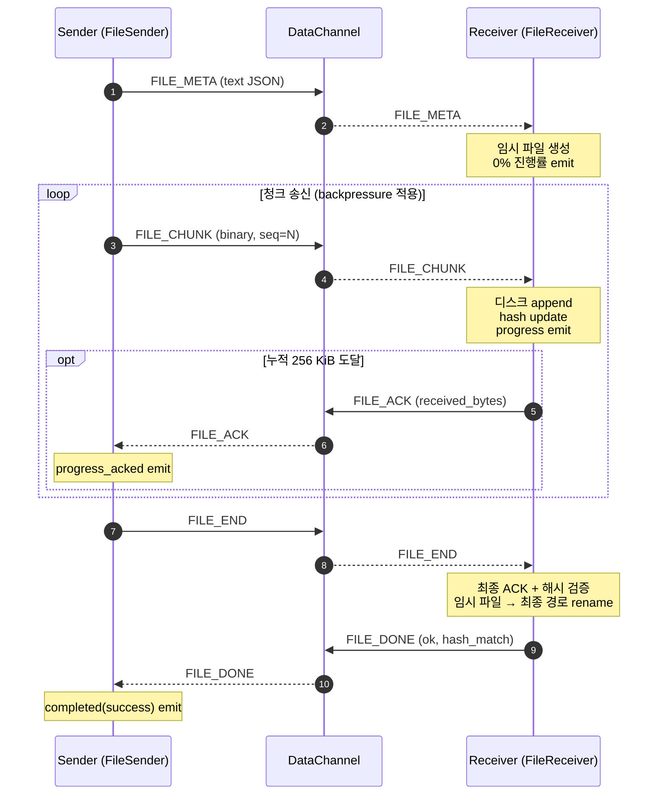

# app/rtc — TooTalk WebRTC DataChannel 계층

> Phase 1 MVP M4 마일스톤 — 파일/이미지 송수신 + 양방향 ProgressBar.
> 정본 정합: [CLAUDE_HARNESS_IMPORTANT.md §E](../../CLAUDE_HARNESS_IMPORTANT.md) ·
> Exec Plan: [docs/exec-plans/active/2026-05-17-tootalk-phase1-mvp.md](../../docs/exec-plans/active/2026-05-17-tootalk-phase1-mvp.md)

본 서브패키지는 시그널링 계층 ([app/net/signaling_client.py](../net/signaling_client.py))
위에 얹혀 실제 텍스트·이미지·파일 데이터를 운반하는 WebRTC PeerConnection /
DataChannel 래퍼와 송수신 모듈을 제공한다. 모든 IO 는 비동기다 (정본 §E —
동기 IO 금지). 파일 디스크 IO 는 `aiofiles` 또는 `asyncio.to_thread` 경유.

---

## 1. 모듈 구성

| 모듈 | 책임 |
|---|---|
| [`__init__.py`](__init__.py) | 패키지 docstring + 외부 진입점 모음 |
| [`protocol.py`](protocol.py) | 파일 전송 5종 메시지 (FILE_META/CHUNK/ACK/END/DONE) + 직렬화 헬퍼 |
| [`peer.py`](peer.py) | `RTCPeerConnection` 래퍼 — Offer/Answer/ICE + DataChannel 이벤트 → Qt signal |
| [`file_sender.py`](file_sender.py) | 파일 송신기 — 청크 스트리밍 + bufferedAmount backpressure + progress 신호 |
| [`file_receiver.py`](file_receiver.py) | 파일 수신기 — 청크 누적 + 주기적 ACK 송신 + 해시 검증 |
| [`image_processor.py`](image_processor.py) | Pillow 기반 썸네일 생성 + base64 인코딩 (CPU bound → `to_thread`) |

UI 위젯 [`app/ui/file_progress_widget.py`](../ui/file_progress_widget.py) 는
본 패키지의 송신/수신 신호에 결선되는 양방향 ProgressBar 위젯이다.

---

## 2. 파일 전송 프로토콜 (정본)

### 2.1 메시지 타입 5종

| ID | 방향 | 프레임 종류 | 페이로드 |
|---|---|---|---|
| `FILE_META` | 송신 → 수신 | text JSON | 파일 시작 알림 + 메타데이터 |
| `FILE_CHUNK` | 송신 → 수신 | binary | `file_id(16B)` + `seq(4B)` + payload |
| `FILE_ACK` | 수신 → 송신 | text JSON | 누적 수신 바이트 + 마지막 seq |
| `FILE_END` | 송신 → 수신 | text JSON | 모든 청크 송신 완료 알림 |
| `FILE_DONE` | 수신 → 송신 | text JSON | 저장 + 해시 검증 결과 회신 |

### 2.2 메시지 명세

#### FILE_META (text JSON)

```json
{
  "type": "FILE_META",
  "file_id": "9b1f2c3d...32 hex chars...",
  "name": "report.pdf",
  "size": 12345678,
  "mime": "application/pdf",
  "total_chunks": 754,
  "sha256": "<64 hex chars>",
  "thumbnail_base64": "<base64, image MIME 한정, 옵션>"
}
```

- `file_id` — UUID4 hex 32자. 동일 세션 내 충돌 가능성은 무시 가능.
- `mime` — `image/*` 이면 수신자가 인라인 미리보기로 처리.
- `thumbnail_base64` — 이미지 한정. 최대 200×200, JPEG 80% 품질. 본 필드가
  존재하면 수신자는 원본 파일이 도착하기 전부터 썸네일을 즉시 표시.
- `sha256` — 전체 파일 sha256 hex (송신자 산출). 수신자가 점진적 hash 로
  검증 후 `FILE_DONE.hash_match` 에 결과 반영.

#### FILE_CHUNK (binary)

```
| file_id (16B UUID raw) | seq (4B big-endian uint32) | payload (N B) |
```

- 헤더 총 20바이트. `seq` 는 0부터 단조증가. payload 길이는 청크마다 다를
  수 있으나 `FILE_CHUNK_SIZE` 환경변수가 기본값 — 16 KiB.
- TCP 와 달리 WebRTC DataChannel 은 메시지 경계를 보존하므로 별도 길이
  필드 불필요.

#### FILE_ACK (text JSON)

```json
{
  "type": "FILE_ACK",
  "file_id": "...",
  "received_bytes": 1048576,
  "last_seq": 64
}
```

- 송신자는 본 메시지를 보고 progress bar 의 파란(상대 확인) 막대를 갱신.
- 발행 빈도는 수신자가 결정 — 기본 `FILE_ACK_INTERVAL_BYTES` = 256 KiB.

#### FILE_END (text JSON)

```json
{ "type": "FILE_END", "file_id": "..." }
```

- 송신자가 모든 청크를 큐에 넣은 직후 송신. 수신자는 본 메시지를 받으면
  남은 모든 청크가 곧 도착할 것임을 확신하고 해시 검증 단계로 전이.

#### FILE_DONE (text JSON)

```json
{
  "type": "FILE_DONE",
  "file_id": "...",
  "ok": true,
  "hash_match": true
}
```

- `ok` = 디스크 저장 + rename 성공 여부.
- `hash_match` = 송신자가 보낸 `sha256` 과 수신자 계산값 일치 여부.
- 두 값 모두 `true` 일 때만 송신자는 전송 성공으로 처리.

### 2.3 시퀀스 다이어그램



---

## 3. 환경변수 (정본 §E — 하드코딩 금지)

| 키 | 기본값 | 의미 |
|---|---|---|
| `FILE_CHUNK_SIZE` | `16384` (16 KiB) | 송신 청크 크기 (bytes) |
| `FILE_BUFFER_HIGH` | `16777216` (16 MiB) | bufferedAmount high watermark |
| `FILE_BUFFER_LOW` | `4194304` (4 MiB) | bufferedAmount low watermark |
| `FILE_BACKPRESSURE_POLL_MS` | `50` | backpressure 폴링 주기 (ms) |
| `FILE_ACK_INTERVAL_BYTES` | `262144` (256 KiB) | ACK 회신 간격 (bytes) |
| `FILE_RECEIVE_DIR` | `Config.media_cache_dir` | 수신 파일 저장 디렉토리 |
| `THUMB_MAX_PX` | `200` | 썸네일 정사각 박스 픽셀 |
| `THUMB_QUALITY` | `80` | JPEG 품질 1~100 |

---

## 4. UI 결선 패턴 (Task #16 통합 가이드)

본 패키지는 메인 윈도우와 직접 결합하지 않는다. 다음 패턴으로 결선한다.

```python
# 송신 — _on_send_clicked 슬롯 내부 (Task #16 에서 구현)
file_id = protocol.new_file_id()
sender = FileSender()
widget = FileProgressWidget(file_id, path.name, path.stat().st_size, role="send")
sender.progress_sent.connect(widget.on_sent)
sender.progress_acked.connect(widget.on_acked)
sender.completed.connect(widget.on_completed)
sender.error.connect(widget.on_error)
chat_view.add_widget(widget)  # MessageBubble 자리에 본 위젯 삽입
asyncio.create_task(sender.send(peer.channel, path, file_id))
```

```python
# 수신 — Peer.set_message_handler 로 디스패처 주입
receiver = FileReceiver(config)
peer.set_message_handler(
    text=lambda raw: receiver.on_text_message(peer.channel, raw),
    binary=lambda raw: receiver.on_binary_message(peer.channel, raw),
)
# 새 FILE_META 도착 시 위젯 동적 추가 — receiver.progress 의 첫 emit 을 후킹
```

수신 위젯의 동적 생성/등록 흐름은 Task #16 에서 ChatView 의 `add_widget`
API 와 함께 추가된다.

---

## 5. backpressure 동작 원리

aiortc 의 `RTCDataChannel.send` 는 즉시 반환되지만 내부 SCTP 큐에 데이터가
적재된다. `bufferedAmount` 속성으로 큐 깊이를 확인할 수 있다.

- 송신자 큐가 `FILE_BUFFER_HIGH` 를 초과하면 `_wait_for_buffer_low` 가
  `FILE_BUFFER_LOW` 이하로 떨어질 때까지 `asyncio.sleep` 으로 양보.
- 50 ms 단위 폴링 — aiortc 가 명시적 `bufferedAmountLow` 이벤트를 제공하지
  않는 환경 호환을 위해 폴링 방식 채택.

본 메커니즘이 없으면 RAM 폭주 → OOM 으로 크래시. 100 MB 파일 검증 시
RSS 가 안정적으로 유지되는 것이 M4 마일스톤의 통과 기준이다.

---

## 6. 보안 / 신뢰성 메모

- **파일명 sanitization** — 수신자에서 `os.path.basename` 적용으로 디렉토리
  트래버설 차단. 추가 검증은 [SECURITY.md](../../SECURITY.md) 참조.
- **SHA-256 검증** — 송신자 산출 해시 ↔ 수신자 점진적 해시 비교. 불일치
  시 `FILE_DONE.hash_match=false` 회신 — UI 가 실패로 표기.
- **빈 파일 거부** — 0 바이트 파일은 `FileSender.send` 가 `ValueError`.
- **중복 FILE_META** — 동일 file_id 의 META 가 재도착하면 기존 컨텍스트를
  폐기 후 새로 시작 (idempotent 재시도 시나리오 대비).
- **DTLS 자동 적용** — aiortc 가 DataChannel 위에 DTLS 를 강제 — Phase 1
  은 별도 E2EE Signal Protocol 없이 본 DTLS 만 사용 (Phase 2 이후 확장).

---

## 7. 변경 이력

- 2026-05-17 — 본 패키지 신규 작성. 5종 프로토콜·송수신기·UI 위젯 1차 도입 (Phase 1 MVP M4 착수).
