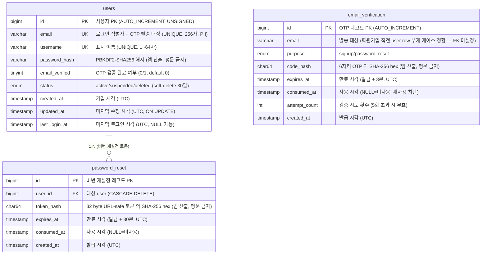
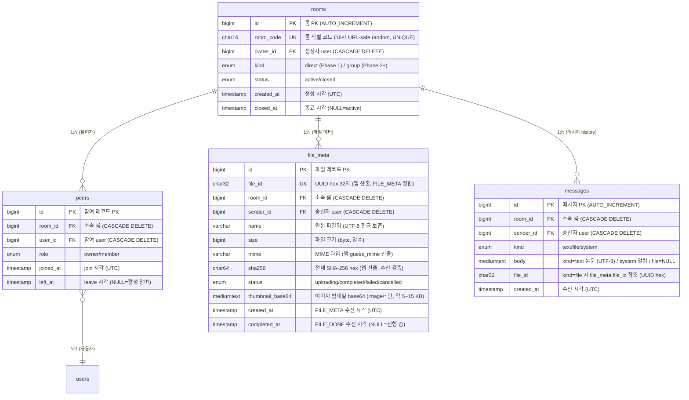
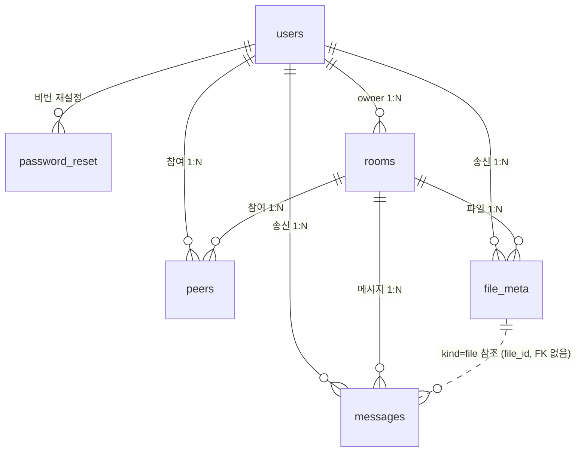

# TooTalk 데이터 모델 ERD (Phase 1)

> 본 ERD = `server/db/migrations/0001_init.sql` 의 1:1 mirror.
> 가드레일 [[feedback-db-schema-field-comments]] 정합 — 모든 필드 description 의무.
> 본문 컬럼 description = SQL DDL 의 COMMENT 절 의 요약.

## 1. 본 문서 운영 규약

1. **단일 정본 = SQL DDL** (`server/db/migrations/0001_init.sql`). 본 ERD 는 그 mirror.
2. **변경 절차** — SQL 변경 시 본 ERD 동시 갱신 의무. 한쪽 단독 변경 금지.
3. **필드 description 5요소** — 용도 + 제약 + 값 출처 + 참조 관계 + 민감도. 빈 description 금지.

## 2. AUTH 3 TABLE

## 3. 대화 4 TABLE

## 4. 전체 통합 관계

## 5. 필드 description 5요소 점검 표

본 표 = 가드레일 [[feedback-db-schema-field-comments]] 의 5요소 (용도 + 제약 + 출처 + 참조 + 민감도) 정합 self-audit.

| table | 필드 수 | 5요소 점검 | 민감도 표기 |
| --- | --- | --- | --- |
| users | 9 | ✅ 모두 5요소 정합 | email/password_hash = PII/비밀번호 |
| email_verification | 7 | ✅ 모두 5요소 정합 | email/code_hash = PII/비밀 |
| password_reset | 5 | ✅ 모두 5요소 정합 | token_hash = 비밀 |
| rooms | 6 | ✅ 모두 5요소 정합 | room_code = 외부 공유 키 |
| peers | 6 | ✅ 모두 5요소 정합 | 일반 |
| file_meta | 12 | ✅ 모두 5요소 정합 | name = 사용자 콘텐츠 |
| messages | 7 | ✅ 모두 5요소 정합 | body = 사용자 콘텐츠 |

**합계** = 52 필드 + 7 테이블, 모두 SQL DDL `COMMENT` 절 + ERD description 동시 정합.

## 6. 변경 절차

- **DDL 변경 시점** = 동시 갱신 의무 영역:
  1. `server/db/migrations/000N_<name>.sql` 신규 migration (append-only)
  2. `docs/db/erd.md` 본 ERD 갱신 (mermaid + 5요소 표)
  3. `ARCHITECTURE.md` §부록 B (DB schema) 동시 갱신
  4. `docs/exec-plans/active/2026-05-17-session-handoff.md` §5 정책 표 갱신

## 7. 참조

- 정본 DDL: [server/db/migrations/0001_init.sql](../../server/db/migrations/0001_init.sql)
- 영구 메모리: `feedback_db_schema_field_comments.md`
- 가드레일 인덱스: [CLAUDE.md §7](../../CLAUDE.md) #26
- ARCHITECTURE: [ARCHITECTURE.md](../../ARCHITECTURE.md)

---

마지막 갱신: 2026-05-17 — 사이클 18 (server/db/migrations/0001_init.sql 신설 + 본 ERD mirror)
