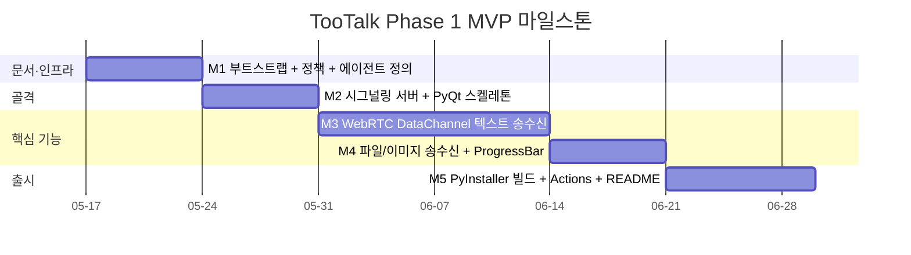
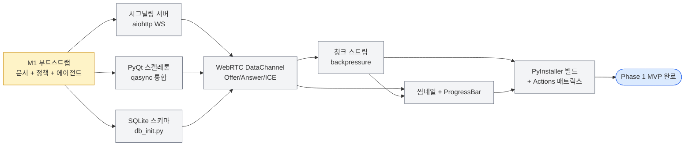

# TooTalk Phase 1 MVP 실행계획

> 정본 정합: [CLAUDE_HARNESS_IMPORTANT.md §D Exec Plans](../../../CLAUDE_HARNESS_IMPORTANT.md) · 저장소 맵: [AGENTS.md](../../../AGENTS.md)
> 본 문서는 TooTalk(코드명 `p2p_msg`) Phase 1 MVP 의 실행/검증/결정 기록 문서다. TODO 목록이 아님.

---

## 1. 개요

**TooTalk** 는 PyQt6 데스크탑 P2P 메신저다. 텔레그램 UX 를 참고하되 시그널링 서버 하나만 거치고, 실제 데이터(텍스트·이미지·파일)는 WebRTC DataChannel 직결로 운반한다. Phase 1 MVP 의 목표는 **1:1 P2P 채팅이 macOS + Windows 양쪽에서 안정적으로 동작하는 zip 배포 가능 상태**까지 도달하는 것이다.

본 Phase 의 범위는 의도적으로 좁다. 음성/영상 통화·그룹 채팅·E2EE Signal Protocol·자동 업데이트 같은 무거운 기능은 모두 Phase 2 이후로 보류한다. 대신 본 Phase 에서는 GitHub Actions **self-hosted** 매트릭스 CI, PyInstaller 빌드, 데모 시그널링 서버(`114.207.112.73`) 배포까지 한 번의 흐름으로 끝까지 검증할 수 있는 골격을 우선 확립한다. 코드 분량보다 **문서·정책·CI 게이트 정합**을 먼저 끝내고, 그 토대 위에 PyQt 스켈레톤 → WebRTC DataChannel → 파일 송수신 → 빌드를 순차로 쌓는다.

> **CI 정책 (2026-05-17 사용자 directive)**: GitHub Actions runner = self-hosted 환경. macOS arm64 + Windows x64 self-hosted runner 매트릭스. GitHub-hosted runner 미사용. 데모 서버 Linux runner 별도 후보.

---

## 2. 범위 (In Scope)

Phase 1 MVP 가 반드시 포함하는 항목.

- **PyQt6 메인 윈도우 + 채팅 뷰** — qasync 기반 Qt ↔ asyncio 이벤트 루프 통합, 메시지 리스트·입력창·송신 버튼·파일 첨부 버튼.
- **WebRTC DataChannel 1:1 연결** — aiortc 기반, DTLS 자동 적용, STUN `stun.l.google.com:19302` 단일 의존.
- **시그널링 서버 (aiohttp WebSocket)** — Offer/Answer/ICE 후보 교환만 담당, 메시지 데이터는 일절 통과하지 않음.
- **텍스트 메시지 송수신** — DataChannel 기반 JSON envelope, 타임스탬프·발신자 식별자 포함.
- **이미지 송수신 (썸네일 + 원본)** — Pillow 기반 썸네일 생성 후 인라인 표시, 원본은 별도 청크 스트림.
- **파일 송수신 (양방향 ProgressBar)** — 송신/수신 양쪽 PyQt `QProgressBar` 동기 갱신, 청크 단위 backpressure 적용.
- **SQLite 로컬 히스토리** — 대화 영구 저장, 메시지·이미지·파일 메타데이터 분리 테이블.
- **PyInstaller macOS + Windows 빌드** — `--onedir` zip 패키징, 인증서 미사용, 첫 실행 가능 여부까지 검증.
- **GitHub Actions self-hosted 매트릭스 CI** — `[self-hosted, macOS, arm64]` + `[self-hosted, Windows, x64]` runner, Python 3.13, 빌드·import 스모크·M1~M4 게이트. GitHub-hosted runner 미사용 (사용자 directive 2026-05-17).
- **데모 시그널링 서버 배포** — `114.207.112.73` 호스트, 시스템d 또는 Docker 단일 컨테이너, 인증 없이 공개 데모 가능.
- **AGENTS.md + 9 정책 + `.claude/agents/` + README** — 문서 골격 전체 완성.
- **CI 5종 게이트** — M1(문서 선행) · M2(README 변경 이력) · M3(History 역순) · M4(한글 주석) · 루트 18 동결.

---

## 3. 범위 외 (Out of Scope, Phase 2 이후)

Phase 1 에서는 절대 손대지 않는다.

- **음성/영상 통화** — WebRTC MediaStream + Opus/H.264 negotiation, 에코 캔슬링.
- **그룹 채팅 (mesh 또는 SFU)** — 3명 이상 토폴로지, mediasoup·LiveKit 도입 검토.
- **E2EE Signal Protocol** — Double Ratchet + X3DH. Phase 1 은 DTLS 자체 암호로 충분.
- **코드 서명 인증서** — Apple Developer ID, Windows Authenticode. 사용자가 Gatekeeper/SmartScreen 우회 수동 수행.
- **자동 업데이트** — Sparkle / WinSparkle / Squirrel 통합.
- **Linux 빌드** — AppImage / Flatpak / `.deb`. Phase 1 은 macOS + Windows 만 매트릭스.
- **다국어 (i18n)** — Phase 1 은 한국어 단일 UI.
- **푸시 알림** — APNs / FCM 연동, 백그라운드 데몬 분리.

---

## 4. 마일스톤 (Milestones)

### 4.1 Gantt 차트

### 4.2 마일스톤 표

| ID | 목표일       | 제목                                              | 산출물                                                                                             |
|----|--------------|---------------------------------------------------|----------------------------------------------------------------------------------------------------|
| M1 | 2026-05-24   | 부트스트랩 + 정책 문서 + 에이전트 정의             | 루트 18 문서 · `docs/` 골격 · `.claude/agents/` 12 에이전트 · CI 3 워크플로우                       |
| M2 | 2026-05-31   | 시그널링 서버 + PyQt 스켈레톤                     | `server/signaling.py` (aiohttp WS) · `app/main.py` (메인 윈도우) · qasync 이벤트 루프 통합           |
| M3 | 2026-06-14   | WebRTC DataChannel 텍스트 송수신                  | `app/rtc/peer.py` (aiortc 래퍼) · Offer/Answer/ICE 교환 · 텍스트 송수신 + SQLite 영구화              |
| M4 | 2026-06-21   | 파일/이미지 송수신 + 양방향 ProgressBar           | `app/rtc/transfer.py` 청크 스트림 · 썸네일 생성 · 송수신 ProgressBar · 100MB 파일 검증                |
| M5 | 2026-06-30   | PyInstaller 빌드 + GitHub Actions + README       | `build/TooTalk-{ver}-{os}.zip` · `.github/workflows/build.yml` 매트릭스 · README 빌드/실행 안내       |

---

## 5. 세부 작업 분해 (Task Breakdown)

본 시점(2026-05-17) 기준 task #11 ~ #22 까지 12 개 작업의 mapping.

| id   | M  | 작업                                              | 담당 에이전트              | 의존성        | 상태       |
|------|----|---------------------------------------------------|----------------------------|---------------|------------|
| #11  | M1 | `AGENTS.md` 초안 작성 + 명명 규약 명문화          | `@spec-agent`              | -             | done       |
| #12  | M1 | 9 정책 문서 신설 (ARCHITECTURE / DESIGN / ...)    | `@spec-agent`              | #11           | in_progress|
| #13  | M1 | `.claude/agents/` 12 에이전트 사양 작성           | `@planning-agent`          | #11           | in_progress|
| #14  | M2 | `server/signaling.py` aiohttp WebSocket 구현      | `@backend-agent`           | #12, #13      | pending    |
| #15  | M2 | `app/main.py` PyQt6 메인 윈도우 + qasync 통합     | `@frontend-agent`          | #12, #13      | pending    |
| #16  | M2 | SQLite 스키마 + 마이그레이션 (`tools/db_init.py`) | `@backend-agent`           | #12           | pending    |
| #17  | M3 | `app/rtc/peer.py` aiortc 래퍼 + Offer/Answer 교환 | `@backend-agent`           | #14, #15      | pending    |
| #18  | M3 | 텍스트 메시지 envelope + 채팅 뷰 wiring           | `@frontend-agent`          | #17, #16      | pending    |
| #19  | M4 | `app/rtc/transfer.py` 청크 스트림 + backpressure  | `@backend-agent`           | #17           | pending    |
| #20  | M4 | 송수신 ProgressBar + Pillow 썸네일                | `@frontend-agent`          | #19           | pending    |
| #21  | M5 | `tools/build.py` PyInstaller 매트릭스 빌드        | `@release-agent`           | #18, #20      | pending    |
| #22  | M5 | `.github/workflows/build.yml` Actions 매트릭스    | `@release-agent`           | #21           | pending    |

> 상태 값: `pending` / `in_progress` / `blocked` / `review` / `done`. `blocked` 전이 시 §10 차단점 추적 표에 1행 누적.

---

## 6. Definition of Done

Phase 1 MVP 종료 조건. 아래 10 항목 모두 체크되어야 `status: completed` 로 전이하고 `docs/exec-plans/completed/` 로 이동.

- [ ] 텍스트 메시지 1:1 송수신이 macOS ↔ Windows 양방향에서 동작 확인 (왕복 RTT 평균 < 500ms, 데모 시그널링 서버 경유).
- [ ] 이미지 송수신 + 인라인 썸네일 표시 검증 (1MB JPEG · 5MB PNG 양쪽 sample 정상 렌더).
- [ ] 100MB 파일 송수신 성공 + 송수신 양쪽 `QProgressBar` 가 1% 단위 이상 갱신 (정지 또는 역행 없음).
- [ ] macOS + Windows zip 빌드 산출물 (`TooTalk-{ver}-{os}.zip`) 다운로드 후 첫 실행 가능 (Gatekeeper/SmartScreen 우회 안내 README 기재).
- [ ] GitHub Actions 매트릭스 (`macos-latest` + `windows-latest` × Python 3.13) 모두 GREEN.
- [ ] `AGENTS.md` + 정책 9 문서 + `.claude/agents/` 12 에이전트 사양 + CI 3 워크플로우 모두 작성 + 최신 갱신 일자 정합.
- [ ] `README.md` 에 빌드/실행 안내 + "변경 이력" 섹션 (M2) + 데모 서버 안내 포함.
- [ ] CI 5종 게이트 통과 — M1(문서 선행) · M2(README 변경 이력) · M3(History 역순) · M4(한글 주석) · 루트 18 동결.
- [ ] `SECURITY.md` 에 명시된 외부 입력 처리 항목 (시그널링 메시지 · 파일 헤더 · STUN 응답) 코드 측면 검증 완료.
- [ ] 본 실행계획 §9 검증 결과 표에 M1~M5 의 PASS 기록이 모두 등재 (검증자·일자·비고 포함).

---

## 7. 결정 로그

본 Phase 의 굵직한 결정 사항. 2026-05-17 부트스트랩 시점 8 건 누적.

| 날짜       | 결정                                              | 이유                                                                                       | 영향                                                              |
|------------|---------------------------------------------------|--------------------------------------------------------------------------------------------|-------------------------------------------------------------------|
| 2026-05-17 | GUI 프레임워크 = PyQt6                            | Tk·wxPython 대비 위젯 완성도·QSS 테마·signal/slot 모델 우위. qasync 통합 안정성 검증됨.    | 빌드 라이선스 GPL 영향 검토 (상용 변경 시 PySide6 전환 가능)      |
| 2026-05-17 | Python 버전 = 3.13                                | PyInstaller 6.x · aiortc 1.10+ · qasync 0.27+ 모두 3.13 호환. 최신 asyncio 성능 개선.       | CI 매트릭스 단일 버전, 사용자 환경 강제                            |
| 2026-05-17 | 시그널링 = `aiohttp` WebSocket                    | FastAPI WS 대비 의존 가벼움, 단일 파일 배포 가능, asyncio 네이티브.                         | `server/signaling.py` 약 200~300 LOC 예상                          |
| 2026-05-17 | 그룹 채팅 보류 (Phase 2 이후)                     | mesh n^2 또는 SFU 도입 모두 Phase 1 범위 초과. 1:1 안정성 확보가 선행.                      | M3·M4 task 단순화, Phase 2 에서 mediasoup 도입 검토                 |
| 2026-05-17 | E2EE Signal Protocol 보류                         | DataChannel DTLS 가 transport 암호 제공. Phase 1 위협 모델 (악성 시그널링 서버) 에는 충분. | Phase 2 에서 Double Ratchet + X3DH 도입 시 envelope 호환 필요       |
| 2026-05-17 | 빌드 = PyInstaller + zip (인증서 미사용)          | Phase 1 데모 단계, 코드 서명 비용·심사 시간 회피. 사용자 우회 안내로 대체.                  | macOS Gatekeeper · Windows SmartScreen 첫 실행 우회 README 명시 의무|
| 2026-05-17 | GitHub repo 가시성 = public                       | OSS 데모 + 채용 포트폴리오 겸용. 시크릿은 `.env` + GitHub Actions Secrets 분리.             | `.gitignore` 에 `.env.local` · `.env.telegram` 명시 의무            |
| 2026-05-17 | 서비스명 = TooTalk · 코드명 = p2p_msg             | UI/빌드 산출물은 브랜드 노출, import 경로·repo 명은 코드 식별자 유지.                       | `AGENTS.md §1` 명명 규약 명문화, About 다이얼로그·User-Agent 적용  |
| 2026-05-17 | CI runner = self-hosted (사용자 directive)        | GitHub-hosted runner 미사용. macOS arm64 + Windows x64 self-hosted 매트릭스. 비용 0.       | workflow `runs-on` 라벨 배열 사용, runner 등록은 사용자 직접 수행 |

---

## 8. 기술 부채 추적 (Tech Debt)

본 Phase 진행 중 의도적으로 미루는 항목. 사용자 directive 기반 5 건. 신규 발견 부채는 본 표에 행을 추가하고 해소 시점을 명시.

| id    | 항목                                                        | 영향                                                                       | 해소 시점        |
|-------|-------------------------------------------------------------|----------------------------------------------------------------------------|------------------|
| TD-1  | 시그널링 서버 보안 hardening (TLS · 인증 토큰 · rate limit)  | 데모 서버 공개 노출. 악의적 클라이언트 DoS 가능, peer 식별 위·변조 위험.    | Phase 2          |
| TD-2  | macOS Gatekeeper 우회 안내 → 정식 codesign + notarization    | 첫 실행 시 사용자 수동 우회 요구. UX 마찰, 비기술 사용자 진입 장벽.         | Phase 2          |
| TD-3  | Windows SmartScreen 우회 안내 → Authenticode 정식 서명       | "확인된 게시자 없음" 경고. 다운로드 차단 가능성, 평판 점수 부재.            | Phase 2          |
| TD-4  | aiortc 약 5Mbps 처리 한계 → 성능 검증 + 대안 검토            | 대용량 파일(>500MB) 전송 시 throughput 부족 우려. 청크 사이즈·동시성 튜닝   | Phase 1 후반     |
| TD-5  | M7 텔레그램 MCP 일시 disconnected → 자동 재연결 + 백오프     | 결과 보고 누락 시 directive 추적 단절. 사용자 가시성 손실.                  | Phase 1          |
| TD-6  | self-hosted runner 보안 hardening (public repo + fork PR)    | 외부 contributor fork PR 측 악성 코드 실행 위험. 데모 단계는 무위협.        | Phase 2 진입 전  |

---

## 9. 검증 결과 기록

각 마일스톤 종료 시점의 검증 결과를 누적 기록한다. PASS / FAIL 기록 필수, FAIL 시 §10 차단점 추적과 연동.

| 날짜       | 마일스톤 | 결과   | 비고                                                                          |
|------------|----------|--------|-------------------------------------------------------------------------------|
| (예정)     | M1       | -      | 부트스트랩 완료 후 `@reviewer-agent` + `harness-verify` 7/7 PASS 확인          |
| (예정)     | M2       | -      | 시그널링 서버 health check + PyQt 메인 윈도우 첫 실행 캡처                     |
| (예정)     | M3       | -      | macOS ↔ Windows 텍스트 송수신 왕복 + SQLite 영구화 회귀                        |
| (예정)     | M4       | -      | 100MB 파일 송수신 + ProgressBar 양방향 갱신 + 1MB/5MB 이미지 썸네일 검증       |
| (예정)     | M5       | -      | zip 빌드 다운로드 → 첫 실행 → 텍스트/파일/이미지 모두 동작 확인 (양 OS)        |

---

## 10. 차단점 추적

현재 차단 발생 시 1 행 누적. 차단 해소까지 본 표가 한 번이라도 비어있지 않으면 `status: blocked` 로 전이 검토.

| 날짜       | 차단 사유                                         | 영향 task   | 해소 조건                                                  | 상태       |
|------------|---------------------------------------------------|-------------|------------------------------------------------------------|------------|
| (현재 없음)| -                                                 | -           | -                                                          | -          |

> 분류기 hard block 패턴이 재발하는 경우 [정본 §S-3](../../../CLAUDE_HARNESS_IMPORTANT.md) 의 `SKIP_PREPUSH=1` prefix 우회를 본 표에 1 행으로 등재 후 진행.

---

## 11. 의존성 그래프

핵심 경로: **M1 → 시그널링 서버 → DataChannel → 파일전송 → 빌드**. 이 경로 한 단계라도 FAIL 시 직후 단계 진행 금지.

---

## 12. 참조

### 12.1 정본·맵

- [CLAUDE_HARNESS_IMPORTANT.md](../../../CLAUDE_HARNESS_IMPORTANT.md) — 정본. §A 7대 규칙 · §B 5단계 워크플로우 · §D Exec Plans · §K 루트 동결 · §R M5 · §S Tier 1 자동화.
- [AGENTS.md](../../../AGENTS.md) — 저장소 맵 + 명명 규약 + 7대 규칙 요약.

### 12.2 루트 9 정책 문서 (예정)

- `ARCHITECTURE.md` · `DESIGN.md` · `FRONTEND.md` · `PLANS.md` · `PRODUCT_SENSE.md` · `QUALITY_SCORE.md` · `RELIABILITY.md` · `SECURITY.md` (task #12 산출물)

### 12.3 운영 문서 (예정)

- `Specification.md` — 요구사항 명세 (M1 단계)
- `Structure.md` — 파일 트리 + ERD
- `CheckList.md` — 작업 체크리스트
- `History.md` — 개발 히스토리 (역순 prepend)
- `README.md` — 빌드/실행 안내 + 변경 이력 30 행

### 12.4 코드 영역 (예정)

- `app/` — PyQt6 클라이언트 (main 윈도우 · 채팅 뷰 · RTC 래퍼)
- `server/` — aiohttp 시그널링 서버
- `tools/` — `md_agents.py` · `db_init.py` · `build.py` · hook 스크립트
- `.github/workflows/` — `ci.yml` · `docs-lint.yml` · `doc-gardener.yml` · `build.yml`

### 12.5 외부 라이브러리 참조

- [PyQt6](https://www.riverbankcomputing.com/static/Docs/PyQt6/) · [aiortc](https://aiortc.readthedocs.io/) · [qasync](https://github.com/CabbageDevelopment/qasync) · [aiohttp](https://docs.aiohttp.org/) · [PyInstaller](https://pyinstaller.org/)

---

**문서 상태**: `active` · 최초 작성 2026-05-17 · 다음 검증 예정 M1 종료일 (2026-05-24)
