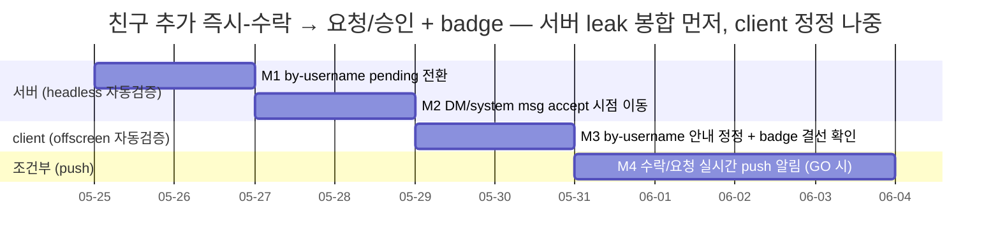
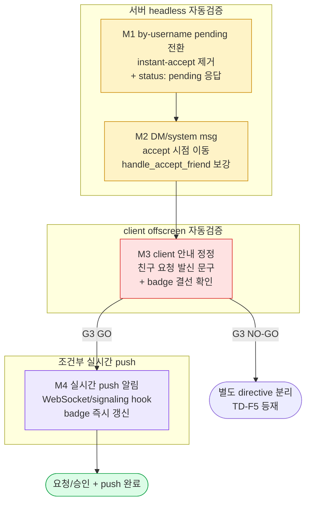

# 친구 추가 즉시-수락 → 요청/승인 모델 + pending badge 전환

> 정본 정합: [CLAUDE_HARNESS_IMPORTANT.md §B 5단계 워크플로우](../../../CLAUDE_HARNESS_IMPORTANT.md) · [§C 7역할](../../../CLAUDE_HARNESS_IMPORTANT.md) · [§D Exec Plans](../../../CLAUDE_HARNESS_IMPORTANT.md) · [§A M1~M7](../../../CLAUDE_HARNESS_IMPORTANT.md)
> 운영: [CLAUDE.md §2 워크플로우](../../../CLAUDE.md) · 저장소 맵: [AGENTS.md](../../../AGENTS.md)
> 본 문서는 실행/검증/결정 기록 문서다. TODO 목록이 아니다. ② 개발 단계는 main session 이 후속 수행하며, 본 planning 산출물은 코드보다 먼저 존재한다 (M1).
> directive 출처: 사용자 "친구 요청시에 뱃지가 있어야 하는것도 알지? / 뱃지가 있어야 요청중인 친구가 있는게 확인이 되겠지?"

---

## 0. 핵심 권고 요약 (사용자 재검토용 — 진행 전 필독)

코드 정독 (2026-05-25 — `friends_by_username_handler.py` · `friends_handlers.py` · `friends.py` repo · `contacts_dialog.py` · `add_friend_by_username_dialog.py` · `_friend_search_mixin.py` · `pending_requests_dialog.py` · `sidebar_rail.py` · `friends_client.py` · e2e 2종) 결과, **요청/승인 + badge 인프라는 이미 90% 완성돼 있다.** 본 directive 의 진짜 작업은 "신규 모델 구축" 이 아니라 **"단 하나 남은 즉시-수락 leak 경로의 봉합"** 이다. 추측을 배제한 정확한 경계는 아래와 같다.

### 0.1 요청/승인 모델은 이미 존재하고 결선돼 있다 — 신규 구축 부재

- **서버**: `POST /api/friends` (`handle_request_friend`) 가 이미 `status="pending"` 단방향 INSERT 한다. `POST /api/friends/{id}/accept` 가 pending → accepted + reverse row INSERT 한다. `POST /api/friends/{id}/reject` 가 pending → removed 한다. `GET /api/friends/pending` 가 수신 pending list 를 반환한다. friends 8 endpoint 전부 등록 완료 (`server/main.py:308`).
- **client**: `FriendsClient` 8 method (`request_friend`/`accept_friend`/`reject_friend`/`list_pending` 포함) 완비. `PendingRequestsDialog` 가 수락/거절 버튼 + async chain 결선. `_on_friend_requested` 가 `request_friend` 호출 + Conflict 시 "이미 요청된 상대" 안내.
- **badge**: `sidebar_rail._pending_badge` (우상단 원형 QLabel, count>0 시 visible) + `set_pending_count` 완비. `_refresh_pending_badge` 가 `list_pending` 길이로 갱신. `_on_pending_resolved` + `_auth_chain_mixin` (로그인 직후) 에서 호출.

### 0.2 유일한 결함 — username 경로가 즉시-수락으로 leak 한다

- **핵심 leak**: `POST /api/friends/by-username` (`friends_by_username_handler.py`) 가 username resolve 후 **양방향 `status="accepted"` 즉시 INSERT** + DM room + system message 를 한 번에 생성한다 (`friends_by_username_handler.py` L47~84). pending 요청을 만들지 않으므로 이 경로로 추가된 친구는 수신자의 "받은 친구 요청" 에 **절대 나타나지 않고 badge 에도 잡히지 않는다.**
- **진입점**: `contacts_dialog._on_friend_username_submitted` → `_async_post_friend_username` 가 직접 `aiohttp` 로 `/api/friends/by-username` 를 POST 한다 (`contacts_dialog.py` L150~197). `AddFriendByUsernameDialog` ("사용자명으로 친구 추가") 가 source.
- **대조군**: `AddFriendDialog` 경로 (`_on_friend_search_requested` → `_on_friend_requested` → `FriendsClient.request_friend` → `POST /api/friends`) 는 **이미 올바른 pending 모델** 을 따른다. 즉 username 경로 1건만 잘못된 모델로 남아 있다.

### 0.3 가장 빠른 win = username 경로를 기존 pending endpoint 로 redirect

- username 경로를 즉시-수락에서 끊어 내고 기존 `POST /api/friends` (pending) 흐름으로 합류시키면, 이미 결선된 PendingRequestsDialog + badge 가 자동으로 동작한다. 신규 endpoint·신규 dialog·신규 badge 위젯이 **불요** 하다.
- **권고**: `friends_by_username_handler.py` 를 instant-accept 에서 **username resolve → 기존 pending 요청 생성** 으로 재설계한다. DM room + system message 생성 책임을 **accept 시점** (`handle_accept_friend`) 으로 이동한다. client `contacts_dialog` 의 by-username 경로는 성공 안내 문구를 "친구 요청 발신" 으로 정정한다.

### 0.4 스키마 변경 불요 — friends.status ENUM 이 이미 pending 포함

- `0007_friends.sql` `status ENUM('pending','accepted','blocked','removed')` 가 이미 pending 을 포함한다. **마이그레이션 신설 불요.** directive 가 언급한 "friends 테이블에 created_at 컬럼 부재" 는 사실이나, `requested_at TIMESTAMP DEFAULT CURRENT_TIMESTAMP` (0007 L26) 가 동등한 정렬 기준으로 이미 존재한다 — PendingRequestsDialog 가 이미 `requested_at_iso` 로 요청 시각을 표시한다. **별도 컬럼 추가 불요.**
- **결론**: 본 작업은 DB 무변경. 순수 application layer (서버 핸들러 1건 재설계 + client 안내 문구 1건 + DM/system msg 이동) + 회귀 안전망이다.

> 사용자 재검토 포인트: 진짜 목적이 "username 으로 친구 추가 시에도 상대가 수락해야 친구가 되고, 수신자에게 pending badge 가 뜬다" 라면 M1~M3 로 충분하다 (DB 무변경, headless 자동검증). "수락 시 실시간 push 알림" 까지면 M4 (push 결선, 조건부) 가 필요하다.

---

## 1. 개요

TooTalk 친구 추가의 username 입력 경로를 **즉시-수락 모델 → 요청/승인 모델** 로 전환해, 수신자에게 pending 요청이 쌓이고 sidebar 햄버거 badge(N) 가 표시되도록 한다.

핵심 데이터 흐름 (목표):

```
발신자 username 입력
  → POST /api/friends/by-username (재설계: resolve + pending INSERT)
  → friends row 1건 (forward, status=pending)
수신자 측
  → GET /api/friends/pending → PendingRequestsDialog 표시
  → 햄버거 badge count = pending 길이
  → [수락] → POST /api/friends/{id}/accept (pending→accepted + reverse INSERT + DM room + system msg)
  → [거절] → POST /api/friends/{id}/reject (pending→removed)
```

본 계획은 **DB 무변경** 을 전제로 한다. friends.status ENUM 이 pending 을 이미 포함하고, 요청/승인/badge 인프라가 이미 결선돼 있으므로, 작업은 (1) username 핸들러 재설계, (2) DM room + system message 책임의 accept 시점 이동, (3) client 안내 문구 정정 + by-username 응답 분기 갱신, (4) 회귀 안전망으로 분해된다. 모든 단계는 **기존 `AddFriendDialog` pending 경로 + PendingRequestsDialog + badge offscreen/e2e test 를 1건도 손상시키지 않는** 것을 게이트로 한다.

---

## 2. 범위 (In Scope)

- **username 핸들러 재설계 (M1)** — `friends_by_username_handler.py` 를 양방향 instant-accept 에서 **forward 1건 pending INSERT** 로 전환. self-add(400) / username 부재(404) / pool 부재(503) 검증 유지. 이미 accepted 관계 또는 pending 중복 시 409 또는 idempotent 안내. 응답 contract 를 `{friend_user_id, username, status: "pending"}` 로 변경.
- **DM room + system message 책임 이동 (M2)** — username 핸들러가 더 이상 DM room + welcome system message 를 생성하지 않는다. 해당 책임을 `handle_accept_friend` (수락 시점) 으로 이동 — 양방향 accepted 완성 직후 `find_or_create_dm_room` + "{닉네임}님과 친구가 되었습니다" system message. `AddFriendDialog` pending 경로도 동일 accept 시점 DM 생성으로 수렴 (현재 pending 경로는 accept 시 DM 미생성 — 본 이동으로 양 경로 일원화).
- **client by-username 흐름 정정 (M3)** — `contacts_dialog._on_friend_username_submitted` / `_async_post_friend_username` 의 성공 안내를 "친구 추가됨" → "친구 요청 발신 — 상대 수락 시 친구 등록" 으로 정정. 201 응답의 `status` 분기 처리. 409(이미 친구/요청) 안내 추가. `contact_added` 즉시 emit 제거 또는 의미 정정 (즉시 친구 목록 추가 금지).
- **badge 즉시 갱신 결선 확인 (M3)** — by-username 발신 후 발신자 측 화면에는 badge 변화 없음(수신자만 badge). 수신자 측은 기존 `_refresh_pending_badge` (로그인 직후 + resolve 직후 + polling) 가 자동 처리됨을 e2e/offscreen 으로 확인. 신규 위젯·신규 호출 추가 없이 기존 결선의 정상 동작 검증.
- **회귀 안전망 (전 단계)** — `tests/integration/test_friends_by_username_e2e.py` (instant-accept 전제 6 케이스) 를 pending 모델로 rewrite. `tests/server/test_friends_handlers.py` accept 시 DM/system msg 생성 케이스 추가. `tests/app/ui/test_mixin_isolated_batch2.py` (badge refresh) + PendingRequestsDialog offscreen test 무손상. `pytest tests/` 전량 + cov delta.
- **문서 동기 의무 (전 단계)** — `Structure.md` / `FRONTEND.md` / `CheckList.md` / 평가 snapshot 2종 갱신 지점 명시 (§12.2).

---

## 3. 범위 외 (Out of Scope)

무엇을 하지 않는지가 무엇을 하는지보다 명확해야 한다.

- **DB 마이그레이션 / 스키마 변경** — friends.status ENUM 이 pending 을 이미 포함. `requested_at` 이 정렬 기준으로 존재. **신규 컬럼·신규 마이그레이션 절대 금지.** created_at 별도 추가는 over-engineering (§0.4).
- **신규 pending endpoint 신설** — `GET /api/friends/pending` + accept/reject 가 이미 존재. **신규 endpoint 추가 금지.** by-username 은 기존 흐름으로 redirect 만.
- **신규 badge 위젯 / sidebar 변경** — `sidebar_rail._pending_badge` + `set_pending_count` 완비. **신규 위젯 추가 금지.** 기존 결선 검증만.
- **PendingRequestsDialog UI 재설계** — 수락/거절 버튼 + avatar + 요청 시각 이미 결선. UI 추가 변경 범위 외 (기능 정상 동작 검증만).
- **실시간 push 알림** — 수락/요청 도착 시 WebSocket/signaling push 알림은 별도 directive. 본 계획의 badge 는 polling/refresh 기반 스냅샷 (M4 조건부에서만 push 검토).
- **AddFriendDialog 검색 경로 재설계** — `_on_friend_requested` → `request_friend` 는 이미 올바른 pending 모델. 손대지 않는다 (DM 생성 책임 이동만 공유).
- **기존 instant-accept 로 생성된 friend row 마이그레이션** — 과거 accepted row 는 그대로 유효 (하위호환). soft 정정 backfill 범위 외 (§9 결정 로그).
- **차단/삭제(block/remove) 흐름** — 기존 endpoint 유지. 본 계획 무관.
- **코드 직접 작성** — 본 산출물은 planning 1 문서. ②~⑤ 단계는 main session 후속 (M1 문서 선행).

---

## 4. gap 분석 (현 instant-accept vs 목표 request/approval)

코드 정독 결과의 정확한 경계. "있음/leak/정정" 3 분류.

| # | 요소 | 현 TooTalk 상태 | 분류 | 근거 (정독 위치) |
|---|------|-----------------|------|------------------|
| A-1 | search 경로 pending 요청 (`POST /api/friends`) | `handle_request_friend` status=pending INSERT | **있음** | `friends_handlers.py` L211~293 |
| A-2 | username 경로 친구 추가 | **양방향 status=accepted 즉시 INSERT** (pending 우회) | **leak** | `friends_by_username_handler.py` L47~58 |
| A-3 | username 경로 DM room + system msg | username 핸들러가 추가 즉시 생성 | **정정** (accept 시점 이동) | `friends_by_username_handler.py` L60~84 |
| B-1 | 수신 pending list endpoint | `GET /api/friends/pending` + `list_pending_requests` | **있음** | `friends_handlers.py` L157, `friends.py` L206 |
| B-2 | accept endpoint (pending→accepted + reverse) | `POST /api/friends/{id}/accept` + reverse INSERT | **있음** | `friends_handlers.py` L296~359 |
| B-3 | reject endpoint (pending→removed) | `POST /api/friends/{id}/reject` | **있음** | `friends_handlers.py` L362~392 |
| B-4 | accept 시 DM room + system msg | **부재** (accept 핸들러가 DM 미생성) | **정정** (A-3 이동 대상) | `handle_accept_friend` DM 호출 부재 |
| C-1 | PendingRequestsDialog (수락/거절 UI) | avatar + 요청 시각 + 수락/거절 버튼 + async | **있음** | `pending_requests_dialog.py` 전체 |
| C-2 | sidebar pending badge 위젯 | `_pending_badge` QLabel (우상단 원형, count>0 visible) | **있음** | `sidebar_rail.py` L76~90, L214~228 |
| C-3 | badge count refresh chain | `_refresh_pending_badge` (list_pending 길이) | **있음** | `_friend_search_mixin.py` L191~203 |
| C-4 | badge refresh trigger | 로그인 직후(`_auth_chain_mixin` L115) + resolve 직후(L187) | **있음** | `_auth_chain_mixin.py` L115, `_friend_search_mixin.py` L178~189 |
| D-1 | client request_friend (pending POST) | `FriendsClient.request_friend` + `_on_friend_requested` | **있음** | `friends_client.py` L376, `_friend_search_mixin.py` L95 |
| D-2 | client by-username 성공 안내 | "친구 추가됨" (즉시-수락 전제 문구) | **정정** | `contacts_dialog.py` L183~188 |
| D-3 | client by-username 즉시 `contact_added` emit | 발신 직후 즉시 emit (친구 추가 전제) | **정정** | `contacts_dialog.py` L165 |
| E-1 | friends.status ENUM pending | `ENUM('pending','accepted','blocked','removed')` | **있음** (마이그레이션 불요) | `0007_friends.sql` L20 |
| E-2 | friends 정렬 기준 (created/requested) | `requested_at TIMESTAMP DEFAULT CURRENT_TIMESTAMP` | **있음** (created_at 별도 불요) | `0007_friends.sql` L26 |

> **요약**: "있음" 13건 · "leak" 1건 (A-2) · "정정" 4건 (A-3·B-4·D-2·D-3). 신규 구축 0건. 본 작업은 leak 봉합 + 책임 이동 + 안내 정정 + 회귀 rewrite 다.

---

## 5. 데이터 모델 + REST 갭

### 5.1 데이터 모델 (변경 없음 확인)

| 항목 | 현 상태 | 필요 변경 | 단계 |
|------|---------|-----------|------|
| friends.status pending | `ENUM(...pending...)` 존재 | **없음** (재사용) | - |
| 요청 정렬 기준 | `requested_at` 존재 | **없음** (`created_at` 불요) | - |
| 수락 시점 | `accepted_at` 존재 (accept 시 UPDATE) | **없음** (재사용) | - |
| DM room | `find_or_create_dm_room` 존재 | 생성 **시점** 만 이동 (추가→수락) | M2 (코드, 마이그레이션 불요) |

> **마이그레이션 신설 명시: 없음.** 본 계획 전 구간 DB 무변경. directive §4 "스키마 변경 불요 추정" 을 코드 정독으로 확정 — `0007_friends.sql` status ENUM 에 pending 포함 + requested_at 존재. created_at 부재는 사실이나 requested_at 이 정렬·표시를 이미 커버한다 (PendingRequestsDialog `requested_at_iso` 사용).

### 5.2 REST 갭

| endpoint | 현 상태 | 필요 변경 | 단계 |
|----------|---------|-----------|------|
| `POST /api/friends/by-username` | 양방향 accepted + DM + system msg | **forward pending INSERT** 만 (DM/msg 제거). 응답 `status: "pending"` | M1 |
| `POST /api/friends/{id}/accept` | pending→accepted + reverse INSERT | + DM room + system msg 생성 (A-3 이동) | M2 |
| `GET /api/friends/pending` | 수신 pending list | **없음** (재사용) | - |
| `POST /api/friends/{id}/reject` | pending→removed | **없음** (재사용) | - |
| `POST /api/friends` (search 경로) | pending INSERT | **없음** (accept 시 DM 이동만 공유) | M2 |

> **권고**: by-username 핸들러는 신규 endpoint 를 만들지 않고 기존 path 를 유지하되 **내부 로직만** instant-accept → pending 으로 교체한다 (client 호출 URL 불변, 회귀 표면 최소화). 응답 contract 의 `status` 필드 추가가 유일한 wire 변경.

---

## 6. 마일스톤 (Milestones)

### 6.1 Gantt 차트



### 6.2 마일스톤 표

| ID | 목표일     | 제목                                       | 산출물 (commit 단위)                                                                                                  | 검증 유형 | 게이트 |
|----|-----------|--------------------------------------------|---------------------------------------------------------------------------------------------------------------------|-----------|--------|
| M1 | 2026-05-27 | by-username 핸들러 pending 전환            | `friends_by_username_handler.py` instant-accept → forward pending INSERT + 응답 `status: "pending"` + 중복/이미친구 분기 + e2e rewrite (코드 — main session) | 자동      | G1     |
| M2 | 2026-05-29 | DM room + system msg accept 시점 이동      | `handle_accept_friend` 가 양방향 accepted 직후 `find_or_create_dm_room` + "친구가 되었습니다" system msg 생성 + by-username 핸들러에서 DM/msg 로직 제거 + accept e2e 보강 | 자동      | G2     |
| M3 | 2026-06-01 | client by-username 안내 정정 + badge 결선 확인 | `contacts_dialog` 성공 안내 "친구 요청 발신" 정정 + 201 status 분기 + 409 안내 + 즉시 `contact_added` emit 제거 + badge 결선 offscreen test | 자동      | **G3** |
| M4 | 2026-06-07 | 수락/요청 실시간 push 알림 (G3 GO 시)      | pending 도착 + 수락 완료 시 WebSocket/signaling push → 수신자 badge 즉시 갱신 (polling 의존 제거). server push hook + client receive 결선 | 자동      | G4     |

> **G3 = 사용자 GO/NO-GO 게이트.** M3 종료 시점에 "username 경로도 pending 요청을 만들고 수신자에게 badge 가 뜨며 수락 시 친구+DM 이 생성된다 (e2e/offscreen PASS)" 가 달성된다. 실시간 push 알림(M4) 을 본 계획에서 이어갈지 또는 별도 directive 로 분리할지 사용자가 결정한다. polling/refresh 기반 badge 로 충분하면 M3 종료가 본 directive 완료다.

### 6.3 게이트 정의

| 게이트 | 통과 조건                                                                                                  | 실패 시 |
|--------|------------------------------------------------------------------------------------------------------------|---------|
| G1     | `POST /api/friends/by-username` 가 forward pending row 1건만 생성 (accepted 양방향 INSERT 제거 확인) + 응답 `status="pending"` + self/404/503/중복 분기 e2e PASS + 기존 friends 8 endpoint 회귀 무손상 | M1 재작업 |
| G2     | `handle_accept_friend` 가 pending→accepted + reverse INSERT 직후 DM room + system msg 생성 e2e PASS + by-username 핸들러에 DM/msg 로직 부재 확인 + accept 멱등(중복 수락) 무중복 DM PASS | M2 재작업 |
| G3     | `contacts_dialog` by-username 성공 시 "친구 요청 발신" 안내 + 즉시 친구목록 추가 부재 + 수신자 측 badge count 가 list_pending 길이로 갱신됨을 offscreen Qt + e2e 로 확인 + PendingRequestsDialog/badge 기존 test 무손상 + `pytest tests/` 무손상 + **사용자 GO/NO-GO 응답** | NO-GO → M4 보류 + 잔존 TD 등재 |
| G4     | pending 도착 + 수락 완료 시 push 이벤트가 수신자 client 에 도달 + badge 가 polling 없이 즉시 갱신 e2e PASS + 기존 무손상 | 초과 항목 TD 등재 + 별도 directive |

---

## 7. Task Breakdown

각 task 는 검증 조건·종료 조건·산출 파일을 명시한다. 담당 = ② 개발은 main session 직접 (backend/frontend agent 미존재), ③ 검증은 reviewer→qa→observability 직렬.

| id | M | 작업 | 산출 파일 | 의존성 | 검증 조건 | 상태 |
|----|---|------|-----------|--------|-----------|------|
| T1 | M1 | by-username 핸들러 instant-accept → forward pending INSERT (양방향 accepted 제거) | `server/api/friends_by_username_handler.py` | - | forward row 1건 pending unit | 대기 |
| T2 | M1 | 응답 contract `status: "pending"` + 이미 friend(409)/이미 pending(idempotent) 분기 | `server/api/friends_by_username_handler.py` | T1 | 분기 e2e | 대기 |
| T3 | M1 | `test_friends_by_username_e2e.py` instant-accept 전제 6 케이스 → pending 모델 rewrite | `tests/integration/test_friends_by_username_e2e.py` | T1·T2 | e2e 전량 PASS | 대기 |
| T4 | M2 | `handle_accept_friend` 에 DM room + "친구가 되었습니다" system msg 생성 추가 | `server/api/friends_handlers.py` | T1 | accept e2e + DM 생성 검증 | 대기 |
| T5 | M2 | by-username 핸들러에서 DM/system msg 로직 제거 (책임 단일화) | `server/api/friends_by_username_handler.py` | T4 | by-username 응답에 room_id 부재 확인 | 대기 |
| T6 | M2 | accept 멱등성 — 중복 수락 시 DM 중복 생성 차단 (`find_or_create_dm_room` 멱등 확인) | `server/api/friends_handlers.py` | T4 | 중복 수락 무중복 DM e2e | 대기 |
| T7 | M3 | `contacts_dialog` 성공 안내 "친구 요청 발신 — 상대 수락 시 등록" 정정 + 201 status 분기 | `app/ui/contacts_dialog.py` | T2 | offscreen Qt + 문구 assert | 대기 |
| T8 | M3 | by-username 409(이미 친구/요청) 안내 + 즉시 `contact_added` emit 제거 | `app/ui/contacts_dialog.py` | T7 | offscreen Qt | 대기 |
| T9 | M3 | 수신자 badge 결선 정상 동작 e2e/offscreen 확인 (신규 코드 없이 검증 task) | `tests/app/ui/test_mixin_isolated_batch2.py` 보강 | T2·T4 | badge count = list_pending 길이 PASS | 대기 |
| T10 | M4 | pending 도착 + 수락 완료 push hook (server) + client receive → badge 즉시 갱신 (G3 GO 시) | `server/api/friends_handlers.py` · client receive 경로 | T9·G3 GO | push e2e | 대기 |

---

## 8. Definition of Done

종료 조건. 아래 9 항목이 검증 가능 단위로 분해돼 있으며, `status: completed` 전이 전 모두 충족돼야 한다 (`@release-agent` + 사용자 승인). **[자동]/[조건부]** 태그로 검증 유형 분리.

- [ ] **DoD-1 [자동]** `POST /api/friends/by-username` 가 username resolve 후 **forward 1건 pending row 만** 생성하고 (양방향 accepted INSERT 제거), 응답이 `status: "pending"` 을 포함한다 (T1·T2). e2e PASS.
- [ ] **DoD-2 [자동]** by-username 가 이미 accepted 관계면 409, 이미 pending 이면 idempotent 안내를 반환하고, self-add(400)/username 부재(404)/pool 부재(503) 검증을 유지한다 (T2). e2e PASS.
- [ ] **DoD-3 [자동]** `test_friends_by_username_e2e.py` 가 instant-accept 전제(room_id 응답 assert) 를 제거하고 pending 모델로 rewrite 됐다 (T3). 전량 PASS.
- [ ] **DoD-4 [자동]** `handle_accept_friend` 가 pending→accepted + reverse INSERT 직후 `find_or_create_dm_room` + "친구가 되었습니다" system message 를 생성한다 (T4). accept e2e + DM 생성 검증 PASS.
- [ ] **DoD-5 [자동]** by-username 핸들러에 DM room/system msg 생성 로직이 부재하고 (책임이 accept 시점으로 단일화), by-username 응답에 room_id 가 더 이상 없다 (T5). e2e PASS.
- [ ] **DoD-6 [자동]** 중복 수락 시 DM room 이 중복 생성되지 않는다 (`find_or_create_dm_room` 멱등) (T6). 중복 수락 e2e PASS.
- [ ] **DoD-7 [자동]** `contacts_dialog` by-username 성공 안내가 "친구 요청 발신 — 상대 수락 시 친구 등록" 으로 정정되고 (즉시 "친구 추가됨" 문구 제거), 201 status 분기 + 409 안내가 처리되며 발신 직후 `contact_added` 즉시 emit 이 제거됐다 (T7·T8). offscreen Qt + 문구 assert PASS.
- [ ] **DoD-8 [자동]** by-username 으로 보낸 요청이 수신자 `GET /api/friends/pending` 에 나타나고, `_refresh_pending_badge` 가 `set_pending_count(N)` 로 badge 를 갱신함을 e2e/offscreen 으로 확인한다 (T9). 신규 위젯·신규 호출 추가 없이 기존 결선 정상 동작 PASS.
- [ ] **DoD-9 [자동]** 전 단계 종료 시 `pytest tests/` 전량 PASS + cov 무감소 + 기존 `AddFriendDialog` pending 경로 + PendingRequestsDialog + sidebar badge + friends 8 endpoint test 무손상. M4 미진행 시 잔존 항목(실시간 push)은 §10 기술 부채 표에 해소 시점과 함께 등재됐다 (TBD 금지).

---

## 9. 결정 로그

본 계획의 굵직한 결정 사항. directive 시점·근거·영향 3열 충족.

| 날짜 (directive 시점) | 결정                                                                 | 근거                                                                                                       | 영향                                                                                       |
|-----------------------|----------------------------------------------------------------------|------------------------------------------------------------------------------------------------------------|--------------------------------------------------------------------------------------------|
| 2026-05-25 (사용자 "친구 요청 시 badge 가 있어야") | 친구 추가 username 경로를 요청/승인 모델 + pending badge 로 전환하는 Exec Plan 착수 | 사용자 directive 명시. badge 부재 = 즉시-수락 leak 의 결과. 요청/승인 + badge 인프라 이미 90% 결선 | 본 Exec Plan 작성 (M1 문서 선행). ②~⑤ 는 main session 후속 |
| 2026-05-25 | **신규 구축 부재 — username 경로 1건만 기존 pending 흐름으로 redirect** | 서버 8 endpoint + FriendsClient + PendingRequestsDialog + badge 위젯/refresh 전부 이미 존재·결선. 미결 = `friends_by_username_handler` instant-accept leak 1건 | 작업 표면 최소. 신규 endpoint·dialog·badge 위젯 0건. leak 봉합 + 책임 이동 + 안내 정정 |
| 2026-05-25 | **DB 무변경 — friends.status ENUM 이 pending 포함, requested_at 이 정렬 커버** | `0007_friends.sql` status ENUM 4종에 pending 존재. created_at 부재나 requested_at 이 동등 기능 (PendingRequestsDialog 이미 사용) | 마이그레이션 신설 절대 금지. created_at 별도 추가 over-engineering 으로 배제 |
| 2026-05-25 | **DM room + system msg 생성 책임을 추가 시점 → 수락 시점으로 이동** | 즉시-수락 모델에서 추가 즉시 DM 생성은 정당했으나, pending 모델에선 "요청만 보냄 — 아직 친구 아님" 단계에 DM 생성은 부정합. 친구 성립(accept) 시점이 DM 생성 적기 | `handle_accept_friend` 가 DM/msg 생성. by-username 핸들러는 pending INSERT 만. search 경로도 동일 수렴 |
| 2026-05-25 | **by-username endpoint path 유지 — 내부 로직만 교체** | client 호출 URL 불변 시 회귀 표면 최소. 신규 endpoint 추가는 라우트/테스트/문서 동기 부담 | `contacts_dialog` 호출 URL 무변경. 응답 contract 에 `status` 추가 + room_id 제거가 유일 wire 변경 |
| 2026-05-25 | **기존 instant-accept 로 생성된 friend row 는 그대로 유지 (하위호환)** | 과거 accepted row 는 정상 친구 관계. 소급 정정은 데이터 위험 + 사용자 혼란 | backfill/마이그레이션 범위 외. 신규 요청부터 pending 모델 적용 |
| 2026-05-25 | **실시간 push 알림은 M4 조건부 — polling/refresh 기반 badge 가 기본** | 기존 `_refresh_pending_badge` 가 로그인 직후 + resolve 직후 호출. push 는 WebSocket/signaling 결선 수반 over-scope | M3 종료가 본 directive 완료선. push 는 G3 GO 시 또는 별도 directive |

> 본 표는 작성자(planning-agent) 초안이다. 활성 전이 후 결정 로그 수정은 작성자 또는 사용자 명시 승인 필요.

---

## 10. 기술 부채 추적 (Tech Debt)

해소 시점 명시 의무 (TBD 금지).

| id    | 항목                                                                       | 영향                                                              | 해소 시점        |
|-------|----------------------------------------------------------------------------|-------------------------------------------------------------------|------------------|
| TD-F1 | `friends_by_username_handler` 가 양방향 instant-accept — pending/badge 우회 | username 경로 친구가 수신자 badge/요청 list 에 미표시 (현 결함)   | M1 (T1 pending 전환) |
| TD-F2 | DM room + system msg 가 추가 시점 생성 — pending 모델과 부정합              | "요청만 보낸" 미수락 상대와 DM 방이 선생성됨                      | M2 (T4·T5 accept 시점 이동) |
| TD-F3 | `contacts_dialog` 성공 안내 "친구 추가됨" + 즉시 `contact_added` emit       | 발신자가 "이미 친구 됨" 으로 오인 (실제는 요청 대기)             | M3 (T7·T8 안내 정정) |
| TD-F4 | search 경로 accept 와 username 경로의 DM 생성 시점 불일치                   | 두 경로 수락 후 DM 생성 동작 차이 (일원화 전)                    | M2 (T4 단일 accept 경로 수렴) |
| TD-F5 | badge 가 polling/refresh 스냅샷 — 수신자가 화면 열어둔 동안 즉시 미갱신     | 요청 도착 시 badge 가 다음 refresh(로그인/resolve/탭전환) 까지 지연 | M4 (T10 push) 또는 별도 directive (G3 NO-GO 시) |
| TD-F6 | 과거 instant-accept friend row 가 pending 단계 없이 accepted 로 잔존        | 신/구 데이터 모델 혼재 (하위호환 의도적 유지)                    | backfill 별도 directive (필요 시 — 현재 위험 대비 불요 판단) |
| TD-F7 | by-username 응답 contract 변경 (room_id 제거 + status 추가)                | 응답을 room_id 로 소비하는 외부 호출자 있으면 영향 (현재 contacts_dialog 단독) | M1·M3 (호출자 동기 갱신으로 해소) |

---

## 11. 차단점 추적

차단 발생 시 1행 누적. 비어있지 않으면 `status: blocked` 전이 검토.

| 날짜        | 차단 사유 | 영향 마일스톤 | 해소 조건 | 상태 |
|-------------|-----------|---------------|-----------|------|
| (현재 없음) | -         | -             | -         | -    |

> PyQt6 미설치 (headless) 환경에서는 dialog test 가 offscreen Qt (`QT_QPA_PLATFORM=offscreen`) 로 진행. httpx 미설치 시 `FriendsClient` 가 RuntimeError graceful — client test 는 mock injection 으로 진행 (`friends_client.py` L217 패턴).
> by-username 응답 contract 변경(room_id 제거)이 다른 미발견 호출자에 영향 시 본 표 1행 등재 + TD-F7 연동.
> 분류기 hard block 재발 시 [정본 §S-3](../../../CLAUDE_HARNESS_IMPORTANT.md) `SKIP_PREPUSH=1` prefix 우회를 본 표에 1행 등재 후 진행.

---

## 12. 의존성 그래프 + 문서 동기 의무

### 12.1 의존성 그래프



핵심 경로: **M1 by-username pending 전환 → M2 DM/system msg accept 시점 이동 → M3 client 안내 정정 + badge 결선 확인 (G3 GO/NO-GO) → (조건부) M4 실시간 push**. M1~M3 는 전부 headless 자동 검증 (aiohttp test client e2e + offscreen Qt + httpx/FriendsClient mock). M4 만 push 인프라 결선. 한 단계라도 회귀 게이트 FAIL 시 직후 단계 진행 금지 + rollback. **DB 마이그레이션 전 구간 부재.**

### 12.2 문서 동기 의무 (각 단계 commit 시 main session 책임)

| 문서 | 갱신 지점 | 갱신 시점 |
|------|-----------|-----------|
| `Structure.md` ↔ `docs/html/Structure.html` | `friends_by_username_handler` 의 pending 모델 전환 등재. DM 생성 책임이 accept 핸들러로 이동 명시 | M1/M2 로직 전환 시 (md+html 동시, CLAUDE.md §10-6) |
| `FRONTEND.md` ↔ `docs/html/FRONTEND.html` | 친구 추가 = "요청 전송" 의미 정정. pending badge 표시 규칙 등재 | M3 안내 정정 시 (md+html 동시) |
| `CheckList.md` | 친구 요청/승인 + badge 항목 체크 갱신 | 각 마일스톤 완료 시 |
| `docs/assessments/productization.md` ↔ `docs/html/productization.html` | 친구 관계 / 요청 승인 UX row 진척 반영 | 각 마일스톤 완료 시 snapshot 전체 rewrite (CLAUDE.md §10-7, md+html 동시) |
| `docs/assessments/vibe-coding.md` ↔ `docs/html/vibe-coding.html` | 친구 요청 UX 관련 row | 각 마일스톤 완료 시 snapshot 전체 rewrite (동시) |
| `README.md` "변경 이력" (M2) + `History.md` (M3) | 각 commit 1줄 prepend | 각 단계 commit 직후 |

> **마이그레이션 정합 문서 (MIGRATION_MARIADB) 갱신 의무: 없음.** 본 계획 DB 무변경.

---

## 13. 참조

### 13.1 정본·맵·운영

- [CLAUDE_HARNESS_IMPORTANT.md](../../../CLAUDE_HARNESS_IMPORTANT.md) — §B 5단계 워크플로우 · §C 7역할 · §D Exec Plans · §A M1~M7.
- [CLAUDE.md](../../../CLAUDE.md) — §2 워크플로우 + 서브에이전트 호출 규약 · §10 문서 동기 의무.
- [AGENTS.md](../../../AGENTS.md) — 저장소 맵 + 명명 규약.

### 13.2 대상 코드 (정독 확인 2026-05-25)

- `server/api/friends_by_username_handler.py` — `POST /api/friends/by-username`. L47~58 양방향 `status="accepted"` 즉시 INSERT (leak). L60~84 DM room + welcome system msg. M1·M2·M5 재설계 대상.
- `server/api/friends_handlers.py` — friends 8 endpoint. `handle_request_friend` (L211, pending INSERT — 정상). `handle_accept_friend` (L296, pending→accepted + reverse INSERT — DM 생성 부재). `handle_reject_friend` (L362). `handle_list_pending` (L157). `register_friends_routes` (L479). M2 accept 보강 대상.
- `server/db/repositories/friends.py` — `insert_friend(status=...)` (L128), `list_pending_requests` (L206, friend_user_id=user_id AND status=pending), `accept_friend` (L219, pending→accepted), `update_status` (L241). 요청/승인 repo 완비 — 재사용.
- `server/db/migrations/0007_friends.sql` — `status ENUM('pending','accepted','blocked','removed')` (L20, pending 포함) + `requested_at`(L26)/`accepted_at`(L29). 마이그레이션 불요 근거.
- `app/ui/contacts_dialog.py` — `_on_open_by_username` (L140) → `_on_friend_username_submitted` (L150) → `_async_post_friend_username` (L167, `/api/friends/by-username` POST). L165 즉시 `contact_added` emit. L183~188 "친구 추가됨" 안내. M3 정정 대상.
- `app/ui/add_friend_by_username_dialog.py` — `AddFriendByUsernameDialog` ("사용자명으로 친구 추가" modal). `friend_added(str)` signal. by-username 경로 source.
- `app/ui/_friend_search_mixin.py` — `_on_friend_requested` (L95, `request_friend` pending — 정상 대조군). `_on_open_pending_requests` (L148, PendingRequestsDialog + list_pending). `_refresh_pending_badge` (L191, `set_pending_count`). badge refresh chain 완비.
- `app/ui/pending_requests_dialog.py` — `PendingRequestsDialog` (avatar + 요청 시각 + 수락/거절 버튼 + `accept_friend`/`reject_friend` async + `request_resolved` signal). 수락/거절 UI 완비 — 재사용.
- `app/ui/sidebar_rail.py` — `_pending_badge` QLabel (L76~90, 우상단 원형, count>0 visible) + `set_pending_count` (L214~228). badge 위젯 완비 — 재사용.
- `app/net/friends_client.py` — `FriendsClient` 8 method (`request_friend` L376 / `accept_friend` L406 / `reject_friend` L419 / `list_pending` L342). client wire 완비 — 재사용.

### 13.3 신규 산출 대상 (코드 — main session 후속)

- 신규 파일 **없음.** 본 계획은 기존 파일 로직 전환 + 안내 정정 + 테스트 rewrite 만. (신규 endpoint·dialog·badge 위젯·마이그레이션 0건 — §0.3·§3 정합.)

### 13.4 회귀 대상 테스트 (정독 확인 2026-05-25)

- `tests/integration/test_friends_by_username_e2e.py` — 6 케이스 (401/400/503/404/400 self/201 success). 201 케이스가 `room_id == 99` 를 assert (instant-accept 전제) — M1·M2 에서 pending 모델로 rewrite 대상.
- `tests/server/test_friends_handlers.py` — friends 핸들러 e2e. M2 accept 시 DM/system msg 생성 케이스 추가 대상.
- `tests/app/ui/test_mixin_isolated_batch2.py` — `_refresh_pending_badge` ensure_future 스케줄 verify (L89). M3 badge 결선 확인 보강 대상.

### 13.5 외부 조사 (오프라인 결정 보강)

- 요청/승인 친구 모델은 텔레그램 "친구 요청 → 수락" 등가 directive spec 을 정본으로 한다 (외부 라이브러리 의존 부재 — 기존 REST + PyQt6). 별도 외부 사양 조사 불요.

### 13.6 기존 active Exec Plan (형식 정합)

- [2026-05-25-telegram-group-management.md](2026-05-25-telegram-group-management.md) — 직전 Exec Plan. frontmatter 형식 + gap 분석 3분류 + GO/NO-GO 게이트 + headless 우선 패턴 정합 source.

---

**문서 상태**: `draft` · 최초 작성 2026-05-25 · `@reviewer-agent` 사전 검토 대기 (M1 정합 확인) · 사용자 승인 후 main session 이 `status: active` 전이 + `wbs_tasks` row 등록 (M6)
