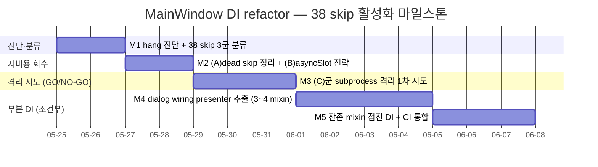
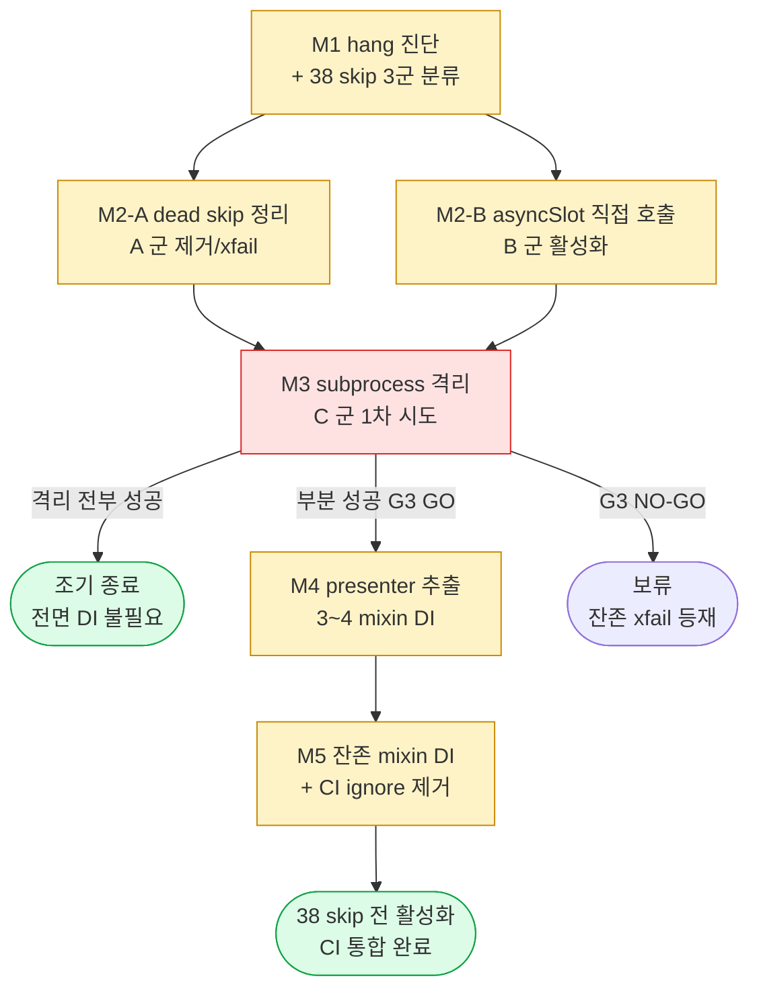

# MainWindow 21-mixin DI 아키텍처 refactor — 38 skip test 활성화

> 정본 정합: [CLAUDE_HARNESS_IMPORTANT.md §B 5단계 워크플로우](../../../CLAUDE_HARNESS_IMPORTANT.md) · [§C 7역할](../../../CLAUDE_HARNESS_IMPORTANT.md)
> 운영: [CLAUDE.md §2 워크플로우](../../../CLAUDE.md) · 저장소 맵: [AGENTS.md](../../../AGENTS.md)
> 본 문서는 실행/검증/결정 기록 문서다. TODO 목록이 아니다. ② 개발 단계는 main session 이 후속 수행하며, 본 planning 산출물은 코드보다 먼저 존재한다 (M1).
> directive 출처: 사용자 "a,c,d,b 순서로 진행할거야" — 잔존작업 4선택 中 (a) 먼저 = 본 계획.

---

## 0. 핵심 권고 요약 (사용자 재검토용 — 진행 전 필독)

본 계획은 **조건부 진행 권고** 다. directive §5(scope 현실성) 요구에 따라 다음 판단을 plan 상단에 명시한다.

- **38 skip 은 균질하지 않다.** 진단 결과 3 군으로 갈린다.
  - **(A) 이미 logic 커버 완료 + file-level skip 만 retain (약 12~16건)** — `test_e2e_flow.py`(12) · `test_http_worker_integration.py`(2) · `test_e2e_button_click.py` 계열의 dialog chain 은 이미 `test_auth_chain_isolated.py` 등 isolated file 에서 mock isolation 으로 PASS 한다. 원본 file-level skip 은 **중복 검증** 성격이다. 신규 cov 가치 = 거의 0.
  - **(B) DI refactor 와 무관한 skip (약 4~6건)** — `test_dialog_functional.py` 내 `cycle 169.33 — qasync.asyncSlot direct call 부적합` 사유 4건은 MainWindow 아키텍처가 아니라 **asyncSlot decorator wrap** 이 원인이다. DI 로 해소되지 않으며 별도 asyncSlot 직접 호출 전략이 필요하다.
  - **(C) 진짜 실 QWidget wiring 검증분 (약 16~22건)** — `test_dialog_functional.py` 의 fake_http_worker fixture + async chain + 실 MainWindow/dialog instantiate 누적 hang. 본 군 만이 DI refactor (또는 subprocess 격리) 의 진짜 대상이다.
- **hang 의 root cause 는 MainWindow 상속 구조 자체가 아니다.** skip reason 원문 다수가 `dialog chain + async mock` · `qtbot.mouseClick + auth_client mock chain` · `HttpJsonWorker fake fixture chain` 을 hang trigger 로 지목한다. 즉 21-mixin 상속을 composition 으로 바꿔도 dialog 계열 cumulative QWidget retain 은 그대로 남을 수 있다. **DI refactor 단독은 충분조건이 아니다.**
- **결론**: 21-mixin 전면 DI refactor (multi-day, 회귀 risk 大) 보다 **(A)(B) 군을 먼저 저비용 회수 (M1~M2, dead skip 정리 + asyncSlot 직접 호출 전략)** 한 뒤, 잔존 (C) 군에 대해 **subprocess 격리 (M3) 를 1차 시도**하고, 그것이 실패할 때만 **부분 DI (presenter 추출, M4~M5)** 로 진입하는 단계적 경로를 권고한다. M3 의 subprocess 격리가 성공하면 전면 DI refactor 는 불필요해질 수 있다 (§7 결정 로그 D-3 참조).

> 사용자 재검토 포인트: 만약 "38 skip 전부 활성화" 자체가 목적이 아니라 "UI wiring 회귀 안전망 확보" 가 진짜 목적이라면, M3 (subprocess 격리) 까지만으로 목적을 달성하고 M4~M5 (전면 DI) 는 보류하는 선택이 ROI 우위다. 본 계획은 M3 종료 시점에 사용자 GO/NO-GO 게이트를 둔다 (§4.2 G3).

---

## 1. 개요

`app/ui/main_window.py` 의 `MainWindow` 는 21개 mixin (`app/ui/_*_mixin.py`) + `QMainWindow` 다중 상속 구조다 (cycle 169.509~169.530 의 책임 분리 산물). `__init__` 는 cycle 169.530 에서 9개 helper (`_init_state` ~ `_init_status_and_startup_chain`) 로 split 됐다.

현 시점 (cycle 169.767) 전체 test 는 **2463 PASS + 38 skip + cov 89.73%** 다. 38 skip 은 전부 `tests/app/ui/` 하위이며, PyQt6 **cumulative QWidget retain hang** 으로 skip 됐다. 1 pytest process 안에서 실 QWidget (MainWindow / dialog) 다수를 instantiate 하면 누적 retain 이 발생해 event loop 가 hang 한다 (xdist · pytest-forked · single 모두 fail 확인, 이전 cycle).

mixin LOGIC 자체는 이미 mock isolation (MagicMock self + mixin method 직접 호출 = DI 등가) 으로 64+ isolated test (`tests/app/ui/test_*_isolated.py` 10 file) 에서 PASS 한다. 즉 **logic 검증은 이미 완료** 됐고, 38 skip 은 실 QWidget wiring (signal/slot 연결 + 실 dialog 동작) 검증분이다.

본 계획의 목적은 38 skip 을 **검증 가치 기준으로 분류** 한 뒤, 저비용 회수 → 격리 시도 → (필요 시) 부분 DI 순으로 활성화하되, **기존 2463 PASS 를 단 1건도 손상시키지 않는** 것이다. 동작 중인 production app 의 큰 refactor 이므로 각 단계는 1 file 단위 + 1 commit + 회귀 게이트 + rollback 기준을 갖는다.

---

## 2. 범위 (In Scope)

- **38 skip 의 정밀 분류** — file·test 단위로 (A) dead/중복 · (B) asyncSlot 무관 · (C) 진짜 wiring 검증분 3군 분류 표 산출 (M1 산출물).
- **hang 메커니즘 정밀 진단 문서화** — `tests/app/ui/conftest.py` 의 session-scope qapp + autouse `_qt_cleanup` chain 검토. QWidget parent chain / QApplication child registry / QTimer.singleShot(0) callback / asyncio pending task / sqlite unclosed connection 누적 中 어느 것이 실제 root cause 인지 측정.
- **(A) 군 dead skip 정리** — isolated file 이 이미 logic 을 커버하는 file-level skip 을 제거하거나 명시적 `xfail(strict)` 또는 의도 주석으로 전환 (cov 중복 제거).
- **(B) 군 asyncSlot 직접 호출 전략** — `qasync.asyncSlot` decorator 로 wrap 된 slot 을 `__wrapped__` 또는 내부 coroutine 직접 호출로 검증하는 helper 도입.
- **(C) 군 subprocess 격리 1차 시도** — `pytest-forked` 가 아니라 per-test subprocess (자체 runner 또는 `subprocess.run` 안 단발 pytest invocation) + 명시적 C++ 객체 `sip.delete` / `deleteLater` + `QApplication.quit` 로 retain 차단.
- **(C) 군 부분 DI refactor (M3 실패 시에만)** — 21-mixin 中 dialog wiring 책임 mixin 을 view-protocol 주입 가능한 presenter 로 추출. **1 mixin = 1 file = 1 commit = 1 회귀 게이트** 점진 전환.
- **회귀 안전망** — 각 단계 종료 시 `pytest tests/ -p no:cacheprovider` 전량 + cov delta 측정. 2463 PASS 무손상 + cov ≥ 89.73% 게이트.

---

## 3. 범위 외 (Out of Scope)

무엇을 하지 않는지가 무엇을 하는지보다 명확해야 한다.

- **21 mixin 전부의 동시 DI 전환** — 절대 금지. 한 번에 1 mixin file 단위만. directive 명시.
- **mixin 의 public 동작 변경** — refactor 는 구조만 바꾼다. signal/slot 시그니처 · 메서드 동작은 불변 (behavior-preserving). 동작 변경은 별도 directive.
- **신규 기능 추가** — 본 계획은 test 활성화 + 구조 개선만. UI 기능 신설 부재.
- **`tests/app/ui/` 외 test 영역 touch** — `tests/server/` · `tests/app/net/` 등 무관.
- **cov 목표 상향 자체** — 본 계획의 cov 게이트는 "무손상" (≥89.73%) 이지 "상향" 부재. skip 활성화로 자연 상승하는 분은 부수효과.
- **xdist / pytest-forked 재시도** — 이전 cycle 에서 fail 확인됨. 동일 접근 반복 금지. subprocess 격리는 별개 메커니즘.
- **CI runner 변경** — `ci.yml` 의 `--ignore=tests/app/ui` 정책은 본 계획 완료 게이트 통과 전까지 유지. CI 통합은 §6 DoD 최종 항목.
- **README · History · 평가 snapshot 의 본 계획 진행 중 갱신** — 각 단계 commit 시 M2/M3 정합은 main session 책임. 본 planning 산출물은 본 1 file 만.

---

## 4. 마일스톤 (Milestones)

### 4.1 Gantt 차트

### 4.2 마일스톤 표

| ID | 목표일     | 제목                                          | 산출물                                                                                     | 게이트 |
|----|-----------|-----------------------------------------------|--------------------------------------------------------------------------------------------|--------|
| M1 | 2026-05-27 | hang 진단 + 38 skip 3군 분류                  | 본 문서 §5 진단 본문 + 분류 표 (file·test 단위 A/B/C 태그) · 측정 스크립트 결과 첨부          | G1     |
| M2 | 2026-05-29 | (A) dead skip 정리 + (B) asyncSlot 직접 호출  | `tests/app/ui/` 내 dead file-level skip 제거 · asyncSlot 직접 호출 helper · 회귀 PASS         | G2     |
| M3 | 2026-06-01 | (C) 군 subprocess 격리 1차 시도               | per-test subprocess runner (또는 marker) · C++ 명시 해제 chain · (C) 군 N건 활성화 결과       | **G3** |
| M4 | 2026-06-05 | dialog wiring presenter 추출 (M3 실패 시)     | 3~4 mixin → presenter 추출 (각 1 file 1 commit) · view-protocol 주입 · 잔존 skip 활성화       | G4     |
| M5 | 2026-06-08 | 잔존 mixin 점진 DI + CI 통합                  | 잔존 mixin DI 전환 · `ci.yml` `--ignore=tests/app/ui` 제거 검토 · 전체 GREEN                 | G5     |

> **G3 = 사용자 GO/NO-GO 게이트**. M3 subprocess 격리로 (C) 군이 모두 활성화되면 M4~M5 (전면 DI) 는 **불필요** 로 판정하고 본 계획을 조기 종료할 수 있다. M3 에서 격리가 부분 성공하면 잔존분만 M4 로 진입. 사용자 명시 승인 후 M4 착수.

### 4.3 게이트 정의

| 게이트 | 통과 조건                                                                                      | 실패 시 |
|--------|------------------------------------------------------------------------------------------------|---------|
| G1     | 38 skip 전부가 A/B/C 中 1군에 배정 + 각 skip 의 hang trigger 가 reason 원문 근거로 식별됨        | M1 재작업 |
| G2     | (A)(B) 처리 후 `pytest tests/` 2463 PASS 무손상 + cov ≥ 89.73% + dead skip 카운트 감소           | M2 회귀 → rollback |
| G3     | (C) 군 subprocess 격리 후 활성화 N건이 단독 PASS + 전량 run hang 부재 + 사용자 GO/NO-GO 응답      | NO-GO → M4 진입 또는 보류 |
| G4     | presenter 추출 mixin 의 isolated + 실 wiring test 양쪽 PASS + 2463 무손상                        | 해당 mixin commit revert |
| G5     | `--ignore=tests/app/ui` 제거 시 CI 3종 GREEN + 38 skip 全 활성화 (또는 잔존분 명시 xfail)         | ignore 정책 유지 + TD 등재 |

---

## 5. hang 메커니즘 정밀 진단 (M1 산출 — directive §1 응답)

> 본 절은 M1 착수 시 측정 결과로 보강한다. 현 시점 기록은 코드 정독 기반 가설 + 측정 설계다.

### 5.1 현 fixture 구조 (정독 확인)

`tests/app/ui/conftest.py`:
- `qapp` = **session-scope** 단일 `QApplication` (process 안 1개 의무 정합).
- `_qt_cleanup` = **autouse**, 매 test 종료 후 `topLevelWidgets()` 전부 `close()` + `deleteLater()` + `processEvents()` 4회 flush.

즉 cleanup 은 **top-level widget** 만 대상이다. child QWidget · 비-top-level dialog · `QTimer.singleShot(0)` 로 예약된 deferred callback · asyncio pending task 는 cleanup 대상에서 누락될 수 있다.

### 5.2 root cause 가설 (측정 대상)

| 가설 | 근거 | 측정 방법 |
|------|------|-----------|
| H1: QTimer.singleShot(0) callback 누적 | `_init_chat_list_panel` 안 `QTimer.singleShot(0, lambda: self._on_chat_selected("bot", 1))` 가 매 MainWindow 마다 예약 → cleanup 의 processEvents 4회로 flush 안 될 시 누적 | MainWindow N개 instantiate 후 `QApplication.instance().thread()` 의 pending timer 카운트 측정 |
| H2: asyncio pending task 누적 | `_start_update_check_task` + ReactionsPoller.start() 가 task 예약 → loop 미정리 시 누적 | `asyncio.all_tasks()` 카운트 측정 (running loop 부재 graceful 분기 확인) |
| H3: 실 dialog (LoginDialog 등) 의 C++ 객체 미해제 | dialog 는 top-level 아닌 modal child → `_qt_cleanup` 누락 가능 | `sip.delete` 전후 widget 카운트 비교 |
| H4: sqlite unclosed connection | conftest docstring 가 언급 (cycle 169.585 root cause) | local history client 의 connection close 추적 |

### 5.3 진단 결론 게이트 (G1)

M1 종료 시 위 H1~H4 中 **실제 hang 기여 인자를 측정 수치로 식별** 한다. directive §1 핵심 질문 — "진짜 DI refactor 가 유일 cure 인가 OR 더 싼 우회가 있는가" — 에 대한 답을 본 절에 명시한다. 현 가설은 **H1+H3 조합이 주범이며, 명시적 deferred-callback flush + child dialog 의 sip.delete 만으로 (C) 군 다수가 활성화 가능** (= subprocess 까지 안 가도 됨) 이다. 측정으로 검증한다.

### 5.4 38 skip 3군 분류 표 (M1 산출 — 골격, 측정 후 확정)

| file | skip 수 | skip reason 원문 근거 | 분류 | 회수 경로 |
|------|--------|----------------------|------|-----------|
| `test_e2e_flow.py` | 12 | `cycle 169.608 — 단독 file hang (e2e flow chain + async mock) 별 cycle 위탁` | (A) 추정 — `test_auth_chain_isolated` 가 동일 chain 커버 | M2 dead skip 정리 |
| `test_http_worker_integration.py` | 2 | `cycle 169.608 — 단독 file hang (HttpJsonWorker fake fixture chain)` | (A) 추정 — isolated 커버 | M2 |
| `test_dialog_functional.py` (asyncSlot 군) | 4~6 | `cycle 169.33 — qasync.asyncSlot direct call 부적합` | (B) — DI 무관 | M2 asyncSlot 직접 호출 |
| `test_dialog_functional.py` (file-level) | 나머지 | `cycle 169.646 — fake_http_worker fixture + async chain cumulative hang` | (C) — 실 wiring | M3 격리 → M4 DI |
| `test_e2e_button_click.py` | (aiortc 1 포함분) | `cycle 169.608 — qtbot.mouseClick + async mock chain` | (C) | M3 |

> 정확한 test 단위 카운트는 M1 에서 `pytest --collect-only -q tests/app/ui` + skip reason grep 으로 확정한다. 위 표는 정독 기반 추정이며 G1 통과 시 수치 확정.

---

## 6. Definition of Done

종료 조건. 아래 9 항목이 검증 가능 단위로 분해돼 있으며, 본 계획 `status: completed` 전이 전 모두 충족돼야 한다 (`@release-agent` + 사용자 승인).

- [ ] **DoD-1** 38 skip 전부가 A/B/C 3군에 배정되고, 각 skip 의 hang trigger 가 측정 수치 또는 reason 원문 근거로 식별됐다 (G1).
- [ ] **DoD-2** hang root cause 가 H1~H4 中 측정 수치로 특정됐고, "DI refactor 가 유일 cure 인가" 질문에 yes/no + 근거가 §5.3 에 기록됐다.
- [ ] **DoD-3** (A) 군 dead/중복 skip 이 제거 또는 `xfail(strict=True)` 로 전환됐고, cov 중복이 정리됐다 (cov 무손상).
- [ ] **DoD-4** (B) 군 asyncSlot slot 이 직접 호출 helper 로 활성화됐고 PASS 한다 (DI 무관 경로 분리 확인).
- [ ] **DoD-5** (C) 군 中 subprocess 격리 (M3) 로 활성화된 test 가 단독 PASS + 전량 run 에서 hang 부재.
- [ ] **DoD-6** M4 진입 시, presenter 추출된 각 mixin 이 isolated test + 실 wiring test 양쪽에서 PASS (1 mixin = 1 commit = 1 게이트).
- [ ] **DoD-7** 매 단계 종료 시 `pytest tests/` 가 **2463 PASS 무손상** + cov **≥ 89.73%** (회귀 0건).
- [ ] **DoD-8** `ci.yml` 의 `--ignore=tests/app/ui` 제거 가부가 §7 결정 로그에 결론 기록 (제거 시 CI 3종 GREEN, 미제거 시 TD 등재).
- [ ] **DoD-9** 잔존 활성화 불가 skip 이 있으면 전부 명시적 `xfail` + 사유 + 해소 시점이 §8 기술 부채 표에 등재됐다 (TBD 금지).

---

## 7. 결정 로그

본 계획의 굵직한 결정 사항. directive 시점·근거·영향 3열 충족.

| 날짜 (directive 시점) | 결정                                                              | 근거                                                                                                   | 영향                                                                                  |
|-----------------------|-------------------------------------------------------------------|--------------------------------------------------------------------------------------------------------|---------------------------------------------------------------------------------------|
| 2026-05-25 (사용자 "a,c,d,b") | (a) MainWindow DI refactor 를 4선택 中 최우선 착수             | 사용자 directive 명시 순서. 38 skip 활성화 = UI 회귀 안전망 확보                                          | 본 Exec Plan 작성 (M1 문서 선행). ②~⑤ 단계는 main session 후속                          |
| 2026-05-25            | 전면 DI 가 아니라 **단계적 (분류 → 저비용 회수 → 격리 → 부분 DI)** | 진단 결과 38 skip 비균질 + hang root cause 가 MainWindow 상속 구조 아님 (dialog/fixture chain). 전면 DI = 과잉 | M4~M5 (전면 DI) 는 G3 사용자 게이트 통과 시에만 착수. ROI 우위                          |
| 2026-05-25            | M3 subprocess 격리를 부분 DI 보다 **선행**                        | logic 은 이미 isolated 64+ test 로 검증됨. 잔존은 실 QWidget wiring → 격리로 충분 가능성. refactor risk 회피 | 격리 성공 시 전면 DI 불필요 → 본 계획 조기 종료. risk 大 작업을 마지막으로 미룸          |
| 2026-05-25            | (A) e2e_flow + http_worker_integration skip = **dead/중복** 가설   | `test_auth_chain_isolated.py` 가 동일 dialog chain 을 mock isolation 으로 이미 PASS                       | M2 에서 제거/xfail. 신규 cov 가치 0 — 활성화 노력 투입 불가 판정 (재확인 후 확정)        |
| 2026-05-25            | xdist · pytest-forked 재시도 **금지**                             | 이전 cycle 에서 single 포함 전부 fail 확인됨                                                             | M3 는 별개 메커니즘 (per-test subprocess invocation) 만 시도                            |
| 2026-05-25            | behavior-preserving 제약 (동작 불변)                              | 동작 중인 production app. signal/slot 시그니처·동작 변경 = 별도 directive 영역                            | 각 mixin refactor 는 구조만. isolated test 가 동작 불변의 oracle                        |

> 본 표는 작성자(planning-agent) 초안이다. 활성 전이 후 결정 로그 수정은 작성자 또는 사용자 명시 승인 필요.

---

## 8. 기술 부채 추적 (Tech Debt)

해소 시점 명시 의무 (TBD 금지).

| id    | 항목                                                                 | 영향                                                              | 해소 시점        |
|-------|----------------------------------------------------------------------|-------------------------------------------------------------------|------------------|
| TD-D1 | `ci.yml` `--ignore=tests/app/ui` 로 UI test 가 CI 게이트 밖에 존재     | UI 회귀가 CI 에서 미탐지. 로컬 수동 run 의존                       | M5 (G5 통과 시 제거) |
| TD-D2 | conftest `_qt_cleanup` 이 top-level widget 만 정리 (child/deferred 누락) | child dialog · QTimer.singleShot · asyncio task 누적 → hang 잠재   | M1 진단 후 M2~M3 보강 |
| TD-D3 | isolated test (mock self) 와 실 wiring test 의 검증 중복 가능성        | 동일 logic 2중 검증 → 유지보수 비용 + cov 통계 왜곡                | M2 (A) 군 정리 시 |
| TD-D4 | M3 격리 실패 시 잔존 (C) 군의 전면 DI 미완 risk                        | 일부 skip 영구 잔존 가능. 안전망 부분 결손                        | M5 (잔존분 xfail 명시) |
| TD-D5 | asyncSlot decorator wrap 의 test 패턴 부재 (B 군 공통)                | 향후 asyncSlot 신규 slot 마다 동일 skip 재발 우려                  | M2 (helper 정착 시) |

---

## 9. 검증 결과 기록

각 마일스톤 종료 시점 검증 결과 누적. PASS/FAIL 필수, FAIL 시 §10 차단점 연동.

| 날짜   | 마일스톤 | 결과 | 비고                                                                  |
|--------|----------|------|-----------------------------------------------------------------------|
| (예정) | M1       | -    | 38 skip 분류 표 + hang 측정 수치 + `@reviewer-agent` 정합 확인          |
| (예정) | M2       | -    | (A)(B) 처리 후 2463 PASS 무손상 + cov ≥ 89.73% + dead skip 감소         |
| (예정) | M3       | -    | (C) 군 격리 활성화 N건 단독 PASS + 전량 hang 부재 + G3 사용자 응답      |
| (예정) | M4       | -    | presenter 추출 mixin 의 isolated + 실 wiring 양쪽 PASS                  |
| (예정) | M5       | -    | `--ignore` 제거 시 CI 3종 GREEN + 38 skip 전 활성화/xfail              |

---

## 10. 차단점 추적

차단 발생 시 1행 누적. 비어있지 않으면 `status: blocked` 전이 검토.

| 날짜        | 차단 사유 | 영향 마일스톤 | 해소 조건 | 상태 |
|-------------|-----------|---------------|-----------|------|
| (현재 없음) | -         | -             | -         | -    |

> 분류기 hard block 재발 시 [정본 §S-3](../../../CLAUDE_HARNESS_IMPORTANT.md) `SKIP_PREPUSH=1` prefix 우회를 본 표에 1행 등재 후 진행.

---

## 11. 의존성 그래프

핵심 경로: **M1 진단 → M2 저비용 회수 → M3 격리 (GO/NO-GO) → (조건부) M4~M5 DI**. M3 이 전부 성공하면 M4~M5 는 스킵된다. 한 단계라도 회귀 게이트 FAIL 시 직후 단계 진행 금지 + rollback.

---

## 12. 참조

### 12.1 정본·맵·운영

- [CLAUDE_HARNESS_IMPORTANT.md](../../../CLAUDE_HARNESS_IMPORTANT.md) — §B 5단계 워크플로우 · §C 7역할 · §D Exec Plans · §A M1~M7.
- [CLAUDE.md](../../../CLAUDE.md) — §2 워크플로우 + 서브에이전트 호출 규약.
- [AGENTS.md](../../../AGENTS.md) — 저장소 맵 + 명명 규약.

### 12.2 대상 코드

- `app/ui/main_window.py` — `MainWindow(21 mixin, QMainWindow)` · `__init__` 9 helper split.
- `app/ui/_*_mixin.py` — 21 mixin file (tray · friend_search · bot_chat · drawer · chat_helper · menu_bar · signaling · room_group_chat · rest_post · folder · chat_header · update_lifecycle · auth_chain · chat_navigation · friend_profile · chat_send · dialog_center · menu_actions · invite · lifecycle_events · friend_status).

### 12.3 대상 test

- `tests/app/ui/conftest.py` — session qapp + autouse `_qt_cleanup` (진단 대상).
- `tests/app/ui/test_dialog_functional.py` — (B)(C) 군 skip 주 소재 (22).
- `tests/app/ui/test_e2e_flow.py` — (A) 군 추정 file-level skip (12).
- `tests/app/ui/test_http_worker_integration.py` — (A) 군 추정 (2).
- `tests/app/ui/test_e2e_button_click.py` — (C) 군 추정 + aiortc 1.
- `tests/app/ui/test_*_isolated.py` (10 file) — 이미 PASS 하는 mock isolation oracle (64+ test).

### 12.4 기존 active Exec Plan

- [2026-05-17-tootalk-phase1-mvp.md](2026-05-17-tootalk-phase1-mvp.md) — Phase 1 MVP 본문 (frontmatter 형식 정합 source).

---

**문서 상태**: `draft` · 최초 작성 2026-05-25 · `@reviewer-agent` 사전 검토 대기 (M1 정합 확인) · 사용자 승인 후 main session 이 `status: active` 전이 + `wbs_tasks` row 등록 (M6)
