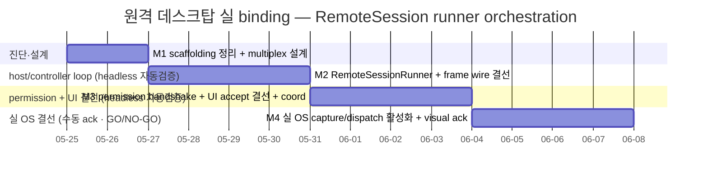
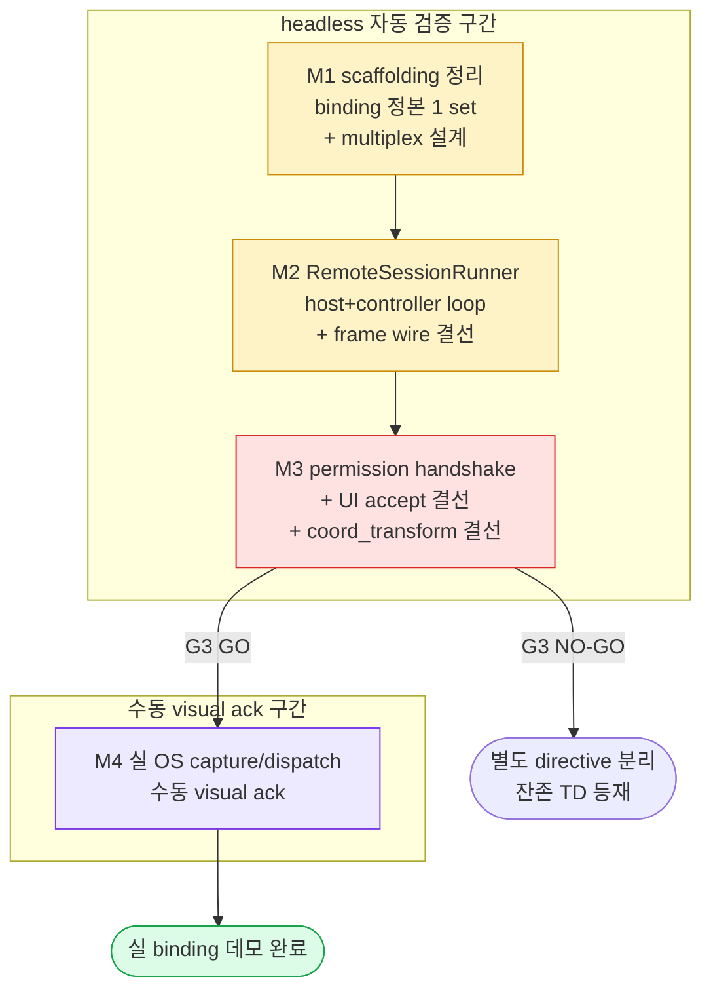

# Phase 5 친구간 원격 데스크탑 제어 실 binding — RemoteSession runner orchestration

> 정본 정합: [CLAUDE_HARNESS_IMPORTANT.md §B 5단계 워크플로우](../../../CLAUDE_HARNESS_IMPORTANT.md) · [§C 7역할](../../../CLAUDE_HARNESS_IMPORTANT.md)
> 운영: [CLAUDE.md §2 워크플로우](../../../CLAUDE.md) · 저장소 맵: [AGENTS.md](../../../AGENTS.md)
> 차별화 근거: 메모리 `project_phase2_remote_control_differentiator.md` (친구간 1:1, Pattern A 도움 + Pattern B 제어)
> 본 문서는 실행/검증/결정 기록 문서다. TODO 목록이 아니다. ② 개발 단계는 main session 이 후속 수행하며, 본 planning 산출물은 코드보다 먼저 존재한다 (M1).
> directive 출처: 사용자 "P0 완료 후 원격 데스크탑 실 binding 진입작업해" — 잔존작업 (c) = Phase 5 친구간 원격 데스크탑 제어 실 binding.

---

## 0. 핵심 권고 요약 (사용자 재검토용 — 진행 전 필독)

본 계획은 **자동 검증 가능 범위와 사용자 직접 검증 필요 범위를 명확히 분리**한 단계적 진행을 권고한다. directive §5(platform 제약/검증)·§6(scope 현실성) 요구에 답한다.

### 0.1 scaffolding 정밀 매핑 결론 — "빌딩블록 전부 존재"는 절반만 맞다

코드 정독 결과 빌딩블록 상태가 **3 군으로 갈린다**. directive 배경의 "전부 존재 + unit test 됨" 전제를 보정한다.

- **(존재 + 실 OS binding 구현됨, 단 실 OS 환경 미검증)** — `app/remote/capture.py` 의 `MacOSQuartzBackend`/`WindowsGDIBackend`/`LinuxX11Backend` (cycle 169.416/421) 와 `app/remote/input_forward.py` 의 `MacOSCGEventBackend`/`WindowsSendInputBackend`/`LinuxXTestBackend` 는 **실 OS API 호출 코드가 들어가 있다** (Quartz CGDisplayCreateImage / Win32 BitBlt / Xlib XGetImage / CGEvent / SendInput / XTest). 단 test 는 전부 `MockCaptureBackend`/`MockInputForwardBackend` 경유라 **실 OS 호출 경로는 1회도 실행 검증된 바 없다**.
- **(존재하나 skeleton — None 반환, 중복/사문화 의심)** — `app/remote/screen_capture.py`(`ScreenCaptureBackend` 계열) + `app/remote/input_dispatch.py`(`InputDispatchBackend` 계열) 는 **전부 None 반환 skeleton** 이다. 위 capture.py/input_forward.py 와 **기능 중복**이며, 어느 쪽이 정본 binding layer 인지 미정리 상태다 (M1 정리 대상).
- **(부재 — 본 계획의 진짜 산출물)** — host/controller 양측 loop 를 살아있는 DataChannel 위에서 묶는 **RemoteSession runner(orchestrator) 가 전혀 없다**. `_on_remote_request`/`_on_remote_connect`(`app/ui/_chat_header_mixin.py`) 는 `RemoteCallDialog` modal 만 열고 끝난다. dialog 의 `accepted_signal`/`rejected_signal`/`cancelled_signal` 은 정의돼 있으나 **연결처(slot)가 없다**. permission handshake(PermissionRequest/Grant)는 dataclass 만 있고 **채널 위 교환 코드 부재**.

### 0.2 e2e/integration chain 의 실체 — mock orchestration 이다 (실 binding 아님)

directive §1 핵심 질문 — "e2e 원격 데스크탑 chain(8 PASS)이 실 binding 인지 mock 인지" — 정독 답:

- `tests/integration/test_remote_control_e2e.py` (8 test) = **MockCaptureBackend.capture() → captured_to_remote_frame() dataclass 변환 + RemoteInput envelope 검증 + RemoteSession dataclass binding** 만 검증한다. **DataChannel 송수신 부재, 실 OS 호출 부재, host/controller loop 부재.**
- `tests/integration/test_remote_control_chain.py` (10 class) = **coord_transform 수치 정합 + capture/dispatch skeleton 의 None graceful + audit emit mock** 검증. `TestFullChainMock` 도 `InputDispatchBackend().dispatch()` 가 None 반환하는 skeleton 을 통과시킨다 (실 dispatch 아님).
- 결론: 현 green test 는 **데이터 모델 + 좌표 수학 + audit** 의 oracle 이다. **"실제로 친구 PC 가 제어되는가"는 단 1건도 검증된 바 없다.** 본 계획이 그 공백을 메운다.

### 0.3 진행 권고 — 자동 검증 → 수동 ack 순서 + GO/NO-GO 게이트

- **M1~M3 (DataChannel orchestration + permission handshake + UI 결선) 은 전부 headless 자동 검증 가능** — aiortc loopback pair + MockCapture/MockInput + offscreen Qt. 실 OS 권한 무관. 본 구간이 본 계획의 **검증 가능한 핵심 가치**다.
- **M4 (실 OS capture/dispatch 활성화) 만 수동 visual ack 필요** — macOS Screen Recording/Accessibility 권한 grant + PyObjC 설치 + 실제 두 머신(또는 동일 머신 self-loop)에서 마우스가 실제로 움직이는지 사람이 눈으로 확인. 자동화 불가 구간이며 `MANUAL_TESTS.md` 와 연계한다.
- **G3 = 사용자 GO/NO-GO 게이트.** M3 종료(headless full chain green) 시점에서, 실 OS 결선(M4)을 본 계획에서 진행할지 또는 별도 directive 로 분리할지 사용자가 결정한다. directive §6 "multi-cycle 추정" 정합 — M1~M3 만으로도 "친구 화면이 내 창에 뜨고 내 클릭이 채널로 전달됨(mock dispatch)"까지 도달하며, M4 는 OS 권한 + 물리 장비 의존이라 ROI/risk 가 다르다.

> 사용자 재검토 포인트: 진짜 목적이 "실제로 친구 PC 가 제어되는 데모"라면 M4 까지 필수다. 진짜 목적이 "orchestration 결선 + 회귀 안전망"이라면 M1~M3 로 충분하고 M4 는 데모 직전 1회 수동 검증으로 미룰 수 있다.

---

## 1. 개요

빌딩블록 (protocol/permission/capture/input_forward/coord_transform/peer_connection) 은 **데이터 모델 + 좌표 수학 + OS API 호출 코드** 수준까지 존재한다. 빠진 것은 이를 **살아있는 WebRTC DataChannel 위에서 양방향 loop 로 묶는 orchestration** 이다.

원격 데스크탑 1 세션의 방향 정의 (`app/remote/protocol.py` docstring 정합):

- **target (피제어)** — 화면 capture → `RemoteFrame` encode → DataChannel send. 동시에 `RemoteInput` recv → `input_forward.apply_events()` 로 OS 적용.
- **controller (제어)** — `RemoteFrame` recv → 화면 렌더. 동시에 로컬 마우스/키보드 capture → `RemoteInput` encode → DataChannel send.

본 계획은 위 두 loop 를 구동하는 `RemoteSessionRunner` (host 쪽 + controller 쪽) 를 신설하고, permission handshake 를 채널 위에서 교환하며, 기존 `_on_remote_request`/`_on_remote_connect` 의 dialog accept 를 실 session 시작에 결선한다. file_sender/file_receiver 가 이미 검증한 **DataChannel chunk 송수신 패턴 + bufferedAmount backpressure** 를 재사용한다.

현 시점 (2026-05-25) 전체 test 는 2463 PASS + cov 89.73% 다. 본 계획의 모든 단계는 **기존 PASS 를 1건도 손상시키지 않는** 것을 게이트로 한다.

---

## 2. 범위 (In Scope)

- **scaffolding 정리 (M1)** — `capture.py`/`input_forward.py` (실 binding 보유) 와 `screen_capture.py`/`input_dispatch.py` (skeleton) 의 중복을 진단하고, 정본 binding layer 를 1 set 으로 확정 (사문화 모듈은 deprecate 결정을 §7 에 기록).
- **frame/input multiplex 설계 + 채널 분리 (M1)** — 기존 file transfer DataChannel 과 원격 frame/input 채널을 분리할지 공유할지 결정. 단일 `RTCPeerConnection` 위 별도 label DataChannel (`tootalk-remote-frame` / `tootalk-remote-input`) 분리 권고안 검토.
- **RemoteSessionRunner 신설 (M2)** — host loop + controller loop 의 asyncio task orchestrator. `build_capture_backend`/`select_input_backend` 주입 가능 (DI) 구조 — 실 OS backend 와 Mock backend 를 동일 runner 가 구동.
- **frame encode/decode wire 결선 (M2)** — `RemoteFrame` ↔ DataChannel bytes 직렬화. file transfer 의 chunk 분할 (16KB) + backpressure (bufferedAmount high/low) 패턴 재사용. raw_rgb full frame 의 대역 현실성 검토 + frame rate throttle 1차값.
- **permission handshake on-channel (M3)** — dialog accept → `PermissionRequest` send → 상대 `PermissionGrant`/Deny recv → `check_grant_active` 게이트 + `derive_revoke_token` → 1-click revoke 전파. 무단 제어 차단 (grant 부재 시 input apply 거부).
- **UI 결선 (M3)** — `_on_remote_request`/`_on_remote_connect` 의 `RemoteCallDialog.accepted_signal` → runner.start() 결선. controller 쪽 frame 렌더 widget (`remote_control_dialog.py` 활용) + 로컬 input capture → `RemoteInput` 송신.
- **coord_transform 결선 + rate 조절 (M3)** — controller view 좌표 → `transform_coordinates` → target 절대 좌표. `RemoteScreenInfo` 양측 채널 교환 (기존 round-trip test 가 base). frame rate/대역 동적 조절 1차.
- **실 OS capture/dispatch 활성화 (M4 — 조건부)** — macOS Screen Recording + Accessibility 권한 grant flow + 실 backend 의 실제 1 frame capture/실제 1 click dispatch 의 수동 visual ack.
- **회귀 안전망** — 각 단계 종료 시 `pytest tests/` 전량 + cov delta. 2463 PASS 무손상 + cov ≥ 89.73% 게이트. headless 구간은 aiortc loopback + Mock backend 로 자동화.

---

## 3. 범위 외 (Out of Scope)

무엇을 하지 않는지가 무엇을 하는지보다 명확해야 한다.

- **ABR encoding (h264/vp9)** — 본 계획은 raw_rgb (+ 필요 시 PNG/JPEG) 까지만. video codec 통합은 별도 directive. (protocol.py docstring 의 "별개 cycle" 정합)
- **multi-monitor 선택 dispatch** — 본 계획은 primary monitor 단일. `list_monitors` 다중 분기는 범위 외.
- **modifier key stateful tracking** — shift down → A → shift up 순서 보장은 input_forward docstring 의 "별개 cycle". 본 계획은 4 event (mouse_move/click/key_down/key_up) raw forward 까지.
- **input rate limit / flood 방어** — per-second cap 은 본 계획의 frame rate throttle 와 구분되는 보안 항목. 별도 directive.
- **Pattern B (unattended control) 의 2FA + 항상 visible indicator** — permission.py 가 정의한 CONTROL mode 의 강한 인증 chain 은 본 계획에서 **HELP mode (expiry + 1-click revoke) 까지만 결선**. Pattern B 의 2FA 는 별도 directive (보안 review 필요).
- **Wayland 입력/capture** — X11 XTest/XGetImage 까지. Wayland (screencopy-unstable-v1 + libinput) 은 범위 외 (capture.py/input_forward docstring 정합).
- **mesh (N-peer) 원격** — 친구간 1:1 만. `MeshManager` 의 N-peer fan-out 은 원격 데스크탑 대상 아님.
- **streaming 통합** — 메모리 `project_streaming_deprioritized.md` 정합. chzzk/kick/twitch 무관.
- **코드 직접 작성** — 본 산출물은 planning 1 문서. ②~⑤ 단계는 main session 후속 (M1 문서 선행).
- **README/History/평가 snapshot 의 본 계획 진행 중 갱신** — 각 단계 commit 시 M2/M3 정합은 main session 책임.

---

## 4. 마일스톤 (Milestones)

### 4.1 Gantt 차트



### 4.2 마일스톤 표

| ID | 목표일     | 제목                                              | 산출물                                                                                                  | 검증 유형 | 게이트 |
|----|-----------|---------------------------------------------------|---------------------------------------------------------------------------------------------------------|-----------|--------|
| M1 | 2026-05-27 | scaffolding 정리 + frame/input multiplex 설계     | §5 정밀 매핑 본문 + binding layer 정본 1 set 확정 + 채널 분리/공유 결정 + sequence diagram                | 자동      | G1     |
| M2 | 2026-06-01 | RemoteSessionRunner + frame wire 결선             | `app/remote/session_runner.py` 신설 (host+controller loop) + RemoteFrame DataChannel 직렬화 + chunk/backpressure 재사용 + aiortc loopback test green | 자동      | G2     |
| M3 | 2026-06-06 | permission handshake on-channel + UI accept 결선  | permission send/recv/revoke chain + `_on_remote_request`/`_on_remote_connect` accept 결선 + controller 렌더 + coord_transform 결선 + headless full chain green | 자동      | **G3** |
| M4 | 2026-06-11 | 실 OS capture/dispatch 활성화 (M3 G3 GO 시)       | macOS 권한 grant flow + 실 backend 1 frame capture/1 click dispatch 의 수동 visual ack + `MANUAL_TESTS.md` 항목 추가 | **수동**  | G4     |

> **G3 = 사용자 GO/NO-GO 게이트.** M3 종료 시점에 "headless full chain (mock OS backend) green" 이 달성된다. 실 OS 결선(M4)을 본 계획에서 이어갈지 또는 별도 directive 로 분리할지 사용자가 결정한다.

### 4.3 게이트 정의

| 게이트 | 통과 조건                                                                                                  | 실패 시 |
|--------|------------------------------------------------------------------------------------------------------------|---------|
| G1     | binding layer 정본 1 set 확정 (capture.py vs screen_capture.py 중복 해소 결정) + 채널 분리/공유 결정 기록 + sequence diagram 이 §5 에 존재 | M1 재작업 |
| G2     | aiortc loopback pair 에서 target loop 가 MockCapture frame 을 DataChannel 로 보내고 controller loop 가 수신/디코드 → 자동 assert PASS + `pytest tests/` 2463 무손상 + cov ≥ 89.73% | M2 회귀 → rollback |
| G3     | permission grant 없이 input apply 거부 + grant 후 apply 허용 + revoke 후 차단의 자동 검증 + dialog accept → runner.start 결선의 offscreen Qt test PASS + 전량 green + **사용자 GO/NO-GO 응답** | NO-GO → M4 보류 + 잔존 TD 등재 |
| G4     | 실 OS 환경에서 (1) 화면 1 frame 이 실제 캡처돼 controller 창에 표시 (2) controller 클릭이 target OS 에서 실제 마우스 이동을 일으킴 의 사람 눈 확인 + `MANUAL_TESTS.md` 기록 | 실패 항목 TD 등재 + 권한/장비 차단점 §10 기록 |

---

## 5. scaffolding 정밀 매핑 (M1 산출 — directive §1·§2 응답)

> 본 절은 코드 정독 (2026-05-25) 기반 확정 매핑이다. M1 착수 시 중복 해소 결정 + sequence diagram 으로 보강한다.

### 5.1 모듈별 실체 매핑

| 모듈 | 실 OS 호출 코드 | test 검증 경로 | 본 계획 역할 |
|------|----------------|----------------|--------------|
| `app/remote/protocol.py` | 부재 (순수 데이터 모델) | dataclass invariant 검증 (실 검증) | wire format 정본 — 그대로 사용 |
| `app/remote/permission.py` | 부재 (순수 모델 + token) | `check_grant_active`/`derive_revoke_token` 실 검증 | handshake 정본 — M3 결선 |
| `app/remote/capture.py` | **존재** (Quartz/GDI/X11 actual binding, cycle 169.416/421) | **MockCaptureBackend 만 검증** — 실 OS 경로 미실행 | M4 에서 실 OS 활성화 대상 |
| `app/remote/input_forward.py` | **존재** (CGEvent/SendInput/XTest actual binding) | **MockInputForwardBackend 만 검증** — 실 OS 경로 미실행 | M4 에서 실 OS 활성화 대상 |
| `app/remote/screen_capture.py` | skeleton (None 반환) | None graceful 검증만 | **중복 의심 — M1 deprecate 결정** |
| `app/remote/input_dispatch.py` | skeleton (None 반환) | None graceful 검증만 | **중복 의심 — M1 deprecate 결정** |
| `app/remote/coord_transform.py` | PyQt6 graceful (실 detect) | 좌표 수학 실 검증 (광범위) | M3 결선 — 그대로 사용 |
| `app/rtc/peer_connection.py` | aiortc actual (graceful import) | aiortc loopback 검증분 존재 | M2 DataChannel 송수신 base |
| `app/rtc/file_sender.py` | DataChannel chunk + backpressure | 광범위 검증 (실 패턴) | M2 chunk/backpressure 패턴 재사용 source |

### 5.2 핵심 미결 결정 (M1 게이트 G1 대상)

- **D-A 중복 binding layer 해소** — `capture.py`(실 binding) vs `screen_capture.py`(skeleton), `input_forward.py`(실 binding) vs `input_dispatch.py`(skeleton). 4 모듈이 동일 책임을 2중으로 가진다. **권고: capture.py + input_forward.py 를 정본으로 채택, screen_capture.py + input_dispatch.py 는 deprecate 표시** (즉시 삭제는 회귀 risk — test 의존 확인 후). M1 에서 import 의존 grep 으로 확정.
- **D-B 채널 분리 vs 공유** — 원격 frame (대용량 raw_rgb) 과 input (소형 빈번) 을 file transfer 채널과 같은 DataChannel 에 multiplex 할지, 별도 label 채널로 분리할지. **권고: 별도 label 2 채널 분리** (`tootalk-remote-frame` ordered=false + `tootalk-remote-input` ordered=true). frame 은 최신성 우선 (드롭 허용), input 은 순서 보장 필수. file transfer 와 혼선 차단.
- **D-C frame 직렬화 포맷** — `RemoteFrame` 의 payload(bytes) + 메타(frame_id/width/height/format) 를 DataChannel 1 message 로 어떻게 packing 할지. file_sender 의 `encode_chunk`(file_id + seq + payload) 패턴을 frame_id + 메타 + payload 로 차용.

### 5.3 권고 sequence (M1 에서 mermaid sequenceDiagram 으로 확정)

```
controller                         target
  | --- PermissionRequest --------> |   (HELP mode, duration, reason)
  | <-- PermissionGrant ----------- |   (revoke_token, expires_at)
  | <-- RemoteScreenInfo ---------- |   (target 화면 메타)
  | --- RemoteScreenInfo ---------> |   (controller view 메타)
  |                                 |   target: capture loop 시작
  | <== RemoteFrame (frame ch) ==== |   (raw_rgb, frame_id++, throttled)
  | --- RemoteInput (input ch) ---> |   (coord_transform 적용 좌표)
  |                                 |   target: check_grant_active → apply_events
  | --- revoke(token) ------------> |   (1-click → 양측 loop stop)
```

---

## 6. Definition of Done

종료 조건. 아래 10 항목이 검증 가능 단위로 분해돼 있으며, `status: completed` 전이 전 모두 충족돼야 한다 (`@release-agent` + 사용자 승인). **[자동]/[수동]** 태그로 검증 유형 분리.

- [ ] **DoD-1 [자동]** binding layer 중복 (capture.py/screen_capture.py · input_forward.py/input_dispatch.py) 이 정본 1 set 으로 정리됐고, deprecate 결정이 §7 에 기록됐다 (D-A).
- [ ] **DoD-2 [자동]** 채널 분리/공유 결정 (D-B) 과 frame 직렬화 포맷 (D-C) 이 §5.2 에 확정됐고, sequence diagram 이 §5.3 에 mermaid 로 존재한다.
- [ ] **DoD-3 [자동]** `RemoteSessionRunner` 가 host loop + controller loop 를 asyncio task 로 구동하며, capture/input backend 를 주입 가능 (DI) 하다 — Mock backend 로 단위 검증 PASS.
- [ ] **DoD-4 [자동]** aiortc loopback pair 에서 target → controller 의 `RemoteFrame` DataChannel 송수신 + 디코드가 자동 assert 로 PASS 하고, chunk 분할 + backpressure 가 적용된다.
- [ ] **DoD-5 [자동]** controller → target 의 `RemoteInput` 이 input 채널로 전달되고, target 쪽 `check_grant_active` 게이트 통과 시 `apply_events` (Mock) 가 호출됨이 검증된다.
- [ ] **DoD-6 [자동]** permission handshake — grant 부재 시 input apply 거부 + grant 후 허용 + revoke 후 차단 의 3 상태가 자동 검증된다 (무단 제어 차단 oracle).
- [ ] **DoD-7 [자동]** `_on_remote_request`/`_on_remote_connect` 의 `RemoteCallDialog.accepted_signal` → runner.start() 결선이 offscreen Qt test 로 PASS 하고, controller 쪽 frame 렌더 + 로컬 input capture → `RemoteInput` 송신이 결선됐다.
- [ ] **DoD-8 [자동]** controller view 좌표 → `transform_coordinates` → target 절대 좌표 결선이 `RemoteScreenInfo` 양측 교환과 함께 검증되고, frame rate throttle 1차값이 적용된다.
- [ ] **DoD-9 [수동]** (G3 GO 시) 실 OS 환경에서 화면 1 frame 실제 캡처 → controller 창 표시 + controller 클릭 → target OS 실제 마우스 이동 이 사람 눈으로 확인되고 `MANUAL_TESTS.md` 에 기록됐다.
- [ ] **DoD-10 [자동]** 매 단계 종료 시 `pytest tests/` 가 **2463 PASS 무손상** + cov **≥ 89.73%** (회귀 0건). M4 미진행 시 잔존 항목은 §8 기술 부채 표에 해소 시점과 함께 등재됐다 (TBD 금지).

---

## 7. 결정 로그

본 계획의 굵직한 결정 사항. directive 시점·근거·영향 3열 충족.

| 날짜 (directive 시점) | 결정                                                                 | 근거                                                                                                       | 영향                                                                                       |
|-----------------------|----------------------------------------------------------------------|------------------------------------------------------------------------------------------------------------|--------------------------------------------------------------------------------------------|
| 2026-05-25 (사용자 "P0 완료 후 원격 데스크탑 실 binding") | Phase 5 원격 데스크탑 실 binding 을 잔존작업 (c) 로 착수 | 사용자 directive 명시. 메모리 `project_phase2_remote_control_differentiator.md` 차별화 정합              | 본 Exec Plan 작성 (M1 문서 선행). ②~⑤ 는 main session 후속                                  |
| 2026-05-25            | **headless 자동검증 (M1~M3) 을 실 OS 결선 (M4) 보다 선행 + 분리**      | capture/input_forward 의 실 OS 경로는 1회도 실행 검증된 바 없음. orchestration 부재가 진짜 공백. 실 OS 는 권한/장비 의존 | M1~M3 으로 "친구 화면 표시 + 클릭 채널 전달 (mock dispatch)" 도달. M4 는 G3 사용자 게이트 후 | 
| 2026-05-25            | **binding 정본 = capture.py + input_forward.py, skeleton 2종 deprecate (권고)** | capture.py/input_forward.py 는 실 OS 호출 코드 보유. screen_capture.py/input_dispatch.py 는 None 반환 중복 | M1 에서 import 의존 grep 후 확정. 사문화 모듈 정리로 혼선 차단 (즉시 삭제는 회귀 확인 후) |
| 2026-05-25            | **frame/input 별도 label 2 채널 분리 (권고, D-B)**                    | frame (대용량 raw_rgb, 최신성 우선) 과 input (소형, 순서 필수) 의 QoS 가 상반. file transfer 채널과 혼선 차단 | frame ch ordered=false, input ch ordered=true. M1 G1 에서 확정                              |
| 2026-05-25            | **Pattern A (HELP) 까지만 결선, Pattern B (CONTROL 2FA) 는 범위 외**   | Pattern B 의 2FA + 항상 visible indicator 는 보안 review 필요. HELP (expiry + 1-click revoke) 가 데모 차별화 핵심 | M3 은 HELP mode handshake 만. Pattern B 는 별도 directive (§3 범위 외)                       |
| 2026-05-25            | **file_sender chunk + bufferedAmount backpressure 패턴 재사용**       | file transfer 가 이미 광범위 검증한 DataChannel 대용량 송신 패턴. raw_rgb full frame = 대용량               | M2 frame wire 결선이 검증된 패턴 위에 구축 — 신규 송신 로직 risk 최소화                      |

> 본 표는 작성자(planning-agent) 초안이다. 활성 전이 후 결정 로그 수정은 작성자 또는 사용자 명시 승인 필요.

---

## 8. 기술 부채 추적 (Tech Debt)

해소 시점 명시 의무 (TBD 금지).

| id    | 항목                                                                       | 영향                                                              | 해소 시점        |
|-------|----------------------------------------------------------------------------|-------------------------------------------------------------------|------------------|
| TD-R1 | `screen_capture.py` + `input_dispatch.py` skeleton 이 capture.py/input_forward.py 와 중복 | binding layer 2중 → 신규 작업자 혼선 + 유지보수 비용                | M1 (deprecate 결정 + 의존 grep) |
| TD-R2 | `protocol.py`/`capture.py` 등 기존 docstring 의 U+CE21 단독 + 소유격 조사 2연쇄 패턴 | BPE 손상 토큰 잠재 (기존 코드). reviewer FAIL 패턴 잠재             | M4 이후 별도 doc-gardening cycle (본 계획 신규 코드는 위생 준수) |
| TD-R3 | raw_rgb full frame 의 대역폭 (1080p × 3 byte × N fps = 수백 Mbps)            | 실 네트워크에서 대역 초과 → frame 적체. ABR 부재                    | M2 throttle 1차값 + ABR 은 별도 directive (§3 범위 외) |
| TD-R4 | 실 OS capture/dispatch 의 실행 검증 부재 (Mock 만 green)                     | 실 OS 환경에서 권한/API 실패 가능성 미탐지                          | M4 (G3 GO 시 수동 ack) / NO-GO 시 데모 직전 1회 수동 |
| TD-R5 | macOS Screen Recording + Accessibility 권한 grant flow 코드 부재             | 권한 미grant 시 capture/dispatch silent fail. 사용자 안내 UI 부재   | M4 (권한 flow + 안내 dialog) |
| TD-R6 | Pattern B (CONTROL) 의 2FA + 항상 visible indicator 미결선                   | unattended control 보안 게이트 부재. HELP mode 만 가용             | 별도 directive (보안 review 후 신규 Exec Plan) |
| TD-R7 | qasync + asyncio loop 위 Qt widget 의 cumulative hang (앞선 (a) 패턴)        | M3 UI 결선 test 가 실 QWidget 누적 시 hang 가능                    | M3 (mock isolation pattern 적용 — DI runner + offscreen) |

---

## 9. 검증 결과 기록

각 마일스톤 종료 시점 검증 결과 누적. PASS/FAIL 필수, FAIL 시 §10 차단점 연동.

| 날짜   | 마일스톤 | 결과 | 비고                                                                       |
|--------|----------|------|----------------------------------------------------------------------------|
| (예정) | M1       | -    | scaffolding 매핑 + 중복 해소 결정 + sequence diagram + `@reviewer-agent` 정합 |
| (예정) | M2       | -    | RemoteSessionRunner + aiortc loopback frame 송수신 green + 2463 무손상       |
| (예정) | M3       | -    | permission 3 상태 + UI accept 결선 + coord 결선 + headless full chain green + G3 응답 |
| (예정) | M4       | -    | 실 OS capture/dispatch 수동 visual ack + `MANUAL_TESTS.md` 기록 (G3 GO 시)   |

---

## 10. 차단점 추적

차단 발생 시 1행 누적. 비어있지 않으면 `status: blocked` 전이 검토.

| 날짜        | 차단 사유 | 영향 마일스톤 | 해소 조건 | 상태 |
|-------------|-----------|---------------|-----------|------|
| (현재 없음) | -         | -             | -         | -    |

> macOS Screen Recording / Accessibility 권한 미grant 또는 PyObjC 미설치 시 M4 차단 → 본 표에 1행 등재 + TD-R5 연동.
> 분류기 hard block 재발 시 [정본 §S-3](../../../CLAUDE_HARNESS_IMPORTANT.md) `SKIP_PREPUSH=1` prefix 우회를 본 표에 1행 등재 후 진행.

---

## 11. 의존성 그래프



핵심 경로: **M1 정리/설계 → M2 runner + frame wire → M3 permission + UI 결선 (G3 GO/NO-GO) → (조건부) M4 실 OS**. M1~M3 은 전부 headless 자동 검증 (aiortc loopback + Mock backend + offscreen Qt). M4 만 실 OS 권한 + 수동 visual ack. 한 단계라도 회귀 게이트 FAIL 시 직후 단계 진행 금지 + rollback.

---

## 12. 참조

### 12.1 정본·맵·운영

- [CLAUDE_HARNESS_IMPORTANT.md](../../../CLAUDE_HARNESS_IMPORTANT.md) — §B 5단계 워크플로우 · §C 7역할 · §D Exec Plans · §A M1~M7.
- [CLAUDE.md](../../../CLAUDE.md) — §2 워크플로우 + 서브에이전트 호출 규약.
- [AGENTS.md](../../../AGENTS.md) — 저장소 맵 + 명명 규약.
- 메모리 `project_phase2_remote_control_differentiator.md` — 친구간 1:1, Pattern A 도움 + Pattern B 제어 차별화 근거.

### 12.2 대상 코드 (정독 확인 2026-05-25)

- `app/remote/protocol.py` — `RemoteFrame`/`RemoteInput`/`RemoteSession` + `FrameFormat`/`InputEventType` enum (wire format 정본).
- `app/remote/permission.py` — `PermissionMode`/`PermissionRequest`/`PermissionGrant` + `check_grant_active` + `derive_revoke_token` (handshake 정본).
- `app/remote/capture.py` — `MockCaptureBackend` + `MacOSQuartzBackend`/`WindowsGDIBackend`/`LinuxX11Backend` (실 OS binding) + `captured_to_remote_frame`.
- `app/remote/input_forward.py` — `InputForwardBackend` Protocol + `MockInputForwardBackend` + OS backend (실 binding) + `apply_events`.
- `app/remote/screen_capture.py` + `app/remote/input_dispatch.py` — skeleton (None 반환, 중복 의심 — M1 deprecate 대상).
- `app/remote/coord_transform.py` — `transform_coordinates` + `RemoteScreenInfo` + `build_local_screen_info` (DPI/Retina 좌표 보정).
- `app/rtc/peer_connection.py` — `PeerConnectionWrapper` (aiortc RTCPeerConnection + DataChannel actual binding).
- `app/rtc/mesh_manager.py` — `MeshManager` (N-peer fan-out, 본 계획은 1:1 만).
- `app/rtc/file_sender.py` — DataChannel chunk + bufferedAmount backpressure 패턴 (재사용 source).
- `app/ui/_chat_header_mixin.py` — `_on_remote_request`/`_on_remote_connect`/`_spawn_incoming_remote_modal` (dialog modal 만, 실 session 결선 부재).
- `app/ui/remote_call_dialog.py` — `RemoteCallDialog` (accepted/rejected/cancelled signal 정의, 연결처 부재).

### 12.3 대상 test

- `tests/integration/test_remote_control_e2e.py` — capture mock → RemoteFrame envelope + RemoteInput + RemoteSession dataclass 검증 (실 binding 아님).
- `tests/integration/test_remote_control_chain.py` — coord_transform 수치 + capture/dispatch skeleton None graceful + audit emit mock (10 class).
- `tests/app/remote/test_capture.py` · `test_input_forward.py` · `test_protocol.py` · `test_screen_capture.py` — 단위 (Mock 경유).
- `tests/server/test_remote_handlers_audit.py` · `test_peers_remote_handlers.py` — server audit handler.
- `docs/exec-plans/active/MANUAL_TESTS.md` — M4 수동 visual ack 항목 추가 대상.

### 12.4 기존 active Exec Plan

- [2026-05-25-mainwindow-di-refactor.md](2026-05-25-mainwindow-di-refactor.md) — 직전 잔존작업 (a). frontmatter 형식 정합 source + qasync/Qt hang 패턴 (TD-R7 연계).
- [2026-05-23-phase5-extension-setup.md](2026-05-23-phase5-extension-setup.md) — Phase 5 setup 본문.

---

**문서 상태**: `draft` · 최초 작성 2026-05-25 · `@reviewer-agent` 사전 검토 대기 (M1 정합 확인) · 사용자 승인 후 main session 이 `status: active` 전이 + `wbs_tasks` row 등록 (M6)
