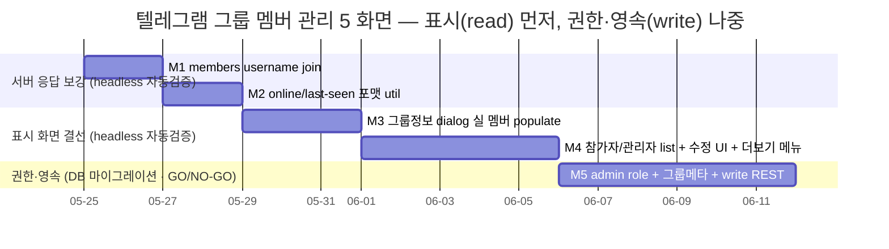

# 텔레그램 그룹 멤버 관리 UX 전체 — 5 화면 TooTalk 결선

> 정본 정합: [CLAUDE_HARNESS_IMPORTANT.md §B 5단계 워크플로우](../../../CLAUDE_HARNESS_IMPORTANT.md) · [§C 7역할](../../../CLAUDE_HARNESS_IMPORTANT.md) · [§D Exec Plans](../../../CLAUDE_HARNESS_IMPORTANT.md) · [§A M1~M7](../../../CLAUDE_HARNESS_IMPORTANT.md)
> 운영: [CLAUDE.md §2 워크플로우](../../../CLAUDE.md) · 저장소 맵: [AGENTS.md](../../../AGENTS.md)
> 본 문서는 실행/검증/결정 기록 문서다. TODO 목록이 아니다. ② 개발 단계는 main session 이 후속 수행하며, 본 planning 산출물은 코드보다 먼저 존재한다 (M1).
> directive 출처: 사용자 "텔레그램 그룹 멤버 관리 UX 전체 5 화면 spec" — 그룹 정보 dialog / 그룹 수정 / 관리자 목록 / 참가자 목록 / 더 보기 컨텍스트 메뉴.

---

## 0. 핵심 권고 요약 (사용자 재검토용 — 진행 전 필독)

코드 정독 (2026-05-25, `group_info_dialog.py` · `rooms_client.py` · `member_list.py` · `member_panel.py` · `_room_group_chat_mixin.py` · `server/api/rooms_handlers.py` · `server/db/repositories/rooms.py` · `0001_init.sql` ~ `0016_*.sql`) 결과, 텔레그램 5 화면 대비 TooTalk 현 구조의 경계가 명확히 드러났다. 본 계획은 이 경계를 정확히 반영한다 (추측 배제).

### 0.1 가장 빠른 win 은 "실 멤버 populate" 가 아니라 그 직전의 서버 응답 보강이다

- `GroupInfoDialog` UI 골격은 이미 풍부하다 (avatar + 그룹명 + "참가자 N명" + 4 action 버튼 + 참가자 list + 추가 버튼). 그러나 `_room_group_chat_mixin._on_group_info` 가 `members=[]` 빈 stub 으로 호출한다.
- **핵심 경계차**: `GET /api/rooms/{id}` 의 members 응답 (`server/db/repositories/rooms.py` `_SELECT ... peers`) 은 `id, room_id, user_id, role, joined_at, left_at` 만 반환한다. **username·last_seen·online 상태가 부재**다. 즉 클라이언트가 user_id 만으로는 "avatar + 이름 + online/last-seen" row 를 그릴 수 없다.
- **결론**: "실 멤버 populate (M1)" 의 진짜 1차 작업은 서버 members 응답에 username 을 join 하는 일이다 (M1 에서 username join, online/last-seen 은 M2 로 분리). UI 만 손대면 user_id 숫자만 표시되는 헛작업이 된다.

### 0.2 admin role 은 신규다 — peers.role ENUM 은 owner/member 2값만 존재한다

- `0001_init.sql` `peers.role ENUM('owner', 'member')`. **admin (관리자) 값이 부재**다. 텔레그램의 "관리자 목록 dialog (화면 3)" + "관리" 진입 권한은 admin role 을 전제하므로, ENUM 확장 마이그레이션이 신설 단계다 (M5, 신규 migration `0017`).
- `member_list.py` `_MemberRow` 의 role 분기는 owner 만 처리한다 (`if member.role == "owner"`). admin badge 분기 부재.

### 0.3 그룹 name·description·avatar 는 서버에 영속되지 않는다

- `rooms` 테이블에 `name`·`description`·`avatar` 컬럼이 부재다 (`0001_init.sql`). 현재 그룹명은 클라이언트 `chat_list` entry 에만 존재한다 (`_on_group_info` 가 entry 를 순회해 `name` 추출).
- 텔레그램 "그룹 수정 dialog (화면 2)" 의 그룹명 edit·설명·avatar 변경을 영속하려면 `rooms` 컬럼 신설 + 수정 REST endpoint 가 신설 단계다 (M5, migration `0017` + `PATCH /api/rooms/{id}`).
- **권고**: 화면 1·3·4 (정보·관리자·참가자 표시) 는 admin role / 그룹 메타 영속 없이도 진척 가능하다. 메타 영속 (화면 2 저장) + admin role (화면 3 의 실 admin) 은 M5 로 묶어 가장 뒤에 둔다. 표시 우선, 영속·권한 나중.

### 0.4 진행 권고 — 표시(read) 먼저, 권한·영속(write) 나중. 전 구간 headless 자동검증

- M1~M4 (서버 members username join → online 포맷 util → 정보 dialog 실 populate → 참가자/관리자 sub-list → 그룹 수정 dialog UI) 는 **전부 headless 자동 검증 가능** — offscreen Qt (`QT_QPA_PLATFORM=offscreen`) + rooms_client unit (httpx mock) + 서버 handler e2e (aiohttp test client).
- **G6 = 사용자 GO/NO-GO 게이트.** M5 (admin role ENUM 확장 + 그룹 메타 영속 + 승격/강등·수정 REST) 는 DB 마이그레이션 + 권한 모델 변경을 수반하므로, M4 종료 (표시 5 화면 골격 green) 시점에서 M5 진입 여부를 사용자가 결정한다.

> 사용자 재검토 포인트: 진짜 목적이 "그룹 정보·참가자·관리자 목록이 실제 멤버로 그려진다 (telegram 시각 정합)" 라면 M1~M4 로 충분하다. 진짜 목적이 "그룹명·설명·avatar 를 바꿔 저장하고 관리자를 승격/강등한다 (write + 권한)" 라면 M5 필수다.

---

## 1. 개요

텔레그램 그룹 멤버 관리 UX 5 화면을 TooTalk 에 결선한다.

1. **그룹 정보 dialog** — `GroupInfoDialog` 골격 존재. 실 멤버 populate 가 공백 (현 `members=[]` stub). 미디어 요약 (사진/링크/GIF count) 미존재.
2. **그룹 수정 dialog** — 미존재. avatar 변경 + 그룹명 edit + 설명 + 관리자/참가자 row 진입 + 취소/저장.
3. **관리자 목록 dialog** — 미존재. 검색바 + 관리자 row + 소유자 badge. admin role 전제 (현 ENUM 부재).
4. **참가자 목록 dialog** — 미존재. 검색바 + 참가자 row (online/last-seen) + 참가자 추가. `MemberPanel` 패턴 재사용 가능.
5. **더 보기 컨텍스트 메뉴** — 미존재. 자동 삭제 / 참가자 추가 / 그룹 관리 / 대화 내역 내보내기 / 폴더에 추가 / 신고.

핵심 데이터 흐름: `GET /api/rooms/{id}` → (RoomPayload, list[RoomMemberPayload]) → UI row. 현 members 응답은 user_id 만 있어 username·online 표시가 불가하므로, 본 계획은 **서버 members 응답 보강 (M1 username join, M2 last-seen)** 을 표시 작업의 선행으로 둔다.

본 계획은 표시(read) 5 화면을 먼저 결선하고 (M1~M4), 영속·권한(write — admin role / 그룹 메타 / 수정 REST) 을 M5 로 분리해 GO/NO-GO 게이트 뒤에 둔다. 모든 단계는 **기존 1:1/group chat PASS + 기존 GroupInfoDialog/MemberListWidget/MemberPanel offscreen test PASS 를 1건도 손상시키지 않는** 것을 게이트로 한다.

---

## 2. 범위 (In Scope)

- **서버 members 응답 보강 (M1)** — `GET /api/rooms/{id}` members 가 `user_id` 외 `username` 을 join 반환. `RoomMemberPayload` 에 `username` 필드 추가. (online/last-seen 은 M2.)
- **online 상태 포맷 util (M2)** — `last_activity_at`/세션 `disconnected_at` → "온라인" / "N분 전까지 접속함" / "N시간 전까지 접속함" / "YYYY. M. D.까지 접속함" 변환 순수 함수 신설. members 응답에 `last_seen_iso` + `is_online` 추가.
- **그룹 정보 dialog 실 멤버 populate (M3)** — `_room_group_chat_mixin._on_group_info` 가 `RoomsClient.get_room` 으로 실 멤버를 조회해 `GroupInfoDialog` 에 주입. 참가자 N명 count 실값. owner/admin badge 표시.
- **참가자/관리자 sub-list dialog (M4)** — 화면 3·4. 검색바 + role 필터 (참가자 / 관리자) + 참가자 추가 진입. `MemberPanel`/`MemberListWidget` 패턴 재사용 또는 신규 list dialog.
- **그룹 수정 dialog UI + 더 보기 메뉴 (M4)** — 화면 2 (avatar/그룹명/설명 edit form, 저장 비활성 placeholder 가능) + 화면 5 (더 보기 QMenu: 6 action). M4 단계는 UI + signal 까지, 실 영속은 M5.
- **admin role + 그룹 메타 영속 + write REST (M5 — 조건부)** — `peers.role` ENUM 에 `admin` 추가 + `rooms` 에 `name`/`description`/`avatar_ref` 컬럼 추가 (migration `0017`). 승격/강등 (`PATCH /api/rooms/{id}/members/{uid}`) + 그룹 수정 (`PATCH /api/rooms/{id}`) + `RoomsClient` method 추가. MIGRATION_MARIADB 정합.
- **미디어 요약 count (M5 — 조건부)** — 사진/링크/GIF count endpoint. `messages`/`file_meta` 집계.
- **테스트 전략 (전 단계)** — offscreen Qt isolated (dialog) + rooms_client unit (httpx mock) + 서버 handler e2e (aiohttp test client). headless 자동화.
- **문서 동기 의무 (전 단계)** — `Structure.md` / `FRONTEND.md` / `CheckList.md` / 평가 snapshot 2종 갱신 지점 명시 (§11).
- **회귀 안전망** — 각 단계 종료 시 `pytest tests/` 전량 + cov delta. 기존 PASS 무손상 게이트.

---

## 3. 범위 외 (Out of Scope)

무엇을 하지 않는지가 무엇을 하는지보다 명확해야 한다.

- **자동 삭제 (메시지 TTL) 실 결선** — 더 보기 메뉴의 "자동 삭제" 는 M4 에서 진입점 (메뉴 항목 + dialog placeholder) 까지만. 실제 메시지 TTL 만료 엔진은 별도 directive.
- **대화 내역 내보내기 실 export** — 더 보기 메뉴 항목 + 진입점까지만. 실 파일 export (HTML/JSON) 는 별도 directive.
- **신고 (report) 백엔드 처리** — 메뉴 항목 + dialog placeholder 까지만. moderation 처리 pipeline 은 별도 directive.
- **폴더에 추가 백엔드** — `0009_folders.sql` 연동 실 결선은 별도 directive (메뉴 항목까지만).
- **그룹 avatar 이미지 업로드/저장소** — M5 의 `avatar_ref` 컬럼은 참조 키만. 실 이미지 업로드 파이프라인 (object storage) 은 별도 directive. M5 는 컬럼 + edit form 까지.
- **online 실시간 push** — online 상태는 조회 시점 스냅샷 (last_activity_at 기준). signaling presence 실시간 broadcast 는 별도 directive.
- **음소거 (mute) 실 알림 억제** — 4 action 버튼의 음소거는 기존 signal 유지. 실 알림 억제 결선은 별도 directive.
- **코드 직접 작성** — 본 산출물은 planning 1 문서. ②~⑤ 단계는 main session 후속 (M1 문서 선행).
- **README/History/평가 snapshot 의 본 계획 진행 중 갱신** — 각 단계 commit 시 M2/M3 정합은 main session 책임.

---

## 4. gap 분석 (directive §1 응답 — 텔레그램 5 화면 vs 현 TooTalk)

코드 정독 결과의 정확한 경계. "있음/부분/신설" 3 분류.

| # | 텔레그램 요소 | 현 TooTalk 상태 | 분류 | 근거 (정독 위치) |
|---|---------------|-----------------|------|------------------|
| 1-a | 큰 원형 avatar + 그룹명 + "참가자 N명" | `GroupInfoDialog._make_avatar` + name_label + count_label 존재 | **있음** | `group_info_dialog.py` L88~100 |
| 1-b | 4 action 버튼 (음소거/관리/나가기/더보기) | 4 버튼 + signal 존재 (단 "더 보기" signal 부재 — None) | **부분** | `group_info_dialog.py` L107~113 |
| 1-c | 미디어 요약 (사진 N/링크 N/GIF N) | 미존재 | **신설** | dialog 본문 부재 |
| 1-d | "참가자 N명" 헤더 + 추가 버튼 | 헤더 + add_btn 존재 (단 count 가 빈 stub 기준) | **부분** | `group_info_dialog.py` L123~141 |
| 1-e | 참가자 row (avatar+이름+online/last-seen+badge) | `_populate_members` 존재하나 `members=[]` 빈 stub 호출 → 미표시. status·role 키 기대하나 서버 미제공 | **부분** | `_room_group_chat_mixin.py` L56 (`members=[]`) |
| 2 | 그룹 수정 dialog (avatar/그룹명/설명/관리자·참가자 row/저장) | 미존재. "관리" 버튼 signal 만 존재 | **신설** | `_chat_header_mixin.py` L235 placeholder |
| 3 | 관리자 목록 dialog (검색바+관리자 row+소유자 badge) | 미존재. admin role 자체 부재 | **신설** | `peers.role ENUM('owner','member')` |
| 4 | 참가자 목록 dialog (검색바+참가자 row+추가+닫기) | `MemberPanel`+`MemberListWidget` 패턴 재사용 가능. 검색바·last-seen 부재 | **부분** | `member_panel.py` / `member_list.py` |
| 5 | 더 보기 컨텍스트 메뉴 (6 action) | 미존재 ("더 보기" signal 부재) | **신설** | `group_info_dialog.py` L112 (signal None) |
| D-1 | members 응답에 username | 부재 (user_id 만) | **신설** | `repositories/rooms.py` L118/123 SELECT |
| D-2 | members 응답에 online/last-seen | 부재 | **신설** | members SELECT + `users.last_activity_at` 미join |
| D-3 | admin role | 부재 (owner/member 2값) | **신설** | `0001_init.sql` L155 |
| D-4 | 그룹 name/description/avatar 영속 | 부재 (client chat_list entry 만) | **신설** | `rooms` 컬럼 부재 |
| D-5 | 승격/강등·그룹 수정 REST | 부재 (create/list/get/join/leave/invite/kick 7종만) | **신설** | `rooms_handlers.py` L478~484 |

---

## 5. 데이터 모델 + REST 갭 (directive §2·§3 응답)

### 5.1 데이터 모델 (M1·M2·M5 산출)

| 항목 | 현 상태 | 필요 변경 | 단계 |
|------|---------|-----------|------|
| members 응답 username | `peers` SELECT 에 username 미join | `peers JOIN users` 로 `username` (+ M5 시 nickname fallback) 반환 | M1 (read, 마이그레이션 불요) |
| online / last-seen | `users.last_activity_at` 존재 · `user_sessions.last_active_at`/`disconnected_at` 존재 | members 응답에 `last_seen_iso` + `is_online` 파생 반환 (조회 시점 스냅샷, 신규 컬럼 불요) | M2 (read, 기존 컬럼 재사용) |
| admin role | `peers.role ENUM('owner','member')` | `ENUM('owner','admin','member')` 확장 (migration `0017`) | M5 (write, 마이그레이션) |
| 그룹 name | `rooms` 컬럼 부재 (client entry 만) | `rooms.name VARCHAR(128) NULL` 추가 (migration `0017`) | M5 (write, 마이그레이션) |
| 그룹 description | 부재 | `rooms.description VARCHAR(255) NULL` 추가 | M5 (write, 마이그레이션) |
| 그룹 avatar | 부재 | `rooms.avatar_ref VARCHAR(255) NULL` (참조 키만, 이미지 업로드 범위 외) 추가 | M5 (write, 마이그레이션) |

> **마이그레이션 신설 명시 (MIGRATION_MARIADB 정합)**: 현 최신 마이그레이션 = `0016_streaming_oauth_tokens.sql`. 신규 = `0017_group_metadata_admin_role.sql` (ENUM 확장 + rooms 3 컬럼). 모든 컬럼 5요소 comment 의무 (메모리 `feedback_db_schema_field_comments.md`). ENUM 확장은 `ALTER TABLE peers MODIFY COLUMN role ENUM('owner','admin','member')` — 기존 값 보존. 본 마이그레이션은 M5 G6 GO 시점에만 신설.
>
> **online/last-seen 은 마이그레이션 불요**가 핵심이다. `users.last_activity_at` (0003) 가 이미 존재하므로 M2 는 SELECT join + 파생 계산만으로 가능하다. 신규 컬럼 추가는 admin/그룹메타 (M5) 만이다.

### 5.2 REST 갭 (M1·M2·M5 산출)

| endpoint | 현 상태 | 필요 변경 | 단계 |
|----------|---------|-----------|------|
| `GET /api/rooms/{id}` members | user_id/role/joined/left 만 | `username` 추가 (M1) → `last_seen_iso`/`is_online` 추가 (M2) | M1·M2 |
| `PATCH /api/rooms/{id}` | 부재 | 그룹 name/description/avatar_ref 수정 (owner/admin 만) | M5 |
| `PATCH /api/rooms/{id}/members/{uid}` | 부재 | 승격 (member→admin) / 강등 (admin→member). owner 만 | M5 |
| 멤버 검색 | 부재 (클라이언트 필터 가능) | M4 는 클라이언트 in-memory 필터 (검색바). 서버 검색 endpoint 는 대규모 시 별도 | M4 (client) |
| 미디어 요약 count | 부재 | `GET /api/rooms/{id}/media-summary` (사진/링크/GIF count, messages+file_meta 집계) | M5 |

> **권고**: M4 의 검색바는 서버 검색 endpoint 없이 클라이언트 in-memory 필터로 충분하다 (데모 그룹 규모). 서버 검색은 over-engineering. `RoomsClient` 신규 method (`update_room`, `set_member_role`, `media_summary`) 는 M5 에서만 추가.

---

## 6. 마일스톤 (Milestones)

### 6.1 Gantt 차트



### 6.2 마일스톤 표

| ID | 목표일     | 제목                                              | 산출물 (commit 단위)                                                                                                  | 검증 유형 | 게이트 |
|----|-----------|---------------------------------------------------|---------------------------------------------------------------------------------------------------------------------|-----------|--------|
| M1 | 2026-05-27 | 서버 members 응답에 username join                 | `repositories/rooms.py` peers SELECT 에 `JOIN users` username + `rooms_handlers.handle_get_room` 응답 + `RoomMemberPayload.username` 필드 + handler e2e + client unit (코드 — main session) | 자동      | G1     |
| M2 | 2026-05-29 | online/last-seen 포맷 util + members 응답 확장     | online 포맷 순수 함수 신설 (`app/ui/_last_seen_format.py` 또는 i18n util) + members 응답 `last_seen_iso`/`is_online` (users.last_activity_at 파생) + unit test (경계값 분/시간/날짜) | 자동      | G2     |
| M3 | 2026-06-01 | 그룹 정보 dialog 실 멤버 populate                 | `_room_group_chat_mixin._on_group_info` 가 `get_room` 실 멤버 주입 (`members=[]` 제거) + `GroupInfoDialog` row (avatar+이름+online+badge) + 참가자 count 실값 + offscreen Qt test | 자동      | G3     |
| M4 | 2026-06-06 | 참가자/관리자 list + 그룹 수정 UI + 더보기 메뉴   | 화면 3·4 list dialog (검색바 + role 필터, MemberPanel 패턴 재사용) + 화면 2 수정 form (저장 placeholder) + 화면 5 더보기 QMenu (6 action) + 각 offscreen Qt test | 자동      | **G6** |
| M5 | 2026-06-14 | admin role + 그룹메타 영속 + write REST (G6 GO 시) | migration `0017` (peers.role ENUM admin + rooms name/description/avatar_ref) + `PATCH /api/rooms/{id}` + `PATCH .../members/{uid}` + media-summary + `RoomsClient` method + 수정 form 실 저장 결선 + handler e2e | 자동      | G7     |

> **G6 = 사용자 GO/NO-GO 게이트.** M4 종료 시점에 "표시 5 화면 골격 green (실 멤버 + 참가자/관리자 list + 수정 UI + 더보기 메뉴, offscreen Qt PASS)" 가 달성된다. admin role ENUM 확장 + 그룹 메타 영속 + write REST (M5) 를 본 계획에서 이어갈지 또는 별도 directive 로 분리할지 사용자가 결정한다.

### 6.3 게이트 정의

| 게이트 | 통과 조건                                                                                                  | 실패 시 |
|--------|------------------------------------------------------------------------------------------------------------|---------|
| G1     | `GET /api/rooms/{id}` 응답 members 가 username 을 포함 + handler e2e (aiohttp test client) PASS + `RoomMemberPayload.username` client unit PASS + 기존 7 endpoint 회귀 무손상 | M1 재작업 |
| G2     | online 포맷 함수가 분/시간/날짜/온라인 4 경계값 + 자정 경계 unit test PASS + members 응답 `last_seen_iso`/`is_online` 파생이 handler e2e PASS | M2 재작업 |
| G3     | `_on_group_info` 가 실 멤버 주입 (`members=[]` 제거 확인) + `GroupInfoDialog` 가 avatar+이름+online+owner badge row 렌더 offscreen Qt PASS + 참가자 count 실값 + 기존 GroupInfoDialog test 무손상 | G3 회귀 → rollback |
| G6     | 화면 3·4 list dialog (검색 필터 + role 분기) offscreen Qt PASS + 화면 2 수정 form 렌더 PASS + 화면 5 더보기 QMenu 6 action 존재 PASS + 기존 MemberListWidget/MemberPanel/GroupInfoDialog 무손상 + `pytest tests/` 무손상 + **사용자 GO/NO-GO 응답** | NO-GO → M5 보류 + 잔존 TD 등재 |
| G7     | migration `0017` 정합 (ENUM 기존 값 보존 + rooms 3 컬럼 5요소 comment) + `PATCH` 2종 권한 분기 (owner/admin) handler e2e PASS + admin badge 렌더 PASS + media-summary count PASS + 수정 form 실 저장 round-trip PASS + 기존 무손상 | 초과 항목 TD 등재 + 별도 directive |

---

## 7. Task Breakdown

각 task 는 검증 조건·종료 조건·산출 파일을 명시한다. 담당 = ② 개발은 main session 직접 (backend/frontend agent 미존재), ③ 검증은 reviewer→qa→observability 직렬.

| id | M | 작업 | 산출 파일 | 의존성 | 검증 조건 | 상태 |
|----|---|------|-----------|--------|-----------|------|
| T1 | M1 | peers SELECT 에 `JOIN users` username 추가 | `server/db/repositories/rooms.py` | - | username 반환 unit | 대기 |
| T2 | M1 | handle_get_room 응답에 username + `RoomMemberPayload.username` | `server/api/rooms_handlers.py` · `app/net/rooms_client.py` | T1 | handler e2e + client unit | 대기 |
| T3 | M2 | online 포맷 순수 함수 (분/시간/날짜/온라인) | `app/ui/_last_seen_format.py` (신규) | - | 경계값 unit | 대기 |
| T4 | M2 | members 응답에 `last_seen_iso`/`is_online` (last_activity_at 파생) | `server/db/repositories/rooms.py` · `rooms_handlers.py` · `rooms_client.py` | T1·T3 | handler e2e | 대기 |
| T5 | M3 | `_on_group_info` 실 멤버 주입 (`members=[]` 제거) | `app/ui/_room_group_chat_mixin.py` | T2·T4 | offscreen Qt | 대기 |
| T6 | M3 | `GroupInfoDialog` row 보강 (avatar+이름+online+badge) | `app/ui/group_info_dialog.py` | T5 | offscreen Qt | 대기 |
| T7 | M4 | 참가자/관리자 list dialog (검색바 + role 필터) | `app/ui/group_member_list_dialog.py` (신규, MemberPanel 패턴) | T6 | offscreen Qt | 대기 |
| T8 | M4 | 그룹 수정 dialog UI (avatar/그룹명/설명 form, 저장 placeholder) | `app/ui/group_edit_dialog.py` (신규) | T6 | offscreen Qt | 대기 |
| T9 | M4 | 더 보기 컨텍스트 메뉴 (6 action) + "더 보기" signal 결선 | `app/ui/group_info_dialog.py` | T6 | offscreen Qt | 대기 |
| T10 | M5 | migration `0017` (peers.role admin + rooms name/desc/avatar_ref) | `server/db/migrations/0017_group_metadata_admin_role.sql` (신규) | T9·G6 GO | DDL apply 검증 | 대기 |
| T11 | M5 | `PATCH /api/rooms/{id}` + `.../members/{uid}` 승격/강등 + RoomsClient method | `server/api/rooms_handlers.py` · `app/net/rooms_client.py` | T10 | handler e2e + client unit | 대기 |
| T12 | M5 | media-summary count endpoint + 수정 form 실 저장 결선 + admin badge | `server/api/rooms_handlers.py` · `app/ui/group_edit_dialog.py` · `app/ui/member_list.py` | T11 | handler e2e + offscreen Qt | 대기 |

---

## 8. Definition of Done

종료 조건. 아래 10 항목이 검증 가능 단위로 분해돼 있으며, `status: completed` 전이 전 모두 충족돼야 한다 (`@release-agent` + 사용자 승인). **[자동]/[조건부]** 태그로 검증 유형 분리.

- [ ] **DoD-1 [자동]** `GET /api/rooms/{id}` members 응답이 user_id 외 username 을 포함하고 (T1·T2), `RoomMemberPayload` 에 username 필드가 추가됐다. handler e2e + client unit PASS.
- [ ] **DoD-2 [자동]** online 포맷 순수 함수가 "온라인" / "N분 전까지 접속함" / "N시간 전까지 접속함" / "YYYY. M. D.까지 접속함" 4 경계 + 자정 경계를 unit test 로 PASS 한다 (T3).
- [ ] **DoD-3 [자동]** members 응답이 `users.last_activity_at` 파생 `last_seen_iso`/`is_online` 을 반환하고 (마이그레이션 불요), handler e2e PASS 한다 (T4).
- [ ] **DoD-4 [자동]** `_on_group_info` 가 `RoomsClient.get_room` 실 멤버를 주입하며 `members=[]` 빈 stub 이 제거됐다. 참가자 count 가 실값이다 (T5). offscreen Qt PASS.
- [ ] **DoD-5 [자동]** `GroupInfoDialog` 참가자 row 가 avatar + 이름 + online/last-seen + owner badge 를 렌더한다 (T6). 기존 GroupInfoDialog test 무손상.
- [ ] **DoD-6 [자동]** 참가자/관리자 목록 dialog (화면 3·4) 가 검색바 + role 필터 + 참가자 추가 진입을 제공하고 (T7), `MemberPanel`/`MemberListWidget` 패턴 재사용 또는 신규 dialog 가 offscreen Qt PASS 한다.
- [ ] **DoD-7 [자동]** 그룹 수정 dialog (화면 2) 가 avatar/그룹명/설명 edit form + 관리자/참가자 row 진입 + 취소/저장 버튼을 렌더한다 (T8). offscreen Qt PASS (M4 는 저장 placeholder).
- [ ] **DoD-8 [자동]** 더 보기 컨텍스트 메뉴 (화면 5) 가 자동 삭제/참가자 추가/그룹 관리/대화 내역 내보내기/폴더에 추가/신고 6 action 을 제공하고 "더 보기" signal 이 결선됐다 (T9). offscreen Qt PASS.
- [ ] **DoD-9 [조건부]** (G6 GO 시) migration `0017` 이 `peers.role ENUM('owner','admin','member')` 확장 (기존 값 보존) + `rooms.name`/`description`/`avatar_ref` 3 컬럼 (5요소 comment) 을 추가하고, `PATCH /api/rooms/{id}` + `PATCH .../members/{uid}` 승격/강등 + media-summary 가 handler e2e PASS 하며 수정 form 실 저장이 round-trip PASS 한다 (T10~T12).
- [ ] **DoD-10 [자동]** 전 단계 종료 시 `pytest tests/` 전량 PASS + cov 무감소 + 기존 1:1/group chat + MemberListWidget/MemberPanel/GroupInfoDialog offscreen test 무손상. M5 미진행 시 잔존 항목은 §10 기술 부채 표에 해소 시점과 함께 등재됐다 (TBD 금지).

---

## 9. 결정 로그

본 계획의 굵직한 결정 사항. directive 시점·근거·영향 3열 충족.

| 날짜 (directive 시점) | 결정                                                                 | 근거                                                                                                       | 영향                                                                                       |
|-----------------------|----------------------------------------------------------------------|------------------------------------------------------------------------------------------------------------|--------------------------------------------------------------------------------------------|
| 2026-05-25 (사용자 "텔레그램 그룹 관리 5 화면") | 텔레그램 그룹 멤버 관리 5 화면을 TooTalk Exec Plan 으로 착수 | 사용자 directive 명시. `GroupInfoDialog` 골격 존재 + `MemberPanel` 신설 (cycle 169.819) 기반 위 확장 적기 | 본 Exec Plan 작성 (M1 문서 선행). ②~⑤ 는 main session 후속 |
| 2026-05-25 | **표시(read) 먼저, 권한·영속(write) 나중 — admin role/그룹메타/write REST 를 M5 GO/NO-GO 뒤로 분리** | 화면 1·3·4 표시는 admin role/메타 영속 없이 진척 가능. write 는 DB 마이그레이션 + 권한 모델 변경 수반 | M1~M4 = 표시 5 화면 결선. M5 = G6 사용자 게이트 후 write |
| 2026-05-25 | **가장 빠른 win = 서버 members 응답 username join (M1) — UI 단독 populate 는 헛작업** | members 응답이 user_id 만 반환 (`repositories/rooms.py` SELECT). UI 가 user_id 숫자만 그릴 수밖에 없음 | M1 을 표시 작업의 선행으로 배치. UI populate (M3) 는 M1·M2 의존 |
| 2026-05-25 | **online/last-seen 은 신규 컬럼 불요 — `users.last_activity_at` (0003) 재사용** | `0003_user_activity.sql` 에 last_activity_at + user_sessions.last_active_at/disconnected_at 이미 존재 | M2 는 SELECT join + 파생 계산만. 마이그레이션은 admin/그룹메타 (M5) 만 |
| 2026-05-25 | **admin role 은 신규 — `peers.role ENUM('owner','member')` 에 admin 추가 (M5 migration 0017)** | `0001_init.sql` L155 ENUM 2값만. 텔레그램 관리자 dialog (화면 3) 가 admin role 전제 | M5 ENUM 확장 (기존 값 보존 ALTER). M1~M4 의 "관리자 목록" 은 owner 만 표시 또는 빈 list |
| 2026-05-25 | **M4 멤버 검색 = 클라이언트 in-memory 필터, 서버 검색 endpoint 부재** | 데모 그룹 규모에 서버 검색은 over-engineering. 검색바는 표시된 list 필터로 충분 | M4 검색바 = 클라이언트. 서버 검색은 대규모 시 별도 directive (§10 TD) |
| 2026-05-25 | **더 보기 6 action 중 자동삭제/내보내기/신고/폴더는 진입점까지만 (실 결선 범위 외)** | 각 항목이 독립 백엔드 (TTL 엔진/export/moderation/folders) 를 수반 — over-scope | M4 는 메뉴 항목 + dialog placeholder. 각 실 결선 별도 directive (§3 범위 외) |
| 2026-05-25 | **그룹 avatar 는 M5 의 `avatar_ref` 참조 키까지 — 이미지 업로드 파이프라인 범위 외** | object storage 업로드는 별개 인프라 작업 | M5 avatar 는 컬럼 + edit form 진입. 실 업로드 별도 directive |

> 본 표는 작성자(planning-agent) 초안이다. 활성 전이 후 결정 로그 수정은 작성자 또는 사용자 명시 승인 필요.

---

## 10. 기술 부채 추적 (Tech Debt)

해소 시점 명시 의무 (TBD 금지).

| id    | 항목                                                                       | 영향                                                              | 해소 시점        |
|-------|----------------------------------------------------------------------------|-------------------------------------------------------------------|------------------|
| TD-G1 | `_on_group_info` 가 `members=[]` 빈 stub 호출 — 실 멤버 미표시              | 그룹 정보 dialog 가 참가자 0 표기 (기존)                          | M3 (T5 실 멤버 주입) |
| TD-G2 | members 응답이 user_id 만 — username/online 부재로 UI row 표현 불가         | M1 이전 dialog 는 숫자 user_id 만 표현 가능                       | M1·M2 (username + last-seen) |
| TD-G3 | `peers.role` ENUM 에 admin 부재 — "관리자 목록" (화면 3) 이 owner 만 표시   | M1~M4 의 관리자 list = owner 1명만 또는 빈 list                   | M5 (T10 ENUM 확장) |
| TD-G4 | `rooms` 에 name/description/avatar 미영속 — 그룹명이 client entry 만 source | 수정 dialog (화면 2) 저장이 M4 까지 placeholder                  | M5 (T10·T12 컬럼 + PATCH) |
| TD-G5 | 더 보기 6 action 중 4 action (자동삭제/내보내기/신고/폴더) 진입점만         | 메뉴 클릭 시 placeholder dialog (실 동작 부재)                    | 각 항목 별도 directive (§3 범위 외, 우선순위 사용자 결정) |
| TD-G6 | 그룹 avatar 가 `avatar_ref` 참조 키만 — 실 이미지 업로드 부재               | 수정 form 의 avatar 변경이 참조만 저장 (이미지 미저장)            | object storage 업로드 별도 directive |
| TD-G7 | online 상태가 조회 시점 스냅샷 (last_activity_at) — 실시간 push 부재         | dialog 열린 동안 online 변경이 미반영 (재조회 필요)              | signaling presence 실시간 broadcast 별도 directive |
| TD-G8 | M4 멤버 검색이 클라이언트 in-memory — 대규모 그룹 시 전량 로드 부담         | 수백 멤버 그룹에서 검색 지연 가능 (데모 규모는 무영향)            | 서버 검색 endpoint 별도 directive (대규모 도달 시) |
| TD-G9 | `member_list.py` `_MemberRow` role 분기가 owner 만 — admin badge 미처리     | admin 멤버가 일반 member 와 동일 표기 (M5 이전)                  | M5 (T12 admin badge 분기 추가) |

---

## 11. 차단점 추적

차단 발생 시 1행 누적. 비어있지 않으면 `status: blocked` 전이 검토.

| 날짜        | 차단 사유 | 영향 마일스톤 | 해소 조건 | 상태 |
|-------------|-----------|---------------|-----------|------|
| (현재 없음) | -         | -             | -         | -    |

> PyQt6 미설치 (headless) 환경에서는 dialog test 가 `MemberListWidget` graceful stub 패턴 (`member_list.py` L69) 정합 — offscreen Qt (`QT_QPA_PLATFORM=offscreen`) 로 진행. httpx 미설치 시 `RoomsClient` 가 RuntimeError graceful — client test 는 mock injection 으로 진행.
> migration `0017` 의 ENUM 확장이 운영 DB 적용 차단 시 (M5) 본 표 1행 등재 + TD-G3 연동.
> 분류기 hard block 재발 시 [정본 §S-3](../../../CLAUDE_HARNESS_IMPORTANT.md) `SKIP_PREPUSH=1` prefix 우회를 본 표에 1행 등재 후 진행.

---

## 12. 의존성 그래프 + 문서 동기 의무

### 12.1 의존성 그래프

```mermaid
flowchart TD
    M1[M1 members username join<br/>peers JOIN users<br/>+ RoomMemberPayload.username] --> M2[M2 online/last-seen 포맷 util<br/>last_activity_at 파생<br/>마이그레이션 불요]
    M2 --> M3[M3 그룹정보 dialog 실 멤버 populate<br/>members=[] 제거<br/>+ avatar/이름/online/badge row]
    M3 --> M4[M4 참가자·관리자 list + 수정 UI + 더보기 메뉴<br/>화면 2·3·4·5 골격]
    M4 -->|G6 GO| M5[M5 admin role + 그룹메타 영속<br/>migration 0017 + PATCH 2종<br/>+ media-summary]
    M4 -->|G6 NO-GO| HOLD([별도 directive 분리<br/>잔존 TD 등재])
    M5 --> DONE([텔레그램 5 화면 완료])

    subgraph AUTO[headless 자동 검증 구간]
        M1
        M2
        M3
        M4
    end
    subgraph WRITE[DB 마이그레이션 + 권한 구간]
        M5
    end

    classDef gate fill:#fee2e2,stroke:#dc2626
    classDef done fill:#dcfce7,stroke:#16a34a
    classDef wip fill:#fef3c7,stroke:#ca8a04
    classDef wr fill:#ede9fe,stroke:#7c3aed
    class M4 gate
    class DONE done
    class M1,M2,M3 wip
    class M5 wr
```

핵심 경로: **M1 username join → M2 online/last-seen 포맷 → M3 정보 dialog 실 populate → M4 참가자·관리자 list + 수정 UI + 더보기 (G6 GO/NO-GO) → (조건부) M5 admin role + 그룹메타 영속 + write REST**. M1~M4 는 전부 headless 자동 검증 (offscreen Qt + httpx mock + aiohttp test client). M5 만 DB 마이그레이션 + 권한 모델 변경. 한 단계라도 회귀 게이트 FAIL 시 직후 단계 진행 금지 + rollback.

### 12.2 문서 동기 의무 (directive §7 응답 — 각 단계 commit 시 main session 책임)

| 문서 | 갱신 지점 | 갱신 시점 |
|------|-----------|-----------|
| `Structure.md` ↔ `docs/html/Structure.html` | `group_member_list_dialog.py` · `group_edit_dialog.py` · `_last_seen_format.py` 신규 모듈 등재. migration `0017` 등재 | M3/M4/M5 신규 파일 생성 시 (md+html 동시, CLAUDE.md §10-6) |
| `FRONTEND.md` ↔ `docs/html/FRONTEND.html` | 그룹 정보·수정·참가자·관리자·더보기 5 화면 UI 컴포넌트 + online 표기 규칙 등재 | 각 화면 결선 시 (md+html 동시) |
| `CheckList.md` | 그룹 멤버 관리 5 화면 항목 체크 갱신 | 각 마일스톤 완료 시 |
| `docs/assessments/productization.md` ↔ `docs/html/productization.html` | 그룹 채팅 / 멤버 관리 row 진척 반영 | 각 마일스톤 완료 시 snapshot 전체 rewrite (CLAUDE.md §10-7, md+html 동시) |
| `docs/assessments/vibe-coding.md` ↔ `docs/html/vibe-coding.html` | 그룹 관리 UX 관련 row | 각 마일스톤 완료 시 snapshot 전체 rewrite (동시) |
| `README.md` "변경 이력" (M2) + `History.md` (M3) | 각 commit 1줄 prepend | 각 단계 commit 직후 |
| migration 정합 문서 (MIGRATION_MARIADB) | `0017_group_metadata_admin_role.sql` 등재 + ENUM 확장 + rooms 3 컬럼 | M5 (G6 GO 시) |

---

## 13. 참조

### 13.1 정본·맵·운영

- [CLAUDE_HARNESS_IMPORTANT.md](../../../CLAUDE_HARNESS_IMPORTANT.md) — §B 5단계 워크플로우 · §C 7역할 · §D Exec Plans · §A M1~M7.
- [CLAUDE.md](../../../CLAUDE.md) — §2 워크플로우 + 서브에이전트 호출 규약 · §10 문서 동기 의무.
- [AGENTS.md](../../../AGENTS.md) — 저장소 맵 + 명명 규약.
- 메모리 `feedback_db_schema_field_comments.md` — DDL 5요소 comment 의무 (migration `0017` 정합 근거).

### 13.2 대상 코드 (정독 확인 2026-05-25)

- `app/ui/group_info_dialog.py` — `GroupInfoDialog` (avatar + 그룹명 + count + 4 action + 참가자 list + 추가 버튼 골격). `_populate_members` 가 name/status/role 키 기대. "더 보기" signal 부재. M3·M9 보강 대상.
- `app/ui/_room_group_chat_mixin.py` — `_on_group_info` (L56 `members=[]` 빈 stub 호출). M3 실 멤버 주입 대상.
- `app/ui/_chat_header_mixin.py` — group menu (act_manage L235 placeholder). 더 보기/관리 진입 대상.
- `app/ui/member_list.py` — `MemberItem`(user_id/username/role/is_online) + `MemberListWidget` (`_MemberRow` role 분기 owner 만). admin badge (M5 T12) 대상. graceful stub 패턴 source.
- `app/ui/member_panel.py` — `MemberPanel` (헤더 뒤로 + list + 빈 안내, cycle 169.819). 참가자/관리자 list dialog (M4 T7) 재사용 패턴 source.
- `app/net/rooms_client.py` — `RoomsClient` 7 method + `RoomMemberPayload` (id/room_id/user_id/role/joined/left — username 부재). M1 username 필드 + M5 method 추가 대상.
- `server/api/rooms_handlers.py` — 7 endpoint (`handle_get_room` L234). M1 username + M2 last-seen + M5 PATCH/media-summary 대상.
- `server/db/repositories/rooms.py` — peers SELECT (L118/123, username 미join). M1 `JOIN users` + M2 last_activity_at 파생 대상.
- `server/db/migrations/0001_init.sql` — `peers.role ENUM('owner','member')` (L155, admin 부재) + `rooms` (name/description/avatar 부재). M5 ENUM 확장 + 컬럼 추가 대상.
- `server/db/migrations/0003_user_activity.sql` — `users.last_activity_at` (L23) + `user_sessions.last_active_at`/`disconnected_at` (L54/57). M2 online/last-seen 파생 source (마이그레이션 불요 근거).

### 13.3 신규 산출 대상 (코드 — main session 후속)

- `app/ui/_last_seen_format.py` (M2 신설) — last_activity_at → online 상태 4 포맷 순수 함수.
- `app/ui/group_member_list_dialog.py` (M4 신설) — 참가자/관리자 목록 dialog (검색바 + role 필터, MemberPanel 패턴).
- `app/ui/group_edit_dialog.py` (M4 신설) — 그룹 수정 dialog (avatar/그룹명/설명 form).
- `server/db/migrations/0017_group_metadata_admin_role.sql` (M5 신설) — peers.role admin 확장 + rooms name/description/avatar_ref.

### 13.4 외부 조사 (오프라인 결정 보강)

- 텔레그램 그룹 관리 UX 5 화면은 directive 원문 spec 을 정본으로 한다 (외부 라이브러리 의존 부재 — 순수 PyQt6 + 기존 REST 확장). 별도 외부 사양 조사 불요.

### 13.5 기존 active Exec Plan (형식 정합)

- [2026-05-25-voice-video-sfu-expansion.md](2026-05-25-voice-video-sfu-expansion.md) — 직전 Exec Plan. frontmatter 형식 + GO/NO-GO 게이트 + headless 우선 패턴 정합 source.

---

**문서 상태**: `draft` · 최초 작성 2026-05-25 · `@reviewer-agent` 사전 검토 대기 (M1 정합 확인) · 사용자 승인 후 main session 이 `status: active` 전이 + `wbs_tasks` row 등록 (M6)
