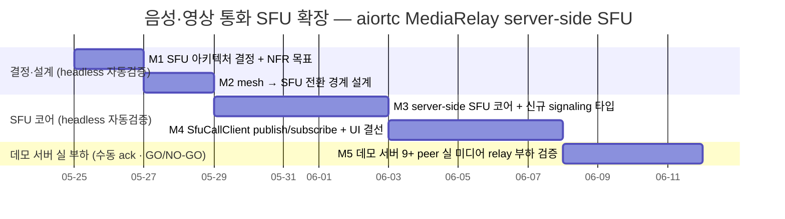
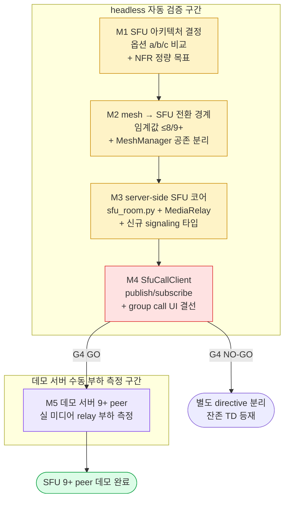

# 음성·영상 통화 SFU 확장 (9 peer 이상) — Selective Forwarding Unit 본격 착수

> 정본 정합: [CLAUDE_HARNESS_IMPORTANT.md §B 5단계 워크플로우](../../../CLAUDE_HARNESS_IMPORTANT.md) · [§C 7역할](../../../CLAUDE_HARNESS_IMPORTANT.md) · [§D Exec Plans](../../../CLAUDE_HARNESS_IMPORTANT.md) · [§A M1~M7](../../../CLAUDE_HARNESS_IMPORTANT.md)
> 운영: [CLAUDE.md §2 워크플로우](../../../CLAUDE.md) · 저장소 맵: [AGENTS.md](../../../AGENTS.md)
> 본 문서는 실행/검증/결정 기록 문서다. TODO 목록이 아니다. ② 개발 단계는 main session 이 후속 수행하며, 본 planning 산출물은 코드보다 먼저 존재한다 (M1).
> directive 출처: 사용자 "음성·영상 통화 SFU 확장 (9 peer 이상) 본격 착수" — Phase 6+/cycle 200+ 예정이던 SFU 확장을 앞당겨 착수.

---

## 0. 핵심 권고 요약 (사용자 재검토용 — 진행 전 필독)

본 계획은 **데몬스트레이션 프로젝트 성격 (유저 배포 부재, 메모리 `project_no_user_distribution.md` 정합)** 에 맞춰, 외부 SFU (mediasoup/Janus/LiveKit) 운영 부담을 피하고 **aiortc 자체 server-side SFU (Python MediaRelay)** 를 1차 채택한다. 옵션 비교는 §5 에 정량 표로 정리한다.

### 0.1 현 구조 정독 결론 — "mesh ≤ 8" 의 실체는 text mesh 다 (음성·영상 mesh 는 결선 공백)

코드 정독 (2026-05-25) 결과, productization.md 의 "1:1 + mesh ≤ 8" 표기와 실제 코드 사이에 **중요한 경계차**가 있다. 본 계획은 이 경계차를 정확히 반영한다.

- **음성·영상 통화 = 1:1 만 실 결선** — `app/net/call_client.py` 의 `CallClient` 는 단일 `RTCPeerConnection` 에 OS MediaPlayer audio/video track 을 add 하고 offer/answer 를 교환한다. `_on_signaling_offer` (`app/ui/_signaling_mixin.py`) → `CallDialog` → `CallClient.accept_offer` 의 1:1 chain 만 결선돼 있다.
- **`MeshManager` 는 text DataChannel fan-out 전용** — `app/rtc/mesh_manager.py` (cycle 138 skeleton, `MAX_MESH_PEERS=8`) 는 `broadcast`/`broadcast_payload` 로 **JSON 메시지 fan-out** 만 한다. `addTrack`·`MediaStreamTrack`·audio/video sender 가 전무하다. 즉 **mesh 위 group 음성·영상은 결선된 바 없다.** "mesh ≤ 8" 은 text group chat 의 mesh 다.
- **결론** — SFU 확장의 진짜 공백은 "9 peer 초과 시 mesh → SFU" 가 아니라, **group 음성·영상 자체가 (mesh 든 SFU 든) 처음 결선되는 작업**이다. 본 계획은 group call 의 SFU 경로를 1차 결선 대상으로 삼고, 기존 1:1 `CallClient` 회귀를 게이트로 보호한다.

### 0.2 server-side SFU 빌딩블록 — aiortc MediaRelay 가 존재한다

- aiortc 는 `aiortc.contrib.media.MediaRelay` 를 제공한다. incoming track 1개를 복제해 N 개 outgoing peer 로 forward 할 수 있다 (selective forwarding 의 핵심). [aiortc MediaRelay 문서](https://aiortc.readthedocs.io/en/latest/changelog.html) 정합.
- 단, MediaRelay 사용 시 원본 track 은 직접 소비 불가 (relay 만 소비), 첫 subscribe 이후 원본 producing 동안 relay 가 영구 소비한다. 본 제약은 §9 기술 부채 + §5 설계 결정에 반영한다.
- `app/ui/_video_renderer.py` 의 `VideoRenderer` 가 remote video track 렌더를 이미 제공한다 — controller(수신자) 쪽 렌더 재사용 가능.

### 0.3 진행 권고 — headless 자동검증 → 데모 서버 수동 ack 순서 + GO/NO-GO 게이트

- **M1~M4 (SFU 아키텍처 결정 + 전환 경계 + SFU 서버 코어 + 클라이언트 publish/subscribe 결선) 은 전부 headless 자동 검증 가능** — aiortc loopback + `MediaStreamTrack` 더미(test source) + offscreen Qt. 본 구간이 본 계획의 검증 가능한 핵심 가치다.
- **M5 (데모 서버 114.207.112.73 위 실 미디어 relay 부하 검증) 만 수동/통합 검증 필요** — 실제 9+ 클라이언트 fan-out 의 CPU/대역폭은 자동화 한계가 있다. `MANUAL_TESTS.md` 와 연계한다.
- **G4 = 사용자 GO/NO-GO 게이트.** M4 종료 (headless 9-peer fan-out 시뮬레이션 green) 시점에서, 데모 서버 실 부하 검증(M5)을 본 계획에서 진행할지 또는 별도 directive 로 분리할지 사용자가 결정한다.

> 사용자 재검토 포인트: 진짜 목적이 "9명 화상회의가 데모 서버에서 실제로 돈다"라면 M5 필수다. 진짜 목적이 "SFU 코어 + 전환 경계 설계 + 회귀 안전망 확립"이라면 M1~M4 로 충분하고 M5 는 데모 직전 1회 부하 검증으로 미룰 수 있다.

---

## 1. 개요

현 음성·영상 통화는 `CallClient` 기반 1:1 `RTCPeerConnection` (audio/video track + offer/answer) 만 결선돼 있다. group(2명 초과) 음성·영상은 결선 부재다. full-mesh 를 group 음성·영상에 확장하면 N 명일 때 각 peer 가 N-1 개 upstream track 을 인코딩·송신해야 하므로 송신 대역과 CPU 가 **O(n²)** 로 폭증한다 (peer 5명 = 각자 4 upstream, 전체 20 stream). 9 peer 이상에서는 클라이언트 업로드 대역과 CPU 가 현실적 한계를 초과한다.

본 계획은 **SFU (Selective Forwarding Unit)** 를 신설한다. 각 클라이언트는 자신의 미디어를 **1개 upstream 으로 SFU 서버에 publish** 하고, SFU 가 이를 다른 peer 들로 **selective forward** 한다. 클라이언트 upstream 은 peer 수와 무관하게 항상 1 stream — 클라이언트 쪽 부하가 **O(1)**, 서버 fan-out 이 **O(n)** 이 된다.

SFU 서버 코어는 aiortc `MediaRelay` 위에 구축한다. 신규 클라이언트 component `SfuCallClient` (publish 1 upstream + subscribe N downstream) 를 신설하고, peer count 임계값 (≤ 8 → mesh/1:1, 9+ → SFU) 의 전환 경계를 정의한다. signaling 서버는 현재 OFFER/ANSWER/ICE 단순 relay 만 하므로 (`server/signaling.py` 정독), SFU room join/publish/subscribe 를 위한 신규 메시지 타입을 `server/protocol.py` 화이트리스트에 추가한다.

본 계획의 모든 단계는 **기존 1:1 voice/video PASS + text mesh PASS 를 1건도 손상시키지 않는** 것을 게이트로 한다.

---

## 2. 범위 (In Scope)

- **SFU 아키텍처 결정 (M1)** — (a) aiortc 자체 server-side SFU vs (b) 외부 SFU 연동 vs (c) hybrid 의 장단점 정량 표 + 데모 프로젝트 성격 반영 결정 (§5). MediaRelay 제약 (원본 track 직접 소비 불가) 의 설계 영향 명시.
- **mesh → SFU 전환 경계 설계 (M2)** — peer count 임계값 정의 (≤ 8 = 기존 1:1/text-mesh 유지, 9+ = SFU 승격). 자동 전환 vs 명시 모드 결정. 기존 `MeshManager` (text fan-out) 와 신규 SFU media path 의 공존 책임 분리.
- **SFU 서버 코어 신설 (M3)** — `server/sfu_room.py` (publisher track → MediaRelay → subscriber forward) + room 단위 track registry. 신규 publish/subscribe 메시지 타입을 `server/protocol.py` 화이트리스트에 추가. signaling 서버 `_dispatch_text` 라우팅 분기 추가.
- **클라이언트 SfuCallClient 신설 (M4)** — `app/net/sfu_call_client.py` (1 upstream publish + N downstream subscribe). 기존 `CallClient` 의 MediaPlayer capture + `VideoRenderer` 렌더 재사용. group call UI 진입점 (`call_dialog.py` group mode) 결선.
- **테스트 전략 (전 단계)** — SFU loopback / fan-out 시뮬레이션 (aiortc 9+ dummy `MediaStreamTrack` source) + 기존 voice/video browser E2E 회귀 보호. headless 자동화.
- **NFR 정량 목표 (M1 정의 + 전 단계 검증)** — 대역폭 (mesh O(n²) vs SFU O(n)), CPU, 지연의 목표값 + 측정 방법.
- **데모 서버 실 부하 검증 (M5 — 조건부)** — 114.207.112.73 위 9+ 클라이언트 fan-out 의 실제 CPU/대역폭 수동 측정 + `MANUAL_TESTS.md` 기록.
- **문서 동기 의무 (전 단계)** — `productization.md` / `vibe-coding.md` 음성·영상 row, `Structure.md`, `ARCHITECTURE.md`, `CheckList.md` 갱신 지점 명시 (§11).
- **회귀 안전망** — 각 단계 종료 시 `pytest tests/` 전량 + cov delta. 기존 PASS 무손상 게이트.

---

## 3. 범위 외 (Out of Scope)

무엇을 하지 않는지가 무엇을 하는지보다 명확해야 한다.

- **외부 SFU (mediasoup/Janus/LiveKit) 운영 도입** — 본 계획은 aiortc 자체 SFU 1차 채택 (§5 결정). 외부 SFU 마이그레이션은 데모 부하 한계 도달 시 별도 directive (§9 TD 등재).
- **simulcast / SVC (계층 인코딩)** — 단일 해상도 layer 만. 수신자별 해상도 적응 (simulcast)·temporal/spatial layer 선택은 별도 directive.
- **ABR / bandwidth estimation 기반 동적 layer 전환** — frame rate / 해상도 throttle 1차 고정값까지만. REMB/transport-cc 기반 동적 적응은 범위 외.
- **server-side 미디어 녹화 / 합성 (MCU)** — SFU 는 forward 만. server 쪽 mixing(MCU)·녹화는 범위 외.
- **active speaker detection / 화면 레이아웃 자동 전환** — 누가 말하는지 감지 + 큰 화면 전환은 별도 directive.
- **end-to-end 미디어 암호화 (insertable streams / SFrame)** — SFU 가 평문 RTP 를 forward 하는 모델까지. E2E 미디어 암호화는 별도 보안 directive.
- **TURN 서버 대규모 relay 운영** — 기존 STUN/TURN env (`TOOTALK_TURN_*`) 재사용. coturn 운영 hardening 은 범위 외.
- **mobile / 브라우저 외 클라이언트** — 데스크탑 PyQt6 + aiortc 클라이언트 만.
- **streaming 통합** — 메모리 `project_streaming_deprioritized.md` 정합. chzzk/kick/twitch 무관.
- **코드 직접 작성** — 본 산출물은 planning 1 문서. ②~⑤ 단계는 main session 후속 (M1 문서 선행).
- **README/History/평가 snapshot 의 본 계획 진행 중 갱신** — 각 단계 commit 시 M2/M3 정합은 main session 책임.

---

## 4. 마일스톤 (Milestones)

### 4.1 Gantt 차트



### 4.2 마일스톤 표

| ID | 목표일     | 제목                                              | 산출물 (commit 단위)                                                                                                  | 검증 유형 | 게이트 |
|----|-----------|---------------------------------------------------|---------------------------------------------------------------------------------------------------------------------|-----------|--------|
| M1 | 2026-05-27 | SFU 아키텍처 결정 + NFR 정량 목표                 | §5 옵션 비교 표 (a/b/c 장단점) + aiortc 자체 SFU 채택 결정 + §6 NFR 목표값 (대역/CPU/지연) 본문 (문서 갱신, 코드 부재) | 자동      | G1     |
| M2 | 2026-05-29 | mesh → SFU 전환 경계 설계                         | 전환 임계값 (≤8/9+) 정의 + 자동 전환 vs 명시 모드 결정 + `MeshManager` 공존 책임 분리 sequence diagram (문서 갱신)     | 자동      | G2     |
| M3 | 2026-06-05 | server-side SFU 코어 + 신규 signaling 타입         | `server/sfu_room.py` 신설 (publisher → MediaRelay → subscriber forward) + `server/protocol.py` 신규 타입 + `server/signaling.py` 라우팅 분기 + aiortc loopback 1→2 forward test green | 자동      | G3     |
| M4 | 2026-06-12 | SfuCallClient publish/subscribe + UI 결선         | `app/net/sfu_call_client.py` 신설 (1 upstream publish + N downstream subscribe) + group call UI 결선 + 9-peer dummy track fan-out 시뮬레이션 test green | 자동      | **G4** |
| M5 | 2026-06-18 | 데모 서버 9+ peer 실 미디어 relay 부하 검증 (G4 GO 시) | 114.207.112.73 위 실 클라이언트 fan-out CPU/대역폭 측정 + NFR 목표 대비 결과 + `MANUAL_TESTS.md` 항목 추가         | **수동**  | G5     |

> **G4 = 사용자 GO/NO-GO 게이트.** M4 종료 시점에 "headless 9-peer dummy track fan-out 시뮬레이션 green" 이 달성된다. 데모 서버 실 부하 검증(M5)을 본 계획에서 이어갈지 또는 별도 directive 로 분리할지 사용자가 결정한다.

### 4.3 게이트 정의

| 게이트 | 통과 조건                                                                                                  | 실패 시 |
|--------|------------------------------------------------------------------------------------------------------------|---------|
| G1     | SFU 옵션 (a)/(b)/(c) 장단점 정량 표가 §5 에 존재 + 데모 성격 반영 1차 채택 결정 기록 + NFR 목표값 (대역/CPU/지연 수치) 이 §6 에 확정 | M1 재작업 |
| G2     | peer count 전환 임계값 (≤8 mesh/1:1, 9+ SFU) + 자동/명시 전환 결정 + `MeshManager`(text) ↔ SFU(media) 공존 책임 분리가 §5 에 sequence diagram 으로 존재 | M2 재작업 |
| G3     | aiortc loopback 에서 publisher 1개 dummy track 이 SFU 코어 MediaRelay 경유 subscriber 2개로 forward 돼 자동 assert PASS + 신규 signaling 타입이 화이트리스트 검증 통과 + `pytest tests/` 기존 PASS 무손상 + cov 무감소 | G3 회귀 → rollback |
| G4     | 9+ dummy `MediaStreamTrack` source 가 SFU 경유 fan-out 되는 시뮬레이션이 자동 PASS + group call UI accept → SfuCallClient publish 결선 offscreen Qt test PASS + 기존 1:1 voice/video PASS 무손상 + **사용자 GO/NO-GO 응답** | NO-GO → M5 보류 + 잔존 TD 등재 |
| G5     | 데모 서버 114.207.112.73 에서 9+ 실 클라이언트 fan-out 시 (1) 미디어가 실제 forward 되고 (2) 서버 CPU/대역이 §6 NFR 목표 내 의 사람 측정 확인 + `MANUAL_TESTS.md` 기록 | 초과 항목 TD 등재 + 외부 SFU 마이그레이션 검토 §9 |

---

## 5. SFU 아키텍처 결정 (M1·M2 산출 — directive §1·§2 응답)

> 본 절은 코드 정독 (2026-05-25) + [aiortc MediaRelay 문서](https://aiortc.readthedocs.io/en/latest/changelog.html) 조사 기반 초안이다. M1/M2 착수 시 옵션 표 + 전환 경계 sequence diagram 으로 확정한다.

### 5.1 SFU 옵션 비교 (M1 게이트 G1 대상)

| 옵션 | 구성 | 장점 | 단점 | 데모 적합도 |
|------|------|------|------|-------------|
| **(a) aiortc 자체 server-side SFU** | Python aiortc `MediaRelay` 위 publisher→subscriber forward. 신규 외부 프로세스 부재 | 기존 aiortc 스택 그대로 재사용. 단일 Python 의존. signaling 서버(aiohttp)와 동일 프로세스 가능. 학습 곡선 최소 | aiortc SFU 성숙도 제한 (대규모 forward 성능 미검증). MediaRelay 원본 track 직접 소비 불가 제약. simulcast/SVC 부재 | **높음 (1차 채택)** — 데모 9 peer 규모는 단일 Python relay 로 충분. 운영 부담 최소 |
| **(b) 외부 SFU (mediasoup/Janus/LiveKit)** | Node/C SFU 서버 + Python 제어층 | 검증된 대규모 forward (수백 peer). simulcast/SVC/녹화 내장 | 신규 외부 프로세스 운영 (Node/C 빌드·배포·모니터링). 데모 서버 1대에 SFU 추가 운영 부담. 데모 성격 (유저 배포 부재) 대비 over-engineering | 낮음 — 데모 규모 초과. `project_no_user_distribution.md` 정합 부적합 |
| **(c) hybrid (aiortc signaling + 외부 SFU media)** | Python 제어 + 외부 SFU media plane | 향후 대규모 확장 대비 + Python 제어 유지 | (b) 의 운영 부담 + 통합 복잡도. 데모 단계에 불필요한 결합 | 낮음 (현 단계) — M5 부하 한계 도달 시 재검토 (§9 TD 등재) |

**1차 채택 = (a) aiortc 자체 server-side SFU.** 근거: 데모 프로젝트 (유저 배포 부재, 9 peer 규모) 에서 단일 Python `MediaRelay` 가 충분하며, 외부 SFU 운영 부담이 데모 성격에 부적합. M5 데모 서버 부하 한계 도달 시에만 (c) hybrid 를 별도 directive 로 재검토 (§9 TD-S5).

### 5.2 핵심 미결 결정 (게이트 G1·G2 대상)

- **D-A MediaRelay 소비 모델** — aiortc `MediaRelay.subscribe()` 는 원본 track 을 영구 소비한다 (첫 subscribe 이후 원본 직접 소비 불가). publisher 쪽 로컬 self-view 가 필요하면 publish 전에 별도 relay subscribe 1개를 self-view 용으로 확보해야 한다. **권고: publisher 가 MediaRelay 에 등록 후 self-view 와 forward 를 모두 relay subscribe 로 통일.** M3 G3 에서 확정.
- **D-B 전환 임계값 + 모드 (G2)** — peer count ≤ 8 = 기존 1:1 `CallClient` 또는 (group 결선 시) 소규모 mesh, 9+ = SFU 승격. **권고: 명시 모드 1차** (group call 시작 시 SFU 경로 명시 선택), 자동 전환 (통화 중 8→9 승격 시 SDP 재협상)은 복잡도가 높아 별도 directive. M2 G2 에서 자동 vs 명시 확정.
- **D-C 신규 signaling 메시지 타입** — 현 `server/protocol.py` 화이트리스트 = JOIN/LEAVE/OFFER/ANSWER/ICE. SFU 는 `SFU_JOIN`(room publish 의향) / `SFU_PUBLISH`(upstream offer) / `SFU_SUBSCRIBE`(downstream 요청) / `SFU_PRODUCERS`(현 publisher 목록) 등 신규 타입 필요. **권고: 기존 OFFER/ANSWER/ICE 를 SFU offer/answer 에 재사용 + room 단위 producer 목록 broadcast 타입만 신설.** M3 G3 에서 최소 타입 셋 확정.
- **D-D SFU 코어 배치** — `server/sfu_room.py` 를 기존 aiohttp signaling 프로세스와 동일 프로세스에 둘지 별도 프로세스로 분리할지. **권고: 데모 단계 동일 프로세스** (단일 aiohttp app). 부하 분리는 M5 측정 후 결정.

### 5.3 권고 sequence (M2/M3 에서 mermaid sequenceDiagram 으로 확정)

```
client A (publisher)        SFU server (sfu_room.py)        client B,C... (subscriber)
   | --- SFU_JOIN(room) ------> |                                  |
   | --- OFFER(upstream sdp) --> |  publisher track → MediaRelay    |
   | <-- ANSWER --------------- |  (track registry 등록)            |
   |                            | -- SFU_PRODUCERS(목록) --------> |   (신규 publisher 통지)
   |                            | <-- SFU_SUBSCRIBE(A) ----------- |
   |                            |  relay.subscribe(A.track)        |
   |                            | -- OFFER(downstream sdp) ------> |
   |                            | <-- ANSWER --------------------- |
   |                            | == forward A.track ===========> |   (selective forward, O(n))
   | --- LEAVE ---------------> |  track registry 해제 + cleanup    |
```

핵심: 각 publisher 는 upstream 1개만 송신 (O(1)). SFU 가 subscriber 수만큼 relay.subscribe 로 forward (서버 O(n)). 기존 1:1 `CallClient` 는 SFU 미경유 직결 유지 (회귀 보호).

---

## 6. NFR 정량 목표 + Definition of Done

### 6.1 NFR 정량 목표 (M1 G1 확정)

| 지표 | mesh (현 모델 추정) | SFU 목표 | 측정 방법 |
|------|---------------------|----------|-----------|
| 클라이언트 upstream 대역 | N-1 stream (peer 9 = 8 upstream, O(n)) | **1 upstream 고정 (O(1))** | dummy track bitrate × stream 수 산정 + M5 실측 |
| 클라이언트 CPU (인코딩) | N-1 encode (O(n)) | **1 encode 고정 (O(1))** | 인코더 인스턴스 count + M5 실측 |
| 서버 fan-out 대역 | 0 (P2P) | publisher 수 × subscriber 수 (O(n)) — 데모 9 peer 내 허용 | SFU 서버 송신 bitrate M5 실측 |
| 종단 지연 (1-hop) | 직결 (낮음) | SFU 1-hop relay 추가 (목표 < 150ms 추가) | loopback RTT + M5 실측 |
| 동시 peer 상한 | 8 (text mesh cap) | **9~16 (데모 목표)** + 그 이상은 외부 SFU 검토 | fan-out 시뮬레이션 + M5 |

> 위 목표값은 M1 에서 확정한다. M5 데모 서버 실측이 목표를 초과하면 §9 TD-S5 (외부 SFU 검토) 로 연동한다.

### 6.2 Definition of Done

종료 조건. 아래 10 항목이 검증 가능 단위로 분해돼 있으며, `status: completed` 전이 전 모두 충족돼야 한다 (`@release-agent` + 사용자 승인). **[자동]/[수동]** 태그로 검증 유형 분리.

- [ ] **DoD-1 [자동]** SFU 옵션 (a)/(b)/(c) 장단점 정량 표가 §5.1 에 존재하고, 데모 성격 반영 1차 채택 (a) 결정이 §7 결정 로그에 기록됐다.
- [ ] **DoD-2 [자동]** NFR 정량 목표값 (클라이언트 upstream O(1), 서버 fan-out O(n), 지연/peer 상한) 이 §6.1 에 수치로 확정됐다.
- [ ] **DoD-3 [자동]** mesh → SFU 전환 임계값 (≤8/9+) + 자동/명시 모드 결정 + `MeshManager`(text) ↔ SFU(media) 공존 책임 분리가 §5.2/§5.3 에 확정됐고 sequence diagram 이 존재한다.
- [ ] **DoD-4 [자동]** `server/sfu_room.py` 가 publisher track 을 `MediaRelay` 에 등록하고 subscriber 로 forward 하며, room 단위 track registry + leave cleanup 이 단위 검증 PASS 한다.
- [ ] **DoD-5 [자동]** 신규 SFU signaling 타입이 `server/protocol.py` 화이트리스트에 추가되고, `server/signaling.py` `_dispatch_text` 라우팅 분기가 검증된다 (기존 OFFER/ANSWER/ICE 회귀 무손상).
- [ ] **DoD-6 [자동]** aiortc loopback 에서 publisher 1개 dummy `MediaStreamTrack` 이 SFU 코어 경유 subscriber 2개로 forward 돼 자동 assert 로 PASS 한다 (1→2 fan-out oracle).
- [ ] **DoD-7 [자동]** `app/net/sfu_call_client.py` 가 1 upstream publish + N downstream subscribe 를 결선하고, 기존 MediaPlayer capture + `VideoRenderer` 렌더를 재사용함이 검증된다.
- [ ] **DoD-8 [자동]** 9+ dummy track source 가 SFU 경유 fan-out 되는 시뮬레이션이 자동 PASS 하고, 클라이언트 upstream 이 peer 수와 무관하게 1 stream 임이 확인된다 (O(1) oracle).
- [ ] **DoD-9 [자동]** group call UI accept → `SfuCallClient` publish 결선이 offscreen Qt test 로 PASS 하고, 기존 1:1 voice/video browser E2E + text mesh PASS 가 무손상이다.
- [ ] **DoD-10 [수동]** (G4 GO 시) 데모 서버 114.207.112.73 에서 9+ 실 클라이언트 fan-out 시 미디어 실제 forward + 서버 CPU/대역이 §6.1 NFR 목표 내임이 사람 측정으로 확인되고 `MANUAL_TESTS.md` 에 기록됐다. M5 미진행 시 잔존 항목은 §9 기술 부채 표에 해소 시점과 함께 등재됐다 (TBD 금지).

---

## 7. 결정 로그

본 계획의 굵직한 결정 사항. directive 시점·근거·영향 3열 충족.

| 날짜 (directive 시점) | 결정                                                                 | 근거                                                                                                       | 영향                                                                                       |
|-----------------------|----------------------------------------------------------------------|------------------------------------------------------------------------------------------------------------|--------------------------------------------------------------------------------------------|
| 2026-05-25 (사용자 "SFU 확장 본격 착수") | 음성·영상 SFU 확장 (9 peer 이상) 을 Phase 6+ 에서 앞당겨 착수 | 사용자 directive 명시. productization.md 음성·영상 row 의 "SFU 확장(9 peer+)만 Phase 6+" 항목 선행          | 본 Exec Plan 작성 (M1 문서 선행). ②~⑤ 는 main session 후속                                  |
| 2026-05-25            | **SFU 아키텍처 = (a) aiortc 자체 server-side SFU (MediaRelay) 1차 채택** | 데모 프로젝트 (유저 배포 부재, 9 peer 규모) 에 단일 Python relay 가 충분. 외부 SFU 운영 부담 부적합 (`project_no_user_distribution.md`) | M3 `server/sfu_room.py` 가 aiortc MediaRelay 위 구축. 외부 SFU 는 M5 부하 한계 시 별도 directive |
| 2026-05-25            | **group 음성·영상은 SFU 가 첫 결선 — 기존 "mesh ≤ 8" 은 text mesh 임을 보정** | 코드 정독: `MeshManager` 는 text DataChannel fan-out 전용 (MediaStreamTrack 부재). `CallClient` 는 1:1 만 | 본 계획이 group 음성·영상의 첫 실 결선. 1:1 `CallClient` 회귀 보호가 게이트                   |
| 2026-05-25            | **headless 자동검증 (M1~M4) 을 데모 서버 실 부하 (M5) 보다 선행 + 분리** | 9+ peer 실 미디어 부하는 자동화 한계. SFU 코어/전환 경계/fan-out 시뮬은 dummy track 으로 headless 가능       | M1~M4 으로 "9-peer fan-out 시뮬 green" 도달. M5 는 G4 사용자 게이트 후                        |
| 2026-05-25            | **전환 모드 = 명시 1차, 통화 중 자동 승격 (8→9 재협상) 은 범위 외 (권고)** | 통화 중 mesh→SFU 자동 전환은 SDP 재협상 복잡도 높음. 명시 모드 (group call 시작 시 SFU 선택) 가 데모에 충분  | M2 G2 에서 확정. 자동 승격은 별도 directive (§9 TD-S6)                                        |
| 2026-05-25            | **simulcast/SVC + ABR + MCU + E2E 미디어 암호화는 범위 외**            | 단일 layer forward 가 데모 9 peer 에 충분. 계층 인코딩/동적 적응/server mixing/E2E 암호화는 over-engineering | M3/M4 는 단일 layer 평문 forward 만. 각 항목 별도 directive (§3 범위 외)                       |

> 본 표는 작성자(planning-agent) 초안이다. 활성 전이 후 결정 로그 수정은 작성자 또는 사용자 명시 승인 필요.

---

## 8. 검증 결과 기록

각 마일스톤 종료 시점 검증 결과 누적. PASS/FAIL 필수, FAIL 시 §10 차단점 연동.

| 날짜   | 마일스톤 | 결과 | 비고                                                                       |
|--------|----------|------|----------------------------------------------------------------------------|
| (예정) | M1       | -    | SFU 옵션 표 + 채택 결정 + NFR 목표값 + `@reviewer-agent` 정합               |
| (예정) | M2       | -    | 전환 임계값 + 모드 결정 + MeshManager 공존 분리 sequence diagram            |
| (예정) | M3       | -    | `sfu_room.py` + 신규 signaling 타입 + 1→2 forward loopback green + 기존 무손상 |
| (예정) | M4       | -    | `SfuCallClient` + group UI 결선 + 9-peer fan-out 시뮬 green + 1:1 회귀 무손상 + G4 응답 |
| (예정) | M5       | -    | 데모 서버 9+ peer 실 부하 측정 + NFR 대비 결과 + `MANUAL_TESTS.md` (G4 GO 시) |

---

## 9. 기술 부채 추적 (Tech Debt)

해소 시점 명시 의무 (TBD 금지).

| id    | 항목                                                                       | 영향                                                              | 해소 시점        |
|-------|----------------------------------------------------------------------------|-------------------------------------------------------------------|------------------|
| TD-S1 | `MeshManager` (cycle 138 skeleton) 가 audio/video track 미지원 — group 음성·영상 mesh 결선 부재 | productization.md "mesh ≤ 8" 표기와 실제 코드 경계차 (text mesh 만) | M2 (전환 경계 설계 시 명시 + row 문구 보정 main session 위임) |
| TD-S2 | aiortc `MediaRelay` 원본 track 영구 소비 제약 (D-A) — self-view 처리 주의       | publisher self-view 와 forward 의 relay subscribe 통일 필요         | M3 (G3 self-view relay 통일 확정) |
| TD-S3 | `app/net/call_client.py` 기존 docstring 의 U+CE21 단독 + 소유격 조사 2연쇄 (line 41/58 BPE 손상 패턴 잔존) | BPE 손상 토큰 잠재 (기존 코드). reviewer FAIL 패턴 잠재             | 별도 doc-gardening cycle (본 계획 신규 코드는 위생 준수) |
| TD-S4 | 단일 layer forward — simulcast/SVC 부재. 저대역 subscriber 도 고해상도 수신     | 저대역 클라이언트 frame 적체 가능. ABR 부재                         | M4 frame rate/해상도 고정값 + simulcast 는 별도 directive (§3 범위 외) |
| TD-S5 | aiortc 자체 SFU 의 대규모 forward 성능 미검증 — 데모 9~16 peer 초과 시 한계     | 데모 서버 1대 단일 Python relay 의 CPU 상한                         | M5 실측 → 초과 시 외부 SFU (mediasoup/Janus/LiveKit) hybrid 별도 directive |
| TD-S6 | 통화 중 mesh→SFU 자동 승격 (8→9 SDP 재협상) 미결선 — 명시 모드만               | 진행 중 통화에 9번째 참가 시 재시작 필요 (자동 승격 부재)           | 별도 directive (자동 전환 복잡도 review 후) |
| TD-S7 | SFU 코어 + signaling 동일 프로세스 (D-D) — media relay 가 signaling loop 점유 가능 | 고부하 시 signaling 응답 지연 가능성                               | M5 측정 → 부하 분리 필요 시 별도 프로세스 directive |

---

## 10. 차단점 추적

차단 발생 시 1행 누적. 비어있지 않으면 `status: blocked` 전이 검토.

| 날짜        | 차단 사유 | 영향 마일스톤 | 해소 조건 | 상태 |
|-------------|-----------|---------------|-----------|------|
| (현재 없음) | -         | -             | -         | -    |

> aiortc 미설치 (headless) 환경에서는 SFU 코어 graceful import 폴백 (기존 `peer_connection.py` 패턴 정합) — test 는 dummy track + loopback 으로 진행. 미설치가 M5 실 검증을 차단하면 본 표에 1행 등재.
> 데모 서버 114.207.112.73 CPU/대역 한계 도달 시 M5 차단 → 본 표 등재 + TD-S5 연동.
> 분류기 hard block 재발 시 [정본 §S-3](../../../CLAUDE_HARNESS_IMPORTANT.md) `SKIP_PREPUSH=1` prefix 우회를 본 표에 1행 등재 후 진행.

---

## 11. 의존성 그래프 + 문서 동기 의무

### 11.1 의존성 그래프



핵심 경로: **M1 아키텍처 결정 → M2 전환 경계 → M3 SFU 코어 + signaling → M4 SfuCallClient + UI (G4 GO/NO-GO) → (조건부) M5 데모 서버 실 부하**. M1~M4 는 전부 headless 자동 검증 (aiortc loopback + dummy MediaStreamTrack + offscreen Qt). M5 만 데모 서버 실 부하 + 수동 측정. 한 단계라도 회귀 게이트 FAIL 시 직후 단계 진행 금지 + rollback.

### 11.2 문서 동기 의무 (directive §7 응답 — 각 단계 commit 시 main session 책임)

| 문서 | 갱신 지점 | 갱신 시점 |
|------|-----------|-----------|
| `docs/assessments/productization.md` | 음성·영상 통화 row (line 397) — "SFU 확장(9 peer+)만 Phase 6+" → 진척 반영. TD-S1 (text mesh 경계차) 문구 보정 | 각 마일스톤 완료 시 snapshot 전체 rewrite (CLAUDE.md §10-7) |
| `docs/assessments/vibe-coding.md` | 음성·영상 / SFU 관련 row | 각 마일스톤 완료 시 snapshot 전체 rewrite (동시) |
| `docs/html/productization.html` · `docs/html/vibe-coding.html` | 위 두 md 의 HTML 등가 | md rewrite 와 동시 rewrite (CLAUDE.md §10-6) |
| `Structure.md` ↔ `docs/html/Structure.html` | `server/sfu_room.py` · `app/net/sfu_call_client.py` 신규 모듈 등재 | M3/M4 신규 파일 생성 시 (md+html 동시) |
| `ARCHITECTURE.md` ↔ `docs/html/ARCHITECTURE.html` | SFU 미디어 path (publisher → MediaRelay → subscriber) 아키텍처 다이어그램 추가 | M3 SFU 코어 완료 시 (md+html 동시) |
| `CheckList.md` | 음성·영상 SFU 항목 체크 갱신 | 각 마일스톤 완료 시 |
| `README.md` "변경 이력" (M2) + `History.md` (M3) | 각 commit 1줄 prepend | 각 단계 commit 직후 |
| `docs/exec-plans/active/MANUAL_TESTS.md` | M5 데모 서버 9+ peer 실 부하 수동 측정 항목 | M5 (G4 GO 시) |

---

## 12. 참조

### 12.1 정본·맵·운영

- [CLAUDE_HARNESS_IMPORTANT.md](../../../CLAUDE_HARNESS_IMPORTANT.md) — §B 5단계 워크플로우 · §C 7역할 · §D Exec Plans · §A M1~M7.
- [CLAUDE.md](../../../CLAUDE.md) — §2 워크플로우 + 서브에이전트 호출 규약 · §10 문서 동기 의무.
- [AGENTS.md](../../../AGENTS.md) — 저장소 맵 + 명명 규약.
- 메모리 `project_no_user_distribution.md` — 데모/내부 도구 성격 (외부 SFU 운영 부담 부적합 근거).

### 12.2 대상 코드 (정독 확인 2026-05-25)

- `app/net/call_client.py` — `CallClient` (1:1 RTCPeerConnection + OS MediaPlayer audio/video track + offer/answer). 본 계획은 group 결선 시 capture/track 패턴 재사용 source.
- `app/rtc/mesh_manager.py` — `MeshManager` (cycle 138 skeleton, `MAX_MESH_PEERS=8`, text DataChannel fan-out 전용 — MediaStreamTrack 부재). 전환 경계 공존 대상 (TD-S1).
- `app/rtc/peer_connection.py` — `PeerConnectionWrapper` (aiortc graceful import 패턴 — SFU 코어 graceful 폴백 정합 source).
- `app/ui/_signaling_mixin.py` — `_on_signaling_offer` → CallDialog + `CallClient.accept_offer` 1:1 chain (group 진입점 결선 대상).
- `app/ui/call_dialog.py` — `CallDialog` (CallClient attach + remote_track video → VideoRenderer). group mode 결선 대상.
- `app/ui/_video_renderer.py` — `VideoRenderer` (remote video track 렌더 — subscriber 쪽 재사용 source).
- `server/signaling.py` — `handle_ws`/`_dispatch_text`/`_handle_relay` (OFFER/ANSWER/ICE 단순 relay — SFU 라우팅 분기 추가 대상).
- `server/protocol.py` — 메시지 타입 화이트리스트 (JOIN/LEAVE/OFFER/ANSWER/ICE — 신규 SFU 타입 추가 대상).

### 12.3 신규 산출 대상 (코드 — main session 후속)

- `server/sfu_room.py` (M3 신설) — publisher track → aiortc `MediaRelay` → subscriber selective forward + room 단위 track registry.
- `app/net/sfu_call_client.py` (M4 신설) — 1 upstream publish + N downstream subscribe 클라이언트.
- SFU loopback / 9-peer fan-out 시뮬레이션 test (M3/M4 — dummy `MediaStreamTrack` source).

### 12.4 외부 조사 (오프라인 결정 보강)

- [aiortc MediaRelay 문서 (Read the Docs changelog)](https://aiortc.readthedocs.io/en/latest/changelog.html) — `MediaRelay` track 복제 + 원본 소비 제약 (D-A / TD-S2 근거).
- [Python WebRTC SFU + MediaRelay 조사](https://johal.in/webrtc-sfu-servers-python-mediasoup-for-scalable-video-conferencing/) — aiortc SFU vs mediasoup hybrid 비교 (§5.1 옵션 근거).

### 12.5 기존 active Exec Plan (형식 정합)

- [2026-05-25-remote-desktop-real-binding.md](2026-05-25-remote-desktop-real-binding.md) — 직전 Exec Plan. frontmatter 형식 + GO/NO-GO 게이트 + headless 우선 패턴 정합 source.
- [2026-05-23-phase5-extension-setup.md](2026-05-23-phase5-extension-setup.md) — Phase 5 setup 본문.

---

**문서 상태**: `draft` · 최초 작성 2026-05-25 · `@reviewer-agent` 사전 검토 대기 (M1 정합 확인) · 사용자 승인 후 main session 이 `status: active` 전이 + `wbs_tasks` row 등록 (M6)
