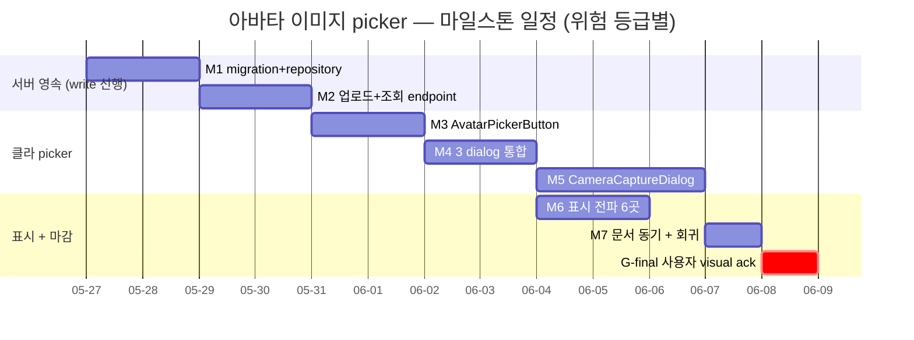
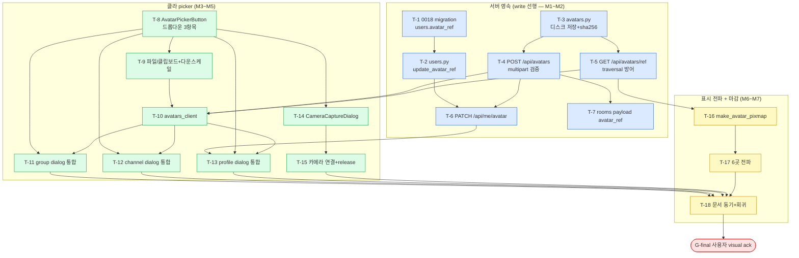

# 아바타 이미지 picker — 3곳 + 서버 영속 (텔레그램 정합)

> 정본 정합: [CLAUDE_HARNESS_IMPORTANT.md §B 5단계 워크플로우](../../../CLAUDE_HARNESS_IMPORTANT.md) · [§C 7역할](../../../CLAUDE_HARNESS_IMPORTANT.md) · [§D Exec Plans](../../../CLAUDE_HARNESS_IMPORTANT.md) · [§A M1~M7](../../../CLAUDE_HARNESS_IMPORTANT.md)
> 운영: [CLAUDE.md §2 워크플로우](../../../CLAUDE.md) · [CLAUDE.md §5 spawn 표준](../../../CLAUDE.md) · 저장소 맵: [AGENTS.md](../../../AGENTS.md)
> UI 모달 정책: [FRONTEND.md §16 다이얼로그 모달 정책](../../../FRONTEND.md) (in-app overlay 모달 + 별도 OS 윈도우 예외 4종)
> 본 문서는 실행/검증/결정 기록 문서다. TODO 목록이 아니다. ② 개발 단계는 main session 이 후속 수행하며, 본 planning 산출물은 코드보다 먼저 존재한다 (M1).
> directive 출처: 사용자 2026-05-26 "텔레그램 정합 — 아바타 이미지 picker 를 그룹 만들기 + 채널 만들기 + 개인 프로필 수정 3곳에 구현 + 서버 영속까지 지금".

---

## 0. 핵심 권고 요약 (사용자 재검토용 — 진행 전 필독)

코드 정독 (2026-05-26 read-only — `_avatar_helper.py` · `new_group_dialog.py` · `new_channel_dialog.py` · `my_profile_dialog.py` · `0011`/`0017` migration · `emoji_handlers.py` · `emoji_pack_items` DDL · `file_meta.py` · `users.py` · `friends.py` · `rooms_handlers.py` 라우팅) 결과, 5 경계 사실을 확정했다 (추측 배제).

### 0.1 현 3곳의 camera_btn 은 전부 클릭 핸들러가 부재다 — 빈 button shell

- `new_group_dialog.py:93` camera_btn = `load_icon("attach")` 의 파란 원형 button. `clicked` connect 부재. `new_channel_dialog.py:91` 은 icon 이 `notification` (오용) + 역시 핸들러 부재.
- `my_profile_dialog.py:111` 의 avatar 는 `make_initial_pixmap` 의 read-only 표시. picker 진입 button 부재. directive 가 지목한 "개인 프로필 수정(정보 dialog)" 의 picker 는 신설이다.
- **결론**: 3곳 모두 button 자리는 있으나 picker 동작은 0%. 공유 컴포넌트 `AvatarPickerButton` 1개로 3곳을 통일하면 중복 0 + 일관 UX 를 얻는다 (D-1).

### 0.2 서버 avatar 영속의 비대칭 — rooms 는 컬럼 존재, users 는 부재

- `rooms.avatar_ref VARCHAR(255)` 는 `0017` migration 에 **이미 존재**한다. 단 DDL 주석이 "실 이미지 업로드 파이프라인 = 별도 directive" 라 명시 — 컬럼만 있고 업로드 경로가 없다. 본 directive 가 그 "별도 directive" 다.
- `users` 테이블은 `nickname`(0011)·`display_name`/`phone`/`birthdate`/`bio`(0010) 만 있고 **avatar 이미지 컬럼이 부재**다. 신규 migration `0018` 로 `users.avatar_ref` 를 추가한다 (M1).
- **결론**: 서버 작업의 1차 단위는 "users.avatar_ref 컬럼 신설 + 업로드 endpoint + 저장 backend" 다. rooms 는 컬럼 재사용만 한다.

### 0.3 저장 backend 의 기존 패턴은 "server volume relative path" 다

- `emoji_pack_items.file_path` DDL 주석: "S3 key 또는 server volume relative path. 실 multipart upload to local volume = 별 cycle". `file_meta` 는 P2P DataChannel 전송 메타만 보관 (서버가 byte 를 들고 있지 않음).
- 즉 저장소 내 **실 이미지 byte 를 서버 디스크에 영속한 선례는 부재**다. 본 directive 가 그 최초 binding 이다.
- **권고 (D-3)**: 저장 backend = **server volume(디스크) relative path** 를 default 로 한다 (DB blob ✗ — 64KB+ 이미지의 row bloat / object storage ✗ — S3 인프라 미배치). `avatar_ref` 에는 `"avatars/<sha256>.<ext>"` relative key 를 보관하고 byte 는 `AVATAR_STORAGE_DIR` 디스크에 둔다. 추후 S3 전환 시 repository layer 만 교체.

### 0.4 표시 전파의 single source of truth 는 `_avatar_helper` 다

- `make_initial_pixmap` 호출처가 **11 파일** 확인됨: `settings_dialog` · `member_list` · `pending_requests_dialog` · `hamburger_drawer` · `my_account_dialog` · `chat_list_panel` · `remote_call_dialog` · `my_profile_dialog` · `group_info_dialog` · `call_dialog` (+ helper 본체).
- **권고 (D-6)**: `_avatar_helper` 에 `make_avatar_pixmap(name, avatar_ref=None, size=...)` 단일 진입을 신설한다 — `avatar_ref` 가 있으면 이미지 load (원형 crop), 없으면 기존 `make_initial_pixmap` fallback. 11 호출처를 이 단일 진입으로 점진 마이그레이션하되, **M6 의 표시 전파 범위는 directive 가 명시한 6곳 (chat sender/drawer header/profile/group/channel/member_list) 으로 한정**한다. 나머지 5곳은 fallback 그대로 무손상 (회귀 0).

### 0.5 진행 권고 — 서버 영속(write) 먼저, 클라 picker, 표시 전파 순. G-final 사용자 visual ack

- directive 가 "서버 영속까지 지금" 을 명시했으므로 M1(migration+repo) → M2(업로드 endpoint) 를 클라보다 먼저 둔다. 클라가 회신받을 `avatar_ref` 계약이 먼저 존재해야 한다 (M1 문서 선행 정신).
- M1~M7 전 구간 **headless 자동 검증 가능** — 서버는 aiohttp test client + repository unit, 클라는 offscreen Qt (`QT_QPA_PLATFORM=offscreen`) + QFileDialog/clipboard/camera mock. **G-final = 사용자 GO/NO-GO visual ack 게이트** (실 webcam 촬영 + 3 dialog 시각 정합은 headless 로 대체 불가).

> 사용자 재검토 포인트: 진짜 목적이 "3곳에서 이미지를 골라 원형 아바타로 보이고 서버에 남는다" 라면 M1~M7 전량 필요. 카메라(실 webcam)는 M5 단일 마일스톤으로 격리했으므로, 만약 카메라를 후순위로 미루려면 M5 만 GO/NO-GO 분리 가능 (M1~M4+M6 = 파일/클립보드 picker + 영속 + 표시로 자족).

---

## 1. 개요

텔레그램 정합 아바타 이미지 picker 를 **그룹 만들기 · 채널 만들기 · 개인 프로필 수정(정보 dialog)** 3곳에 결선하고, 선택 이미지를 **서버에 영속**한다.

- 원형 아바타 button 클릭 시 드롭다운 메뉴 3 항목: **파일에서 / 카메라에서 / 클립보드에서**. (텔레그램의 "이모지 사용" 항목은 **제외** — directive 명시.)
- 선택 이미지를 원형(circle crop)으로 표시한다.
- 이미지 미설정 시 **기존 `_avatar_helper` 이니셜 2글자 fallback 동작을 그대로 유지**한다 (회귀 0).
- 카메라 = 실 webcam 촬영. QtMultimedia(`QCamera`/`QImageCapture`/`QMediaCaptureSession`) 기반 **in-app 모달** live preview + capture (`CameraCaptureDialog`).
- 서버 영속: `rooms.avatar_ref`(0017 기존 컬럼 재사용) + `users.avatar_ref`(0018 신설) + 이미지 업로드 파이프라인(multipart + 디스크 volume 저장 + 조회 endpoint).

핵심 데이터 흐름:

```
[클라] AvatarPickerButton (파일/카메라/클립보드) → 이미지 byte (정사각 다운스케일 + EXIF strip)
   → POST /api/avatars (multipart) → 서버 검증 + sha256 + 디스크 저장 → avatar_ref 회신
   → 대상 영속 (PATCH /api/me/avatar 또는 그룹/채널 생성 payload 의 avatar_ref)
[표시] _avatar_helper.make_avatar_pixmap(name, avatar_ref)
   → avatar_ref 존재 시 GET /api/avatars/{ref} 이미지 load + 원형 crop
   → 부재 시 make_initial_pixmap 이니셜 fallback
```

본 계획은 **서버 영속(write) 을 먼저** 결선하고(M1~M2), 클라 picker(M3~M5) → 3 dialog 통합(M4 내) → 표시 전파(M6) 순으로 진행한다. 각 단계는 **기존 dialog/avatar offscreen test PASS 를 1건도 손상시키지 않는 것**을 게이트로 하며, 각 마일스톤 종료 시 `@reviewer-agent` 게이트를 의무화한다 (③ 검증 단계 진입).

---

## 2. 범위 (In Scope)

- **users.avatar_ref migration (M1)** — `server/db/migrations/0018_user_avatar_field.sql` 신설. `users.avatar_ref VARCHAR(255) NOT NULL DEFAULT ''`. 5요소 comment 의무 (용도/제약/값 출처/참조/민감도). `users.py` `UserRow` + `update_avatar_ref` 추가. `rooms.avatar_ref`(0017) 는 재사용.
- **avatar 저장 repository (M1)** — `server/db/repositories/avatars.py` 신설. 디스크 volume 저장 + sha256 dedup + relative key 산출. `AVATAR_STORAGE_DIR` 환경변수 (default `server/_avatar_store/`, .gitignore).
- **이미지 업로드 + 조회 endpoint (M2)** — `server/api/avatars_handlers.py` 신설. `POST /api/avatars`(multipart) + `GET /api/avatars/{ref}`(image bytes). `PATCH /api/me/avatar`(users.avatar_ref 갱신). 그룹/채널 생성 시 avatar_ref 수용 (`POST /api/rooms` payload + 그룹 수정 PATCH 정합).
- **AvatarPickerButton 공유 컴포넌트 (M3)** — `app/ui/_avatar_picker_button.py` 신설. QPushButton 확장. 원형 button + 클릭 시 드롭다운 3 항목(파일/카메라/클립보드). 파일=`QFileDialog`, 클립보드=`QGuiApplication.clipboard().image()`. 선택 이미지 정사각 다운스케일 + 원형 preview. `avatar_selected(QImage)` signal.
- **CameraCaptureDialog (M5)** — `app/ui/_camera_capture_dialog.py` 신설. QtMultimedia in-app 모달 (FRONTEND.md §16 `exec_modal` 정합). live preview(`QVideoWidget`) + 촬영 button(`QImageCapture.capture`) → QImage 회신. PyObjC/Qt camera resource release 의무 (feedback_objc_memory_release_mandatory 정합).
- **3 dialog 통합 (M4)** — `new_group_dialog.py`/`new_channel_dialog.py`/`my_profile_dialog.py` 의 camera_btn/avatar 를 `AvatarPickerButton` 으로 교체. 선택 이미지 → 업로드 → avatar_ref 를 생성/수정 payload 에 포함. `new_channel_dialog` icon 오용(notification) 동시 시정.
- **avatars_client (M2~M4)** — `app/net/avatars_client.py` 신설. upload/fetch/patch_me httpx wrapper.
- **표시 전파 (M6)** — `_avatar_helper.make_avatar_pixmap(name, avatar_ref, size)` 신설 + 6곳(chat sender/drawer header/profile/group/channel/member_list) 마이그레이션. avatar_ref 부재 시 이니셜 fallback 무손상.
- **이미지 제약 (M1~M3 전역)** — 포맷 jpg/png 만, 업로드 최대 5 MB, 다운스케일 정사각 512px crop, EXIF strip, content-type + magic byte 검증.
- **테스트 전략 (전 단계)** — 클라 offscreen Qt + QFileDialog/clipboard/camera mock + 이니셜 fallback 회귀. 서버 aiohttp test client + repository unit. headless 자동화.
- **문서 동기 의무 (전 단계)** — `Structure.md` / `FRONTEND.md`(§16 picker 항목 + 모달) / `ARCHITECTURE.md`(§6 avatar 파이프라인) / `CheckList.md` / 평가 snapshot 2종 + HTML mirror 갱신 지점 명시 (§11).
- **회귀 안전망** — 각 단계 종료 시 `pytest tests/` 전량 + cov delta. 기존 PASS 무손상 게이트.

---

## 3. 범위 외 (Out of Scope)

무엇을 하지 않는지가 무엇을 하는지보다 명확하다. directive 가 명시한 비목표를 그대로 고정한다.

- **이모지 아바타** — 텔레그램의 "이모지 사용" picker 항목은 **명시 제외**. 드롭다운은 파일/카메라/클립보드 3 항목만.
- **GIF / 동영상 아바타** — 정적 이미지(jpg/png)만. 애니메이션 아바타 일절 부재.
- **아바타 편집기(crop/rotate/필터)** — 사용자 수동 crop UI 부재. 다운스케일은 **자동 center 정사각 crop** 만 (편집 UI 없음). 회전/필터/줌 별도 directive.
- **avatar 변경 이력/버전 관리** — avatar_ref 는 최신 1개만 보관. 이전 avatar history 부재.
- **object storage(S3) binding** — M1 저장 backend = 디스크 volume. S3 전환은 repository layer 만 교체하는 후속 directive (인터페이스만 S3-ready 로 설계).
- **CDN / 이미지 리사이즈 서비스** — 서버가 단일 512px 정사각만 저장. 다중 해상도(thumbnail/원본) variant 부재.
- **avatar 표시 11곳 전수 마이그레이션** — M6 은 directive 명시 6곳만. 나머지 5곳(settings/pending_requests/remote_call/call_dialog 등)은 fallback 무손상 유지 (별도 directive 시 확장).
- **그룹/채널 멤버의 avatar 권한 정책** — owner/admin 만 그룹 avatar 변경 등의 권한 gate 는 별도 directive (본 directive 는 생성/수정 진입자 = 변경 가능 전제).
- **avatar 실시간 push 갱신** — 상대 avatar 변경 시 즉시 broadcast 부재. 조회 시점 스냅샷.

---

## 4. REST 계약

> 본 절은 클라 ↔ 서버 계약을 코드보다 먼저 고정한다 (M1 정신). 실 구현은 ② 개발 단계.

### 4.1 `POST /api/avatars` — 이미지 업로드

- **인증**: Bearer 의무 (auth_middleware `user_id` 주입).
- **Content-Type**: `multipart/form-data`. field `file` (jpg/png).
- **서버 검증 순서**: (1) content-type allowlist(`image/jpeg`·`image/png`) (2) magic byte 검사 (3) 크기 ≤ 5 MB (4) Pillow decode + 정사각 center crop + 512px 다운스케일 + EXIF strip 재인코딩 (5) sha256(재인코딩 byte) → `avatars/<sha256>.<ext>` key (6) 디스크 저장(존재 시 dedup skip).
- **응답** (201): `{"avatar_ref": "avatars/<sha256>.png", "width": 512, "height": 512, "bytes": <int>}`.
- **오류**: 415(content-type) / 413(크기) / 400(decode 실패) / 401(인증).

### 4.2 `GET /api/avatars/{ref}` — 이미지 조회

- **인증**: Bearer 의무 (avatar = 일반 민감도, 단 enumeration 방어 위해 인증 gate).
- `ref` = `avatars/<sha256>.<ext>` (path traversal 방어 — sha256 hex + ext allowlist 정규식 검증).
- **응답** (200): image bytes + `Content-Type: image/png|jpeg` + `Cache-Control: private, max-age=86400`.
- **오류**: 404(ref 부재) / 400(ref 형식) / 401.

### 4.3 `PATCH /api/me/avatar` — 내 프로필 avatar 갱신

- **인증**: Bearer.
- **body** (JSON): `{"avatar_ref": "avatars/<sha256>.png"}` (빈 문자열 = avatar 제거 → 이니셜 fallback 복귀).
- 서버는 `avatar_ref` 가 실재 파일을 가리키는지 검증 후 `users.avatar_ref` UPDATE.
- **응답** (200): `{"updated": true, "avatar_ref": "..."}`.

### 4.4 그룹/채널 avatar_ref 수용

- `POST /api/rooms` (그룹/채널 생성) payload 에 optional `avatar_ref` 추가 → `rooms.avatar_ref`(0017) 저장.
- 그룹 수정 `PATCH /api/rooms/{id}` (2026-05-25-telegram-group-management 계획의 M5 endpoint 정합) 에 `avatar_ref` field 추가.
- **응답**: 기존 RoomPayload 에 `avatar_ref` 포함 (표시 전파 source).

---

## 5. 마일스톤 (M1~M7)

위험 등급별 분해. 각 마일스톤 종료 시 `@reviewer-agent` PASS 게이트 의무 (③ 검증 진입). FAIL 시 ② 개발로 회귀.

| 마일스톤 | 작업 | 위험 | reviewer 게이트 | 검증 방식 |
|---|---|---|---|---|
| **M1** | `0018_user_avatar_field.sql` migration + `users.py` UserRow/update_avatar_ref + `avatars.py` repository(디스크 저장 + sha256 dedup) | 중 (schema 변경) | 의무 — DDL 5요소 comment + 기존 row 무손상 확인 | MIGRATION_MARIADB dry-run + repository unit (tmp dir) |
| **M2** | `avatars_handlers.py` 3 endpoint(POST/GET/PATCH) + rooms payload avatar_ref 수용 + route 등록 | 중 (업로드 검증) | 의무 — content-type/magic/크기/path-traversal 검증 전수 | aiohttp test client e2e (jpg/png/악성 byte/초과 크기) |
| **M3** | `AvatarPickerButton` 공유 컴포넌트(파일/클립보드 + 드롭다운 + 원형 preview) + `avatars_client` upload/fetch | 저 | 의무 — 한글 주석 + signal 계약 | offscreen Qt + QFileDialog/clipboard mock |
| **M4** | 3 dialog 통합(group/channel/profile camera_btn → AvatarPickerButton) + 생성/수정 payload avatar_ref + channel icon 오용 시정 | 중 (3곳 회귀) | 의무 — 기존 dialog test 무손상 | offscreen Qt 3 dialog + 생성 signal payload assert |
| **M5** | `CameraCaptureDialog`(QtMultimedia in-app 모달 live preview + capture) + 드롭다운 "카메라에서" 연결 + camera resource release | 고 (하드웨어 + 권한 + 메모리) | 의무 — release 누락 0 + 권한 거부 graceful | offscreen + QCamera mock(QImageCapture 가짜 frame) + tracemalloc 회귀 |
| **M6** | `_avatar_helper.make_avatar_pixmap(name, avatar_ref)` + 6곳 표시 전파(chat sender/drawer header/profile/group/channel/member_list) | 중 (표시 회귀) | 의무 — 이니셜 fallback 무손상 + 6곳 image load | offscreen + avatar_ref present/absent 양 분기 assert |
| **M7** | 문서 동기(Structure/FRONTEND §16/ARCHITECTURE §6/CheckList + 평가 snapshot 2 + HTML 2) + 회귀 전량 + 인계 | 저 | 의무 — doc lint + markdown lint PASS | doc-gardener-agent 정합 + pytest 전량 GREEN |
| **G-final** | 사용자 GO/NO-GO **visual ack** — 실 webcam 촬영 + 3 dialog 원형 아바타 시각 정합 + 서버 영속 round-trip | — | — | 사용자 직접 확인 (headless 대체 불가) |

### 5.1 Gantt (mermaid)



> M6 은 M4 종료 후 M5 와 병렬 가능 (표시 전파는 카메라와 독립). G-final 은 M5+M7 둘 다 종료 후 단일 게이트.

---

## 6. Task Breakdown

| id | M | 작업 | 담당 | 의존성 | 종료 조건 / 검증 | 산출물 경로 | 상태 |
|---|---|---|---|---|---|---|---|
| T-1 | M1 | `0018_user_avatar_field.sql` — users.avatar_ref + 5요소 comment | main session | — | migration apply + 기존 row DEFAULT '' 무손상 | `server/db/migrations/0018_user_avatar_field.sql` | ✅ done |
| T-2 | M1 | `users.py` UserRow.avatar_ref + `update_avatar_ref()` | main session | T-1 | repository unit (UPDATE + SELECT round-trip) | `server/db/repositories/users.py` | ✅ |
| T-3 | M1 | `avatars.py` 신설 — 디스크 저장 + sha256 dedup + key 산출 | main session | — | unit (tmp dir 저장 + dedup skip + key 형식) | `server/db/repositories/avatars.py` | ✅ |
| T-4 | M2 | `avatars_handlers.py` POST(multipart 검증 chain) | main session | T-3 | e2e (jpg/png OK + 악성 byte 415 + 초과 413) | `server/api/avatars_handlers.py` | todo |
| T-5 | M2 | GET `/api/avatars/{ref}` (path traversal 방어) | main session | T-3 | e2e (정상 200 + `../` reject 400 + 부재 404) | `server/api/avatars_handlers.py` | todo |
| T-6 | M2 | PATCH `/api/me/avatar` + route 등록 | main session | T-2, T-4 | e2e (avatar_ref 갱신 + 빈값 제거) | `server/api/avatars_handlers.py` · `server/main.py` | todo |
| T-7 | M2 | rooms 생성/수정 payload avatar_ref 수용 | main session | T-4 | e2e (생성 시 rooms.avatar_ref 영속) | `server/api/rooms_handlers.py` | todo |
| T-8 | M3 | `AvatarPickerButton` — 원형 button + 드롭다운 3항목 + preview | main session | — | offscreen (드롭다운 3 action 존재 + signal emit) | `app/ui/_avatar_picker_button.py` | todo |
| T-9 | M3 | 파일/클립보드 핸들러 + 정사각 다운스케일 + EXIF strip | main session | T-8 | offscreen (QFileDialog mock + clipboard.image mock) | `app/ui/_avatar_picker_button.py` | todo |
| T-10 | M3 | `avatars_client.py` upload/fetch/patch_me | main session | T-4, T-5 | httpx mock unit | `app/net/avatars_client.py` | todo |
| T-11 | M4 | `new_group_dialog` camera_btn → AvatarPickerButton + payload | main session | T-8, T-10 | offscreen (group_created signal avatar_ref 포함) | `app/ui/new_group_dialog.py` | todo |
| T-12 | M4 | `new_channel_dialog` 교체 + icon 오용(notification) 시정 | main session | T-8, T-10 | offscreen (channel_created avatar_ref + icon 정상) | `app/ui/new_channel_dialog.py` | todo |
| T-13 | M4 | `my_profile_dialog` avatar picker + PATCH /api/me/avatar | main session | T-6, T-8, T-10 | offscreen (picker 진입 + refresh 갱신) | `app/ui/my_profile_dialog.py` | todo |
| T-14 | M5 | `CameraCaptureDialog` — QtMultimedia live preview + capture | main session | T-8 | offscreen (QCamera mock frame capture → QImage) | `app/ui/_camera_capture_dialog.py` | todo |
| T-15 | M5 | 드롭다운 "카메라에서" 연결 + 권한 거부 graceful + resource release | main session | T-14 | offscreen (권한 거부 시 toast + release 호출 assert) | `app/ui/_avatar_picker_button.py` · `_camera_capture_dialog.py` | todo |
| T-16 | M6 | `_avatar_helper.make_avatar_pixmap(name, avatar_ref, size)` 신설 | main session | T-5 | unit (avatar_ref present → image / absent → 이니셜) | `app/ui/_avatar_helper.py` | todo |
| T-17 | M6 | 6곳 표시 전파(chat sender/drawer header/profile/group/channel/member_list) | main session | T-16 | offscreen (6곳 image load + fallback 무손상) | `app/ui/*.py` (6 파일) | todo |
| T-18 | M7 | 문서 동기 + HTML mirror + 회귀 전량 + 인계 | main session | T-1~T-17 | doc lint + markdown lint + pytest 전량 GREEN | `Structure.md` · `FRONTEND.md` · `ARCHITECTURE.md` · `CheckList.md` · 평가 2 + HTML 2 | todo |

> 담당 = main session 직접 작업 (본 저장소에 `@backend-agent`/`@frontend-agent` 미존재 — CLAUDE.md §2). 각 task 완료 직후 `@reviewer-agent` → `@qa-agent` → `@observability-agent` 직렬 게이트 + 즉시 commit/push (M5 가드레일).

---

## 7. Definition of Done

검증 가능한 단위로 10 항목 이내 정리. 각 항목은 PASS/FAIL 판정이 가능한 종료 조건이다.

| # | 항목 | 검증 방법 | 게이트 |
|---|---|---|---|
| D1 | 3곳(그룹/채널/프로필) 아바타 button 클릭 시 드롭다운 3항목(파일/카메라/클립보드) 노출, 이모지 항목 부재 | offscreen — 각 dialog 의 AvatarPickerButton 드롭다운 action text 3개 assert | reviewer |
| D2 | 파일/클립보드 선택 이미지가 원형 아바타로 즉시 preview | offscreen — QFileDialog/clipboard mock → preview pixmap non-null | reviewer + qa |
| D3 | 카메라(실 webcam) live preview + capture → 원형 아바타 | G-final 사용자 visual ack (실 하드웨어) + offscreen QCamera mock | qa + 사용자 |
| D4 | 이미지 업로드 → 서버 디스크 영속 + avatar_ref 회신 + 재로그인 후 재표시(round-trip) | aiohttp e2e + G-final round-trip | qa + 사용자 |
| D5 | 이미지 미설정 시 기존 이니셜 2글자 fallback 동작 무손상 (회귀 0) | offscreen — avatar_ref 부재 분기 = make_initial_pixmap 출력 동일 | reviewer |
| D6 | 이미지 제약 강제 — jpg/png 외 415, 5 MB 초과 413, EXIF strip, 정사각 512 다운스케일 | aiohttp e2e (악성 byte/초과/EXIF 포함 이미지) | qa |
| D7 | path traversal 방어 — `GET /api/avatars/../` reject | aiohttp e2e (`../`·절대경로·확장자 위조 reject) | qa + observability |
| D8 | 카메라/Qt resource release 누락 0 (메모리 누수 차단) | tracemalloc + camera close 호출 assert | observability |
| D9 | 6곳 표시 전파 — avatar_ref 존재 시 image load, 부재 시 이니셜 | offscreen 6곳 양 분기 assert | reviewer + qa |
| D10 | 5단계 워크플로우 완주 — reviewer→qa→observability PASS + 문서 동기 + 회귀 전량 GREEN + 즉시 push | CI 3종 GREEN + pytest 전량 + doc lint | release |

---

## 8. 결정 로그 (D-1~)

| id | directive 시점 / 근거 | 결정 | 영향 |
|---|---|---|---|
| D-1 | 3곳 camera_btn 전부 핸들러 부재(0.1) + 중복 회피 | 공유 컴포넌트 `AvatarPickerButton`(QPushButton 확장) 1개로 3곳 통일. `avatar_selected(QImage)` signal | 중복 0 + 일관 UX. 3 dialog import 1줄 + button 1개 교체로 통합 |
| D-2 | FRONTEND.md §16 in-app 모달 정책 + QtMultimedia 가용 확인 | `CameraCaptureDialog` = in-app 모달(`exec_modal(dlg, parent)` parent walk → MainWindow `_exec_dialog_centered`). 별도 OS 창 예외 4종 어디에도 미해당 | 카메라 창이 메인 레이아웃 안 overlay. §16 예외표 변경 불요 |
| D-3 | emoji_pack_items/file_meta 조사(0.3) — 디스크 byte 영속 선례 부재 | 저장 backend = **server volume(디스크) relative path** default. `avatar_ref` = `avatars/<sha256>.<ext>` key. byte 는 `AVATAR_STORAGE_DIR` 디스크. S3 인터페이스 ready (repository layer 격리) | DB blob row bloat 회피 + object storage 인프라 미배치 회피. 추후 S3 전환 = repository 1파일 교체 |
| D-4 | 대용량/악성 업로드 위험 + EXIF privacy | 이미지 제약: jpg/png allowlist + magic byte + ≤5 MB + Pillow 정사각 512 center crop + EXIF strip 재인코딩 + sha256 dedup | 업로드 검증 chain 6단계. row/디스크 bloat + GPS EXIF 유출 차단 |
| D-5 | users avatar 컬럼 부재(0.2) + migration 번호 연속성(0017 = 최신) | `users.avatar_ref` = 신규 migration **0018**. `rooms.avatar_ref`(0017) 는 재사용(신규 migration 불요) | 0018 = 단일 ALTER TABLE 1 컬럼. 기존 row DEFAULT '' 안전 |
| D-6 | make_initial_pixmap 11 호출처(0.4) + 회귀 위험 | `_avatar_helper.make_avatar_pixmap(name, avatar_ref=None, size)` 단일 진입. avatar_ref 부재 시 기존 make_initial_pixmap 위임(무손상). 표시 전파 범위 = directive 명시 **6곳 한정** | single source of truth. 나머지 5곳 fallback 무손상. make_initial_pixmap 시그니처 불변(append-only) |
| D-7 | 카메라 = 하드웨어/권한/메모리 3중 위험(M5 고위험) | M5 단일 마일스톤으로 카메라 격리. M1~M4+M6(파일/클립보드+영속+표시) = 카메라 없이 자족. 권한 거부 graceful + resource release 의무 | 카메라만 GO/NO-GO 분리 가능. 권한 거부 시 toast + 다른 2항목 정상 |
| D-8 | avatar = 일반 민감도 단 enumeration 우려 | GET/POST/PATCH 전 endpoint Bearer 인증 gate. avatar_ref = sha256 key (URL enumeration 난이도 상승) | public CDN 부재. 인증 사용자만 조회. 추후 public room avatar 시 재검토 |

> 본 로그는 작성자(planning-agent) 또는 사용자 명시 승인 없이 임의 수정 금지. 추가 결정은 D-9 이후 append.

---

## 9. 기술 부채

해소 시점을 명시한다 (TBD 금지).

| id | 부채 | 사유 | 해소 시점 |
|---|---|---|---|
| TD-1 | 저장 backend = 디스크 volume (S3 미사용) | object storage 인프라 미배치. 데모 서버 단일 호스트 | Phase 4 인프라 확장 시 (object storage 배치 directive) — repository layer 교체 |
| TD-2 | avatar 단일 해상도(512 정사각)만 저장 | thumbnail/원본 variant 파이프라인 = 본 directive 범위 외 | 채팅 list 성능 directive 진입 시 (저해상도 thumbnail variant 추가) |
| TD-3 | 표시 전파 6곳만 (11곳 중 5곳 fallback 유지) | directive 명시 6곳 한정 | avatar 전면 적용 directive 진입 시 (나머지 5곳 확장) |
| TD-4 | avatar 변경 실시간 push 부재 (조회 스냅샷) | signaling presence broadcast = 별도 directive | presence broadcast directive 진입 시 (2026-05-25-telegram-group-management online push 정합) |
| TD-5 | 디스크 GC 부재 (avatar_ref 미참조 파일 누적) | dedup sha256 라 즉시 누수는 아니나 변경 누적 시 orphan 발생 | M7 종료 후 후속 directive (주 1회 orphan sweep cron — doc-gardener 패턴 정합) |

---

## 10. 차단점 (Blockers)

| id | 차단점 | 영향 마일스톤 | 해소 조건 |
|---|---|---|---|
| B-1 | `AVATAR_STORAGE_DIR` 디스크 경로 + 권한 + .gitignore 미정 | M1 | 환경변수 default(`server/_avatar_store/`) 확정 + .gitignore 추가 (M1 내 self-resolve) |
| B-2 | Pillow 의존성 서버 쪽 설치 여부 미확인 | M2 | M2 진입 전 `server/requirements*.txt` Pillow 확인 — 부재 시 추가 (1줄) |
| B-3 | CI/self-hosted runner QtMultimedia + 가짜 카메라 plugin 가용성 | M5 | M5 진입 전 offscreen QCamera mock 전략 확정 (실 하드웨어는 G-final 사용자 ack 로 분리) |
| B-4 | 그룹 수정 PATCH `/api/rooms/{id}` endpoint = 2026-05-25-telegram-group-management 계획 M5 의존 | M4 (그룹 avatar 수정 경로) | 해당 계획 M5 미완 시 본 계획은 **생성 시 avatar_ref** 만 우선 결선, 수정 경로는 후행 (생성/프로필은 독립 진행 가능) |

---

## 11. 의존성 그래프 (mermaid)



> 그래프 정합: §5 마일스톤(M1~M7) ↔ §6 Task(T-1~T-18) ↔ 본 그래프 edge 가 1:1 대응한다. 서버(파랑)가 클라(초록)보다 선행하며(write 계약 선존), 표시 전파(노랑)는 M4·M5 종료 후 수렴해 G-final(빨강) 단일 게이트로 종료한다.

---

## 12. 테스트 전략

### 12.1 클라 (offscreen Qt — `QT_QPA_PLATFORM=offscreen`)

- **AvatarPickerButton (M3)**: 드롭다운 3 action text(`파일에서`/`카메라에서`/`클립보드에서`) assert + 이모지 항목 부재 assert. `avatar_selected` signal emit 검증.
- **파일 picker**: `QFileDialog.getOpenFileName` monkeypatch → 임시 jpg/png path 반환 → preview pixmap non-null + 정사각 다운스케일 size assert.
- **클립보드 picker**: `QGuiApplication.clipboard().image()` mock → QImage 주입 → preview 갱신.
- **카메라 (M5)**: 실 하드웨어 없이 `QImageCapture.imageCaptured` signal 을 가짜 QImage 로 emit (mock) → 회신 검증. 권한 거부 분기 = `QCamera.errorOccurred` mock → toast + dialog 정상 종료. resource release = `QMediaCaptureSession`/`QCamera` `setActive(False)`/`deleteLater` 호출 assert.
- **이니셜 fallback 회귀 (M6 / D5)**: `make_avatar_pixmap(name, avatar_ref=None)` 출력이 기존 `make_initial_pixmap(name)` 와 픽셀 동등(또는 동일 코드경로) assert.
- **3 dialog 통합 (M4)**: 각 dialog 생성 signal payload 에 avatar_ref 포함 검증 (group_created/channel_created/PATCH 호출).

### 12.2 서버 (aiohttp test client + repository unit)

- **avatars repository (M1)**: tmp dir 저장 → key 형식(`avatars/<64 hex>.<ext>`) assert + 동일 byte 재저장 dedup skip + SELECT round-trip.
- **POST /api/avatars (M2)**: 정상 jpg/png 201 + avatar_ref 회신 / 악성 byte(`%PDF`) 415 / 6 MB 413 / EXIF 포함 이미지 → strip 후 저장 검증 / 비인증 401.
- **GET /api/avatars/{ref} (M2)**: 정상 200 + content-type / `../etc/passwd` 400 / 절대경로 400 / 부재 ref 404.
- **PATCH /api/me/avatar (M2)**: avatar_ref 갱신 200 → users.avatar_ref SELECT 일치 / 빈값 → 제거(이니셜 복귀) / 미실재 ref → 400.
- **rooms avatar_ref (M2)**: `POST /api/rooms` avatar_ref 포함 → rooms.avatar_ref 영속 assert.

### 12.3 회귀 + 메모리

- 각 마일스톤 종료 시 `pytest tests/` 전량 GREEN + cov delta 비음수.
- M5: tracemalloc + RSS 회귀 (카메라 open/close 100회 loop 후 누수 0 — feedback_objc_memory_release_mandatory 정합).
- 기존 3 dialog offscreen test + 11 avatar 호출처 test 1건도 손상 없음 (회귀 0 게이트).

---

## 13. 참조

| 주제 | 문서 / 경로 |
|---|---|
| Watcher 정본 (M1~M7 · 5단계 워크플로우 · Exec Plans) | [CLAUDE_HARNESS_IMPORTANT.md](../../../CLAUDE_HARNESS_IMPORTANT.md) §A · §B · §D |
| 세션 내 호출 규약 (spawn 표준 · BPE 위생) | [CLAUDE.md](../../../CLAUDE.md) §2 · §5 |
| 저장소 맵 · 문서 인덱스 | [AGENTS.md](../../../AGENTS.md) §3 · §4 |
| UI 모달 정책 (in-app overlay + 예외 4종) | [FRONTEND.md](../../../FRONTEND.md) §16 |
| avatar fallback helper (이니셜 2글자) | [app/ui/_avatar_helper.py](../../../app/ui/_avatar_helper.py) |
| rooms.avatar_ref 기존 컬럼 (재사용) | [server/db/migrations/0017_group_roles_meta.sql](../../../server/db/migrations/0017_group_roles_meta.sql) |
| users.nickname (avatar text source) | [server/db/migrations/0011_user_nickname_field.sql](../../../server/db/migrations/0011_user_nickname_field.sql) |
| 저장 패턴 참고 (file_path = volume relative) | [server/db/migrations/0004_emoji_packs.sql](../../../server/db/migrations/0004_emoji_packs.sql) · [server/api/emoji_handlers.py](../../../server/api/emoji_handlers.py) |
| 파일 메타 repository 패턴 | [server/db/repositories/file_meta.py](../../../server/db/repositories/file_meta.py) |
| 그룹 수정 PATCH endpoint 의존 (B-4) | [docs/exec-plans/active/2026-05-25-telegram-group-management.md](2026-05-25-telegram-group-management.md) |
| 가드레일 — 코드 전 문서 완성 8 체크리스트 | feedback_doc_perfection_before_code · feedback_workflow_strict_doc_first |
| 가드레일 — DDL 5요소 comment | feedback_db_schema_field_comments |
| 가드레일 — 카메라/Qt resource release | feedback_objc_memory_release_mandatory |

---

## 14. Handoff

- **즉시**: 본 초안 완성 직후 `@reviewer-agent` 사전 검토 요청 (M1 정합 — Task↔마일스톤↔의존성 그래프 1:1 대응 + DoD 검증 가능성 확인).
- **사용자 승인 후**: `status: draft` → `status: active` 전이는 main session 수행.
- **위임**: `wbs_tasks` row 등록(M6 directive=1행) 은 main session 에 위임 (본 에이전트 범위 외).
- **G-final**: M5+M7 종료 후 사용자 visual ack — 실 webcam 촬영 + 3 dialog 원형 아바타 + 서버 영속 round-trip. 이 게이트만 headless 대체 불가.

---

마지막 갱신: 2026-05-26 (planning-agent 초안 — 아바타 이미지 picker 3곳 + 서버 영속 Exec Plan 신설)
