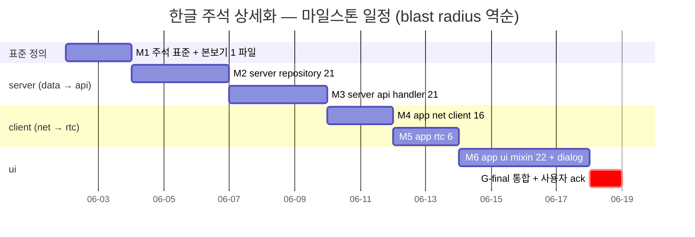
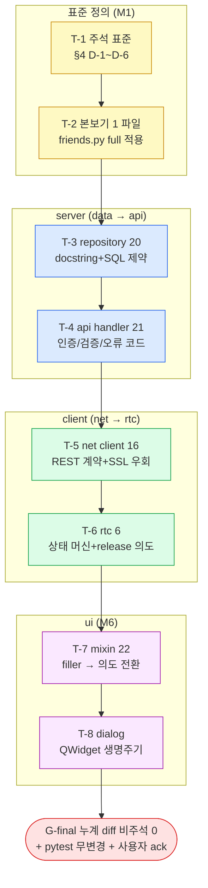

# 한글 주석 상세화 페이즈 — docstring + inline 주석 의도/제약/부작용/참조 보강

> 정본 정합: [CLAUDE_HARNESS_IMPORTANT.md §B 5단계 워크플로우](../../../CLAUDE_HARNESS_IMPORTANT.md) · [§J M4 한글 주석 의무](../../../CLAUDE_HARNESS_IMPORTANT.md) · [§E 계층 구조](../../../CLAUDE_HARNESS_IMPORTANT.md) · [§D Exec Plans](../../../CLAUDE_HARNESS_IMPORTANT.md)
> 운영: [CLAUDE.md §5 spawn 표준](../../../CLAUDE.md) · [CLAUDE.md §5-1 BPE 위생](../../../CLAUDE.md) · [CLAUDE.md §5-3 한글 주석 의무](../../../CLAUDE.md) · 저장소 맵: [AGENTS.md](../../../AGENTS.md)
> 본 문서는 실행/검증/결정 기록 문서다. TODO 목록이 아니다. ② 개발 단계(실 주석 작업)는 main session 이 후속 수행하며, 본 planning 산출물은 코드보다 먼저 존재한다 (M1).
> directive 출처: 사용자 2026-05-26 "전반적인 소스코드를 보니 한글 주석이 조금은 있긴 하지만 좀더 상세 했으면 좋겠어. 주석 보강은 별도의 페이즈에서 작업 하도록 계획세워."

---

## 0. 핵심 권고 요약 (사용자 재검토용 — 진행 전 필독)

read-only 코드 정독 (2026-05-26 — `app/rtc/peer.py` · `server/db/repositories/friends.py` · `app/ui/_chat_send_mixin.py` · `server/db/migrations/0017_group_roles_meta.sql` 의 DDL 5요소 COMMENT 모범 사례) 결과, 3 사실을 확정했다 (추측 배제).

### 0.1 주석이 "있다"는 것과 "상세하다"는 것의 격차가 영역마다 비균질하다

- **모듈/repository docstring 은 이미 모범 수준** — `peer.py` 는 설계 의도·범위 한계·signal 계약을 docstring 에 명시한다. `friends.py` 는 "설계 결정 / 본 module 범위 외" 절을 갖춘다. 이 영역은 보강 여지가 적다.
- **inline 주석은 filler 패턴이 다수** — `app/ui/` 하위에서 리터럴 문자열 `한글 주석` 이 **70 파일 355회** 확인됨 (`_chat_send_mixin.py` 9회 등). 다수가 `# 한글 주석 — InputBar 의 QTextEdit 안 text 이미 clear 됨` 처럼 **무엇(what) 을 재진술**하는 형태다. M4(한글 주석 1줄 의무) 를 기계적으로 충족하나, **왜(의도)·제약·부작용·정본 참조** 가 결여돼 있다.
- **DDL COMMENT 가 이미 등가 상세도 모범 사례** — `0017` migration 의 각 컬럼 COMMENT 는 "용도/제약/값 출처/참조/민감도" 5요소를 한 문장에 담는다 (feedback_db_schema_field_comments 가드레일 산물). **코드 주석의 목표 상세도 = 이 DDL COMMENT 의 코드판 등가물** 이다.

### 0.2 본 작업은 "주석 전용 cycle" 이다 — 기능 diff 0 이 최상위 게이트

- 코드의 동작 라인(statement/expression)은 단 1줄도 바꾸지 않는다. `git diff` 가 **주석·docstring·공백 라인만** 포함하는지가 영역별 머지 게이트다 (D5 + DoD-2).
- 따라서 pytest 전량은 **무변경 PASS** 가 의무다. test 결과가 1건이라도 달라지면 그것은 곧 기능 변경이 섞였다는 증거다 (회귀 0 = 본 페이즈의 안전망이자 검출기).

### 0.3 진행 권고 — blast radius 역순 (위험 큰 server repository 먼저), 영역별 작은 commit + reviewer 게이트

- 주석 오기술(코드 의미를 틀리게 서술) 이 본 페이즈 최대 위험이다. **오기술 주석은 무주석보다 해롭다** (미래 독자를 오도). 따라서 `@reviewer-agent` 가 "주석↔코드 정합" 을 매 영역 검출하는 게이트를 의무화한다.
- 영역 순서 = data 계층(server repository) → API(server handler) → 클라 net → rtc → ui mixin → ui dialog. 깊은 계층(정본 §E 의 하위)일수록 오기술 시 blast radius 가 크므로 먼저 처리해 reviewer 의 시선이 집중된 초반에 고위험 영역을 통과시킨다.

> 사용자 재검토 포인트: 진짜 목적이 "신규 합류자/미래 세션이 코드 의도를 빠르게 파악" 이라면 M1~M6 전량 + 주석 표준(§4) 정착이 필요하다. 만약 "filler `한글 주석` 패턴만 우선 정리" 가 목적이라면 M1 표준 정의 + M2(server repository) 만으로도 표준의 살아있는 본보기를 얻는다 (나머지 영역은 표준 적용을 점진 확산). 본 페이즈는 **기능 마일스톤과 별개 품질 트랙** 이며 사용자 명시 GO 시점에 진입한다 (§8).

---

## 1. 개요

본 페이즈는 TooTalk 소스코드의 한글 주석을 **상세도 기준** 으로 보강하는 **주석 전용 cycle** 이다. 기능 변경은 일절 부재하다.

현 시점 코드는 M4(작업 파일 한글 주석 1줄 의무, 정본 §J) 로 **최소 주석은 존재** 하나, inline 주석 다수가 코드의 동작을 재진술(what)하는 데 그쳐 **의도(why)·제약·부작용·정본 참조** 가 결여돼 있다. 모듈/repository docstring 은 일부 모범 수준이나 영역별 편차가 크다.

목표 = 다음 4 계층의 주석을 "왜/제약/부작용/참조" 수준으로 상세화한다.

- **모듈 docstring** — 역할 + 계층 위치(정본 §E) + 의존성 + 범위 한계.
- **클래스 docstring** — 책임 + 불변식(invariant) + 협력 객체.
- **함수 docstring** — 의도 / Parameters / Returns / Raises / 부작용(side effect).
- **inline 주석** — "왜" 위주. 비자명 분기·회귀 회수 근거·정본 참조.

상세도 목표선 = `server/db/migrations/0017` 의 DDL COMMENT 5요소(용도/제약/값 출처/참조/민감도)의 **코드판 등가물** (§4 주석 표준 D-1).

본 계획은 blast radius 역순(server repository → server api → app/net → app/rtc → app/ui mixin → app/ui dialog)으로 영역을 분해하고, **영역별 작은 commit + `@reviewer-agent` 주석↔코드 정합 게이트 + 기능 diff 0 게이트** 를 의무화한다.

---

## 2. 범위 (In Scope)

- **주석 표준 정의 (M1)** — 본 문서 §4 의 D-1~D-6 주석 표준을 확정하고, 1 영역(server repository 1 파일)에 적용한 **살아있는 본보기(reference exemplar)** 를 산출한다. 표준은 모듈/클래스/함수 docstring + inline 4 계층 + 한글 본문/영문 식별자/BPE 위생 규칙을 포함한다.
- **server repository 주석 보강 (M2)** — `server/db/repositories/*.py` (21 파일). 함수 docstring 에 의도/Parameters/Returns/Raises/부작용 + SQL 의 비자명 제약(단방향 row 모델 등) inline 주석.
- **server API handler 주석 보강 (M3)** — `server/api/*_handlers.py` (21 파일). endpoint docstring 에 인증 요구·검증 순서·오류 코드 매핑·부작용(DB write/broadcast) 명시.
- **app/net client 주석 보강 (M4)** — `app/net/*_client.py` (16 파일). REST 계약·재시도/타임아웃 정책·SSL 우회(_ssl_util) 의도 명시.
- **app/rtc 주석 보강 (M5)** — `app/rtc/*.py` (peer/file_sender/file_receiver/mesh_manager/protocol/image_processor). WebRTC 상태 머신 전이·DataChannel 메시지 계약·메모리 release 의도(feedback_objc_memory_release_mandatory 정합) 명시.
- **app/ui mixin + dialog 주석 보강 (M6)** — `app/ui/_*_mixin.py` (22 파일) + `app/ui/*_dialog.py`. filler `한글 주석 —` 패턴을 의도 기반 주석으로 전환. signal/slot 계약·`self.*` 의존 출처·QWidget 생명주기 부작용 명시.
- **test 코드 주석 보강 (M7 — 사용자 directive 2026-05-27 "e2e 테스트 파일까지 모두 보강")** — `tests/app/**`·`tests/server/**`·`tests/e2e/**` 전량. module docstring 에 test 대상·전략(offscreen/mock/fixture) 명시 + test 함수 docstring/inline 에 **무엇을 왜 검증하는가**(회귀 회수 근거·edge case 의도·oracle). assert/fixture/parametrize 동작 라인 불변(기능 diff 0).
- **주석 표준 문서 정착 (전 영역)** — §4 주석 표준을 `docs/policies/` 하위 또는 본 Exec Plan §4 에 정본화. (루트 신규 마크다운 금지 — docs/ 하위만.)
- **검증 안전망 (전 영역)** — 영역별 `git diff` 의 비주석 라인 0 확인 + `pytest tests/` 전량 무변경 PASS + BPE/대명사 hook PASS + `@reviewer-agent` 주석↔코드 정합.

---

## 3. 범위 외 (Out of Scope)

무엇을 하지 않는지가 무엇을 하는지보다 명확하다. directive 가 명시한 비목표를 그대로 고정한다.

- **영문 식별자의 한글화 절대 금지** — 변수·함수·클래스·모듈 이름은 영문 유지(정본 §J + CLAUDE.md §5-3). 한글은 주석·docstring 본문에만. 식별자 rename = 본 페이즈 범위 외(기능/import 영향).
- **과잉 주석(over-commenting) 금지** — 자명한 코드의 1:1 설명(`i += 1  # i 를 1 증가`)은 금지. 주석은 "왜" 가 비자명할 때만. filler `한글 주석` 을 또 다른 filler 로 치환하는 것은 위반.
- **기능/동작 변경 절대 금지** — statement/expression/제어흐름 일절 불변. 본 페이즈는 주석·docstring·공백 라인만 touch. 동작 변경은 별도 directive.
- **리팩터링 동반 금지** — "주석 달다 보니 코드도 정리" 패턴 금지. 코드 구조 변경은 본 페이즈 게이트(기능 diff 0)를 깨므로 별도 directive.
- **신규 test 추가 금지** — 본 페이즈는 주석 전용. 기존 test 무변경 PASS 가 oracle 이지 신규 test 작성은 부재(기능 변경 부재이므로 검증할 신규 동작 없음). test 파일도 **주석/docstring 만** 보강하며 assert/fixture/parametrize 등 동작 라인은 일절 불변.
- **markdownlint / doc-lint 적용 범위 외** — 본 작업 산출물은 코드 주석(`.py`)이지 마크다운 문서가 아니다. lint 게이트는 본 Exec Plan 문서 자체에만 적용(M2/M3 정합), 코드 주석은 BPE/대명사/AST hook 만 적용.
- **자동 docstring 생성 도구(LLM bulk) 일괄 적용 금지** — bulk 생성은 오기술 위험이 크다. 영역별 수동 + reviewer 정합 게이트가 의무. 도구 보조는 초안까지만, 정합 검증은 사람/reviewer 책임.

---

## 4. 주석 표준 정의 (D-1~D-6 — M1 산출 정본)

> 본 절이 M1 의 핵심 산출물이다. 코드보다 먼저 표준이 존재해야 한다(M1 정신). 상세도 목표선 = `0017` DDL COMMENT 5요소의 코드판 등가물.

### D-1. 모듈 docstring (파일 최상단)

- **역할** — 본 모듈이 무엇을 책임지는가 (1~2 문장).
- **계층 위치** — 정본 §E 계층 구조 안 어디인가 (예: "server data 계층 — repository, API handler 가 호출").
- **의존성** — 무엇에 의존하고 무엇이 본 모듈에 의존하는가 (협력 방향).
- **범위 한계** — 본 모듈이 하지 않는 것 (예: `friends.py` 의 "본 module 범위 외" 절). 오용 방지의 핵심.
- **함수/SQL 카탈로그 컨벤션** — module docstring 에 공개 함수/SQL 목록을 적을 때 **실 심볼명(함수명) 기준**으로 적고, 개수를 실 함수 수와 일치시킨다. 약칭/단수복수 불일치(예: `list_by_friend` ↔ 실 `list_pending_requests`)는 미래 독자가 카탈로그로 코드 탐색 시 오도하므로 금지(reviewer T-2 HIGH 회수, cycle 169.853).

### D-2. 클래스 docstring

- **책임(responsibility)** — 단일 책임 1문장.
- **불변식(invariant)** — 항상 참이어야 하는 조건 (예: "owner 1명 의무 — rooms.owner_id 정합").
- **협력 객체(collaborator)** — 어떤 객체와 협력하며 주입(DI)되는가.

### D-3. 함수/메서드 docstring

- **의도(intent)** — 왜 이 함수가 필요한가 (호출 맥락).
- **Parameters** — 각 인자의 의미·제약·값 출처.
- **Returns** — 반환의 의미·형태.
- **Raises** — 던지는 예외와 조건.
- **부작용(side effect)** — DB write / 네트워크 IO / Qt signal emit / QWidget 생명주기 / 파일 IO 등 외부 가시 효과.

### D-4. inline 주석

- **"왜" 위주, "무엇" 금지** — 코드가 이미 말하는 what 을 재진술하지 않는다. 비자명한 의도·제약을 설명한다.
- **회귀 회수 근거 명시** — 특정 분기가 과거 버그 회수의 산물이면 cycle 번호 + 사유 (예: `# cycle 154.2 file_sender graceful binding — 부재 시 hang 회피`).
- **정본 참조** — 정책/가드레일에 근거한 분기는 출처 링크 (예: `# feedback_objc_memory_release_mandatory — CFRelease 의무`).

### D-5. 언어/위생 규칙 (전 계층 공통)

- **한글 본문 + 영문 식별자** — 주석/docstring 문장은 한국어, 코드 식별자·라이브러리명·signal 명은 영문 유지.
- **BPE 위생** — U+CE21 단독 단어 사용 금지 (합성어 관측·검증·측면·예측 허용). CLAUDE.md §5-1 정합. `@reviewer-agent` 가 `금지패턴-BPE` 로 FAIL.
- **대명사 금지** — self/other 지칭 한국어 대명사(feedback_no_self_other_pronoun 금지 2종) + 1인칭/3인칭 대명사 금지. "내/상대/호출자/peer" 로 대체.
- **emoji** — 주석 안 emoji 는 표준 Unicode BMP 만 (feedback_emoji_telegram_compat). 원칙적으로 코드 주석에 emoji 불요.

### D-6. lint 적용 범위

- 코드 주석은 markdownlint/doc-lint **무관** (마크다운 아님). 적용 게이트 = AST(주석이 syntax 안 깨는지) + BPE hook + 대명사 hook + `@reviewer-agent` 주석↔코드 정합.
- 본 Exec Plan 문서 자체는 markdownlint + doc-lint 적용 (M2/M3 정합).

---

## 5. 마일스톤 (M1~M6 + G-final)

blast radius 역순 분해. 각 마일스톤 종료 시 `@reviewer-agent` 주석↔코드 정합 PASS + 기능 diff 0 게이트 의무 (③ 검증 진입). FAIL 시 ② 개발로 회귀.

| 마일스톤 | 영역 | 파일 수 | 위험 | reviewer 게이트 | 검증 방식 |
|---|---|---|---|---|---|
| **M1** | 주석 표준 정의(§4 D-1~D-6) + server repository 1 파일 본보기 적용 | 1 (+표준) | 저 | 의무 — 표준 자체 + 본보기 정합 | reviewer 표준 승인 + diff 주석만 |
| **M2** | `server/db/repositories/*.py` 전량 | 21 | 중 (data 계층 — 오기술 blast 大) | 의무 — SQL 제약 주석 정합 + diff 주석만 | pytest 전량 무변경 PASS + diff 비주석 0 |
| **M3** | `server/api/*_handlers.py` 전량 | 21 | 중 (계약 오기술) | 의무 — 인증/검증/오류 코드 매핑 정합 | pytest 전량 무변경 PASS + diff 비주석 0 |
| **M4** | `app/net/*_client.py` 전량 | 16 | 저 | 의무 — REST 계약·SSL 우회 의도 정합 | pytest 전량 무변경 PASS + diff 비주석 0 |
| **M5** | `app/rtc/*.py` 전량 | 6 | 중 (상태 머신·메모리 release 의도) | 의무 — 상태 전이·release 의도 정합 | pytest 전량 무변경 PASS + diff 비주석 0 |
| **M6** | `app/ui/_*_mixin.py` (22) + `app/ui/*_dialog.py` | 22+ | 중 (filler `한글 주석` 355회 전환) | 의무 — filler 전환 + signal 계약 정합 + diff 주석만 | offscreen pytest 전량 무변경 PASS + diff 비주석 0 |
| **M7** | `tests/app/**` + `tests/server/**` + `tests/e2e/**` 전량 (사용자 directive 2026-05-27) | 전체 test | 중 (assert/fixture 오변경 시 회귀) | 의무 — test 의도/oracle 주석 정합 + diff 주석만 | pytest 전량 무변경 PASS + diff 비주석 0 (assert/fixture 불변) |
| **G-final** | 전 영역 통합(production + test) | 전체 | — | 사용자 게이트 | `git diff` 누계 비주석 0 + pytest 전량 무변경 + 사용자 GO/NO-GO (표준 정합 sample 육안 확인) |

### 5.1 Gantt (mermaid)

> M4(net) 와 M5(rtc) 는 server(M2/M3) 완료 후 상호 독립 — 병렬 가능(feedback_parallel_execution_mandatory 정합). 단 본 페이즈는 영역별 diff 게이트가 commit 단위라 직렬 권고(reviewer 시선 분산 회피). G-final 은 M6 종료 후 단일 게이트.

---

## 6. Task Breakdown

| id | M | 작업 | 담당 | 의존성 | 종료 조건 / 검증 | 산출물 경로 | 상태 |
|---|---|---|---|---|---|---|---|
| T-1 | M1 | 주석 표준 §4 D-1~D-6 확정 + 카탈로그 컨벤션 + reviewer 승인 | main session | — | 표준 6 항목 + 본보기 정합 | 본 Exec Plan §4 | ✅ |
| T-2 | M1 | server repository 1 파일(`friends.py`) 에 표준 full 적용 본보기 | main session | T-1 | diff 주석만 + pytest 무변경 + reviewer 정합 | `server/db/repositories/friends.py` | ✅ (reviewer PASS, HIGH 회수) |
| T-3 | M2 | `server/db/repositories/*.py` 잔여 함수 docstring + SQL 제약 inline | main session | T-2 | 영역 diff 비주석 0 + pytest 전량 무변경 PASS | `server/db/repositories/*.py` | ✅ (21/21 전수 — verify_comment_only PASS + server 642 무변경) |
| T-4 | M3 | `server/api/*_handlers.py` endpoint docstring(인증/검증 순서/오류 코드/부작용) | main session | T-3 | 영역 diff 비주석 0 + pytest 전량 무변경 PASS | `server/api/*_handlers.py` (실 19) | 🔄 batch-1 3/19 (health·push·read, `6a9ebbe`) |
| T-5 | M4 | `app/net/*_client.py` REST 계약·재시도/타임아웃·SSL 우회 의도 주석 | main session | T-4 | 영역 diff 비주석 0 + pytest 전량 무변경 PASS | `app/net/*_client.py` (16) | todo |
| T-6 | M5 | `app/rtc/*.py` 상태 머신 전이·DataChannel 계약·메모리 release 의도 주석 | main session | T-5 | 영역 diff 비주석 0 + pytest 전량 무변경 PASS | `app/rtc/*.py` (6) | todo |
| T-7 | M6 | `app/ui/_*_mixin.py` filler `한글 주석` 패턴 → 의도 기반 전환 + signal/slot 계약 | main session | T-6 | offscreen pytest 무변경 + filler 카운트 감소 + diff 주석만 | `app/ui/_*_mixin.py` (22) | todo |
| T-8 | M6 | `app/ui/*_dialog.py` 동일 전환 + QWidget 생명주기 부작용 주석 | main session | T-7 | offscreen pytest 무변경 + diff 주석만 | `app/ui/*_dialog.py` | todo |
| T-10 | M7 | `tests/server/**` + `tests/e2e/**` module/함수 docstring(대상·전략·oracle·회귀 근거) | main session | T-4 | pytest 전량 무변경 + diff 비주석 0 (assert/fixture 불변) | `tests/server/**` · `tests/e2e/**` | todo |
| T-11 | M7 | `tests/app/**` module/함수 docstring(offscreen 전략·mock·회귀 의도) | main session | T-8 | offscreen pytest 무변경 + diff 비주석 0 | `tests/app/**` | todo |
| T-9 | G-final | 전 영역 누계 diff 비주석 0 검증 + pytest 전량 무변경 PASS + 사용자 ack | main session | T-1~T-8, T-10, T-11 | CI 3종 GREEN + diff 검증 스크립트 PASS | (검증 산출 — 코드 무변경) | todo |

> 담당 = main session 직접 작업 (본 저장소에 `@backend-agent`/`@frontend-agent` 미존재 — CLAUDE.md §2). 각 영역(파일군) 완료 직후 `@reviewer-agent` → `@qa-agent` → `@observability-agent` 직렬 게이트 + 즉시 commit/push (M5 가드레일). 1 파일군 = 1 commit 권장(M5 per-file 정합, 단 주석 전용이라 동일 영역 묶음 허용).

---

## 7. Definition of Done

검증 가능한 단위로 정리. 각 항목은 PASS/FAIL 판정이 가능한 종료 조건이다.

| # | 항목 | 검증 방법 | 게이트 |
|---|---|---|---|
| D1 | 주석 표준(§4 D-1~D-6) 확정 + 살아있는 본보기 1 파일 적용 + reviewer 승인 | reviewer 표준 정합 + 본보기 diff 검토 | reviewer |
| D2 | **기능 diff 0** — 6 영역 전량 `git diff` 가 주석/docstring/공백 라인만 (statement 변경 0) | diff 검증 스크립트(주석/공백 외 라인 grep = 0) | reviewer + qa |
| D3 | **pytest 전량 무변경 PASS** — 주석 보강 전후 test 결과 동일(PASS 수·skip 수·cov 불변) | `pytest tests/` 전후 비교 (회귀 0) | qa |
| D4 | 함수 docstring 4 계층(모듈/클래스/함수/inline) 표준 충족 — Param/Return/Raises/부작용 명시 | reviewer 영역별 sample 정합 | reviewer |
| D5 | inline 주석이 "왜" 위주 — 자명 코드 1:1 재진술(과잉 주석) 부재 | reviewer 과잉 주석 검출 0 | reviewer |
| D6 | filler `한글 주석 —` 패턴 카운트 유의 감소 (M6 영역) — 의도 기반으로 전환 | `grep -c "한글 주석"` 전후 비교 + reviewer 전환 품질 | reviewer + qa |
| D7 | BPE 위생(U+CE21 단독 0) + 대명사(self/other 지칭 2종 0) 전 영역 | BPE hook + 대명사 hook PASS | reviewer + observability |
| D8 | 영문 식별자 무손상 — rename 0 (주석만 변경) | diff 식별자 라인 변경 0 | reviewer |
| D9 | 주석↔코드 정합 — 오기술(코드 의미 틀린 서술) 0 | reviewer 영역별 정합 검출 | reviewer + qa |
| D10 | 5단계 워크플로우 완주 — reviewer→qa→observability PASS + CI 3종 GREEN + 즉시 push | CI 3종 GREEN + pytest 전량 | release |

---

## 8. 결정 로그 (D-1~)

| id | directive 시점 / 근거 | 결정 | 영향 |
|---|---|---|---|
| D-1 | 사용자 2026-05-26 "주석 보강은 별도의 페이즈에서" + filler 355회(0.1) | 주석 보강을 **기능 마일스톤과 별개 품질 트랙** 으로 분리. Phase 5(i18n/avatar 등) 잔여와 별도 진입 | 기능 cycle 과 주석 cycle 혼선 회피. 사용자 명시 GO 시점에 진입(품질 트랙은 기능 우선순위에 종속 — §8 일정) |
| D-2 | "주석 전용 cycle" 본질 + 회귀 위험 | 최상위 게이트 = **기능 diff 0**(statement 변경 0) + pytest 전량 무변경 PASS. diff 가 주석/공백만일 때만 머지 | test 결과가 바뀌면 곧 기능 혼입 증거. 회귀 0 = 안전망이자 검출기(D2+D3) |
| D-3 | 오기술 주석 = 무주석보다 해로움(0.3) | 영역별 `@reviewer-agent` **주석↔코드 정합** 게이트 의무 + bulk LLM 일괄 생성 금지 | 오기술 0(D9). reviewer 시선 집중 위해 고위험(server data) 먼저 통과 |
| D-4 | DDL `0017` COMMENT 5요소 모범 사례(0.1) | 코드 주석 목표 상세도 = **DDL COMMENT 의 코드판 등가물**(의도/제약/부작용/참조). feedback_db_schema_field_comments 정합 | 상세도 기준선이 명확(주관 판정 회피). reviewer 가 동일 잣대로 판정 |
| D-5 | blast radius 차등 + 정본 §E 계층 | 영역 순서 = server repository → server api → app/net → app/rtc → app/ui. 깊은 계층(오기술 blast 大) 먼저 | 고위험 영역을 초반 reviewer 집중 구간에 배치. ui filler(355회) 는 후반 |
| D-6 | 과잉 주석 위험 + 영문 식별자 한글화 금지(directive 비목표) | 자명 코드 1:1 설명 금지(D5) + 식별자 rename 0(D8). 주석은 "왜" 비자명할 때만 | filler 를 또 다른 filler 로 치환하는 것은 위반. 식별자 변경 = 별도 directive |

| D-7 | 사용자 2026-05-27 "한글 주석 보강을 하는데 e2e 테스트 파일까지 모두 보강해" | (1) draft → **active** 전이(GO). (2) test 코드(`tests/app`·`tests/server`·**`tests/e2e`**)를 범위 외 → **M7 in-scope** 편입(TD-1 해소). test 도 주석/docstring 만 — assert/fixture 동작 라인 불변(기능 diff 0 동일 적용) | M7(T-10/T-11) 신설. G-final 범위 = production + test 통합 누계 diff 비주석 0 |

> 본 로그는 작성자(planning-agent) 또는 사용자 명시 승인 없이 임의 수정 금지. 추가 결정은 D-8 이후 append.

---

## 9. 기술 부채

해소 시점을 명시한다 (TBD 금지).

| id | 부채 | 사유 | 해소 시점 |
|---|---|---|---|
| TD-1 | ~~`tests/` 하위 주석 미보강~~ **해소** | 사용자 directive 2026-05-27 "e2e 테스트 파일까지 모두 보강" → M7 로 본 페이즈 in-scope 편입 | 본 페이즈 M7(T-10/T-11) 에서 처리 — 별도 트랙 부재 |
| TD-2 | 주석↔코드 정합의 지속(stale) 보장 부재 | 본 페이즈는 1회성 보강. 이후 코드 변경 시 주석 drift 가능 | doc-gardener-agent 주 1회 sweep 에 "코드 주석 stale 표본 점검" 항목 추가 검토 (feedback_doc_consistency_mandatory 정합) |
| TD-3 | 주석 표준의 자동 lint 강제 부재 | docstring 4 계층 충족을 CI 가 기계 검증하지 못함(현재 reviewer 수동) | flake8-docstrings / pydocstyle 도입 검토 directive (M1 표준 정착 후) |
| TD-4 | filler `한글 주석` 패턴 재발 방지 hook 부재 | M4(주석 1줄 의무) 충족용 filler 가 재생산될 여지 | feedback_bpe_script_trigger_warning 패턴 등가 — filler 검출 PreToolUse hook 검토(다음 filler 대량 발견 시) |

---

## 10. 차단점 (Blockers)

| id | 차단점 | 영향 마일스톤 | 해소 조건 |
|---|---|---|---|
| B-1 | "diff 비주석 0" 판정 스크립트 부재 — 무엇이 주석/공백 라인인지 기계 판정 필요 | M2~M6 게이트 | M1 내 self-resolve — `git diff -U0` + 주석/공백/docstring 라인 필터 스크립트 확정(D2 검증 도구) |
| B-2 | 주석 표준 §4 가 docs/policies/ 정착 vs 본 Exec Plan §4 잔존 미정 | M1 | 사용자/reviewer 판단 — 정책 문서 신설 시 [AGENTS.md §3 문서 맵](../../../AGENTS.md) 링크 추가(루트 신규 금지, docs/ 하위) |
| B-3 | 본 품질 트랙의 Phase 5 기능 잔여 대비 진입 우선순위 미확정 | 전 영역 진입 시점 | 사용자 명시 GO directive (§8 — 기능 마일스톤과 별도 트랙, 기능 우선순위에 종속) |
| B-4 | M6 ui 영역 offscreen pytest 가 38 skip 보유(2026-05-25-mainwindow-di-refactor 정합) — 무변경 PASS 기준선 확정 필요 | M6 | M6 진입 전 현 skip/pass 카운트 snapshot 을 무변경 기준선으로 고정(주석은 skip 동작에 무영향이어야 함) |

---

## 11. 의존성 그래프 (mermaid)

> 그래프 정합: §5 마일스톤(M1~M6) ↔ §6 Task(T-1~T-9) ↔ 본 그래프 edge 가 1:1 대응한다. blast radius 역순(노랑 표준 → 파랑 server → 초록 client → 자주 ui)으로 직렬 수렴해 G-final(빨강) 단일 게이트로 종료한다. M4(net)·M5(rtc)는 server 완료 후 상호 독립이나 commit 단위 diff 게이트 때문에 직렬 권고(§5.1 주).

---

## 12. 검증 전략

### 12.1 기능 diff 0 검증 (최상위 게이트 — D2)

- 영역별 commit 직전 `git diff -U0 <영역>` 출력에서 **추가/삭제 라인 中 비주석·비공백·비docstring 라인이 0** 임을 확인한다.
- 판정 스크립트(B-1, M1 산출): Python `.py` diff hunk 에서 `#` 시작 라인·docstring 블록(`"""..."""`)·공백 라인을 제외한 변경 라인이 존재하면 FAIL.
- statement/expression/import/제어흐름 라인이 1줄이라도 변경되면 그것은 기능 혼입이며 즉시 회귀(rollback).

### 12.2 pytest 무변경 PASS (회귀 0 — D3)

- 각 영역 보강 전 baseline snapshot: `pytest tests/ -q` 의 PASS 수·skip 수·cov% 기록.
- 보강 후 동일 수치 — 1건이라도 달라지면 주석이 동작에 영향(예: docstring 이 doctest 로 실행)을 줬다는 증거. 회귀로 판정.
- M6 ui 영역은 offscreen(`QT_QPA_PLATFORM=offscreen`) + 38 skip 기준선 고정(B-4).

### 12.3 주석 품질 정합 (reviewer 게이트 — D4/D5/D9)

- **오기술 검출(D9)**: reviewer 가 영역별 sample 의 주석이 코드 동작을 정확히 서술하는지 검토. 오기술 1건 = 영역 FAIL.
- **과잉 주석 검출(D5)**: 자명 코드 1:1 재진술 검출 0.
- **filler 전환(D6)**: `grep -c "한글 주석" app/ui` 전후 카운트 감소 + 잔존분이 의도 기반인지 표본 검토.

### 12.4 언어 위생 (hook — D7/D8)

- BPE hook(U+CE21 단독 0) + 대명사 hook(self/other 지칭 2종 0) + AST hook(주석이 syntax 무손상) 전 영역 PASS.
- 영문 식별자 rename 0 — diff 의 식별자 토큰 변경 라인 0(D8).

---

## 13. 참조

| 주제 | 문서 / 경로 |
|---|---|
| Watcher 정본 (M4 한글 주석 · 5단계 워크플로우 · 계층 · Exec Plans) | [CLAUDE_HARNESS_IMPORTANT.md](../../../CLAUDE_HARNESS_IMPORTANT.md) §J · §B · §E · §D |
| 세션 내 호출 규약 (spawn 표준 · BPE 위생 · 한글 주석 의무) | [CLAUDE.md](../../../CLAUDE.md) §5 · §5-1 · §5-3 |
| 저장소 맵 · 문서 인덱스 | [AGENTS.md](../../../AGENTS.md) §3 · §4 |
| 주석 상세도 목표선 (DDL COMMENT 5요소 모범 사례) | [server/db/migrations/0017_group_roles_meta.sql](../../../server/db/migrations/0017_group_roles_meta.sql) |
| 모범 module docstring (설계 의도 + 범위 한계) | [app/rtc/peer.py](../../../app/rtc/peer.py) · [server/db/repositories/friends.py](../../../server/db/repositories/friends.py) |
| filler `한글 주석` 패턴 소재 (M6 전환 대상) | [app/ui/_chat_send_mixin.py](../../../app/ui/_chat_send_mixin.py) 외 70 파일 355회 |
| M6 offscreen 기준선 (38 skip 정합) | [docs/exec-plans/active/2026-05-25-mainwindow-di-refactor.md](2026-05-25-mainwindow-di-refactor.md) |
| 기능 트랙 우선순위 (별도 트랙 위치 근거) | [docs/exec-plans/active/2026-05-23-phase5-extension-setup.md](2026-05-23-phase5-extension-setup.md) |
| 가드레일 — DDL 5요소 comment (목표 상세도 source) | feedback_db_schema_field_comments |
| 가드레일 — 코드 전 문서 완성 8 체크리스트 | feedback_doc_perfection_before_code · feedback_workflow_strict_doc_first |
| 가드레일 — 메모리 release 의도 주석 (M5) | feedback_objc_memory_release_mandatory |
| 가드레일 — 주석↔코드 정합 (stale 차단) | feedback_doc_consistency_mandatory |

---

## 14. Handoff

- **즉시**: 본 초안 완성 직후 `@reviewer-agent` 사전 검토 요청 (M1 정합 — 주석 표준 §4 + Task↔마일스톤↔의존성 그래프 1:1 대응 + DoD 검증 가능성 확인).
- **사용자 승인 후**: `status: draft` → `status: active` 전이는 main session 수행. 진입 시점은 Phase 5 기능 잔여 대비 사용자 명시 GO 의무(별도 품질 트랙 — B-3).
- **위임**: `wbs_tasks` row 등록(M6 directive=1행) 은 main session 에 위임 (본 에이전트 범위 외).
- **G-final**: M6 종료 후 사용자 GO/NO-GO — 전 영역 누계 diff 비주석 0 + pytest 전량 무변경 PASS + 주석 표준 살아있는 본보기 sample 육안 정합.

---

마지막 갱신: 2026-05-27 (사용자 GO directive — status active 전이 + test(e2e 포함) M7 in-scope 편입(D-7/TD-1 해소) + T-10/T-11 신설. blast radius 역순 M1~M6 production → M7 test → G-final)
