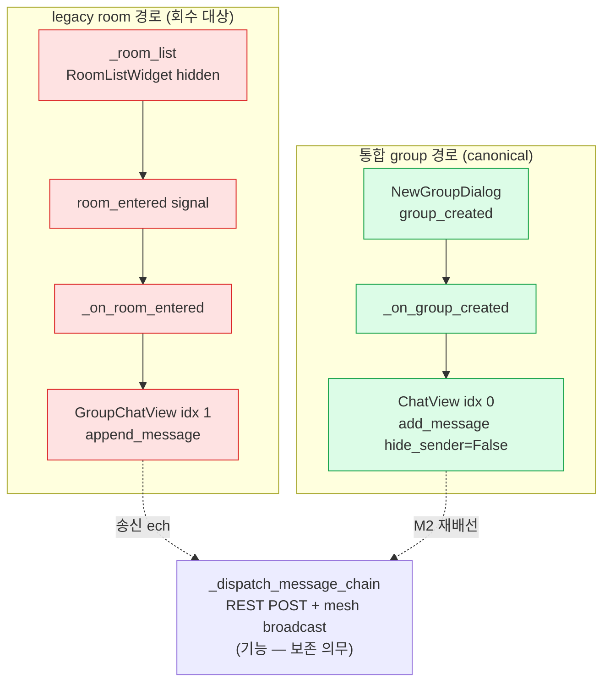
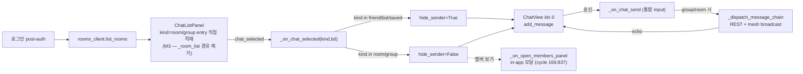
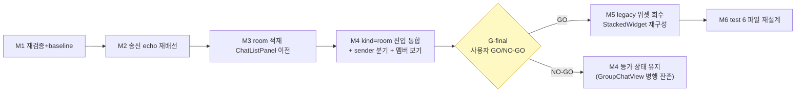
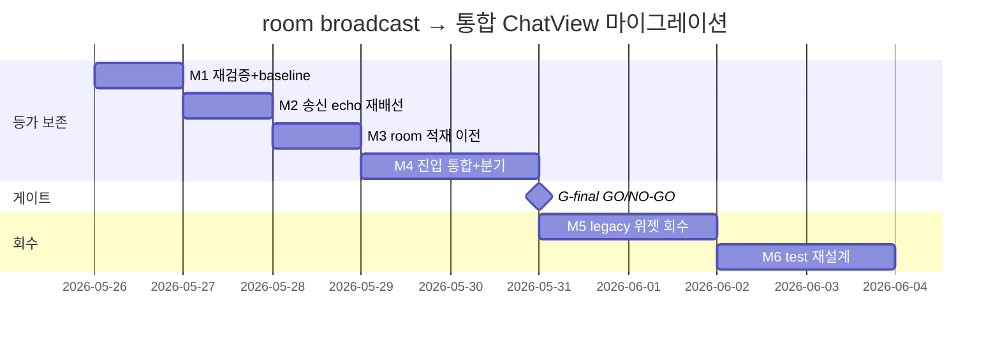
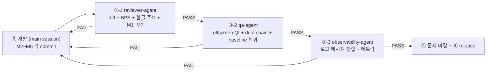

# legacy room broadcast 경로 → 통합 ChatView/group flow 마이그레이션

> 정본 정합: [CLAUDE_HARNESS_IMPORTANT.md §B 5단계 워크플로우](../../../CLAUDE_HARNESS_IMPORTANT.md) · [§C 7역할](../../../CLAUDE_HARNESS_IMPORTANT.md) · [§D Exec Plans](../../../CLAUDE_HARNESS_IMPORTANT.md) · [§A M1~M7](../../../CLAUDE_HARNESS_IMPORTANT.md)
> 운영: [CLAUDE.md §2 워크플로우](../../../CLAUDE.md) · 저장소 맵: [AGENTS.md](../../../AGENTS.md)
> handoff 출처: [2026-05-26-session-handoff-cycle169.838.md](2026-05-26-session-handoff-cycle169.838.md)
> 본 문서는 실행/검증/결정 기록 문서다. TODO 목록이 아니다. ② 개발 단계는 main session 이 후속 수행하며, 본 planning 산출물은 코드보다 먼저 존재한다 (M1).
> directive 출처: 사용자 "legacy room broadcast path → unified ChatView/group flow migration 으로 scope 확정 (dead code 제거가 아님)".

---

## 0. 핵심 권고 요약 (사용자 재검토용 — 진행 전 필독)

코드 정독 (2026-05-26, `main_window.py` · `_room_group_chat_mixin.py` · `_chat_navigation_mixin.py` · `_chat_header_mixin.py` · `_auth_chain_mixin.py` · `app/main.py` · `group_chat_view.py` · `chat_view.py`) 결과, 본 작업의 정확한 성격은 **"dead code 제거"가 아니라 "작동 중인 서버 room broadcast 기능을 통합 ChatView 로 이전하는 기능 보존 마이그레이션"** 임이 확정됐다. 본 계획은 이 경계를 반영한다 (추측 배제).

### 0.1 가장 먼저 답해야 할 경계차 — append_message vs add_message 의 기능 격차

- `GroupChatView.append_message` 는 keyword-only `(sender, text, ts, is_self)` 4 인자만 받고 sender 라벨을 항상 표시한다 (`group_chat_view.py` L182~208). 메시지 dedup·scroll offset 보존·lazy load cursor·day separator·reaction·msg_id·play_sound 분기가 **전부 부재**다.
- `ChatView.add_message` 는 `(sender, text, ts, is_self)` + `reply_to`·`reactions`·`message_id`·`hide_sender`·`play_sound` 를 모두 지원하고 중복 msg_id skip (`_displayed_msg_ids`)·day separator·sender grouping 까지 갖춘 canonical 표시 메서드다 (`chat_view.py` L351~441).
- **결론**: 마이그레이션은 단순 호출 치환이 아니다. `append_message(sender=..., text=..., ts=..., is_self=...)` → `add_message(sender, text, ts, is_self=..., hide_sender=False, play_sound=...)` 로 인자 매핑을 정의하고, 그룹은 `hide_sender=False` 를 명시해 sender 라벨을 유지한다 (1:1 의 `hide_sender=True` 와 대비). 본 매핑이 M2 의 핵심 산출물이다.

### 0.2 가장 큰 미확정 변수 — group broadcast "수신" 경로의 실 결선 지점이 코드상 모호하다

- 송신 echo 경로는 명확하다: `_on_group_message_send` → `_group_chat_view.append_message(is_self=True)` (`_room_group_chat_mixin.py` L176~180) + `_dispatch_message_chain` (REST POST + `GroupMessageClient.send_message` mesh broadcast).
- 그러나 **remote peer 가 보낸 group 메시지를 수신해 `_group_chat_view.append_message(is_self=False)` 로 그리는 inbound 핸들러** 가 grep 으로 명시적으로 잡히지 않는다 (`GroupMessageClient` 는 송신 fan-out wrapper 만 보유). 1:1 은 `_chat_send_mixin`/`_rest_post_mixin` 에 mesh broadcast 가 있으나 group inbound 의 표시 결선 지점이 불명확하다.
- **결론**: M1 의 첫 task 는 "group broadcast inbound 표시 경로의 실 결선 지점 재검증" 이다. inbound 핸들러가 (a) 존재하고 `append_message` 를 호출한다면 그 호출을 `add_message` 로 재배선, (b) 부재하다면 마이그레이션은 송신 echo + 로그인 시 room 적재 + StackedWidget 정리에 한정되고 inbound 결선은 별도 cycle 로 분리. **이 재검증 결과가 M2~M4 의 정확한 범위를 확정**한다.

> **M1 실행 결과 (2026-05-26 cycle 169.841 확정 — option (b))**: `append_message` 호출처는 저장소 전체에서 단 1곳 (`_room_group_chat_mixin.py` L177, 송신 echo `is_self=True`) 이다. `GroupMessageClient` (`app/net/group_message_client.py`) 는 `send_message`·`on_ack`·`register_pending`·`clear_pending` 의 outbound 송신 + ack 만 보유하며 **inbound 수신/표시 핸들러가 부재** 하다. `is_self=False` group inbound `append_message` 호출처도 전체 부재. 따라서 **option (b) 확정** — inbound 표시 결선은 존재하지 않으며 (실 WebRTC mesh peer connection 미결선, T-2 기술 부채), M2 는 **단일 송신 echo 호출의 재배선 한정** 으로 축소된다. baseline test (broadcast + dual chain + group_chat_ui) 11 PASS 기록.

### 0.3 진행 권고 — 등가 보존 먼저, 위젯 회수 나중. 전 구간 headless 자동 검증

- M1 (재검증 + test baseline 고정) → M2 (송신 echo 를 ChatView 로 재배선) → M3 (로그인 시 room 적재를 ChatListPanel 로 이전 + RoomListWidget 의존 해소) → M4 (멤버 보기 + sender label 분기 통합 flow 정합) → M5 (GroupChatView·room_entered·RoomListWidget·idx 1/2 placeholder 회수 + StackedWidget 재구성) → M6 (test 6 파일 재설계 마감).
- M1~M6 전 단계 **headless 자동 검증 가능** — offscreen Qt (`QT_QPA_PLATFORM=offscreen`) + mixin MRO unit + rooms_client httpx mock. 실 WebRTC mesh peer connection 은 본 계획 범위 외.
- **G-final = 사용자 GO/NO-GO 게이트.** M5 (legacy 위젯 물리 회수 + StackedWidget idx 재배치) 는 되돌리기 비용이 가장 큰 단계이므로, M4 종료 (등가 동작이 통합 ChatView 에서 green) 시점에 M5 진입을 사용자가 확정한다.

> 사용자 재검토 포인트: 진짜 목적이 "group 메시지가 통합 ChatView (idx 0) 에서 1:1 과 동일 품질 (dedup·scroll·day separator) 로 그려진다" 라면 M2~M4 가 본질이다. 진짜 목적이 "GroupChatView/RoomListWidget 코드와 idx 1/2 가 저장소에서 사라진다" 라면 M5 가 필수다. 두 목적은 분리 가능하며, M5 는 M4 등가 PASS 를 전제로만 안전하다.

---

## 1. 목표 / 범위 (In Scope · Out of Scope)

### 1.1 목표

통합 ChatView (StackedWidget idx 0, `_STACK_DIRECT_CHAT`) 를 group 채팅의 canonical 표시 경로로 확정한다. 서버 room broadcast 의 송신 echo + (재검증 후) 수신 표시 + 로그인 시 room 적재를 통합 ChatView/`ChatListPanel` flow 로 이전한 뒤, legacy `GroupChatView` + `room_entered` 시그널 + `RoomListWidget` (`_room_list`) + StackedWidget idx 1 (`_STACK_GROUP_CHAT`)·idx 2 (`_STACK_MEMBERS`) 경로를 회수한다.

### 1.2 In Scope

- **(M1)** group broadcast inbound/outbound 실 결선 지점 재검증 + test baseline 고정 (회귀 기준선).
- **(M2)** `_on_group_message_send` 의 송신 echo 를 `_group_chat_view.append_message` → `_chat_view.add_message(hide_sender=False)` 로 재배선. inbound 핸들러가 존재하면 동시 재배선.
- **(M3)** 로그인 시 room 적재를 `_room_list.set_rooms` → `ChatListPanel` 직접 적재로 이전. `_auth_chain_mixin` L115~116 + `app/main.py` L347 + `_chat_navigation_mixin._refresh_chat_list_panel` L80 의 `_room_list._rooms` 참조 해소.
- **(M4)** `kind=="room"` 진입을 `_on_room_entered` (GroupChatView swap) → `_on_chat_selected` 통합 진입 (ChatView + `hide_sender=False`) 으로 통일. 멤버 보기 (`_on_open_members_panel`, cycle 169.837 in-app 모달) 를 통합 flow 에서 유지.
- **(M5)** `GroupChatView`·`room_entered`·`RoomListWidget`·`_STACK_GROUP_CHAT`·`_STACK_MEMBERS`·`_group_chat_view`·`_group_placeholder` 회수 + StackedWidget idx 재구성 + docstring (L4~38) 갱신.
- **(M6)** test 6 파일 재설계 — wizard chain + 통합 ChatView 기준으로 재작성 (`test_main_window_rooms.py` cycle 169.839 패턴 준용).

### 1.3 Out of Scope (의도적 제외 — 무엇을 하지 않는가)

- **실 WebRTC mesh peer connection 의 PeerConnection setup** — 본 계획은 UI 표시 경로 마이그레이션만. 실 P2P 결선은 별도 Phase.
- **group 메시지 history lazy load 서버 REST 결선** — 통합 ChatView 의 lazy_load cursor 를 group 에 결선하는 일은 본 계획에서 인터페이스만 정의하고 실 fetch 는 별도 cycle.
- **그룹 정보 dialog 실 멤버 populate / admin role ENUM 확장** — [2026-05-25-telegram-group-management.md](2026-05-25-telegram-group-management.md) 의 책임. 본 계획은 멤버 보기 진입점의 통합 flow 유지만 다룬다.
- **wizard (NewGroupDialog) 자체 기능 변경** — `group_created` → `_on_group_created` 경로는 이미 canonical 이며 변경하지 않는다.
- **server/ broadcast handler · DB schema 변경** — 본 계획은 클라이언트 UI 라우팅 한정. 서버 API 계약은 불변.
- **dead code 일괄 삭제** — 본 작업은 기능 보존 마이그레이션이다. M5 의 위젯 회수는 M4 등가 PASS 를 전제로만 수행하며, 검증 없는 삭제는 금지.

---

## 2. 현 상태 분석 — group 채팅 개념의 2 갈래 분열

cycle 169.838 에서 "방 입장" (Room ID 직접 입력) UI 진입점이 전수 제거된 결과, group 채팅이 두 경로로 분열했다.

| kind | 진입 경로 | 표시 위젯 | StackedWidget idx | 상태 |
| --- | --- | --- | --- | --- |
| `"group"` | NewGroupDialog → `group_created` → `_on_group_created` | 통합 ChatView | idx 0 (`_STACK_DIRECT_CHAT`) | 신 canonical (사용자 확정) |
| `"room"` | `_on_chat_selected("room")` → `_on_room_entered`, 로그인 시 `_room_list.set_rooms` | GroupChatView | idx 1 (`_STACK_GROUP_CHAT`) | legacy — 마이그레이션 대상 |

### 2.1 현 StackedWidget 구성 (`main_window.py` `_init_right_panel` L320~365)

| idx | 상수 | 위젯 | 본 계획 영향 |
| --- | --- | --- | --- |
| 0 | `_STACK_DIRECT_CHAT` | `ChatView` (1:1) | canonical — group 도 여기로 수렴 |
| 1 | `_STACK_GROUP_CHAT` | `_group_placeholder` (lazy swap → GroupChatView) | M5 회수 |
| 2 | `_STACK_MEMBERS` | `_member_list` (MemberPanel) | M5 회수 (멤버 보기는 cycle 169.837 in-app 모달로 이미 대체) |
| 3 | — | `_friend_list` (FriendListWidget) | idx 재배치 영향 (M5) |

### 2.2 legacy 경로의 실 결선 지점 (정확한 행 번호)

- `main_window.py` L295~299 — `_room_list = RoomListWidget(...)`, `setVisible(False)`, `room_entered.connect(_on_room_entered)`, `set_rooms([])`.
- `main_window.py` L344~346 — `_group_placeholder` (idx 1) addWidget.
- `main_window.py` L347~356 — `_member_list` (idx 2, MemberPanel) + `back_requested` → `setCurrentIndex(_STACK_GROUP_CHAT)`.
- `main_window.py` L4~38 docstring — idx 0/1/2 구조 설명 (L10~13).
- `_room_group_chat_mixin.py` L90~147 — `_on_room_entered`: GroupChatView lazy create + swap + `setCurrentIndex(_STACK_GROUP_CHAT)` + `_input_container.setVisible(False)`.
- `_room_group_chat_mixin.py` L149~195 — `_on_group_message_send`: `_group_chat_view.append_message(is_self=True)` (송신 echo) + `_dispatch_message_chain`.
- `_room_group_chat_mixin.py` L236~276 — `_on_open_members_panel`: cycle 169.837~838 에서 이미 in-app 모달 (`_exec_dialog_centered`). GroupChatView 비의존 — 회수 영향 적음.
- `_chat_navigation_mixin.py` L80 — `_refresh_chat_list_panel` 가 `_room_list._rooms` 순회해 `kind="room"` ChatListEntry 생성.
- `_chat_navigation_mixin.py` L155~160 — `_on_chat_selected`: `kind=="room"` → `_on_room_entered(target_id)` early return (통합 ChatView 진입 분기 미도달).
- `_chat_navigation_mixin.py` L204 — `hide_sender = kind in ("friend","bot","saved")` — **room/group 은 이 집합에 부재 → 자동으로 sender 표시** (group 의도와 정합).
- `_chat_header_mixin.py` L36~41 — `_on_header_sidebar_toggle`: `_room_list.isVisible()` 토글 (hidden widget 대상).
- `_auth_chain_mixin.py` L111~119 — 로그인 후 `rc.list_rooms` → `_room_list.set_rooms(rooms)`.
- `app/main.py` L331~367 — `_populate_rooms`: `RoomItem` 구성 → `window._room_list.set_rooms(items)` + `ChatListPanel` entry inject (이미 병행 중 — M3 가 이를 단일화).

### 2.3 핵심 측면 — 마이그레이션 vs dead code 제거

서버 room broadcast 의 송신 chain (`_dispatch_message_chain`: REST POST `/api/rooms/{id}/messages` + `GroupMessageClient` mesh broadcast) 은 **작동 중인 기능**이다. GroupChatView 는 이 기능의 표시 표면(surface)일 뿐이다. 따라서 GroupChatView 회수 전에 동일 기능을 통합 ChatView 가 제공해야 한다. 표면만 제거하면 송신 chain 의 echo 표시가 사라지는 회귀가 발생한다.

---

## 3. 목표 상태 — 통합 ChatView 가 canonical

목표 불변식 (invariant):

1. group 메시지는 idx 0 ChatView 에서 `add_message(hide_sender=False)` 로 sender 라벨과 함께 그려진다. 1:1 은 `hide_sender=True`.
2. `_on_chat_selected` 가 `kind=="room"` 에서 early return 하지 않고 통합 진입 분기를 탄다 (`_on_room_entered` 호출 제거).
3. 로그인 시 room 은 `ChatListPanel` 에 직접 적재된다. `_room_list` 는 더 이상 source-of-truth 가 아니다.
4. 멤버 보기는 통합 flow 에서 in-app 모달로 유지된다 (StackedWidget idx 2 미경유).
5. StackedWidget 은 idx 1/2 placeholder 없이 재구성된다 — group 전용 페이지 부재.
6. `_dispatch_message_chain` (REST + mesh broadcast) 는 호출 지점만 ChatView 송신으로 바뀌고 chain 내부 로직은 불변 (기능 보존).

---

## 4. 마이그레이션 단계 breakdown (commit 단위 · M1~M6)

각 단계 = 1 commit = 1 산출물 = 독립 PASS 가능 (M5 정합). 순서는 "등가 보존 → 위젯 회수 → test 마감" 으로 고정한다.

### M1 — 재검증 + test baseline 고정 (회귀 기준선)

| 항목 | 내용 |
| --- | --- |
| 작업 | (a) group broadcast inbound 표시 경로의 실 결선 지점 grep 재검증 — `append_message` 호출처 전수 + `GroupMessageClient` inbound 핸들러 유무. (b) 현 6 test 파일을 그대로 실행해 **현 green baseline** 을 기록 (마이그레이션 전후 회귀 비교 기준). |
| 산출물 | 본 Exec Plan §0.2 의 (a)/(b) 분기 확정 주석 갱신 (active Exec Plan 결정 로그 D-3 row 추가). 코드 변경 0건. |
| 검증 조건 | `pytest tests/app/ui/test_group_chat_broadcast.py tests/integration/test_group_message_dual_chain.py -q` 가 현 상태에서 PASS (baseline). inbound 결선 유무가 문서에 명시됨. |
| 종료 조건 | M2 의 정확한 범위 (송신 echo 단독 vs inbound 동시) 가 확정됐다. |
| 담당 | main session (재검증) · 본 결과를 본 Exec Plan 에 반영 |
| 의존성 | 없음 (선행) |

### M2 — 송신 echo 를 통합 ChatView 로 재배선

| 항목 | 내용 |
| --- | --- |
| 작업 | `_on_group_message_send` 의 `_group_chat_view.append_message(sender=..., text=..., ts=..., is_self=True)` → `_chat_view.add_message(sender, text, ts, is_self=True, hide_sender=False, play_sound=False)` 로 인자 매핑 치환. M1 (a) 가 inbound 핸들러 존재로 확정되면 동시 재배선. `_dispatch_message_chain` 내부 불변. |
| 산출물 | `app/ui/_room_group_chat_mixin.py` (1 파일). |
| 검증 조건 | offscreen Qt 에서 group 송신 시 ChatView 에 sender 라벨 포함 버블 1건 추가 + 1:1 송신은 `hide_sender=True` 유지 (분기 회귀 부재). `_displayed_msg_ids` dedup 정상. |
| 종료 조건 | group echo 가 idx 0 ChatView 에 그려진다. GroupChatView 는 아직 존재 (병행 — 안전망). |
| 담당 | main session (개발) → reviewer → qa → observability |
| 의존성 | M1 |

### M3 — 로그인 시 room 적재를 ChatListPanel 로 이전

| 항목 | 내용 |
| --- | --- |
| 작업 | `_auth_chain_mixin` L115~116 + `app/main.py` L347 의 `_room_list.set_rooms` 의존을 ChatListPanel 직접 적재로 단일화. `_chat_navigation_mixin._refresh_chat_list_panel` L80 의 `_room_list._rooms` 순회를 rooms 데이터 직접 보관 (예: `self._rooms_cache`) 으로 치환. `_room_list` 는 아직 instantiate 유지 (M5 회수). |
| 산출물 | `app/ui/_auth_chain_mixin.py` 또는 `app/ui/_chat_navigation_mixin.py` 중 1 파일 (commit 분리 — 1 commit = 1 파일). `app/main.py` 는 별 commit. |
| 검증 조건 | 로그인 후 room 이 `ChatListPanel` 에 `kind="room"` (또는 `"group"`) entry 로 적재된다. `_room_list._rooms` 미참조여도 chat_list refresh 정상. |
| 종료 조건 | room 의 source-of-truth 가 ChatListPanel/cache 로 이전됐다. |
| 담당 | main session (개발) → reviewer → qa → observability |
| 의존성 | M2 |

### M4 — kind="room" 진입 통합 + sender label 분기 + 멤버 보기 유지

| 항목 | 내용 |
| --- | --- |
| 작업 | `_chat_navigation_mixin._on_chat_selected` L158~160 의 `kind=="room"` → `_on_room_entered` early return 제거. room/group 이 통합 진입 분기를 타도록 변경하고 `hide_sender = kind in ("friend","bot","saved")` 정합 (room/group → `hide_sender=False`). 멤버 보기 (`_on_open_members_panel`) 진입을 통합 flow 의 헤더 메뉴 (`_on_header_menu` group 분기, 이미 존재) 에서 유지 확인. `_input_container.setVisible(True)` 유지 (group 도 통합 input). |
| 산출물 | `app/ui/_chat_navigation_mixin.py` (1 파일). |
| 검증 조건 | `kind="room"` 선택 시 idx 0 ChatView 진입 + sender 라벨 표시 + 통합 input 활성. 헤더 "..." 메뉴 group 분기 (멤버 보기/대화 비우기/나가기) 정상. `_on_room_entered` 미호출. |
| 종료 조건 | 통합 ChatView 가 room/group 의 전 표시·진입·송신·멤버 보기를 등가 제공한다 (G-final 게이트 직전). |
| 담당 | main session (개발) → reviewer → qa → observability |
| 의존성 | M3 |

### M5 — legacy 위젯 회수 + StackedWidget 재구성 (G-final 게이트 후)

| 항목 | 내용 |
| --- | --- |
| 작업 | `GroupChatView` import·`_group_chat_view` attr·`_group_placeholder`·`_STACK_GROUP_CHAT`·`_STACK_MEMBERS` 상수·`_on_room_entered`·`room_entered.connect`·`_room_list` (RoomListWidget) 회수. StackedWidget idx 재배치 (group/member placeholder 제거 후 friend_list idx 갱신). `_on_header_sidebar_toggle` 의 `_room_list` 토글 대체 (또는 제거). docstring L4~38 idx 구조 갱신. `_on_open_members_panel` 의 in-app 모달 경로는 보존 (idx 2 미의존 확인). |
| 산출물 | `app/ui/main_window.py` → `app/ui/_room_group_chat_mixin.py` → `app/ui/_chat_header_mixin.py` → `app/ui/room_list.py`/`app/ui/group_chat_view.py` (각 1 commit, 순차). 위젯 정의 파일 자체 회수는 마지막 commit. |
| 검증 조건 | offscreen Qt 에서 main_window 기동 + room/group 진입 + 송신 echo + 멤버 보기 전 PASS (M4 등가). `grep -rn "GroupChatView\|_STACK_GROUP_CHAT\|room_entered\|_room_list" app/` 잔존 0건 (위젯 정의 파일 제외 시점 기준). |
| 종료 조건 | legacy 경로가 저장소에서 회수됐고 통합 ChatView 단일 경로만 남았다. |
| 담당 | main session (개발) → reviewer → qa → observability. **G-final 사용자 GO 후 진입.** |
| 의존성 | M4 + 사용자 GO/NO-GO |
| **실행 결과 (cycle 169.845 — 안전 M5)** | GroupChatView import + `_group_chat_view` attr + `_on_room_entered` + `_on_group_message_send` + `_dispatch_message_chain` + RoomListWidget(`_room_list`) + `room_entered.connect` + header `_room_list` 토글(→ `_chat_list_panel` 전환) 물리 회수. `_group_placeholder`(idx 1) 빈 spacer 잔존 + `_member_list`(idx 2) 유지(D-8). test rework: `test_main_window_messages.py` + `test_group_message_dual_chain.py` 삭제(removed 코드 검증 obsolete) + mro/batch3/rooms 3 파일 갱신. 전체 2500 PASS. **idx 완전 재번호 + 위젯 파일 삭제 = M5b 잔존.** |

### M6 — test 6 파일 재설계 마감 ✅ (cycle 169.847 완료)

| 항목 | 내용 |
| --- | --- |
| 작업 | §5 매핑표 기준으로 6 test 파일을 통합 ChatView/wizard chain 기준으로 재작성 (`test_main_window_rooms.py` cycle 169.839 패턴 준용). broadcast 기능 검증은 `_dispatch_message_chain` + ChatView `add_message` 기준으로 재배선. |
| 산출물 | test 파일 (각 1 commit, §5 우선순위 순). |
| 검증 조건 | `pytest tests/ -q` 전 PASS. M1 baseline 대비 broadcast/dual chain 기능 회귀 0건. coverage 미저하. |
| 종료 조건 | 마이그레이션 전 green 기능이 전부 새 경로 test 로 재확인됐다. |
| 담당 | main session (개발) → reviewer → qa → observability |
| 의존성 | M5 (또는 코드 변경과 test 정렬 — §5.2 참조) |
| **결과** | **cycle 169.847 — `test_main_window_rooms.py` 에 `TestUnifiedRoomSend` 4 PASS 추가 (mesh `broadcast_payload` await + REST `_post_and_resolve(room_id=42)` + room `hide_sender=False` 버블 + 공백 early return). M5 삭제 obsolete legacy(`test_main_window_messages.py`·`test_group_message_dual_chain.py`)의 통합 송신 등가 coverage 재작성 완료. 전체 2504 PASS (기존 2500 + 4), 회귀 0. ACK chain 단위 검증은 `test_mesh_manager.py:181` 잔존(중복 회피).** |

### 4.1 마이그레이션 단계 의존성 그래프

### 4.2 Gantt (단계 일정 측면)

---

## 5. test 재설계 매핑 (6 파일)

### 5.1 파일별 영향 + 재설계 방향

| test 파일 | 현 검증 대상 | 마이그레이션 영향 | 재설계 방향 | 정렬 단계 |
| --- | --- | --- | --- | --- |
| `tests/app/ui/test_group_chat_broadcast.py` | GroupChatView broadcast 표시 | 표시 표면 회수 | `_dispatch_message_chain` + ChatView `add_message(hide_sender=False)` 기준 재작성. broadcast chain (REST+mesh) 호출 검증 유지 | M6 (M2 와 동기) |
| `tests/integration/test_group_message_dual_chain.py` | broadcast dual chain (REST+mesh) | chain 내부 불변 — 호출 지점만 변경 | dual chain 자체는 보존. echo append 검증을 ChatView 로 전환 | M6 (M2 와 동기) |
| `tests/app/ui/test_group_chat_ui.py` | GroupChatView UI 골격 | 위젯 회수 | GroupChatView 제거 시 폐기 또는 통합 ChatView group 모드 test 로 흡수 | M6 (M5 후) |
| `tests/app/ui/test_main_window_messages.py` | main_window 메시지 표시 | idx 변경 + add_message 경로 | 통합 ChatView 기준 + idx 재배치 정합 | M6 (M5 후) |
| `tests/app/ui/test_main_window_mixin_mro.py` | mixin MRO | `_on_room_entered` 회수 시 MRO 변동 | RoomGroupChatMixin method 회수 반영. `_on_group_message_send` 잔존 여부 정합 | M6 (M5 후) |
| `tests/app/ui/test_mixin_isolated_batch3.py` | mixin isolated batch | `_room_list`/`_on_room_entered` 의존 | `_room_list` attr 회수 반영. isolated assertion 갱신 | M6 (M5 후) |
| (참고) `tests/app/ui/test_main_window_rooms.py` | wizard chain | cycle 169.839 이미 재작성 (GroupChatView 미참조) | 변경 불필요 — 본 마이그레이션 목표 패턴의 참조 모델 | — |

### 5.2 test 정렬 전략 — 코드 변경과 어떻게 정렬하나

- **broadcast 기능 test (2 파일)** 는 M2 (송신 echo 재배선) 와 **동기** 로 갱신한다. 기능 보존이 핵심이므로 코드 재배선 commit 과 같은 cycle 에서 test 를 새 경로로 옮겨 회귀를 즉시 잡는다.
- **위젯/구조 test (4 파일)** 는 M5 (위젯 회수) **후** 갱신한다. M5 전에는 GroupChatView 가 병행 잔존하므로 기존 test 가 baseline 역할을 유지한다.
- 원칙: 기능 등가를 검증하는 test 는 기능 재배선과 동행, 구조(위젯 존재)를 검증하는 test 는 구조 변경 후 동행. M1 의 green baseline 이 양쪽의 회귀 판정 기준이다.

---

## 6. Definition of Done

| # | 항목 | 검증 방법 | 게이트 |
| --- | --- | --- | --- |
| D1 | M1 inbound 결선 재검증 결과가 본 Exec Plan 결정 로그에 명시 (존재/부재 분기 확정) | 결정 로그 D-3 row + grep 근거 | 문서 |
| D2 | group 송신 echo 가 idx 0 ChatView 에 `hide_sender=False` 로 그려진다 | offscreen Qt unit — sender 라벨 포함 버블 assert | qa PASS |
| D3 | 1:1 (friend/bot/saved) 의 `hide_sender=True` 분기가 회귀 없이 유지 | offscreen Qt — friend chat sender 숨김 assert | reviewer PASS |
| D4 | 로그인 후 room 이 `ChatListPanel` 에 직접 적재 (`_room_list._rooms` 미참조) | `_room_list` mock 비활성 후 chat_list refresh PASS | qa PASS |
| D5 | `kind=="room"` 선택 시 idx 0 진입 + `_on_room_entered` 미호출 | `_on_room_entered` spy 0 call assert | qa PASS |
| D6 | 멤버 보기 in-app 모달이 통합 flow 에서 idx 2 미경유로 동작 | `_on_open_members_panel` 호출 → 모달 spawn assert | qa PASS |
| D7 | M5 후 `grep "GroupChatView\|_STACK_GROUP_CHAT\|room_entered\|_room_list" app/` 잔존 0 (위젯 정의 파일 회수 포함) | grep count 0 | reviewer PASS |
| D8 | `_dispatch_message_chain` (REST+mesh broadcast) 기능이 호출 지점 변경 후에도 dual chain PASS | `test_group_message_dual_chain` 재작성 PASS | qa PASS |
| D9 | `pytest tests/ -q` 전 PASS + M1 baseline 대비 기능 회귀 0건 | 전 test PASS + coverage 비교 | qa + observability PASS |
| D10 | main_window docstring (L4~38) idx 구조가 재구성된 StackedWidget 과 정합 | docstring vs 실 `_init_right_panel` 정합 grep | reviewer PASS |

---

## 7. 위험 / 롤백

| 위험 | 영향 | 완화 | 롤백 |
| --- | --- | --- | --- |
| inbound broadcast 핸들러가 GroupChatView 에만 결선돼 있었다면 M5 회수 시 group 수신 표시가 사라진다 | group 메시지 수신 회귀 | M1 (a) 재검증으로 사전 확정. inbound 존재 시 M2 에서 동시 재배선 | M2 commit revert (1 파일 단위) |
| `append_message`(4 인자) → `add_message`(다인자) 매핑 누락 시 dedup/scroll 동작 차이 | UX 미세 회귀 | §0.1 인자 매핑표 고정 + D2/D3 assert | M2 commit revert |
| StackedWidget idx 재배치 시 `_friend_list` (idx 3) 진입 깨짐 | 연락처 탭 회귀 | M5 에서 idx 상수 일괄 갱신 + D10 docstring 정합 | M5 commit revert (위젯 회수는 마지막 commit 분리) |
| `_room_list._rooms` 참조처 누락 (grep 미포착) | 로그인 시 room 미적재 | M3 전 `grep -rn "_room_list" app/` 전수 + D4 | M3 commit revert |
| test 재설계가 기능 회귀를 가린다 (test 도 함께 약화) | 회귀 은폐 | M1 green baseline 을 불변 기준으로 고정 + D9 baseline 비교 | M6 commit revert |

롤백 단위: 각 M 은 독립 commit 이므로 단계별 `git revert` 로 직전 등가 상태 복원 가능. M5 (위젯 회수) 는 가장 비싼 단계이므로 G-final 게이트 후에만 진입한다.

---

## 8. 검증 게이트 (reviewer → qa → observability)

- **reviewer-agent (③-1)**: M2~M6 각 commit diff 의 BPE 손상 토큰 (U+CE21 단독) 부재 + 한글 주석 (M4) + docstring 정합 (D10) + 머지 게이트. 코드 직접 수정 금지.
- **qa-agent (③-2)**: D2~D9 의 offscreen Qt assert + dual chain 재작성 PASS + M1 baseline 회귀 비교. 데모 시그널링 서버 비조작.
- **observability-agent (③-3)**: `[main_window] room_entered`·`group_message_send`·`REST POST PASS`·`mesh broadcast PASS` 로그 메시지가 새 경로에서도 정합. baseline 임의 갱신 금지.

> 직렬 고정: reviewer PASS → qa PASS → observability PASS. 1건이라도 FAIL 이면 ② 개발 회귀.

---

## 9. 결정 로그

| id | directive 시점 | 결정 + 근거 | 영향 |
| --- | --- | --- | --- |
| D-1 | 2026-05-26 사용자 directive | 통합 ChatView (idx 0) 를 group canonical 로 확정. 근거 — cycle 169.838 "방 입장" 진입점 전수 제거 후 사용자 확정 + wizard chain 이 이미 통합 ChatView 사용 | GroupChatView/RoomListWidget legacy 회수 방향 고정 |
| D-2 | 2026-05-26 사용자 directive | 본 작업은 dead code 제거가 아니라 작동 중인 server room broadcast 기능의 마이그레이션. 근거 — `_dispatch_message_chain` (REST+mesh) 가 실 기능 | M5 위젯 회수 전 M2~M4 등가 보존 의무 + G-final 게이트 신설 |
| D-3 | 2026-05-26 코드 정독 | `append_message`(GroupChatView, 4 인자, dedup/scroll 부재) vs `add_message`(ChatView, dedup/scroll/day separator/hide_sender) 격차 확정. 근거 — `group_chat_view.py` L182~208 + `chat_view.py` L351~441 | M2 의 핵심 산출물 = 인자 매핑 (§0.1) |
| D-4 | 2026-05-26 코드 정독 | group broadcast inbound 표시 결선 지점이 grep 으로 불명확. 근거 — `GroupMessageClient` 송신 wrapper 만 확인, inbound `append_message(is_self=False)` 호출처 미포착 | M1 (a) 재검증을 선행 task 로 신설 — M2 범위 확정 의존 |
| D-5 | 2026-05-26 코드 정독 | 멤버 보기는 cycle 169.837~838 에서 이미 in-app 모달 (`_exec_dialog_centered`) — StackedWidget idx 2 미의존. 근거 — `_room_group_chat_mixin.py` L259~275 | M5 의 idx 2 회수가 멤버 보기 기능에 무영향 (위험 격하) |
| D-6 | 2026-05-26 코드 정독 | `_on_chat_selected` 의 `hide_sender = kind in ("friend","bot","saved")` 가 이미 room/group 을 sender 표시로 분기. 근거 — `_chat_navigation_mixin.py` L204 | M4 의 sender 분기 통합이 기존 분기와 자연 정합 (추가 분기 코드 최소) |
| D-7 | 2026-05-26 M1 실행 (cycle 169.841) | group broadcast inbound 표시 결선 **부재 확정 (option b)**. 근거 — `append_message` 호출처 단 1곳 (L177 송신 echo `is_self=True`), `GroupMessageClient` outbound+ack 만, `is_self=False` inbound 핸들러 전무. baseline 11 PASS | M2 가 단일 송신 echo 재배선으로 축소. inbound 결선은 T-2 (Phase 3 mesh) 로 분리 — B-1 해소 |
| D-8 | 2026-05-26 M5 실행 (cycle 169.845) | §2.1 가정 정정 — idx 2 `_member_list`(MemberPanel)는 dead 아님. 근거 — `_rest_post_mixin.py:196` `set_members(...)`가 group-management REST 멤버 populate 에 사용 ([2026-05-25-telegram-group-management.md](2026-05-25-telegram-group-management.md) 책임). | **안전 M5** 채택 — legacy GroupChatView 경로(GroupChatView import + `_group_chat_view` + `_on_room_entered` + `_on_group_message_send` + `_dispatch_message_chain` + RoomListWidget `_room_list` + `room_entered.connect` + header room_list 토글) 물리 회수. `_group_placeholder`(idx 1)는 빈 spacer 로 잔존(idx 재번호 회피), `_member_list`(idx 2) 유지. **StackedWidget idx 완전 재번호 + group_chat_view.py/room_list.py 파일 삭제 = M5b 분리** (member_list 조율 의무). |

---

## 10. 기술 부채

| id | 부채 | 사유 | 해소 시점 |
| --- | --- | --- | --- |
| T-1 | group 메시지 history lazy load 가 통합 ChatView lazy_load cursor 에 미결선 | 본 계획은 표시 경로 마이그레이션 한정 — server REST fetch 별 cycle | M6 종료 후 별도 cycle (`messages_client` group 결선) |
| T-2 | group inbound broadcast 실 결선 (M1 (a) 결과 부재 확정 시) | 실 WebRTC mesh peer connection 부재 — 표시 핸들러만 인터페이스 정의 | Phase 3 원격/mesh 결선 cycle (실 P2P 시점) |
| T-3 | `GroupMessageClient.send_message` 의 sender_id 가 `_current_user_id or 0` fallback | 인증 user_id 미주입 경로 잔존 | M3 (로그인 chain 정비) 와 동기 점검 |
| T-4 | `_dispatch_message_chain` 가 fire-and-forget (REST ack 대기·retry 부재) | cycle 142 origin 설계 — ack chain 별 cycle | Phase 1 안정화 cycle (ack + retry 신설) |
| T-5 | docstring L4~38 의 idx 구조 설명이 M5 전까지 실 구조와 일시 불일치 | 단계 마이그레이션 특성상 M5 commit 에서 일괄 갱신 | M5 (D10 게이트) |

---

## 11. 차단점 (Blockers)

| id | 차단 항목 | 차단 대상 | 해소 조건 |
| --- | --- | --- | --- |
| B-1 | ~~M1 (a) inbound 결선 재검증 미완~~ **해소 (cycle 169.841)** | ~~M2 범위 확정~~ | inbound 핸들러 부재 확정 (option b) — M2 = 단일 송신 echo 재배선. inbound 결선 T-2 분리 |
| B-2 | G-final 사용자 GO/NO-GO 미수령 | M5 (legacy 위젯 회수) | M4 등가 PASS 시연 후 사용자 GO 명시 |
| B-3 | offscreen Qt test 환경 (`QT_QPA_PLATFORM=offscreen`) 가용성 | D2~D9 전 검증 | CI/로컬 offscreen 환경 확인 (기존 test 동작 = 가용 추정, M1 baseline 으로 확정) |

---

## 12. 참조

- 정본: [CLAUDE_HARNESS_IMPORTANT.md](../../../CLAUDE_HARNESS_IMPORTANT.md) §A M1~M7 · §B 5단계 워크플로우 · §C 7역할 · §D Exec Plans
- 운영: [CLAUDE.md](../../../CLAUDE.md) §2 워크플로우 · §3 7 프로세스 에이전트 · §5 spawn 프롬프트 표준
- 저장소 맵: [AGENTS.md](../../../AGENTS.md) §3 문서 맵 · §4 워크플로우
- handoff: [2026-05-26-session-handoff-cycle169.838.md](2026-05-26-session-handoff-cycle169.838.md)
- 관련 Exec Plan: [2026-05-25-telegram-group-management.md](2026-05-25-telegram-group-management.md) (그룹 멤버 관리 — 본 계획과 멤버 보기 진입점 공유, 책임 분리)
- test 참조 모델: `tests/app/ui/test_main_window_rooms.py` (cycle 169.839 wizard chain 재작성 — 본 마이그레이션 목표 패턴)
- 정책: [docs/policies/](../../policies/) execution-harness · doc-gardening · adoption-roadmap

---

마지막 갱신: 2026-05-26 (cycle 169.847 — M6 test 재설계 완료. M1~M6 전 단계 PASS. 잔존 = M5b idx 재번호 + 위젯 파일 삭제)
