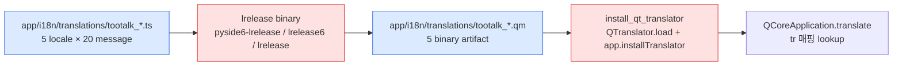
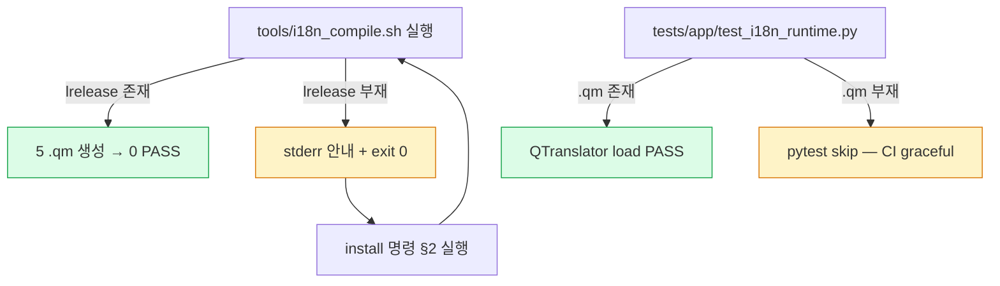

# i18n .qm 컴파일 운영 가이드 — cycle 139

> Phase 5 cycle 139 — lrelease binary 의무 (macOS/Linux/Windows install 명령
> 의 회수 chain 의 CI 통합 안내).
>
> 정본 — [CLAUDE.md](../../CLAUDE.md) §2 5단계 워크플로우 ·
> [AGENTS.md](../../AGENTS.md) §6.

---

## 1. 산출 chain 요약



- `.ts` 의 commit 의무 (XML 의 git diff 추적).
- `.qm` 의 `.gitignore` 차단 의무 (build artifact 의 binary 회피).
- 5 locale `ko / en / zh-CN / zh-TW / ja` 의 일관 chain.

---

## 2. lrelease binary 설치 명령

### 2-1. macOS

```bash
# 옵션 A — Qt 의 brew 설치 (lrelease 의 표준 path)
brew install qt
export PATH="$(brew --prefix qt)/bin:$PATH"

# 옵션 B — PySide6 pip 의 pyside6-lrelease 동봉 (권장)
.venv/bin/pip install PySide6
PATH="$(pwd)/.venv/bin:$PATH" bash tools/i18n_compile.sh
```

### 2-2. Ubuntu / Debian

```bash
# 한글 주석 — qttools5-dev-tools 의 lrelease 6 binary 제공
sudo apt install qttools5-dev-tools

# 또는 PySide6 pip
pip install PySide6
```

### 2-3. Windows

```powershell
# PowerShell — PySide6 pip 권장
.\.venv\Scripts\pip install PySide6
$env:PATH = "$pwd\.venv\Scripts;$env:PATH"
bash tools\i18n_compile.sh
```

---

## 3. 회수 chain

`tools/i18n_compile.sh` 의 lrelease 부재 detect 시 exit 0 + 안내 출력 (FAIL 의
회피 의 의도). 그러나 다음 chain 의 lrelease 의무화 필요 시:



---

## 4. CI 통합 (선택)

GitHub Actions self-hosted runner 의 lrelease 통합 패턴:

```yaml
# 한글 주석 — .github/workflows/ci.yml 의 i18n step 안내 (cycle 139 미통합)
- name: Install PySide6 for lrelease
  run: pip install PySide6
- name: Compile .qm
  run: PATH="$(python -c 'import sys; print(sys.exec_prefix)')/bin:$PATH" bash tools/i18n_compile.sh
- name: Run i18n runtime tests
  run: pytest tests/app/test_i18n_runtime.py -v
```

> 본 step 의 CI 통합 미적용 — cycle 139 의 runtime test 의 `.qm` 부재 시
> `pytest.skip` 의 graceful path 의무. CI 의 lrelease 의무화 시점 의 사용자
> directive 의무.

---

## 5. 검증 명령 (로컬)

```bash
# 1) lrelease binary detect
which pyside6-lrelease || which lrelease6 || which lrelease

# 2) .qm 컴파일
PATH="$(pwd)/.venv/bin:$PATH" bash tools/i18n_compile.sh

# 3) runtime test PASS
.venv/bin/python -m pytest tests/app/test_i18n_runtime.py -v

# 4) .qm 의 git tracking 차단 검증
git check-ignore -v app/i18n/translations/tootalk_en.qm
```

---

## 6. 참조

- [tools/i18n_compile.sh](../../tools/i18n_compile.sh) — lrelease wrapper.
- [app/i18n/__init__.py](../../app/i18n/__init__.py) — install_qt_translator.
- [tests/app/test_i18n_runtime.py](../../tests/app/test_i18n_runtime.py) —
  5 PASS test (install + load + tr + reload + sanity).
- [.gitignore](../../.gitignore) — `app/i18n/translations/*.qm` 차단 라인.

---

마지막 갱신 — 2026-05-17 cycle 139 (i18n-compile 운영 가이드 신설).
