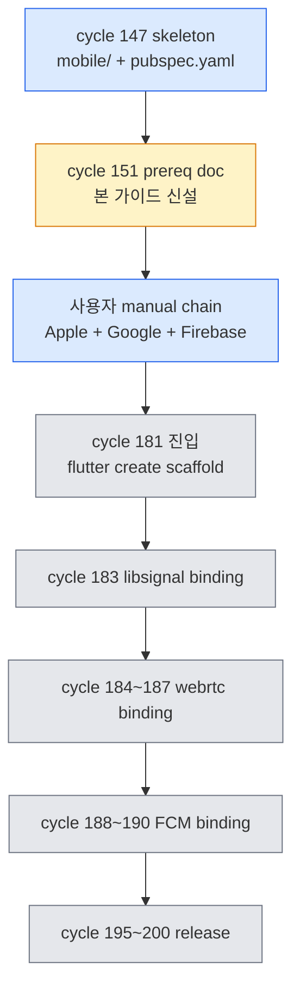

<!-- SPDX-License-Identifier: GPL-3.0-or-later -->
<!-- TooTalk Phase 5 Item 2 mobile cycle 181 본격 진입 prerequisite 단계별 가이드 — cycle 151 신설 -->

# Mobile cycle 181 Prerequisite — Phase 5 Item 2 mobile 본격 진입 manual chain

> 본 가이드는 TooTalk Phase 5 Item 2 — mobile client 본격 cycle 181 진입 직전 의 사용자 manual 의무 chain 을 단계별로 명문화한다.
> cycle 147 sub-agent II 의 [`mobile-flutter-setup.md`](mobile-flutter-setup.md) base + cycle 147 `mobile/` skeleton (pubspec.yaml + lib/main.dart + lib/signaling/ws_client.dart) 후속.
> cycle 181 본격 진입 전 본 가이드 9 section 사용자 ack 의무 — 자동화 차단 (Apple/Google/Firebase 계정 + 인증서 + key 의 manual chain).

---

## 1. 개요 — cycle 181 본격 진입 prerequisite chain

cycle 151 의 본 가이드 = cycle 181 본격 진입 직전 의 사용자 manual chain 의 단계별 흐름 + 외부 service 등록 + 인증서 + key + binding 의 사전 요구 사항.



본 9 section chain — Apple Developer + Google Play Console + Firebase + flutter-webrtc + libsignal-dart + FCM SDK + release build chain + cycle 181 첫 작업 의 직선 흐름.

각 section 의 사용자 manual ack 의무 — 자동 spawn / 자동 install 차단. desktop client 의 manual chain (`SMTP demo server` 의 postfix install) 정합.

---

## 2. Apple Developer 계정 등록

### 2-1. 가입 + 결제

- URL — <https://developer.apple.com/programs/enroll/>
- 비용 — $99 USD/year (Individual 또는 Organization).
- 결제 수단 — Apple ID 안에 등록된 신용카드 (한국 카드 OK).
- 가입 완료 후 24~48시간 의 심사 대기 — Organization 의 경우 D-U-N-S Number 의무.

### 2-2. App ID 등록 (bundle id `com.tootalk.mobile`)

App Store Connect → Certificates, Identifiers & Profiles → Identifiers → `+`:

- Description: `TooTalk Mobile`
- Bundle ID: `com.tootalk.mobile` (Explicit)
- Capabilities (체크 의무): Push Notifications + Associated Domains + Sign In with Apple (선택).

### 2-3. Distribution Certificate 신설

Certificates → `+` → Apple Distribution → 다음 chain:

```bash
# macOS 의 Keychain Access 안에서 CSR 신설
# Keychain Access → Certificate Assistant → Request a Certificate From a Certificate Authority
# - Email: oneticket99 의 Apple ID
# - Common Name: TooTalk Distribution
# - "Saved to disk" 선택 → CertificateSigningRequest.certSigningRequest 저장
```

CSR upload → `.cer` download → double-click 의 Keychain install.

### 2-4. Provisioning Profile 신설

Profiles → `+` → App Store → App ID `com.tootalk.mobile` → Distribution Certificate 선택 → `TooTalk_AppStore.mobileprovision` download.

### 2-5. APNs key 신설 (Phase 5 cycle 188 FCM prerequisite)

Keys → `+` → Apple Push Notifications service (APNs) → key 이름 `TooTalk APNs` → download `.p8` file + Key ID + Team ID 기록.

> placeholder 만 본 가이드 에 노출 — 실 `.p8` + Key ID 의 평문 file 등록 차단 (gitignore + 1Password 의무).

---

## 3. Google Play Console 계정 등록

### 3-1. 가입 + 결제

- URL — <https://play.google.com/console/signup>
- 비용 — $25 USD one-time (Individual 또는 Organization).
- 결제 수단 — Google Pay (한국 카드 OK).
- 가입 완료 후 24시간 의 활성화.

### 3-2. 앱 등록

Play Console → All apps → Create app:

- App name: `TooTalk`
- Default language: 한국어 (ko-KR) + English (en-US) 추가.
- App or game: App
- Free or paid: Free
- Declarations: 동의 chain ack.

### 3-3. Android keystore 신설

```bash
# JDK 의 keytool 경유 신설 — macOS 의 Xcode + Android Studio install 후 자동 PATH
keytool -genkey -v \
  -keystore ~/keystores/tootalk-release.keystore \
  -alias tootalk \
  -keyalg RSA \
  -keysize 2048 \
  -validity 10000

# 비밀번호 + Common Name + Organization + Country (KR) 입력
```

`mobile/android/key.properties` 신설 (gitignore 정합):

```properties
storePassword=<keystore 비밀번호 placeholder>
keyPassword=<key 비밀번호 placeholder>
keyAlias=tootalk
storeFile=/Users/oneticket_toonation/keystores/tootalk-release.keystore
```

> `key.properties` + `.keystore` file 의 git commit 절대 금지. `.gitignore` 의 `mobile/android/key.properties` + `**/*.keystore` 의무.

### 3-4. Service Account JSON (Google Play Developer API)

fastlane / Gradle Play Publisher 의 CI 자동화 prerequisite:

1. Google Cloud Console → IAM & Admin → Service Accounts → Create.
2. 이름 `tootalk-play-publisher` → Roles 비워두고 생성.
3. Keys tab → Add Key → JSON → download `tootalk-play-publisher.json`.
4. Play Console → Setup → API access → Service Account email 초대 + Admin (all permissions) 부여.
5. JSON file 의 secrets / 1Password 보관 — git commit 차단.

---

## 4. Firebase project 신설

### 4-1. project 신설

- URL — <https://console.firebase.google.com>
- Add project → 이름 `tootalk-phase5` → Google Analytics 활성 (선택).
- project ID 자동 생성 — 기록 의무 (예: `tootalk-phase5-a1b2c3`).

### 4-2. iOS app 등록

Project Overview → Add app → iOS:

- Apple bundle ID: `com.tootalk.mobile`
- App nickname: `TooTalk iOS`
- App Store ID: 추후 입력 (cycle 195 release 직후).
- download `GoogleService-Info.plist` → `mobile/ios/Runner/` 경로 배치 (cycle 181 의 `flutter create` 직후).

### 4-3. Android app 등록

Project Overview → Add app → Android:

- Android package name: `com.tootalk.mobile`
- App nickname: `TooTalk Android`
- Debug signing certificate SHA-1: `keytool -list -v -keystore ~/keystores/tootalk-release.keystore` 의 출력.
- download `google-services.json` → `mobile/android/app/` 경로 배치 (cycle 181 직후).

### 4-4. APNs key 등록 (iOS 푸시 binding)

Firebase Console → Project Settings → Cloud Messaging → Apple app configuration:

- APNs Authentication Key upload — section 2-5 의 `.p8` file.
- Key ID + Team ID 입력.

> `GoogleService-Info.plist` + `google-services.json` 의 git commit 차단 의무 — `.gitignore` 의 `mobile/ios/Runner/GoogleService-Info.plist` + `mobile/android/app/google-services.json` 추가.

---

## 5. flutter-webrtc binding (cycle 184~187 본격)

### 5-1. pubspec dependency 선언

cycle 147 의 `mobile/pubspec.yaml` 의 dependencies 에 이미 선언 됨 — install 검증 만:

```bash
cd /Users/oneticket_toonation/Documents/vscode_work/p2p_msg/mobile/
flutter pub get
```

### 5-2. iOS Podfile + Info.plist 설정

`mobile/ios/Podfile` 의 platform 의 `:ios, '12.0'` 설정 (WebRTC native lib 의 minimum):

```ruby
platform :ios, '12.0'
```

`mobile/ios/Runner/Info.plist` 의 권한 key 추가:

```xml
<key>NSCameraUsageDescription</key>
<string>TooTalk 의 화면 공유 영역 의 camera access</string>
<key>NSMicrophoneUsageDescription</key>
<string>TooTalk 의 음성 채팅 영역 의 microphone access</string>
<key>NSLocalNetworkUsageDescription</key>
<string>TooTalk 의 P2P 연결 영역 의 local network discovery</string>
```

### 5-3. Android proguard rules + permissions

`mobile/android/app/proguard-rules.pro` 신설 (release build 의 obfuscation 회피):

```proguard
-keep class org.webrtc.** { *; }
-keep class com.cloudwebrtc.webrtc.** { *; }
```

`mobile/android/app/src/main/AndroidManifest.xml` 의 permissions:

```xml
<uses-permission android:name="android.permission.INTERNET" />
<uses-permission android:name="android.permission.CAMERA" />
<uses-permission android:name="android.permission.RECORD_AUDIO" />
<uses-permission android:name="android.permission.MODIFY_AUDIO_SETTINGS" />
<uses-permission android:name="android.permission.ACCESS_NETWORK_STATE" />
<uses-permission android:name="android.permission.CHANGE_NETWORK_STATE" />
<uses-permission android:name="android.permission.BLUETOOTH" />
```

---

## 6. libsignal-dart binding (cycle 183 본격)

### 6-1. dart dependency 추가

```bash
cd /Users/oneticket_toonation/Documents/vscode_work/p2p_msg/mobile/
flutter pub add libsignal_protocol_dart
```

### 6-2. native binding 검증

`libsignal_protocol_dart` 의 X25519 + Double Ratchet + KDF chain 의 native binding — iOS + Android 의 native lib 자동 install 의 `flutter pub get` 의 부산물.

검증 chain:

```bash
flutter pub deps | grep libsignal
# libsignal_protocol_dart <version>
```

### 6-3. desktop 의 e2ee 흐름 정합

desktop client 의 `app/security/e2ee_session.py` (Python libsignal binding) 와 다음 4 흐름 동등:

- X3DH key agreement — prekey bundle 의 register + fetch.
- Double Ratchet — chain key + message key 의 derivation.
- KDF chain — HKDF-SHA256 의 input key + info + salt.
- session save — `SharedPreferences` (Flutter) / SQLite (`drift` package) 의 영속화.

> cycle 183 본격 진입 시 desktop e2ee_session 의 wire-format 정합 의무 — message header + ratchet step 의 byte-level 동등.

---

## 7. FCM mobile SDK binding (cycle 188~190 본격)

### 7-1. FlutterFire CLI install + configure

```bash
# FlutterFire CLI install
dart pub global activate flutterfire_cli

# PATH 추가 (~/.zshrc)
export PATH="$PATH:$HOME/.pub-cache/bin"
source ~/.zshrc

# Firebase project binding
cd /Users/oneticket_toonation/Documents/vscode_work/p2p_msg/mobile/
flutterfire configure --project=tootalk-phase5
```

### 7-2. firebase_messaging + firebase_core dependency

```bash
flutter pub add firebase_core firebase_messaging
```

### 7-3. iOS APNs binding 검증

`mobile/ios/Runner/AppDelegate.swift` 안에서:

```swift
import Firebase
import FirebaseMessaging

@main
@objc class AppDelegate: FlutterAppDelegate {
  override func application(
    _ application: UIApplication,
    didFinishLaunchingWithOptions launchOptions: [UIApplication.LaunchOptionsKey: Any]?
  ) -> Bool {
    FirebaseApp.configure()
    // APNs key 등록 + delegate 설정
    return super.application(application, didFinishLaunchingWithOptions: launchOptions)
  }
}
```

### 7-4. Android channel 신설

`mobile/android/app/src/main/AndroidManifest.xml`:

```xml
<meta-data
    android:name="com.google.firebase.messaging.default_notification_channel_id"
    android:value="tootalk_default_channel" />
```

---

## 8. release build chain (cycle 195~200 본격)

### 8-1. iOS — fastlane + Xcode

```bash
# fastlane install
sudo gem install fastlane

cd /Users/oneticket_toonation/Documents/vscode_work/p2p_msg/mobile/ios/
fastlane init  # App Store Connect API 의 key.json 입력

# Archive + Upload
flutter build ipa --release
fastlane pilot upload --ipa build/ios/ipa/tootalk_mobile.ipa
```

### 8-2. Android — gradle bundleRelease + Play Publisher

```bash
# AAB build
cd /Users/oneticket_toonation/Documents/vscode_work/p2p_msg/mobile/
flutter build appbundle --release

# Gradle Play Publisher plugin 의 upload
cd android/
./gradlew publishReleaseBundle  # service account JSON 의 service-account.json 자동 인식
```

### 8-3. CI 자동화 (GitHub Actions self-hosted runner)

`/.github/workflows/mobile-release.yml` 신설 (cycle 195 본격):

- iOS — macOS self-hosted runner + fastlane match (인증서 동기) + TestFlight upload.
- Android — Ubuntu self-hosted runner + gradle bundleRelease + Play Publisher.

---

## 9. 다음 cycle 181 첫 작업

cycle 181 본격 진입 시 의 첫 sub-agent II spawn directive:

### 9-1. `flutter create` scaffold

```bash
cd /Users/oneticket_toonation/Documents/vscode_work/p2p_msg/mobile/

# cycle 147 의 4 file 보존 (pubspec.yaml + lib/main.dart + lib/signaling/ws_client.dart + .gitignore)
# Flutter scaffold 의 ios/ + android/ + test/ + analysis_options.yaml 신설
flutter create --org com.tootalk --project-name tootalk_mobile .

# dependency install
flutter pub get
```

### 9-2. 기존 lib/main.dart + signaling/ws_client.dart 통합 검증

cycle 147 skeleton 의 file 보존 의무:

- `lib/main.dart` — 앱 진입점 placeholder 유지.
- `lib/signaling/ws_client.dart` — desktop `app/signaling/ws_client.py` 등가 의 Flutter binding 진입점.

`flutter analyze` PASS 검증 → cycle 182 의 desktop signaling wire-format 정합 binding 진입.

### 9-3. 본격 cycle 진입 chain

| cycle | 작업 | sub-agent |
| --- | --- | --- |
| 181 | scaffold + lib/ 통합 검증 | II — 기존 skeleton 보존 |
| 182 | signaling WS client 본격 binding | II — desktop wire-format 정합 |
| 183 | libsignal-dart e2ee session binding | II — desktop e2ee_session 정합 |
| 184~187 | flutter-webrtc DataChannel binding | II — desktop webrtc_runtime 정합 |
| 188~190 | FCM push binding | II — desktop notifier 정합 |
| 195~200 | TestFlight + Internal Testing release | release-agent (사용자 ack) |

---

## 10. 절대 금지

- 본 가이드 9 section 사용자 manual ack 없이 cycle 181 본격 진입 차단.
- Apple Developer / Google Play Console / Firebase 계정 자동 신설 차단 (사용자 의무).
- 인증서 (.cer / .p8 / .keystore) + API key (Service Account JSON) 의 git commit 절대 금지.
- `mobile/ios/Runner/GoogleService-Info.plist` + `mobile/android/app/google-services.json` 의 git commit 차단.
- `mobile/android/key.properties` 의 git commit 차단.
- 본 가이드 의 placeholder 영역 의 실 secrets 평문 노출 차단.
- mobile cycle 본격 진입 시 = Phase 5 가장 마지막 — emoji pack share + bot framework + 원격 제어 완료 후만 허용.

---

## 11. 참조

- [`mobile-flutter-setup.md`](mobile-flutter-setup.md) — cycle 147 sub-agent II 의 Flutter SDK install + flutter doctor + iOS/Android 빌드 환경 base.
- [`../../mobile/README.md`](../../mobile/README.md) — Phase 5 Item 2 mobile base 안내.
- [`../../mobile/pubspec.yaml`](../../mobile/pubspec.yaml) — Flutter dependency 선언.
- [`../../mobile/lib/main.dart`](../../mobile/lib/main.dart) — 앱 진입점 skeleton.
- [`../../mobile/lib/signaling/ws_client.dart`](../../mobile/lib/signaling/ws_client.dart) — signaling WS client placeholder.
- [`remote-control-prereq.md`](remote-control-prereq.md) — Phase 5 Item 5 원격 제어 prerequisite 정합 reference.
- 가드레일: `project_phase5_mobile_last.md` — mobile = Phase 5 가장 마지막.
- 가드레일: `project_auto_update_feature.md` — mobile 가장 마지막 진입 전 의무.

---

마지막 갱신: 2026-05-19 (cycle 151 — Phase 5 Item 2 mobile cycle 181 본격 진입 prerequisite 단계별 가이드 신설)
