# TooTalk release workflow 운영 가이드

TooTalk 메신저 (Phase 5 cycle 134) `.github/workflows/release.yml` 의 git tag push event 기반 GitHub Release 자동 생성 + zip artifact SHA-256 capture + `POST /api/version/release` DB `app_versions` row INSERT chain 정본. cycle 132 산출 (`server/db/migrations/0006_app_versions.sql` + `server/api/version_handlers.py` + `app/updater/` skeleton) 의무 정합.

---

## 0. 실 fire 이력 (cycle 150 ~)

### 0-1. cycle 150 — `v0.5.0-pre1` first tag verify smoke (2026-05-19)

| 항목 | 값 |
| --- | --- |
| tag | `v0.5.0-pre1` (annotated) |
| trigger | `git push origin v0.5.0-pre1` |
| run id | `26086071669` |
| job id | `76699398517` (macOS arm64 release) |
| 결과 | PASS (1분 45초) |
| 7 step | checkout / Python 3.13 venv / PyInstaller build / Zip / SHA-256 + size / Create Release / POST DB — 전 step GREEN |
| zip artifact | `TooTalk-macos-arm64.zip` |
| SHA-256 | `b22b8ea62dbcb9bdac3bcb713b235bbb6902e76f2a78d6871adf4ffb6e57c0e8` |
| file_size | `340376902` bytes (약 324.6 MiB) |
| GitHub Release URL | https://github.com/oneticket99/p2p_msg/releases/tag/v0.5.0-pre1 |
| release notes | `generate_release_notes: true` 의 자동 합성 — "Full Changelog" 단일 행 |
| DB INSERT | graceful skip — `VERSION_ADMIN_TOKEN` secret 부재 의 workflow `exit 0` 분기 정상 동작 |
| Windows native | 미실행 — 현 workflow = macOS arm64 single-platform 단일 build (후속 cycle 의 Windows step 추가 의무) |
| prerelease flag | `false` (workflow 의 `prerelease: true` 옵션 부재 — `-pre1` suffix 의 자동 prerelease mark 미적용, 후속 cycle 의 강화 의무) |
| Node.js 20 deprecation | `actions/checkout@v4` + `softprops/action-gh-release@v2` 의 warning (2026-06-02 의 Node.js 24 강제 의 사전 대응 의무) |
| self-hosted runner | `tootalk-macos-arm64` (id=2, ARM64) — 단일 runner online 의 정상 |

### 0-2. 후속 cycle 의 강화 chain (cycle 150 발견)

1. **`VERSION_ADMIN_TOKEN` secret 등록 의무** — `python3.13 -c "import secrets; print(secrets.token_hex(32))"` 의 32-byte hex 생성 + `gh secret set VERSION_ADMIN_TOKEN` + 서버 `.env` 동기 갱신 (§5-2 정합).
2. **`prerelease: true` 의 자동 mark** — `softprops/action-gh-release@v2` 의 `prerelease: ${{ contains(github.ref_name, '-pre') || contains(github.ref_name, '-rc') || contains(github.ref_name, '-beta') }}` 의 ternary 의 의무.
3. **Windows native build job 추가** — `release-windows-x64` job 의 wine cross-compile 또는 Windows self-hosted runner 의 의무 (현 cycle = macOS single-platform).
4. **Node.js 24 의 사전 대응** — 2026-06-02 의 강제 의 의무 시 `actions/checkout` + `softprops/action-gh-release` 의 최신 major 의 갱신 또는 `FORCE_JAVASCRIPT_ACTIONS_TO_NODE24=true` 의 env 의 opt-in.
5. **회수 chain 의 미 fire** — cycle 150 = PASS 의무 + cleanup 의 미 필요 의 정상. fail 의 의무 시 §6 회수 chain 의 의무.

---

## 1. 개요

### 1-1. trigger + flow chain

```mermaid
flowchart LR
    DEV[개발자<br/>git tag v0.5.0-phase5]
    PUSH[git push origin v0.5.0-phase5]
    GH[GitHub Actions<br/>release.yml trigger]
    BUILD[PyInstaller build<br/>+ zip 패키징]
    SHA[shasum -a 256<br/>+ stat -f%z]
    REL[softprops/action-gh-release v2<br/>GitHub Release 생성]
    API[POST /api/version/release<br/>admin Bearer]
    DB[(app_versions<br/>row INSERT<br/>is_latest=1)]
    CLI[TooTalk client<br/>GET /api/version/latest<br/>+ updater chain]

    DEV --> PUSH --> GH --> BUILD --> SHA --> REL --> API --> DB --> CLI

    classDef trigger fill:#fee2e2,stroke:#dc2626
    classDef build fill:#dbeafe,stroke:#2563eb
    classDef db fill:#dcfce7,stroke:#16a34a
    class DEV,PUSH,GH trigger
    class BUILD,SHA,REL build
    class API,DB,CLI db
```



### 1-2. 본 가이드 범위

- `release.yml` workflow 정의 + 자동 fire 조건 (git tag push 의 `v*-*` 또는 `v<major>.<minor>.<patch>`).
- GitHub Release 생성 + zip artifact 의 release notes 자동 생성 chain.
- `app_versions` 의 DB row 자동 INSERT chain — `VERSION_ADMIN_TOKEN` + `API_HOST` secrets 의무.
- secrets 등록 절차 (사용자 manual `gh secret set` 의무).
- 회수 chain — release fail 시 cleanup (`gh release delete` + DB row delete).

---

## 2. tag naming convention

### 2-1. 표준 패턴

| 패턴 | 예시 | 용도 |
| --- | --- | --- |
| `v<major>.<minor>.<patch>` | `v0.5.0` | semver plain release |
| `v<major>.<minor>.<patch>-<phase>` | `v0.5.0-phase5` | phase milestone release |
| `v<major>.<minor>.<patch>-<phase>-<n>` | `v0.5.0-phase5-2` | phase patch release |

### 2-2. 의무 규칙

- `v` prefix 의무 (workflow trigger glob 의 `v*` 패턴 정합).
- semver 3 component 의 (`major.minor.patch`) 의무 — 1 또는 2 component 차단.
- phase suffix = `-phase<N>` (N 의 정수) 의 lowercase 의무.
- 32자 cap (`app_versions.version` 의 DDL `VARCHAR(32)` 정합 — `server/db/repositories/app_versions.py` 의 `len(version) > 32` 차단).

### 2-3. tag push 명령

```bash
# 한글 주석 — Phase 5 의 milestone tag push 표준
git tag -a v0.5.0-phase5 -m "Phase 5 자동 업데이트 + i18n + emoji pack 의 milestone"
git push origin v0.5.0-phase5
```

> tag push 직후 `.github/workflows/release.yml` 의 macOS arm64 self-hosted runner 의 PyInstaller build + GitHub Release 생성 + DB INSERT chain 의 fire.

---

## 3. GitHub Release 자동 생성 chain

### 3-1. workflow step 흐름

| step | 도구 | 산출 |
| --- | --- | --- |
| checkout | `actions/checkout@v4` | source tree |
| Python venv + deps | `python3.13 -m venv .venv` + `app/requirements.txt` + `pyinstaller>=6.0` | `.venv/` |
| PyInstaller build | `build/tootalk.spec --clean --noconfirm` | `dist/TooTalk.app` |
| zip artifact | `zip -r TooTalk-macos-arm64.zip TooTalk.app` | `dist/TooTalk-macos-arm64.zip` |
| SHA-256 + size | `shasum -a 256` + `stat -f%z` | `steps.sha.outputs.hash` + `steps.sha.outputs.size` |
| Create Release | `softprops/action-gh-release@v2` | GitHub Release + zip download URL |
| DB INSERT | `curl -X POST /api/version/release` | `app_versions` row + `is_latest=1` |

### 3-2. release notes 자동 생성

- `generate_release_notes: true` 옵션 → GitHub API 의 직전 tag → 본 tag commit/PR 의 markdown 자동 합성.
- 수동 release notes 의무 시 → `body:` 옵션 + heredoc 추가 (workflow 갱신 의무).

### 3-3. zip artifact URL 의 결정

```
https://github.com/<owner>/<repo>/releases/download/<tag>/TooTalk-macos-arm64.zip
```

- workflow 의 `REPO_FULL` env (`github.repository`) + `VERSION_TAG` env (`github.ref_name`) 의 합성.
- client updater 의 `GET /api/version/latest` 응답의 `zip_url` field 와 동일.

---

## 4. DB `app_versions` row INSERT chain

### 4-1. POST payload schema

```json
{
  "version": "v0.5.0-phase5",
  "platform": "macos-arm64",
  "zip_url": "https://github.com/oneticket99/p2p_msg/releases/download/v0.5.0-phase5/TooTalk-macos-arm64.zip",
  "sha256": "<64-hex>",
  "file_size": 12345678,
  "is_latest": true
}
```

### 4-2. admin Bearer 의 인증 chain

- workflow 의 `${{ secrets.VERSION_ADMIN_TOKEN }}` → `Authorization: Bearer <token>` 헤더.
- server `server/api/version_handlers.py` 의 `_ENV_ADMIN_TOKEN = "VERSION_ADMIN_TOKEN"` env → 비교 후 PASS / 401.
- token 일치 시 → `insert_version` repository 호출 → `app_versions` INSERT + `lastrowid` 반환.

### 4-3. graceful skip

- `VERSION_ADMIN_TOKEN` 또는 `API_HOST` secrets 부재 → `exit 0` (DB INSERT skip + GitHub Release 단독 성공).
- 운영자 수동 INSERT 의 fallback chain — `docs/operations/release-workflow.md` §6 회수 절차.

### 4-4. `is_latest` 의 의무

- workflow payload `"is_latest": true` 의 기본 = 새 release 의 자동 latest mark.
- 동일 platform 의 직전 row → server `mark_latest` 의 UPDATE 의 reset 의무 (별개 cycle 의 강화 — 현재 cycle 134 = INSERT only, `is_latest` reset 후속 cycle 의 의무).
- 임시 hotfix release 의 `is_latest=false` 의 의무 시 → workflow payload 의 수동 갱신 의무.

---

## 5. secrets 등록 의무

### 5-1. 등록 대상 4종

| secret 명 | 용도 | 등록 명령 |
| --- | --- | --- |
| `VERSION_ADMIN_TOKEN` | `POST /api/version/release` 의 admin Bearer | `gh secret set VERSION_ADMIN_TOKEN` |
| `API_HOST` | 서버 base URL (예 `https://api.dopa.co.kr`) | `gh secret set API_HOST` |
| `ANTHROPIC_API_KEY` | (별개 cycle) Claude API 의 server-side | `gh secret set ANTHROPIC_API_KEY` |
| `DB_PASSWORD` | (별개 cycle) MariaDB 의 deploy chain | `gh secret set DB_PASSWORD` |

### 5-2. `VERSION_ADMIN_TOKEN` 생성 절차

```bash
# 한글 주석 — 32바이트 의 cryptographically secure 의 hex token 생성
python3.13 -c "import secrets; print(secrets.token_hex(32))"
# 출력 예: a3f1...64hex

# 한글 주석 — 서버 의 .env 의 VERSION_ADMIN_TOKEN 의 env 의 의무 + 동일 token GitHub Actions secrets 등록
gh secret set VERSION_ADMIN_TOKEN --body "<위 64-hex>"
gh secret set API_HOST --body "https://api.dopa.co.kr"
```

### 5-3. token rotation

- 90일 주기 (`docs/operations/rotation-policy.md` 정합) — `gh secret set` 의 재실행 + 서버 `.env` 의 동기 갱신 의무.
- rotation 의 zero-downtime 의 의무 — 서버 `.env` 의 신규 token 적용 → `systemctl restart tootalk-server` → workflow secret 의 신규 token 갱신 (역순 차단, 401 race).

### 5-4. secret 누락 검증

```bash
# 한글 주석 — 등록 secret 의 목록 (값 차단)
gh secret list

# 한글 주석 — release workflow 의 dry-run (workflow_dispatch 추가 시)
gh workflow run release.yml --ref main
```

---

## 6. 회수 chain — release fail cleanup

### 6-1. 시나리오

- workflow `Create GitHub Release` step 실패 (네트워크 / quota / permissions) → release artifact 부재.
- workflow `POST /api/version/release` step 실패 (서버 다운 / 401 / 500) → DB row 누락.
- client `GET /api/version/latest` 의 stale row 응답 → 의 의도치 못한 downgrade.

### 6-2. cleanup 명령

```bash
# 한글 주석 — GitHub Release 의 수동 삭제
gh release delete v0.5.0-phase5 --yes

# 한글 주석 — 동반 git tag 도 삭제 (재 build 의무 시)
git tag -d v0.5.0-phase5
git push origin :refs/tags/v0.5.0-phase5
```

### 6-3. DB row delete

```sql
-- 한글 주석: app_versions row 의 수동 delete (admin only 의무)
-- 본 SQL = MariaDB shell 또는 admin console 의 의도된 회수
DELETE FROM app_versions
 WHERE version = 'v0.5.0-phase5'
   AND platform = 'macos-arm64';
```

### 6-4. re-release 절차

1. `gh release delete` + `git tag -d` + `git push origin :refs/tags/<tag>` 의 3종 cleanup.
2. DB row delete (위 §6-3).
3. source tree 의 hotfix commit + `git tag` 재생성 + push → workflow 재 fire.
4. `app_versions` row 의 신규 INSERT + `is_latest=1` 의 자동 mark.

---

## 7. 후속 cycle 의 강화 chain

| 항목 | 현 cycle 134 | 후속 cycle |
| --- | --- | --- |
| platform 의 다중 build | macOS arm64 single | + Windows x64 (wine cross-compile) + macOS x64 + Linux x64 |
| `is_latest` reset | INSERT only | `mark_latest` 의 atomic UPDATE 의 동기 chain |
| release notes | GitHub 자동 합성 | `CHANGELOG.md` 의 한국어 본문 의 수동 합성 |
| signature / notarize | 미적용 | macOS codesign + Apple notarize + Windows EV codesign |
| auto-rollback | 미적용 | 클라이언트 의 `min_compatible_version` 의 자동 회수 chain |

---

## 8. 참조

- [.github/workflows/release.yml](../../.github/workflows/release.yml) — workflow 정의.
- [server/api/version_handlers.py](../../server/api/version_handlers.py) — POST endpoint.
- [server/db/repositories/app_versions.py](../../server/db/repositories/app_versions.py) — repository.
- [server/db/migrations/0006_app_versions.sql](../../server/db/migrations/0006_app_versions.sql) — DDL.
- [app/updater/](../../app/updater/) — client updater skeleton (cycle 132).
- [docs/operations/rotation-policy.md](rotation-policy.md) — token rotation 정본.
- [docs/operations/smtp-operations.md](smtp-operations.md) — 동등 운영 가이드 (SMTP 운영 reference).

---

마지막 갱신: 2026-05-19 (cycle 150 — first tag verify smoke `v0.5.0-pre1` PASS row 추가).
