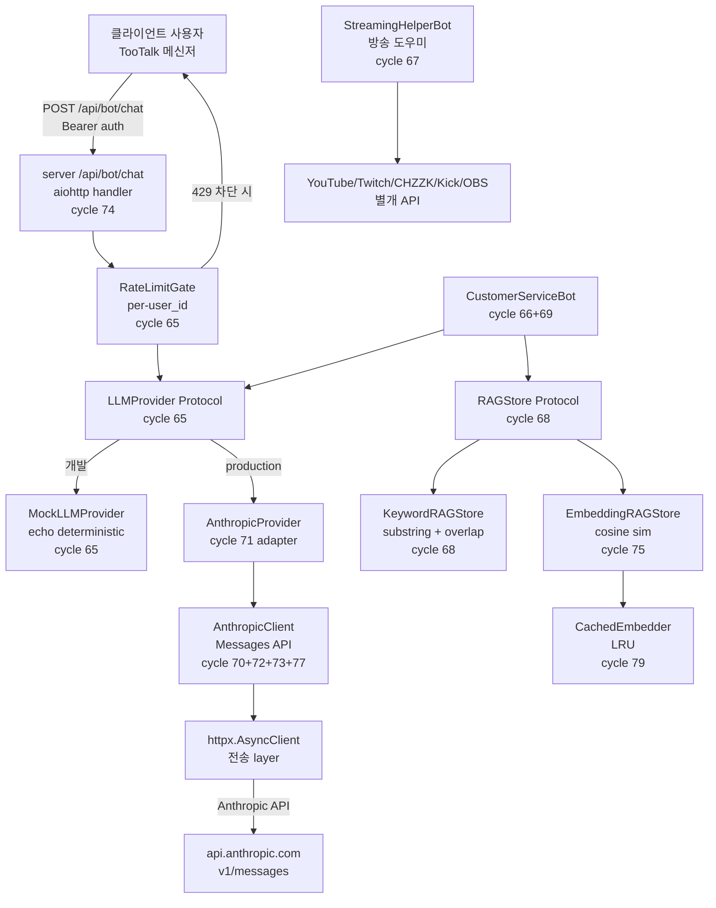

# Bot Framework 정책 본문 (Phase 3)

> 본 문서 = 사이클 80 신설. Phase 3 bot framework chain (cycle 65~79) 의 누계
> 통합 정책 의 정본. memory `project_bot_framework.md` (사용자 directive
> 2026-05-17 + 2026-05-20 + 2026-05-21) 의 본문 등가.

---

## 1. 본 문서 운영 규약

1. **정본 채택** — bot framework 의 핵심 정책 (보안 layer + abuse 차단 + 라이선스 + user_id prefix + retry + RAG) 의 단일 정본. 코드 default + ARCHITECTURE §6 + Specification 의 3 위치 동시 일치 의무.
2. **drift 차단** — directive 본문 + sub-agent 설정 의 정책 가정값 이 본 정본 과 불일치 시 → 본 정본 우선. 추정값 의 갱신 금지.
3. **갱신 절차** — 정책 변경 시 본 문서 + ARCHITECTURE §6 + `app/bot/*.py` + `server/api/bot_handlers.py` 4 위치 동시 갱신.

---

## 2. bot framework 의 아키텍처 (cycle 65~79 누계)



---

## 3. 보안 layer (서버 영역 ↔ 클라이언트 영역 분리)

### 3.1 ANTHROPIC_API_KEY 격리

- **저장 위치** — 서버 호스트 의 환경 변수 (.env 또는 systemd EnvironmentFile)
- **클라이언트 노출 차단** — 클라이언트 의 .env 의 ANTHROPIC_API_KEY 부재 의 정합 의무. 클라이언트 의 직접 Anthropic API 호출 금지
- **검증** — `server/main.py` 의 `AnthropicProvider.is_available()` 의 env 의 존재 확인 + 가용 시 production AnthropicProvider 활성 / 부재 시 MockLLMProvider 폴백 (개발 전용)
- **로그 echo 차단** — `app/bot/anthropic_client.py` 의 모든 log statement 의 api_key value 미포함 의무 (grep 회귀 검증 의무)

### 3.2 system role 클라이언트 주입 차단

- **차단 위치** — `server/api/bot_handlers.py` 의 `_parse_role` 의 의 "system" role 의 명시 reject (web.HTTPBadRequest)
- **이유** — prompt injection 의 1차 방어. system prompt 의 서버 영역 의 default + 클라이언트 의 user/assistant role 만 허용
- **테스트** — `tests/server/test_bot_handlers.py` 의 `test_system_role_rejected` + `test_system_role_rejected_with_index` 의 회귀 방어

### 3.3 per-user_id RateLimitGate

- **위치** — `server/main.py` 의 `RateLimitGate(rate_per_minute=BOT_RATE_PER_MINUTE)` 의 app context APP_KEY_RATE_GATE
- **default** — 분당 20건 (env `BOT_RATE_PER_MINUTE` 의 override 가능)
- **응답** — 한도 초과 시 HTTP 429 의 즉시 raise + 추가 LLM 호출 차단
- **scope** — per-user_id (`request['user_id']` 의 auth_middleware Bearer 의 의 derive)

### 3.4 user_id type confusion 차단

- **위치** — `server/api/bot_handlers.py` 의 `handle_bot_chat` 의 `isinstance(user_id, bool) or not isinstance(user_id, int) or user_id <= 0` reject
- **이유** — Python 의 `isinstance(True, int) is True` 의 edge case 의 auth bypass 회피
- **테스트** — bool/float/string/zero 4 종 reject 의 회귀 방어 (cycle 78)

### 3.5 DoS 회피 cap

- **messages cap** — 32 messages per request (`_MAX_MESSAGES_PER_REQUEST`)
- **content cap** — 16 KB per message (`_MAX_CONTENT_BYTES`)
- **request body cap** — 32 × 16 KB = 512 KB (aiohttp `client_max_size` default 1 MB 정합)
- **retry-after cap** — 60초 (`_RETRY_AFTER_MAX_SECONDS`, DoS 회피)

---

## 4. 라이선스 정합 (GPLv3)

- 모든 `app/bot/*.py` + `server/api/bot_handlers.py` 의 첫 줄 = `# SPDX-License-Identifier: GPL-3.0-or-later`
- LLM provider 의존성 의 라이선스 호환 — Anthropic API (HTTP 호출 의 의 GPL 정합 + sdk 미사용 의 의도 OK)
- sentence-transformers (Apache 2.0) + httpx (BSD 3-Clause) + OpenAI sdk (MIT) — GPLv3 흡수 가능
- bot 출력 의 user-generated content — GPL 의 적용 대상 부재 (LLM 응답 의 사용자 의)

---

## 5. user_id prefix 영역 분리

| Bot 종류 | prefix 영역 | default | 비고 |
|---|---:|---|---|
| 일반 사용자 | < 1_000_000 | (사용자 회원가입 의 의 auto increment) | TooTalk 메신저 사용자 |
| 고객센터 봇 (default) | ≥ 1_000_000 | 1_000_001 | `CustomerServiceConfig._BOT_USER_ID_PREFIX` (cycle 66) |
| 방송 도우미 봇 | ≥ 2_000_000 | (사용자 등록 의) | `StreamingBotConfig._STREAMING_BOT_USER_ID_PREFIX` (cycle 67) |
| 외부 개발자 봇 | ≥ 3_000_000 | (Phase 3 마무리 단계 의) | 등록 디렉토리 의 별개 cycle 의무 |

---

## 6. retry / backoff 정책 (cycle 72~73 + 77)

### 6.1 retry 가능 상태

- **HTTP 429** — Anthropic rate limit (재시도 가능)
- **HTTP 5xx** — upstream 서버 장애 (재시도 가능)
- **ConnectionError / OSError / TimeoutError** — transient network 장애 (재시도 가능, cycle 77)

### 6.2 retry 불가 상태

- **HTTP 401 / 403** — 인증 실패 (재시도 무의미 + 즉시 raise)
- **HTTP 400 + 기타 4xx** — 클라이언트 의 schema 위반 (재시도 무의미)
- **AnthropicMalformedError** — 응답 schema 위반 (재시도 무의미 + log + 502 매핑)

### 6.3 backoff 계산

```text
delay_base = backoff_base_seconds * (2 ** attempt)   # 지수 backoff
delay_after = retry_after_header (있는 경우, cap 60초)
delay = retry_after_header if 있음 else delay_base
delay += jitter_fn() * jitter_max_seconds            # jitter (default 0)
```

### 6.4 default

- `max_retries=0` (회수 무, backwards compat)
- `backoff_base_seconds=1.0`
- `jitter_max_seconds=0.0` (jitter 부재)
- `sleep_fn=asyncio.sleep`
- `jitter_fn=random.random`

### 6.5 production 권장

- `max_retries=3` (4회 시도)
- `backoff_base_seconds=1.0` → delay 1, 2, 4초
- `jitter_max_seconds=0.5` (thundering herd 회피)

---

## 7. RAG context 의 dual baseline (cycle 68 + 75 + 79)

### 7.1 backend 선택

| Backend | 사용 시점 | 외부 의존 | 비용 |
|---|---|---|---|
| `KeywordRAGStore` | 빠른 baseline + 외부 의존 부재 | stdlib | 무료 |
| `EmbeddingRAGStore` + `MockEmbedder` | 테스트 + cosine sim layer 단독 검증 | stdlib | 무료 |
| `EmbeddingRAGStore` + sentence-transformers | 의미 검색 + 로컬 model | sentence-transformers + torch | 로컬 GPU/CPU |
| `EmbeddingRAGStore` + OpenAI embedder | 의미 검색 + cloud API | openai sdk + OPENAI_API_KEY | 토큰당 과금 |
| `EmbeddingRAGStore` + Voyage embedder | 의미 검색 + Anthropic ecosystem | voyageai sdk + VOYAGE_API_KEY | 토큰당 과금 |

### 7.2 cache layer

- `CachedEmbedder` (cycle 79) — OrderedDict LRU 의 동일 query 의 중복 회피
- default `max_cache=256`
- hit/miss counter 의 instrumentation

### 7.3 ranking

- `KeywordRAGStore` — token overlap × (1 + substring boost) — 0.0~1.0
- `EmbeddingRAGStore` — cosine similarity — -1.0~1.0 (sim 0 제외)
- tie stable — ASC idx 의 입력 순서 보존

---

## 8. provider 의 plug-in 패턴

`LLMProvider` Protocol — `is_available()` classmethod + `chat(messages)` async.

```python
from app.bot.llm_proxy import LLMProvider, BotMessage, BotRole

class MyProvider:
    @classmethod
    def is_available(cls) -> bool:
        return True

    async def chat(self, messages: list[BotMessage]) -> BotMessage:
        # 의 외부 LLM API 호출 + 응답 → BotMessage(ASSISTANT)
        ...
```

- `select_llm_provider(name)` factory — "mock" / "anthropic" / "openai" / "gemini" 의 name 의 직접 지정 + None 시 auto-detect (anthropic 우선 + 부재 시 mock 폴백)
- `AnthropicProvider(client)` — `AnthropicClient` 의 DI 의 lazy from_env (cycle 71)

---

## 9. abuse 차단 layer

1. **per-user rate limit** — `RateLimitGate` 분당 20건 (cycle 65 + 74)
2. **content size cap** — 16 KB / message (cycle 74)
3. **messages count cap** — 32 / request (cycle 74)
4. **system role 차단** — 클라이언트 주입 reject (cycle 74)
5. **user_id type check** — bool / float / string / zero reject (cycle 78)
6. **retry-after cap** — 60초 (DoS 회피, cycle 73)
7. **Bearer auth 의무** — auth_middleware 의 PUBLIC_PATHS 외 (사이클 20)

---

## 10. 별개 cycle 후보 (Phase 3 마무리 + Phase 4)

- **streaming response (SSE)** — chunked transfer + sse-starlette equivalent
- **OpenAI provider** — OPENAI_API_KEY + Messages API equivalent
- **prompt injection / jailbreak detector** — heuristic + LLM-as-judge
- **bot conversation 영속화** — `messages` table 의 `bot_id` column + 별개 migration
- **사용 통계 + 비용 추적** — Anthropic usage metric + DB 영속
- **다국어 지원** — 영어 / 중국어 / 일본어 의 system prompt
- **escalation 사람 상담** — queue + assign + handover

---

## 11. 참조

- [ARCHITECTURE.md §6](../../ARCHITECTURE.md) — `app/bot/` 모듈 책임 표
- [Structure.md](../../Structure.md) — bot 디렉토리 트리
- [MANUAL_TESTS.md](../exec-plans/active/MANUAL_TESTS.md) — manual test 항목 분리
- `~/.claude/projects/-Users-oneticket-toonation-Documents-vscode-work-p2p-msg/memory/project_bot_framework.md` — 사용자 directive 의 정본 (memory)
- [CLAUDE_HARNESS_IMPORTANT.md](../../CLAUDE_HARNESS_IMPORTANT.md) — Watcher 정본

---

마지막 갱신: 2026-05-21 21:00 KST (cycle 80 — bot framework 정책 본문 신설)
